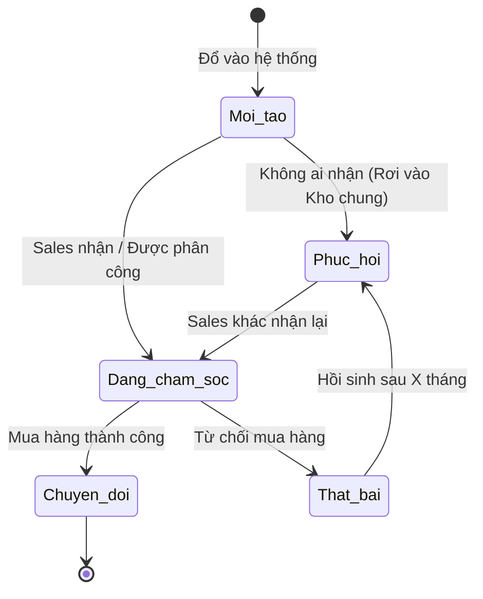

# BF-CRM-01: Quản lý Khách hàng tiềm năng (Lead Generation & Directory)

> **Capability:** CAP-ADM (Năng lực Tuyển sinh & Thương mại)
> **Giai đoạn:** 1 - Tuyển sinh
> **Nhóm chức năng:** CRM & Khách hàng
> **Mã màn hình:** `contact_directory`, `contact_shared_directory`

---

## 1. Mô tả tổng quan

Phân hệ quản trị đầu vào của vòng đời tuyển sinh. Nhiệm vụ chính là thu thập (Capture), chuẩn hóa (Enrich), và phân loại (Segment) các khách hàng tiềm năng (Leads/Contacts) từ nhiều nguồn khác nhau (Chiến dịch tiếp thị, Giới thiệu, Khách vãng lai, Biểu mẫu đăng ký). Cung cấp một danh bạ tập trung để đội ngũ Tư vấn viên (Sales) có thể khai thác và tiếp cận hiệu quả.

## 2. Đối tượng sử dụng (Vai trò)

- **Nhân viên Tư vấn (Sales):** Chăm sóc, cập nhật thông tin và chuyển đổi khách hàng.
- **Nhân viên Tiếp thị (Marketing):** Nhập liệu hoặc đẩy danh sách khách hàng tiềm năng vào hệ thống.
- **Quản lý Chi nhánh / Trưởng nhóm Tư vấn:** Phân bổ khách hàng cho nhân viên, quản lý hiệu suất.

## 3. Ranh giới Nghiệp vụ (Scope)

### Có bao gồm (In Scope)
- Tạo mới hoặc nạp (import) danh sách khách hàng tiềm năng.
- Chuẩn hóa và làm sạch dữ liệu (phát hiện trùng lặp Số điện thoại/Email).
- Phân loại khách hàng theo nguồn (Source), mức độ ưu tiên (Hot/Warm/Cold).
- Quản lý phân bổ: Danh bạ cá nhân (thuộc sở hữu của 1 Sales) và Danh bạ chung (Shared Directory - ai nhận trước thì được chăm sóc).

### Không bao gồm (Out of Scope)
- Ghi nhận chi tiết các cuộc gọi, tin nhắn và lịch hẹn → Xử lý tại `BF-CRM-02`.
- Quản lý hồ sơ Học viên chính thức (Master Profile) sau khi đã đóng tiền → Xử lý tại `BF-MDM-01`.
- Đăng ký lịch học thử/kiểm tra đầu vào → Xử lý tại `BF-ENR-01`, `BF-ENR-02`.

## 4. Mô hình Dữ liệu Nghiệp vụ (Data Entities)

| Tên Thực thể | Trường định danh | Thuộc tính quan trọng | Ràng buộc quan hệ | Diễn giải |
|--------------|------------------|-----------------------|-------------------|----------|
| Khách hàng Tiềm năng (Lead) | Mã Lead | Tên, Số điện thoại, Email, Nguồn, Độ nóng | Độc lập (Chưa thành Học viên gốc) | Hồ sơ tạm thời phục vụ Sale. |
| Sở hữu Lead (Ownership) | Mã phân bổ | Nhân viên phụ trách, Ngày nhận | Trỏ về Mã Lead & Nhân viên | Xác định ai đang chăm sóc khách này. |

### 4.1. Vòng đời Trạng thái (Status Lifecycle)

*Sơ đồ dưới đây xác định vòng đời của một Khách hàng tiềm năng.*

**Quy tắc chuyển đổi:**

| Từ trạng thái | Sang trạng thái | Điều kiện bắt buộc | Vai trò được phép |
|---------------|-----------------|---------------------|-------------------|
| Mới tạo / Phục hồi | Đang chăm sóc | Phải gán cho 1 Nhân viên cụ thể | Sales / Quản lý |
| Đang chăm sóc | Chuyển đổi | Có đơn hàng thành công đầu tiên | Hệ thống tự động |
| Đang chăm sóc | Thất bại | Phải ghi nhận lý do từ chối | Nhân viên Tư vấn |

### 4.2. Ví dụ Dữ liệu mẫu

*Giúp AI và Lập trình viên tạo dữ liệu kiểm thử chính xác.*

| Tình huống | Dữ liệu đầu vào | Kết quả mong đợi |
|------------|-----------------|-------------------|
| Chống trùng lặp | Nhập SĐT "0901234567" đã tồn tại của Sales A | Cảnh báo: "Khách hàng này đang được chăm sóc bởi NV A", chặn lưu. |
| Sales tự nhận khách | Chọn 5 khách hàng trong "Danh bạ chung" -> Bấm "Nhận" | 5 khách chuyển sang "Danh bạ cá nhân" của Sales đó, trạng thái "Đang chăm sóc". |
| Khách hàng mua khóa học | Lead B hoàn tất thanh toán hóa đơn đầu tiên | Trạng thái Lead B chuyển thành "Chuyển đổi" và chuyển hóa thành Học viên chính thức (BF-MDM-01). |

## 5. Quy tắc Nghiệp vụ Tổng thể (Business Rules)

1. **[RULE-CRM-01-01] Tính duy nhất (De-duplication):** Hệ thống chặn tuyệt đối việc tạo mới Khách hàng tiềm năng nếu Số điện thoại đã tồn tại trong một Hồ sơ đang được chăm sóc bởi Tư vấn viên khác, nhằm tránh xung đột tranh giành khách.
2. **[RULE-CRM-01-02] Rơi vào Kho chung (Lead Recycling):** Nếu Khách hàng nằm trong "Danh bạ cá nhân" nhưng Tư vấn viên không có bất kỳ tương tác nào (Không gọi điện, không cập nhật ghi chú) trong vòng X ngày (theo cấu hình), Khách hàng đó sẽ bị tước quyền sở hữu và đẩy lại ra "Danh bạ chung" (Shared Directory) để người khác chăm sóc.

## 6. Danh sách Yêu cầu Người dùng (User Stories)

| Mã Yêu cầu | Tên Yêu cầu (Loại màn hình) | Đường dẫn truy cập | Trạng thái |
|------------|-----------------------------|--------------------|------------|
| US-CRM-01-01 | Quản lý Danh bạ cá nhân (Danh sách) | /app/contact_directory | Đang soạn thảo |
| US-CRM-01-02 | Quản lý Danh bạ chung (Danh sách) | /app/contact_shared_directory | Đang soạn thảo |
| US-CRM-01-03 | Tạo/Sửa thông tin Khách hàng tiềm năng (Biểu mẫu) | Không có | Đang soạn thảo |
