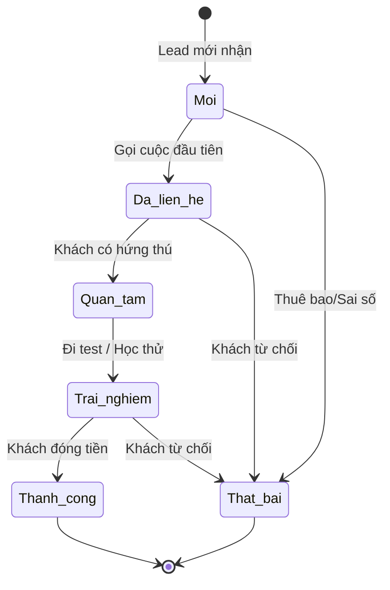

# BF-CRM-02: Theo dõi Cơ hội & Tương tác (Sales Pipeline & Follow-up)

> **Capability:** CAP-ADM (Năng lực Tuyển sinh & Thương mại)
> **Giai đoạn:** 1 - Tuyển sinh
> **Nhóm chức năng:** CRM & Khách hàng
> **Mã màn hình:** `contact_followups`, `contact_interactions`

---

## 1. Mô tả tổng quan

Phân hệ quản lý quá trình theo dõi, chăm sóc và tương tác với khách hàng tiềm năng (Leads) nhằm mục đích chuyển đổi họ thành học viên. Nó bao gồm việc quản lý các cuộc gọi tư vấn, lên lịch hẹn chăm sóc (Follow-ups), ghi nhận trạng thái phễu bán hàng (Pipeline) và xử lý các cơ hội kinh doanh trước khi khách hàng quyết định đóng tiền.

## 2. Đối tượng sử dụng (Vai trò)

- **Nhân viên Tư vấn (Sales / Telesales):** Người trực tiếp gọi điện, nhắn tin, tư vấn lộ trình và chốt sale.
- **Quản lý Chi nhánh / Trưởng nhóm Tư vấn:** Giám sát tiến độ phễu bán hàng, đôn đốc nhân viên hoàn thành các lịch hẹn đến hạn.

## 3. Ranh giới Nghiệp vụ (Scope)

### Có bao gồm (In Scope)
- Ghi nhận lịch sử tương tác đa kênh (Cuộc gọi, Zalo, Gặp trực tiếp) của Tư vấn viên với Khách hàng.
- Lên lịch nhắc hẹn chăm sóc (Follow-up Tasks) trong tương lai.
- Kéo thả và quản lý trạng thái Khách hàng trên Phễu bán hàng (Pipeline: Mới, Đã liên hệ, Đang quan tâm, Chốt/Thất bại).
- Ghi nhận Lý do thất bại (Lost Reason) nếu khách hàng từ chối mua.

### Không bao gồm (Out of Scope)
- Phân bổ Lead đầu vào và lọc trùng lặp → Xử lý tại `BF-CRM-01`.
- Quá trình đăng ký lịch Đánh giá năng lực hoặc Học thử → Thuộc `BF-ENR-01`, `BF-ENR-02`.
- Chăm sóc Học viên đã đóng tiền → Thuộc `CAP-CARE` (BF-CARE-01, BF-CARE-02).

## 4. Mô hình Dữ liệu Nghiệp vụ (Data Entities)

| Tên Thực thể | Trường định danh | Thuộc tính quan trọng | Ràng buộc quan hệ | Diễn giải |
|--------------|------------------|-----------------------|-------------------|----------|
| Nhật ký Tương tác (Interaction) | Mã nhật ký | Kênh liên hệ, Nội dung chi tiết, Phản hồi | Trỏ về Mã Lead | Bằng chứng nhân viên có làm việc. |
| Nhắc hẹn (Follow-up Task) | Mã nhắc hẹn | Thời gian hẹn, Nội dung cần làm, Trạng thái (Pending/Done) | Trỏ về Mã Lead | Todo list của Sales. |
| Lý do Thất bại (Lost Reason) | Mã lý do | Tên lý do (Giá cao, Xa nhà) | Độc lập | Phân tích lý do rớt lead. |

### 4.1. Vòng đời Trạng thái (Status Lifecycle)

*Sơ đồ dưới đây xác định các bước của một Cơ hội bán hàng (Pipeline Stage).*

**Quy tắc chuyển đổi:**

| Từ trạng thái | Sang trạng thái | Điều kiện bắt buộc | Vai trò được phép |
|---------------|-----------------|---------------------|-------------------|
| Bất kỳ | Thành công | Không cho phép tự chọn. Chỉ tự chuyển khi có Đơn hàng thành công | Hệ thống tự động |
| Bất kỳ | Thất bại | Bắt buộc chọn Lý do thất bại | Nhân viên Tư vấn |
| Trải nghiệm | Thành công | Mặc định chuyển sang nếu khách chốt sau Test/Trial | Hệ thống tự động |

### 4.2. Ví dụ Dữ liệu mẫu

*Giúp AI và Lập trình viên tạo dữ liệu kiểm thử chính xác.*

| Tình huống | Dữ liệu đầu vào | Kết quả mong đợi |
|------------|-----------------|-------------------|
| Ghi nhận gọi điện | Gọi lúc 10h, Kênh: Cuộc gọi, Ghi chú: "Hẹn chiều mai tới xem trung tâm" | Lưu vào Timeline tương tác của Lead. |
| Hẹn Follow-up | Đặt lịch hẹn lúc 14h ngày mai, nhắc nhở: "Gọi xác nhận khách tới" | Hiện task nhắc nhở trên Dashboard của Sales. |
| Báo cáo rớt khách | Chuyển trạng thái sang Thất bại, chọn Lý do "Học phí cao" | Lead đóng lại, loại khỏi Phễu đang chăm sóc. |

## 5. Quy tắc Nghiệp vụ Tổng thể (Business Rules)

1. **[RULE-CRM-02-01] Ràng buộc Đóng Deal:** Không cho phép Tư vấn viên tự tay chuyển trạng thái Lead sang "Thành công" (Won). Trạng thái này chỉ được cập nhật TỰ ĐỘNG khi hệ thống sinh ra Đơn hàng (Order) đầu tiên ở trạng thái "Đã thanh toán" từ phân hệ `CAP-COM`.
2. **[RULE-CRM-02-02] Báo động đỏ (Overdue Alert):** Bất kỳ lịch nhắc hẹn (Follow-up Task) nào trễ hạn quá 24h sẽ bị đổi màu đỏ trên bảng điều khiển, và tổng số task trễ hạn của nhân viên sẽ báo cáo thẳng lên màn hình của Quản lý chi nhánh.

## 6. Danh sách Yêu cầu Người dùng (User Stories)

| Mã Yêu cầu | Tên Yêu cầu (Loại màn hình) | Đường dẫn truy cập | Trạng thái |
|------------|-----------------------------|--------------------|------------|
| US-CRM-02-01 | Ghi nhận Nhật ký Tương tác (Component trong Chi tiết Lead) | Nằm trong Chi tiết Lead | Đang soạn thảo |
| US-CRM-02-02 | Tạo và quản lý Nhắc hẹn (Bảng nổi) | Nằm trong Chi tiết Lead | Đang soạn thảo |
| US-CRM-02-03 | Bảng Kanban quản lý Phễu Khách hàng (Pipeline Board) | /app/contact_followups | Đang soạn thảo |
