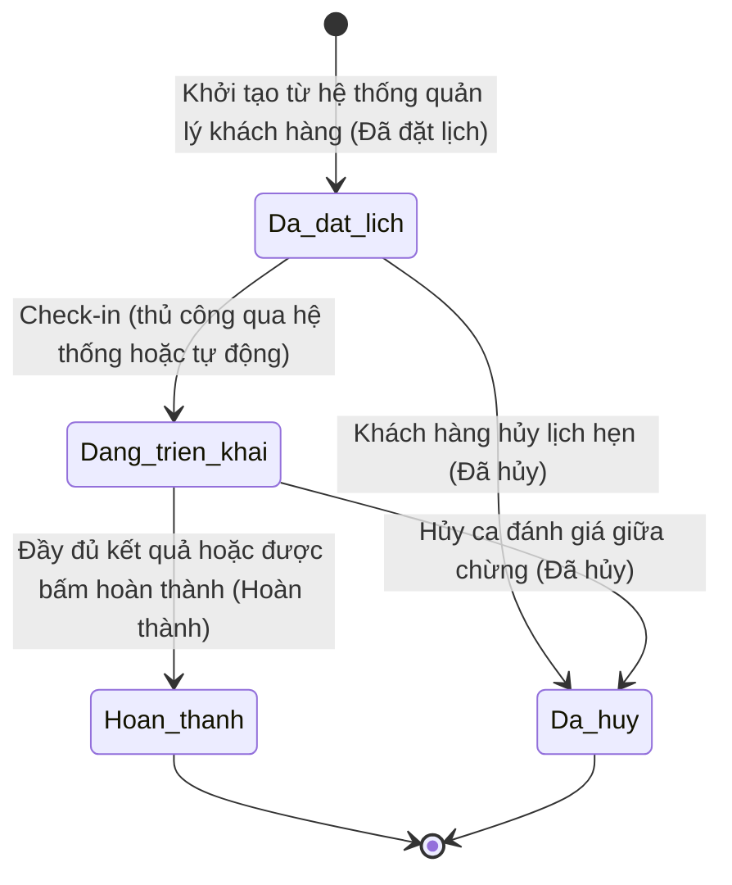

# BF-ENR-01: Đặt lịch Đánh giá năng lực (Đặt lịch đánh giá)

> **Phân hệ thuộc:** CAP-ADM (Năng lực Tuyển sinh & Thương mại)
> **Giai đoạn:** Giai đoạn 1 - Tuyển sinh
> **Nhóm chức năng:** Quản lý lịch hẹn trải nghiệm
> **Mã màn hình:** `booking_test`

---

## 1. Mô tả tổng quan

Quy trình quản lý đặt lịch đánh giá năng lực đầu vào cho học viên tiềm năng từ hệ thống quản lý khách hàng chuyển sang. Quy trình bao gồm việc đặt lịch hẹn trải nghiệm, phân bổ giáo viên chấm điểm Nói và phỏng vấn trực tiếp, học sinh làm bài đánh giá Nghe-Đọc-Viết trên máy tính bảng tại cơ sở, hệ thống tự động nhận kết quả và tổng hợp để xuất báo cáo nhận xét kèm đề xuất trình độ. Báo cáo này là cơ sở để nhân viên tư vấn tuyển sinh đưa ra lộ trình học phù hợp cho phụ huynh học sinh.

## 2. Đối tượng sử dụng (Vai trò)

- **Nhân viên Tư vấn:** Nhận thông tin từ hệ thống quản lý khách hàng, theo dõi lịch hẹn, nhận kết quả và liên kết báo cáo để tư vấn lộ trình học cho phụ huynh.
- **Quản lý Giáo viên / Giáo vụ:** Theo dõi danh sách ca đánh giá để phân bổ giáo viên chấm phỏng vấn, thực hiện đổi giáo viên phụ trách khi có yêu cầu.
- **Giáo viên:** Tiến hành phỏng vấn trực tiếp phần Nói, chấm điểm và ghi nhận nhận xét trên giao diện dành cho giáo viên.
- **Quản lý Chi nhánh:** Giám sát tình trạng các ca đánh giá tại cơ sở.

## 3. Ranh giới Nghiệp vụ (Scope)

### Có bao gồm (In Scope)
- Tiếp nhận lịch hẹn đánh giá năng lực được đẩy từ hệ thống quản lý khách hàng sang theo thời gian thực.
- Thiết lập ca đánh giá với các thông tin: học viên, thời gian bắt đầu, cơ sở (trường), chương trình học, trình độ, loại ca. Mặc định khung giờ phỏng vấn kéo dài 30 phút.
- Quản lý danh sách ca đánh giá tại chi nhánh và hỗ trợ bộ lọc đa cơ sở cho người quản lý.
- Phân công và đổi giáo viên chấm phỏng vấn cho từng ca đánh giá.
- Đồng bộ thông tin ca đánh giá xuống thiết bị máy tính bảng tại quầy để học sinh làm bài test độc lập.
- Ghi nhận kết quả chấm điểm Nói và nhận xét của giáo viên.
- Tổng hợp điểm số từ máy tính bảng và phần phỏng vấn của giáo viên để tính toán đề xuất trình độ đầu vào.
- Phát hành báo cáo năng lực tổng hợp và gửi liên kết về hệ thống quản lý khách hàng.

### Không bao gồm (Out of Scope)
- Các hoạt động tư vấn, chăm sóc khách hàng sau khi có kết quả đánh giá (thuộc quy trình chăm sóc và bán hàng).
- Quản lý kho thiết bị máy tính bảng vật lý tại cơ sở.

## 4. Mô hình Dữ liệu Nghiệp vụ (Data Entities)

| Tên Thực thể | Trường định danh | Thuộc tính quan trọng | Ràng buộc quan hệ | Diễn giải |
|--------------|------------------|-----------------------|-------------------|----------|
| Ca đánh giá | Mã ca đánh giá | Thời gian đánh giá, Chương trình học, Trình độ đề xuất, Trạng thái ca | Liên kết với thông tin học viên & nhân sự phụ trách | Phiếu quản lý ca đánh giá của học sinh. |
| Kết quả đánh giá | Mã kết quả | Điểm Nghe-Đọc-Viết, Điểm Nói, Nhận xét chi tiết, Điểm yếu cần cải thiện | Liên kết với Ca đánh giá | Dữ liệu cấu thành báo cáo kết quả đánh giá. |

### 4.1. Vòng đời Trạng thái (Status Lifecycle)

*Sơ đồ dưới đây xác định 4 trạng thái cốt lõi lưu trong hệ thống của một Ca đánh giá:*

**Quy tắc chuyển đổi trạng thái chính:**

| Từ trạng thái | Sang trạng thái | Điều kiện bắt buộc | Vai trò được phép |
|---------------|-----------------|---------------------|-------------------|
| Khởi tạo | Đã đặt lịch | Dữ liệu được chuyển sang từ hệ thống quản lý khách hàng. | Hệ thống tự động |
| Đã đặt lịch | Đang triển khai | Xác nhận check-in thủ công từ hệ thống; hoặc hệ thống tự động check-in khi học sinh bắt đầu làm bài test trên máy tính bảng hoặc khi giáo viên bắt đầu ca phỏng vấn. | Nhân viên chi nhánh hoặc Hệ thống |
| Đang triển khai | Hoàn thành | Hệ thống nhận đủ điểm Nói (Speaking) và Nghe-Đọc-Viết (LWR) từ máy tính bảng. | Hệ thống |
| Đang triển khai / Đã đặt lịch | Đã hủy | Phụ huynh báo hủy hoặc học sinh không đến làm bài test. | Nhân viên Tư vấn / CS |

### 4.2. Khái niệm Trạng thái ảo (Virtual Statuses) phục vụ Bộ lọc

Để hỗ trợ người dùng theo dõi tiến độ chi tiết, ngoài 4 trạng thái cốt lõi trên, hệ thống tính toán động và hiển thị các **Trạng thái ảo** sau đây trên giao diện bộ lọc và danh sách:

| Trạng thái ảo | Cách tính toán (Logic hiển thị) | Vai trò sử dụng | Ý nghĩa nghiệp vụ |
|---------------|--------------------------------|-----------------|-------------------|
| **Chưa gán giáo viên** | Trạng thái chính là Đã đặt lịch và chưa chọn giáo viên phụ trách phần phỏng vấn. | Giáo vụ / Quản lý | Nhắc nhở cần phân bổ nhân sự trước ca đánh giá. |
| **Đã làm bài** | Trạng thái chính là Đang triển khai và đã nhận được kết quả bài làm trên máy tính bảng. | CS / Giáo vụ | Học viên đã làm xong phần máy tính bảng, chờ phỏng vấn Nói. |
| **Đã phỏng vấn** | Trạng thái chính là Đang triển khai và giáo viên đã chấm điểm phỏng vấn Nói xong. | CS / Giáo vụ | Giáo viên đã chấm xong phỏng vấn Nói, chờ điểm máy tính bảng để tự động hoàn thành. |
| **Đã check-in** | Trạng thái chính là Đang triển khai, Hoàn thành, hoặc Không đạt; hoặc trạng thái chính là Đã đặt lịch nhưng thông tin điểm danh được xác nhận là đã đến. | CS / Giáo vụ | Ghi nhận học viên đã có mặt tại chi nhánh (bằng tay hoặc qua bắt đầu làm bài/phỏng vấn). |
| **Không đạt** | Trạng thái chính là Đang triển khai và học viên được ghi nhận không đạt yêu cầu tuyển sinh cơ bản (được nhân sự đánh dấu thủ công). | CS / Tư vấn viên | Lưu vết hồ sơ học sinh không đạt để tư vấn lộ trình dự phòng. |

### 4.3. Ví dụ Dữ liệu mẫu

| Tình huống | Dữ liệu đầu vào | Kết quả mong đợi |
|------------|-----------------|-------------------|
| Tạo mới ca đánh giá | Chọn Học viên Nguyễn Văn A, môn Tiếng Anh, Cơ sở Quận 1, Thời gian: 15/10 09:00, GV: Trần B | Ca đánh giá được tạo với trạng thái Đã đặt lịch, mã tự tăng, thời lượng phỏng vấn mặc định 30 phút. |
| Kiểm tra giáo viên trùng lịch | Chọn giáo viên Trần B cho ca 09:00 - 09:30. Sau đó gán tiếp cho ca 09:00 | Hệ thống đưa ra cảnh báo trùng lịch. Giáo viên Trần B bị ẩn khỏi danh sách đề xuất mặc định, nếu tìm kiếm trực tiếp thì hiển thị mờ kèm nhãn cảnh báo trùng lịch. |

## 5. Quy tắc Nghiệp vụ Tổng thể (Business Rules)

1. **[RULE-ENR-01-01] Nhất quán thông tin học sinh:** Hệ thống sử dụng chung một mã định danh học sinh duy nhất đồng nhất với hệ thống quản lý khách hàng. Hệ thống tin tưởng tuyệt đối vào thông tin học viên do phía khách hàng chuyển sang.
2. **[RULE-ENR-01-02] Quy tắc khóa thời lượng phỏng vấn:** Mặc định thời gian phỏng vấn giáo viên dành cho học sinh là 30 phút để đảm bảo tính nhất quán lịch biểu của chi nhánh, không cho phép thay đổi thời lượng này trên giao diện.
3. **[RULE-ENR-01-03] Kiểm tra chéo trùng giáo viên:** Giáo viên bị trùng lịch dạy hoặc trùng ca đánh giá khác trong cùng khu vực thời gian sẽ tự động bị ẩn khỏi danh sách đề xuất. Nếu tìm kiếm tên giáo viên bị trùng thì hiển thị dạng mờ đi và đính kèm nhãn ghi rõ ca trùng để quản lý dễ xử lý.
4. **[RULE-ENR-01-04] Quy trình Check-in và làm bài test:** Học sinh có thể trực tiếp làm bài thi trên máy tính bảng tại cơ sở mà không bị chặn bởi bước xác nhận check-in trên hệ thống. Việc xác nhận trên hệ thống đóng vai trò check-in thủ công ghi nhận học sinh đến. Ngoài ra, hệ thống tự động check-in (chuyển sang trạng thái "Đang triển khai") khi học sinh bắt đầu làm bài test trên máy tính bảng hoặc khi giáo viên bắt đầu ca phỏng vấn.
5. **[RULE-ENR-01-05] Trạng thái ảo Đã check-in:** Được tính tự động khi thông tin điểm danh của ca test được xác nhận là "Đã đến" hoặc khi ca test đã chuyển sang các trạng thái tiếp theo như "Đang triển khai" (Đang đánh giá), "Hoàn thành" và "Không đạt".
6. **[RULE-ENR-01-06] Ẩn nút phỏng vấn khi chưa gán giáo viên:** Đối với môn Tiếng Anh, nếu ca đánh giá chưa phân công giáo viên phụ trách phỏng vấn (trạng thái ảo "Chờ gán Giáo viên"), hệ thống sẽ ẩn hoàn toàn nút hoặc liên kết mở bài phỏng vấn Nói (Mở đánh giá) trên giao diện danh sách và chi tiết để đảm bảo an toàn quy trình và tránh việc thao tác chấm điểm Nói trước khi có nhân sự được phân công chính thức.
7. **[RULE-ENR-01-07] Giới hạn trùng lịch đánh giá của Học sinh:** Chặn đặt lịch thi đầu vào mới cho một học sinh cụ thể nếu học sinh đó đang có một ca đánh giá ở trạng thái chưa kết thúc (không phải "Hoàn thành", "Không đạt", hay "Đã hủy").
8. **[RULE-ENR-01-08] Phân quyền hiển thị theo tài khoản Giáo viên:** Nhân sự đăng nhập bằng vai trò Giáo viên chỉ nhìn thấy các ca đánh giá được gán trực tiếp cho họ thuộc các chi nhánh/trường được phân công phụ trách. Quản lý giáo viên và CS/Admin có thể xem toàn bộ cơ sở được gán.

## 6. Danh sách Yêu cầu Người dùng (User Stories)

| Mã Yêu cầu | Tên Yêu cầu (Loại màn hình) | Đường dẫn truy cập | Trạng thái |
|------------|-----------------------------|--------------------|------------|
| US-BT01 | Quản lý danh sách Đặt lịch đánh giá (Danh sách) | /app/booking_test | Đã hoàn thành |
| US-BT02 | Tạo mới Đặt lịch đánh giá (Bảng nổi) | Nút hành động tại màn hình danh sách | Đã hoàn thành |
| US-BT03 | Xem và cập nhật chi tiết đặt lịch (Chi tiết) | Click chọn dòng trên bảng danh sách | Đã hoàn thành |
| US-BT04 | Đánh giá English Assessment Path (Nhập liệu) | Nút thao tác dành cho Giáo viên | Đã hoàn thành |

