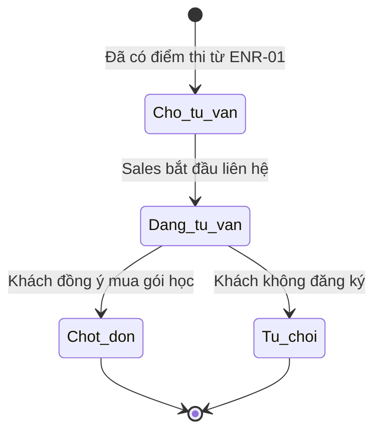

# BF-SAL-03: Đánh giá năng lực (Placement Test)

> **Capability:** CAP-ADM (Năng lực Tuyển sinh & Thương mại)
> **Giai đoạn:** 4 - Tuyển sinh & Bán hàng
> **Nhóm chức năng:** Bán hàng
> **Mã màn hình:** `placement_test`

---

## 1. Mô tả tổng quan

Phân hệ mở rộng của quá trình tư vấn tuyển sinh, chuyên quản lý kết quả bài kiểm tra năng lực đầu vào (Placement Test) của khách hàng. Trong khi `BF-ENR-01` xử lý quy trình đặt lịch (Booking) và điều phối giáo viên, thì phân hệ này tập trung vào việc đọc báo cáo năng lực, mapping trình độ hiện tại với lộ trình học tập, và đề xuất sản phẩm/lớp học phù hợp nhất để nhân viên tư vấn chốt sales.

## 2. Đối tượng sử dụng (Vai trò)

- **Nhân viên Tư vấn (Sales):** Đọc kết quả phân tích năng lực để tư vấn lộ trình học cho khách.
- **Trưởng phòng Sales (Sales Manager):** Xem thống kê tỷ lệ chuyển đổi từ việc test ra việc mua hàng.
- **Cố vấn học tập (Academic Advisor):** Đưa ra nhận xét chuyên sâu hoặc duyệt lộ trình đặc biệt.

## 3. Ranh giới Nghiệp vụ (Scope)

### Có bao gồm (In Scope)
- Hiển thị Báo cáo Đánh giá Năng lực chi tiết (Detail Assessment Report).
- Mapping (Soi chiếu) điểm số bài test với các Khung trình độ (Levels) trong hệ thống.
- Đề xuất tự động (Auto-recommend) các Khóa học (Products) và Lớp học (Classes) đang mở phù hợp với trình độ vừa test.
- Ghi nhận lịch sử tư vấn và kết quả chốt (Thành công / Đang suy nghĩ / Thất bại).

### Không bao gồm (Out of Scope)
- Tổ chức thi, xếp lịch giáo viên phỏng vấn → Thuộc `BF-ENR-01` (Booking Test).
- Tạo đơn hàng và tính tiền → Thuộc `BF-SAL-01` (Quản lý Đơn hàng).

## 4. Mô hình Dữ liệu Nghiệp vụ (Data Entities)

| Tên Thực thể | Trường định danh | Thuộc tính quan trọng | Ràng buộc quan hệ | Diễn giải |
|--------------|------------------|-----------------------|-------------------|----------|
| Hồ sơ Năng lực (Placement Profile) | Mã Hồ sơ | Trình độ quy đổi (Ví dụ: Pre-IELTS), Điểm mạnh/yếu, Lộ trình đề xuất | Trỏ về Mã Kết quả thi (`BF-ENR-01`) & Mã Khách hàng | Dữ liệu nền để tư vấn. |

### 4.1. Vòng đời Trạng thái (Status Lifecycle)

*Sơ đồ dưới đây xác định vòng đời của một quá trình Tư vấn dựa trên năng lực.*

**Quy tắc chuyển đổi:**

| Từ trạng thái | Sang trạng thái | Điều kiện bắt buộc | Vai trò được phép |
|---------------|-----------------|---------------------|-------------------|
| Chờ tư vấn | Đang tư vấn | Ghi nhận Log (Call/Meeting) | Sales |
| Đang tư vấn | Chốt đơn | Tạo thành công Đơn hàng ở `BF-SAL-01` | Hệ thống tự động |

### 4.2. Ví dụ Dữ liệu mẫu

*Giúp AI và Lập trình viên tạo dữ liệu kiểm thử chính xác.*

| Tình huống | Dữ liệu đầu vào | Kết quả mong đợi |
|------------|-----------------|-------------------|
| Nhận kết quả | Khách A được 5.0 IELTS Listening, 6.0 Reading | Hệ thống mapping quy đổi ra trình độ "IELTS Foundation". Đề xuất sản phẩm "Combo Khởi động". |
| Tư vấn | Sales gọi điện báo kết quả cho Khách A | Trạng thái chuyển thành "Đang tư vấn", lưu lịch sử cuộc gọi. |

## 5. Quy tắc Nghiệp vụ Tổng thể (Business Rules)

1. **[RULE-SAL-03-01] Tính logic Lộ trình (Path Validation):** Nếu khách hàng có kết quả test là Trình độ Level 3, hệ thống sẽ cảnh báo (Warning) nếu Sales cố tình tạo Đơn hàng/Xếp lớp vào Khóa học Level 5. Tuy nhiên, quyền quyết định cuối cùng vẫn thuộc về Cố vấn học tập (Cần quyền override).

## 6. Danh sách Yêu cầu Người dùng (User Stories)

| Mã Yêu cầu | Tên Yêu cầu (Loại màn hình) | Đường dẫn truy cập | Trạng thái |
|------------|-----------------------------|--------------------|------------|
| US-SAL-03-01 | Xem Báo cáo Đánh giá Năng lực chi tiết (View) | /app/placement_test/[id] | Đang soạn thảo |
| US-SAL-03-02 | Công cụ Đề xuất Lộ trình & Lớp học tự động (Recommendation Engine) | Nằm trong Chi tiết Khách hàng | Đang soạn thảo |
