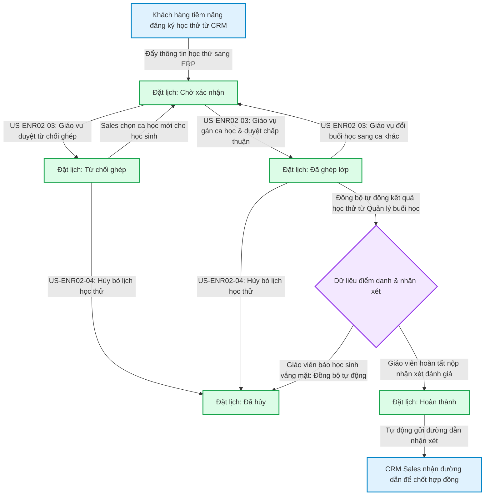

# FLOW-ENR-02: Vòng đời Học thử Ghép buổi (Trial Session Lifecycle)

## 1. Bối cảnh Nghiệp vụ (Context)

Luồng chi tiết mô tả hành trình đầy đủ của một **Lịch học thử (Booking học thử)** — từ lúc hệ thống tiếp nhận nhu cầu học thử, Giáo vụ tìm lớp và phê duyệt xếp ca trải nghiệm, đến ngày học thực tế hệ thống đồng bộ kết quả học thử tĩnh từ phân hệ Quản lý buổi học, và trả đường dẫn xem báo cáo đánh giá về hệ thống chăm sóc khách hàng.

> **Nghiệp vụ gốc (BF):** `BF-ENR-02`
> **Kích hoạt bởi:** Thông tin đăng ký học thử của học viên tiềm năng đẩy tự động từ hệ thống quản lý khách hàng (CRM) sang.
> **Kết thúc khi:** Hệ thống nhận dữ liệu đánh giá, tự động đồng bộ sang trạng thái Hoàn thành và trả đường dẫn xem báo cáo nhận xét chi tiết về CRM cho nhân viên tư vấn.

---

## 2. Đối tượng và Hệ thống tham gia

*   **Nhân viên Tư vấn (Sales):** Theo dõi kết quả nhận xét từ giáo viên đồng bộ về ERP để gọi điện chăm sóc và chốt hợp đồng dài hạn.
*   **Giáo vụ / Quản lý Chi nhánh (Coordinator):** Tìm lớp học phù hợp, thực hiện gán ca học, chấp thuận hoặc từ chối ghép ca, xử lý đổi buổi học và hủy lịch học thử của học viên.
*   **Hệ thống tự động (ERP):** Kiểm tra các giới hạn đặt lịch, tự động giải phóng ca học cũ khi đổi buổi hoặc hủy lịch, và tự động đồng bộ kết quả điểm danh/nhận xét từ phân hệ Quản lý buổi học về màn hình học thử để hiển thị tĩnh và trả kết quả sang CRM.

---

## 3. Sơ đồ Luồng nghiệp vụ

---

## 4. Diễn giải các bước

1.  **Giai đoạn Khởi tạo nhu cầu:** Hồ sơ đăng ký học thử của học viên được đẩy tự động từ hệ thống quản lý khách hàng (CRM) sang hệ thống ERP. Hệ thống tự động kiểm soát các giới hạn đặt lịch của học viên (không vượt quá 2 lần/3 tháng, chỉ gồm 1 giáo viên Việt Nam và 1 giáo viên nước ngoài, và không có lịch học thử nào khác đang hoạt động). Phiếu tạo thành công ở trạng thái **Chờ xác nhận**.
2.  **Giai đoạn Gán ca và Duyệt xếp lớp:** Giáo vụ mở biểu mẫu xếp lớp, dùng bộ lọc khoảng ngày để hiển thị các lớp/ca khả dụng phù hợp với chương trình học. Giáo vụ mở rộng khối co giãn lớp học, tích chọn duy nhất 1 ca học và bấm **Chấp thuận ghép**. Hệ thống chuyển trạng thái sang **Đã ghép lớp** và tự động cập nhật Giáo viên của lớp đó làm Người phụ trách của phiếu học thử.
3.  **Giai đoạn Đổi/Hủy lịch (Ngoại lệ):** 
    *   Nếu học sinh báo bận và có nhu cầu đổi buổi, Giáo vụ thực hiện **Đổi buổi học** trực tiếp trên hệ thống bằng cách chọn ca học mới phù hợp. Hệ thống giải phóng ca cũ và đưa phiếu học thử quay lại trạng thái **Chờ xác nhận** với ca học mới gán.
    *   Trường hợp học sinh không thể tham gia trải nghiệm nữa, Giáo vụ thực hiện hủy lịch. Trạng thái chuyển sang **Đã hủy** và giải phóng ca học.
4.  **Giai đoạn Đồng bộ Kết quả Điểm danh:** Đến ngày học, kết quả điểm danh của học viên học thử tại lớp học thuộc phân hệ **Quản lý buổi học** được tự động đồng bộ về ERP. Nếu học sinh vắng mặt, trạng thái phiếu học thử tự động chuyển sang **Đã hủy** và giải phóng ca học.
5.  **Giai đoạn Đồng bộ Kết quả Nhận xét:** Nếu học sinh có mặt trải nghiệm, sau khi giáo viên hoàn tất nộp đánh giá năng lực bên phân hệ **Quản lý buổi học**, hệ thống ERP tự động đồng bộ kết quả và chuyển trạng thái phiếu học thử sang **Hoàn thành**, đồng thời hiển thị tĩnh liên kết báo cáo nhận xét trên giao diện và trả liên kết này sang CRM cho Sales chăm sóc khách hàng.

---

## 5. Xử lý Rẽ nhánh / Ngoại lệ

*   **Học viên vắng mặt tại buổi học thử:** Hệ thống tự động nhận dữ liệu điểm danh vắng mặt từ phân hệ Quản lý buổi học, tự động chuyển trạng thái booking sang "Đã hủy" và giải phóng ca học.
*   **Học viên muốn hủy lịch học thử:** Giáo vụ hoặc Tư vấn viên bấm Hủy lịch trên ERP (bắt buộc nhập lý do hủy), hệ thống giải phóng ca học đã ghép và chuyển trạng thái booking sang "Đã hủy".
*   **Học sinh muốn thay đổi ca học (Đổi buổi):** Giáo vụ thực hiện đổi buổi trực tiếp, chọn ca học trống khác. Ca học cũ được trả chỗ, ca mới được gán và trạng thái quay lại "Chờ xác nhận" để kiểm soát phê duyệt.