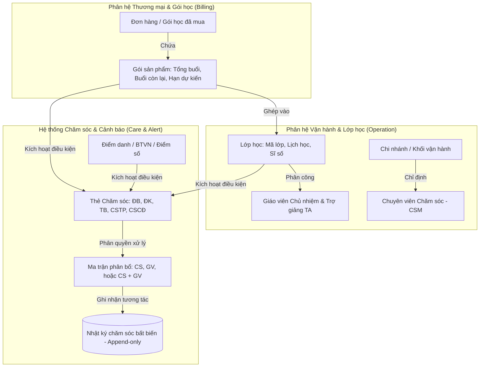

# BF-CARE-01: Kiến trúc & Cơ chế Vận hành Chăm sóc Học viên (Student Operations Care)

> **Mã phân hệ:** `CAP-CARE` (Chăm sóc & Duy trì Học viên)  
> **Màn hình triển khai:** `student_operations_alert` ([/app/student_operations_alert](http://localhost:3001/app/student_operations_alert))  
> **Thực thể liên quan:** Gói học (`Product Package / Order`), Lớp học (`Class / Roster`), Thẻ cảnh báo (`Care Tags / Alerts`), Nhật ký chăm sóc (`Care Interaction Logs`), Nhân sự phụ trách (`Personnel: CS & Teacher`).

---

## 1. TỔNG QUAN KIẾN TRÚC MỐI QUAN HỆ: GÓI — LỚP — THẺ CHĂM SÓC — NGƯỜI PHỤ TRÁCH

Hệ thống quản lý chăm sóc học viên Rinov5 được xây dựng theo mô hình **hướng dữ liệu thực thể (Entity-Driven)** kết hợp **luồng cảnh báo theo thời gian thực (Real-time Alert Engine)**:



### 1.1. Bóc tách trách nhiệm 4 thành phần
1. **Gói sản phẩm (Product Package / Order):**
   - Đại diện cho cam kết thương mại giữa trung tâm và phụ huynh.
   - Quản lý: Tổng số buổi (`totalSessions`), số buổi còn lại (`remainingSessions`), ngày bắt đầu (`startDate`), ngày kết thúc dự kiến (`expectedEndDate`).
   - Có thể tồn tại độc lập trước khi học viên được xếp vào bất kỳ lớp học vật lý nào.
2. **Lớp học (Class / Roster):**
   - Thực thể tổ chức học tập tại cơ sở, gắn liền với phòng học, ca học trong tuần (`schedule`), và giáo trình.
   - Chứa danh sách học viên (`Class Roster`) và đội ngũ giảng dạy trực tiếp gồm Giáo viên chủ nhiệm (`teacherCode`) và Trợ giảng (`TA`).
3. **Thẻ Chăm sóc (Care Tags / Rules):**
   - Sinh tự động dựa trên các sự kiện vận hành và học thuật:
     - `ĐB1` (Chăm sóc Đặc biệt - Red): Cảnh báo C90B, BTVN < 70%, hoặc Điểm thi < 5.0 (SLA xử lý: 24h).
     - `ĐK1`, `ĐK2` (Chăm sóc Định kỳ - Purple): Điểm chạm định kỳ tháng 1, kiểm tra giữa kỳ, hoặc nhắc phí định kỳ (SLA: 5 ngày).
     - `TB1`, `TB2` (Chăm sóc Theo buổi - Amber): Nghỉ học liên tiếp, đi muộn, thiếu bài tập buổi học, hoặc số buổi còn lại $\le 5$ (SLA: 2-3 ngày).
     - `CSTP` (Chăm sóc Tái phí - Green): Học viên cận hạn gói hoặc hết số buổi (SLA: 5 ngày).
     - `CSCĐ` (Chăm sóc Chủ động - Blue): Tự động kích hoạt khi có biến động học thuật giảm sút.
4. **Người phụ trách (Personnel Cluster):**
   - Cột **Phụ trách** trên bảng chăm sóc luôn hiển thị rõ ràng 2 tầng trách nhiệm:
     - **Tầng Dịch vụ (CS/CSM):** Chuyên viên chăm sóc khách hàng chịu trách nhiệm liên lạc chính với phụ huynh, xử lý đơn từ, gia hạn, phản hồi dịch vụ.
     - **Tầng Học thuật (GV/TA):** Giáo viên bộ môn chịu trách nhiệm kèm cặp học viên, đánh giá buổi học, gửi nhận xét, bù bài tập.

---

## 2. QUY TRÌNH KHI GÓI MỚI ĐƯỢC TẠO NHƯNG CHƯA GHÉP LỚP

### 2.1. Trạng thái thực tế trên hệ thống
- Học viên mang trạng thái: `wait_for_assignment` (**Chờ xếp lớp / Chờ ghép lớp**).
- Tại cột "Lớp học": Hệ thống hiển thị nhãn: `Chưa có lớp` và badge cảnh báo vàng cam `CHỜ GHÉP LỚP`.
- Mã lớp (`classCode`) hiển thị rỗng hoặc `Chưa gán`.

### 2.2. Nhân sự phụ trách & Cơ chế chăm sóc giai đoạn chờ
1. **Giáo viên:** Chưa có giáo viên bộ môn (`teacherCode: Chưa gán`).
2. **Chuyên viên CS:**
   - Hệ thống tự động gán CS theo một trong hai cơ sở:
     - **Kế thừa từ nhân viên Sale/Tư vấn viên** đã chốt đơn hàng (chuyển giao giai đoạn Onboarding).
     - Hoặc gán cho **CSM trực thuộc Chi nhánh tiếp nhận**.
   - Nếu chưa có CS tiếp nhận, hệ thống bật cờ cảnh báo:
     - `hasMissingCS: true`, hiển thị dòng chữ cảnh báo màu cam: **"Chưa gán CS/GV"** ngay dưới cột Thẻ chăm sóc.
     - Đồng thời, chỉ số ưu tiên (`priority = 10`) tự động đẩy học viên lên **TOP đầu danh sách** để Quản lý chi nhánh (Branch Manager) hoặc Trưởng nhóm CS phân công ngay trong ngày.
3. **Thẻ chăm sóc giai đoạn chờ:**
   - Kích hoạt thẻ chăm sóc Onboarding / Nhắc lịch xếp lớp: CSM liên hệ phụ huynh để xác nhận khung giờ rảnh, nguyện vọng học, thông báo dự kiến ngày mở lớp.
   - Nếu thời gian chờ lớp vượt quá SLA quy định (ví dụ $> 7$ ngày), hệ thống tự động sinh thẻ cảnh báo `ĐB` (Nguy cơ rút phí do chậm trễ xếp lớp).

---

## 3. CƠ CHẾ KHI GHÉP LỚP, GHI NHẬN & LƯU VẾT NHẬT KÝ CHĂM SÓC

### 3.1. Khi ghép lớp thành công
- Trạng thái học viên tự động chuyển từ `wait_for_assignment` sang `Đang học` (`active`).
- Thông tin Lớp học: Cập nhật `classCode`, tên lớp, phòng học và thời khóa biểu (`schedule`).
- Thông tin Giáo viên: Tự động kế thừa Giáo viên chủ nhiệm (`teacherCode`) và Trợ giảng từ Lớp học vừa ghép. Cột Phụ trách lập tức phản ánh tên GV mới kèm nút xem hồ sơ nhanh (`PersonnelHoverCard`).
- Lịch sử ghép lớp được ghi nhận vào `class_history` (xem qua icon chuyển lớp `ArrowLeftRight`), ghi lại: ngày ghép, tên lớp, lịch học, người thao tác.

### 3.2. Cơ chế Lưu vết Nhật ký Chăm sóc (Audit Trail & Append-Only Log)
Toàn bộ tương tác giữa trung tâm và phụ huynh/học viên được lưu trữ theo nguyên tắc **Nhật ký bất biến chỉ thêm (Append-Only Immutable Log)**:

```json
{
  "id": "log-17892348912",
  "date": "2026-07-08T14:30:00Z",
  "staffName": "Lan Anh (CSM)",
  "callConfirmation": "Đã gọi",
  "parentOpinion": "Bố bận việc gia đình, xin bảo lưu kết quả 1 tháng để con về quê giải quyết việc.",
  "audioDuration": "02:45",
  "notes": "[ĐB1] [Kênh: TELEPHONE] [Kết quả: Nghe máy] Đã gọi điện cảnh báo tình trạng điểm thi học viên..."
}
```

### 3.3. Nguyên tắc Người trước — Người sau ghi nhận
1. **Bảo tồn toàn vẹn dữ liệu người trước (Zero Data Overwrite):**
   - Bất kể nhân sự nào đã thực hiện cuộc gọi, nhắn tin Zalo hay gửi nhận xét trong quá khứ, bản ghi đó vĩnh viễn gắn với `staffName`, thời gian thực hiện, kết quả cuộc gọi, và file ghi âm của người đó.
   - Người sau (dù là CS mới hay GV mới) **KHÔNG THỂ** chỉnh sửa hay xóa nhật ký của người trước.
2. **Góc nhìn xuyên suốt cho người sau (Continuous Timeline):**
   - Khi nhân sự mới mở thẻ học viên (qua `StudentCareDetailPage` hoặc `OperationsAlertHistoryPopover`), toàn bộ lịch sử tương tác từ trước đến nay hiển thị theo thứ tự thời gian giảm dần (mới nhất ở trên).
   - Người sau có thể đọc toàn bộ ý kiến phụ huynh (`parentOpinion`), các cam kết trước đó của người cũ, các lần lỡ hẹn (`missedCallsList`) để tiếp nối cuộc trò chuyện một cách liền mạch mà không hỏi lại những điều phụ huynh đã chia sẻ.
3. **Ghi nhận mới của người sau:**
   - Khi người sau thực hiện cuộc gọi hoặc gửi ghi chú mới, hệ thống tự động trích xuất danh tính của tài khoản đang đăng nhập (`currentUser.name`), gắn mốc thời gian thời gian thực và đóng dấu thẻ cảnh báo tương ứng.

---

## 4. QUY TRÌNH CHUYỂN LỚP, BẢO LƯU & XỬ LÝ KHI NHÂN SỰ NGHỈ VIỆC

### 4.1. Khi Chuyển lớp (Class Transfer)
- **Học thuật (Giáo viên):**
  - Học viên rút khỏi Roster lớp cũ, tham gia vào Roster lớp mới.
  - Giáo viên phụ trách trên màn hình Chăm sóc tự động chuyển sang Giáo viên của lớp mới.
  - Lịch sử thay đổi giáo viên được lưu lại trong `ClassTeacherHistoryPopover` (Ghi rõ: GV cũ phụ trách từ ngày nào đến ngày nào, lý do chuyển lớp; GV mới tiếp nhận từ ngày nào).
  - Tuân thủ quy tắc `RULE-CLS-04-01`: Buổi học trong quá khứ giữ nguyên chấm công cho GV cũ, các buổi học tương lai chuyển giao cho GV mới.
- **Dịch vụ (CSM):**
  - Nếu chuyển lớp trong nội bộ chi nhánh: Giữ nguyên CSM phụ trách để đảm bảo tính thân thiết và thấu hiểu phụ huynh.
  - Nếu chuyển khác chi nhánh: Hệ thống chuyển quyền quản lý học viên sang CSM của cơ sở mới.
- **Nhật ký chuyển lớp:** Tự động ghim 1 bản ghi vào `class_history` (Thời điểm chuyển, lớp cũ $\rightarrow$ lớp mới, lý do chuyển, nhân sự thao tác).

### 4.2. Khi Bảo lưu (Suspension / Reserve)
- Trạng thái học viên chuyển thành `Bảo lưu` (`reserve`).
- Cột Lớp học hiển thị nhãn `Chưa có lớp` kèm badge tím: `BẢO LƯU`.
- Số buổi học còn lại được đóng băng (tạm dừng trừ buổi).
- **Trách nhiệm Giáo viên:** Giáo viên lớp cũ tạm ngưng nghĩa vụ chăm sóc định kỳ hàng tuần cho học viên này; học viên được gỡ khỏi sĩ số hoạt động của lớp (trừ trường hợp bảo lưu có giữ chỗ `hold_seat`).
- **Trách nhiệm Chuyên viên CS:** CSM **VẪN TIẾP TỤC PHỤ TRÁCH** học viên bảo lưu.
  - Hệ thống sinh mốc cảnh báo theo dõi bảo lưu (SLA tối đa 6 tháng theo `RULE-CLS-06-02`).
  - Trước khi hết hạn bảo lưu 15 - 30 ngày, hệ thống kích hoạt nhắc nhở CSM liên hệ phụ huynh để tư vấn xếp lớp đi học lại.

### 4.3. Khi Người chăm sóc (CS / GV) NGHỈ VIỆC hoặc CHUYỂN CÔNG TÁC
1. **Chuyển giao hàng loạt (Bulk Reassignment / Handover):**
   - Quản lý Chi nhánh (BM) hoặc Trưởng nhóm CSM sử dụng chức năng Chuyển giao nhân sự (Handover).
   - Chọn nhân sự nghỉ việc $\rightarrow$ Chọn nhân sự tiếp nhận mới $\rightarrow$ Thực hiện chuyển giao toàn bộ danh sách học viên phụ trách chỉ bằng 1 thao tác.
2. **Cơ chế Chuyển đổi linh hoạt đơn lẻ (Single Reassignment):**
   - Trên thanh tiêu đề chi tiết học viên (`StudentCarePersonnelCluster`), CSM hoặc BM có thể bấm nút chuyển đổi (icon `ArrowLeftRight`) cạnh tên người phụ trách $\rightarrow$ Chọn CSM mới từ danh sách nhân sự cơ sở.
   - Hệ thống thông báo thành công và cập nhật ngay lập tức: `"Đã chuyển người phụ trách CS sang: [Tên nhân viên mới]"`.
3. **Cơ chế An toàn (Fail-Safe) khi chưa kịp bàn giao:**
   - Khi tài khoản của nhân sự nghỉ việc bị vô hiệu hóa (Deactivated) trong hệ thống HRM, toàn bộ các bản ghi chăm sóc của nhân sự đó lập tức kích hoạt trạng thái:
     - `csStaff: 'Chưa gán'`
     - Cờ cảnh báo: `hasMissingCS: true`
     - Dòng chữ cảnh báo: `Chưa gán CS` màu cam hiển thị trên bảng.
     - Học viên tự động nâng mức ưu tiên lên `Priority 10` (nhóm ưu tiên cao nhất, đứng trên cả cảnh báo đặc biệt) để nhắc nhở cấp quản lý phân công người thay thế ngay lập tức.
4. **Trải nghiệm sau chuyển giao:**
   - Nhân sự mới tiếp quản ngay lập tức toàn bộ thông tin, thẻ cảnh báo đang hoạt động, tiến độ SLA của học viên.
   - Không có bất kỳ khoảng trống thông tin nào (Zero Information Loss) vì toàn bộ ghi chú, nhật ký cuộc gọi và ghi âm của người tiền nhiệm đã được lưu vĩnh viễn trên hồ sơ học viên.

---

## 5. TỔNG HỢP MA TRẬN VẬN HÀNH HỆ THỐNG

| Kịch bản Vận hành | Trạng thái Lớp | Giáo viên phụ trách (GV) | Chuyên viên CS (CSM) | Hành vi Thẻ Cảnh báo & SLA | Dấu vết Lịch sử (Audit Logs) |
|-------------------|----------------|--------------------------|----------------------|-----------------------------|------------------------------|
| **1. Gói mới tạo, chưa ghép lớp** | `wait_for_assignment` (Chờ ghép lớp) | Chưa gán (`N/A`) | Gán tạm theo Sale hoặc CSM cơ sở (nếu trống báo `Chưa gán CS`) | Kích hoạt SLA Onboarding/Xếp lớp; ưu tiên hiển thị Top 10 nếu thiếu CS | Lưu đơn hàng mua gói vào `package_history` |
| **2. Ghép lớp thành công** | `active` (Đang học) | Tự động lấy GV chủ nhiệm & TA của lớp | CSM cơ sở phụ trách học viên | Bật chu kỳ chăm sóc 2 buổi đầu, thẻ `ĐK1`, theo dõi chuyên cần `TB1` | Lưu mốc ghép lớp vào `class_history` |
| **3. Học viên chuyển lớp** | `active` (Đang học ở lớp mới) | Tự động đổi sang GV lớp mới | Giữ nguyên CSM cũ (nếu cùng cơ sở) | Chuyển tiếp các thẻ học thuật sang GV mới theo dõi | Ghi vết chuyển lớp vào `class_history` và lịch sử đổi GV vào `TeacherHistory` |
| **4. Học viên Bảo lưu** | `reserve` (Bảo lưu) | Tạm ngưng nghĩa vụ giảng dạy | CSM tiếp tục theo dõi hạn bảo lưu | Đóng băng thẻ chuyên cần, bật thẻ theo dõi hạn bảo lưu (SLA 6 tháng) | Lưu phiếu bảo lưu vào hồ sơ, ghi nhận ngày đi học lại dự kiến |
| **5. Nhân sự CS nghỉ việc** | Không đổi | Không đổi | Chuyển giao hàng loạt sang CS mới; nếu chưa bàn giao thì báo động `Chưa gán CS` | Giữ nguyên trạng thái SLA của các thẻ; CS mới tiếp tục xử lý | Giữ nguyên 100% logs cũ của người đã nghỉ, ghi nhận tên người mới từ lần log tiếp theo |

---

## 6. DANH SÁCH TỆP MÃ NGUỒN VÀ THAM CHIẾU LIÊN QUAN

- [OperationsAlertScreen.tsx](file:///C:/Users/Jacky%20Tran/Documents/Rinov5/src/components/screens/care/OperationsAlertScreen.tsx): Màn hình chính danh sách cảnh báo chăm sóc học viên.
- [AlertRow.tsx](file:///C:/Users/Jacky%20Tran/Documents/Rinov5/src/components/screens/care/AlertRow.tsx): Hiển thị từng dòng học viên gồm cột Lớp học, Gói sản phẩm, Người phụ trách (CS + GV), Thẻ chăm sóc.
- [operationsAlertHelpers.ts](file:///C:/Users/Jacky%20Tran/Documents/Rinov5/src/components/screens/care/operationsAlertHelpers.ts): Logic tính toán cảnh báo, thẻ SLA, kiểm tra thiếu CS/GV (`getUnassignedStaffStatus`), độ ưu tiên hiển thị.
- [StudentCarePersonnelCluster.tsx](file:///C:/Users/Jacky%20Tran/Documents/Rinov5/src/components/screens/care/StudentCarePersonnelCluster.tsx): Cụm hiển thị thông tin và đổi người phụ trách CS/GV linh hoạt.
- [StudentCareDetailPage.tsx](file:///C:/Users/Jacky%20Tran/Documents/Rinov5/src/components/screens/care/StudentCareDetailPage.tsx): Trang chi tiết chăm sóc 360 độ theo từng gói học và phân hệ tương tác.
- [StudentCareChatFeed.tsx](file:///C:/Users/Jacky%20Tran/Documents/Rinov5/src/components/screens/care/StudentCareChatFeed.tsx): Dòng thời gian tương tác (Chat Feed/Timeline) hiển thị đầy đủ nhật ký của các nhân sự trước và form gửi của nhân sự hiện tại.
- [DetailHistoryViews.tsx](file:///C:/Users/Jacky%20Tran/Documents/Rinov5/src/components/screens/care/DetailHistoryViews.tsx): Xem lịch sử chuyển lớp (`class_history`) và lịch sử đổi gói (`package_history`).
- [ClassTeacherHistoryPopover.tsx](file:///C:/Users/Jacky%20Tran/Documents/Rinov5/src/components/screens/care/ClassTeacherHistoryPopover.tsx): Xem lịch sử luân chuyển giáo viên của lớp học.
