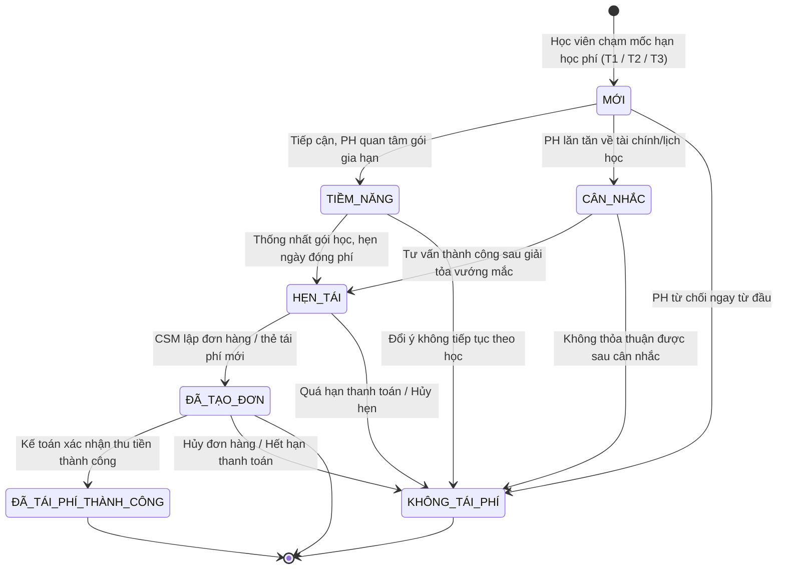

# BF-CARE-01: Quản lý Chăm sóc & Tái phí Học viên (Renewal Management)

> **Capability:** CAP-CARE (Vận hành & Chăm sóc Khách hàng)  
> **Giai đoạn:** 2 - Vận hành & Duy trì học viên  
> **Nhóm chức năng:** 🔄 Vận hành & Chăm sóc  
> **Mã màn hình:** `renewal` (`/app/renewal`)  

---

## Lịch sử cập nhật tài liệu (Changelog)

| Ngày cập nhật | Nội dung cập nhật | Lý do cập nhật |
|---|---|---|
| 17/08/2026 | Khởi tạo tài liệu đặc tả chuẩn Rinov5 5-Tier | Bóc tách tự động qua công cụ html-to-doc từ màn hình `/app/renewal` |
| 17/08/2026 | Tinh chỉnh quy tắc nghiệp vụ theo thực tế trang bóc tách, bỏ mã yêu cầu và trạng thái tĩnh | Chuẩn hóa theo phản hồi thực tế từ giao diện |

---

## 1. Bối cảnh & Vấn đề hiện tại (Context & Problem Statement)
* **Bối cảnh:** [Người dùng tự điền bối cảnh phát sinh yêu cầu của phân hệ này]
* **Vấn đề thực tế:** [Người dùng tự điền khó khăn, hạn chế thực tế đang gặp phải]

---

## 2. Mục tiêu, Giá trị mang lại & Chỉ số đo lường (Objectives, Value & KPIs)
* **Mục tiêu:** [Người dùng tự điền mục tiêu triển khai]
* **Giá trị mang lại:** [Người dùng tự điền giá trị mang lại cho người dùng và tổ chức]
* **Mục tiêu đo lường hiệu quả (Đề xuất chỉ số tương lai):**

| Chỉ số đo lường (KPI) | Mục tiêu đề xuất (Target) | Phương pháp đo lường |
| :--- | :--- | :--- |
| **Tỷ lệ tái phí thành công** | $\ge 80\%$ | Tổng số học viên đóng phí tái / Tổng học viên đến hạn |
| **Thời gian tiếp cận học viên** | Trước 30 ngày (Mốc Hạn T1) | Mốc thời gian ghi nhận cuộc gọi đầu tiên trên hệ thống |
| **Tỷ lệ hoàn thành chăm sóc đến hạn** | $\ge 95\%$ | Số học viên hết hạn có log chăm sóc / Tổng học viên đến hạn |

---

## 3. Hiểu người dùng (Target Users & Personas)

* **Nhân viên Chăm sóc Khách hàng (CSM / CSKH):**
  * *Bối cảnh sử dụng:* Sử dụng hàng ngày để lọc danh sách học viên đến hạn, gọi điện trao đổi, ghi nhận phản hồi và tạo đơn tái phí.
  * *Nhu cầu thực tế:* Xem nhanh thông tin gói học, ngày hết hạn, bấm gọi điện trực tiếp và ghi chú ngay trên một giao diện.
* **Quản lý Cơ sở (Branch Manager - BM):**
  * *Bối cảnh sử dụng:* Theo dõi tiến độ tái phí của cơ sở theo tuần/tháng, phê duyệt các đề xuất điều chỉnh học phí ngoại lệ.
  * *Nhu cầu thực tế:* Báo cáo trực quan theo cơ sở và môn học để điều phối chỉ tiêu kinh doanh.

---

## 4. Ranh giới Nghiệp vụ & Phân loại Risk / Standard (Scope & Classification)

### Có bao gồm (In Scope)
- Danh sách học viên đến hạn tái phí kèm bộ lọc Cơ sở (`branch`), Môn học (`subject`), Trạng thái học vụ (`student_status`: `Đang học`, `Bảo lưu`).
- Phân loại học viên theo mốc hạn học phí radio (`all`, `t1`, `t2`, `t3`).
- Drawer xem chi tiết hồ sơ học viên, thông tin lớp học và dòng thời gian lịch sử chăm sóc.
- Modal tạo thẻ và đơn tái phí mới có mã VietQR thanh toán.
- Modal gửi đề xuất yêu cầu điều chỉnh nghiệp vụ.
- Tích hợp cuộc gọi WebRTC và cơ chế che số điện thoại bảo mật `xxxxxx122`.

### Không bao gồm (Out of Scope)
- Nghiệp vụ thu ngân gạch nợ và xuất hóa đơn VAT $\rightarrow$ Xử lý tại phân hệ Kế toán `BF-FIN-01`.
- Quản lý xếp lớp và điều phối lịch học $\rightarrow$ Xử lý tại phân hệ Lớp học `BF-CLS-01`.

### Đánh giá & Phân loại Risk / Standard (Quality Gate 1)
* **Tổng điểm đánh giá:** 3/5 điểm (Ảnh hưởng đa module, tác động tài chính, tích hợp tổng đài ngoài).
* **Kết luận phân loại:** 🔴 **Risk** (Cần Quản lý Sản phẩm PM phê duyệt trước khi release).

---

## 5. Mô hình Dữ liệu Nghiệp vụ & Phân Quyền Năng Lực (Data Entities & Permissions)

| Tên Thực thể | Trường định danh | Thuộc tính quan trọng | Ràng buộc quan hệ | Diễn giải |
|---|---|---|---|---|
| **Hồ sơ Tái phí (Renewal Record)** | `renewal_id` | `student_id`, `due_date`, `status`, `stage` | Trỏ về `Student`, `Class`, `Product` | Bản ghi theo dõi tiến trình tái phí |
| **Nhật ký Chăm sóc (Care Log)** | `log_id` | `renewal_id`, `call_duration`, `note`, `result` | Trỏ về `Renewal Record`, `User` | Lịch sử cuộc gọi và tương tác |
| **Đơn Tái phí (Renewal Order)** | `order_id` | `student_id`, `product_id`, `amount`, `payment_method` | Trỏ về `Renewal Record`, `Order` | Đơn hàng gia hạn gói học |

### 5.1. Vòng đời Trạng thái Phễu Tái phí (Pipeline State Lifecycle)

### 5.2. Danh mục Quyền hạn & Năng lực Nghiệp vụ Động (Atomic Permissions / Capabilities)

| Mã Quyền Hạn (Permission Key) | Tên Quyền Hạn (Tiếng Việt) | Loại Quyền | Phạm Vi Áp Dụng (Scope) | Diễn Giải Nghiệp Vụ |
| :--- | :--- | :---: | :--- | :--- |
| `care.renewal.view` | Xem danh sách tái phí | Truy cập | Màn hình `/app/renewal` | Cho phép truy cập màn hình và xem danh sách học viên đến hạn. |
| `care.renewal.filter` | Lọc và tra cứu dữ liệu | Thao tác | Thanh công cụ | Cho phép sử dụng bộ lọc Cơ sở, Môn học, Trạng thái và ô tìm kiếm. |
| `care.renewal.view_detail` | Xem chi tiết hồ sơ & lịch sử | Truy cập | Drawer chi tiết | Cho phép mở Drawer xem chi tiết học viên, lớp học và Dòng thời gian CSKH. |
| `care.renewal.add_log` | Ghi nhận nhật ký chăm sóc | Ghi | Drawer chi tiết | Cho phép nhập ghi chú, chọn kết quả tương tác và hẹn ngày nhắc việc. |
| `care.renewal.call` | Gọi điện qua tổng đài ảo | Thao tác | Nút `📞 Gọi điện` | Cho phép kích hoạt cuộc gọi WebRTC trực tiếp tới phụ huynh. |
| `care.renewal.create_order` | Lập thẻ và đơn hàng tái phí | Ghi | Nút `➕ Tạo thẻ Tái phí mới` | Cho phép mở Modal tạo đơn hàng tái phí và sinh mã VietQR. |
| `care.renewal.adjust_request`| Gửi yêu cầu điều chỉnh ngoại lệ | Ghi | Nút `📝 Yêu cầu điều chỉnh` | Cho phép gửi đề xuất xin giảm giá đặc biệt, bảo lưu hoặc đổi lớp. |
| `care.renewal.export` | Xuất dữ liệu báo cáo tái phí | Xuất | Thanh công cụ | Cho phép xuất danh sách học viên tái phí ra tệp dữ liệu bảng tính. |
| `care.renewal.view_full_phone`| Xem số điện thoại đầy đủ | Bảo mật | Cột Liên hệ | Cho phép xem số điện thoại thực tế (không che `xxxxxx122`). |

---

## 6. Quy tắc Nghiệp vụ Tổng thể (Bóc tách trực tiếp từ Giao diện & Dữ liệu Thực tế)

1. **Quy tắc Lọc & Phân nhóm Đa chiều:**
   - Các bộ lọc Cơ sở (`branch`), Môn học (`subject`), Trạng thái học tập (`student_status`: `Đang học`, `Bảo lưu`) và ô tìm kiếm từ khóa hoạt động đồng thời (điều kiện VÀ).
   - Khi thay đổi bất kỳ tiêu chí lọc nào, hệ thống tự động cập nhật bảng dữ liệu tương ứng.
2. **Quy tắc Phân loại Mốc Hạn Học Phí (Hạn T1 / T2 / T3):**
   - Học viên được phân loại tự động vào các nhóm hạn:
     - `Hạn T1 (≤ 1T)`: Học viên có ngày kết thúc khóa học trong vòng 30 ngày tới.
     - `Hạn T2 (1-2T)`: Học viên có ngày kết thúc khóa học từ 31 đến 60 ngày tới.
     - `Hạn T3 (2-3T)`: Học viên có ngày kết thúc khóa học từ 61 đến 90 ngày tới.
   - Nhóm radio hạn học phí cho phép chọn duy nhất 1 khoảng hạn hoặc `all` để xem toàn bộ.
3. **Quy tắc Bảo mật Thông tin Liên hệ & Tác vụ Gọi Nhanh:**
   - Số điện thoại người đại diện hiển thị trên bảng luôn được che 6 ký tự đầu (`xxxxxx122`) để bảo vệ dữ liệu khách hàng.
   - Nút gọi điện thoại `📞` trên từng dòng cho phép kết nối cuộc gọi qua tổng đài WebRTC mà không làm lộ số điện thoại thô.
   - Cung cấp nút sao chép nhanh thông tin liên hệ phục vụ đối soát.
4. **Quy tắc Chuyển đổi Trạng thái Phễu Tái phí:**
   - Mọi học viên trong danh sách được theo dõi qua các giai đoạn phễu: `Mới`, `Tiềm năng`, `Cân nhắc`, `Hẹn tái`, `Đã tạo đơn`, `Đã tái phí thành công`.
   - Trạng thái `Không tái phí` là trạng thái kết thúc toàn cục, có thể chuyển trực tiếp từ bất kỳ giai đoạn nào kèm lý do từ chối cụ thể.
5. **Quy tắc Khởi tạo Đơn Tái phí & Chăm sóc:**
   - Nút `➕ Tạo thẻ Tái phí mới` trên mỗi dòng cho phép mở biểu mẫu lập đơn hàng gia hạn với gói học mới, tự động tính học phí thực thu sau ưu đãi và sinh mã thanh toán VietQR.
   - Thao tác nhấp vào dòng dữ liệu học viên kích hoạt mở hộp thoại trượt (Drawer) hiển thị hồ sơ học tập và toàn bộ lịch sử chăm sóc (Care Timeline).

---

## 7. Danh sách Yêu cầu Người dùng (User Stories)

| Tên Yêu cầu (Màn hình / Hộp thoại) | Phân loại | Mã Quyền Yêu Cầu (Required Capability) |
| :--- | :---: | :--- |
| **Quản lý Danh sách Học viên Tái phí** (Màn hình Danh sách) | 🟢 Standard | `care.renewal.view`, `care.renewal.filter` |
| **Lập Thẻ và Đơn hàng Tái phí Mới** (Hộp thoại nổi / Modal) | 🔴 Risk | `care.renewal.create_order` |
| **Xem Chi tiết Hồ sơ & Dòng thời gian CSKH** (Hộp thoại trượt / Drawer) | 🟢 Standard | `care.renewal.view_detail`, `care.renewal.add_log` |
| **Đề xuất Điều chỉnh & Phê duyệt Ngoại lệ** (Hộp thoại nổi / Modal) | 🔴 Risk | `care.renewal.adjust_request` |

---

## Phụ lục: Tự đánh giá Quality Gate 1 (Checklist A)
- [x] **1. Vì sao phải làm?** Mục 1 dành chỗ trống cho người dùng tự điền bối cảnh thực tế.
- [x] **2. Làm cho ai?** Persona CSM và Branch Manager được định nghĩa rõ ở Mục 3.
- [x] **3. Người dùng sử dụng thế nào?** Luồng trạng thái phễu State Diagram được mô tả ở Mục 5.1.
- [x] **4. Phân quyền động?** Danh mục 9 quyền hạn nguyên tử (Atomic Capabilities) được quy định chi tiết tại Mục 5.2.
- [x] **5. Feature Scope?** 4 User Stories con được liệt kê ở Mục 7 kèm mã quyền hạn liên kết.
