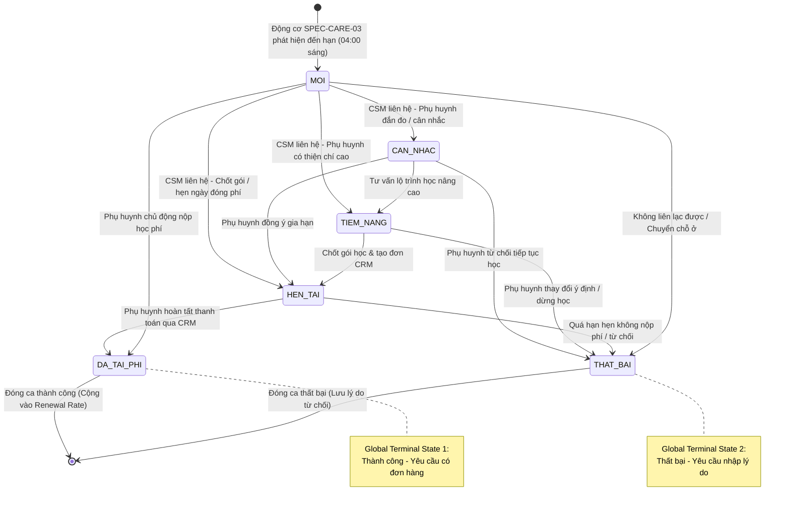

# BF-CARE-02: Nghiệp vụ Quản lý & Chăm sóc Tái phí Học viên (Tuition Renewal & Retention Care)

> **Capability:** CAP-CARE (Nghiệp vụ Chăm sóc Học viên & Giữ chân Khách hàng)  
> **Giai đoạn:** 2 - Vận hành hàng ngày & Giữ chân học viên  
> **Nhóm chức năng:** Vận hành và chăm sóc  
> **Mã màn hình:** `renewal` (`/app/renewal`)  
> **Tham chiếu Động cơ Điều kiện:** `SPEC-CARE-03: Bộ tiêu chí & Mốc kích hoạt - Gói học, Định kỳ` (Folder 133955752)  

---

## Lịch sử cập nhật tài liệu (Changelog)

| Ngày cập nhật | Nội dung cập nhật | Lý do cập nhật |
|---|---|---|
| 14/08/2026 | Phát hành tài liệu phân hệ BF-CARE-02 ban đầu | Chuẩn hóa quy trình nghiệp vụ chăm sóc tái phí, liên thông tạo đơn đơn hàng gia hạn CRM và dòng thời gian chăm sóc |
| 17/08/2026 | Cập nhật nguyên tắc hiển thị danh sách đơn hàng & liên thông gọi CRM | Làm rõ phạm vi phân hệ Station chỉ hiển thị danh sách đơn hàng, các thao tác tạo/sửa đơn đều chuyển hướng gọi sang hệ thống CRM (`crm.rinoedu.ai`) |
| 17/08/2026 | Bổ sung cơ chế kích hoạt từ SPEC-CARE-03 & Chuẩn hóa Tháng T, T+1, T+2 | Làm rõ mối quan hệ 2 tầng giữa Động cơ điều kiện chăm sóc (SPEC-CARE-03 chạy lúc 04:00 sáng) và Màn hình tác nghiệp tái phí theo 3 mốc Tháng T (≤ 1 tháng), Tháng T+1 (1-2 tháng), Tháng T+2 (2-3 tháng) |
| 18/08/2026 | Chuẩn hóa toàn diện theo Golden Template TEMPLATE-BF & Quality Gate 1 | Bổ sung Mô hình Thực thể Dữ liệu, Sơ đồ Mermaid Vòng đời Trạng thái với Global Terminal States, Bảng Quyền hạn Nguyên tử (Atomic Capabilities) và Bảng đánh giá 5 tiêu chí Rủi ro |

---

## 1. Bối cảnh & Vấn đề hiện tại (Context & Problem Statement)

### 1.1. Bối cảnh nghiệp vụ
Trong hoạt động vận hành của chuỗi trung tâm đào tạo, việc duy trì vòng đời học tập liên tục của học viên thông qua tái phí (Renewal / Retention) là yếu tố quyết định tới doanh thu định kỳ và sự gắn kết của phụ huynh. Phân hệ Chăm sóc Tái phí (`/app/renewal`) đóng vai trò là trung tâm tác nghiệp chuyên biệt giúp đội ngũ Chăm sóc khách hàng (CSM) và Quản lý cơ sở (BM) chủ động tiếp cận phụ huynh trước 30 – 90 ngày theo 3 nhóm mốc thời gian quản trị:
* **Nhóm Tháng T (Hạn ≤ 1 tháng / Tháng hiện tại):** Nhóm *Khẩn cấp (Urgent)* — Học viên sắp hết hạn học phí trong tháng hiện tại hoặc còn ≤ 5 buổi học. CSM phải ưu tiên liên hệ và chốt đơn gia hạn ngay.
* **Nhóm Tháng T+1 (Hạn 1 – 2 tháng / Tháng tiếp theo):** Nhóm *Tiềm năng (Pipeline)* — Học viên hết hạn trong tháng tới. CSM gửi báo cáo học tập định kỳ và tư vấn lộ trình gói học nâng cao (Level-Up).
* **Nhóm Tháng T+2 (Hạn 2 – 3 tháng / Tháng sau nữa):** Nhóm *Nuôi dưỡng (Nurturing)* — Học viên hết hạn trong 2 tháng tới. CSM chuẩn bị lộ trình học tập và tâm lý cho phụ huynh.

### 1.2. Mối quan hệ Kiến trúc 2 Tầng giữa Điều kiện Chăm sóc & Tác nghiệp Tái phí
Phân hệ Tái phí vận hành trên mô hình 2 tầng liên kết chặt chẽ:
1. **Tầng 1 - Động cơ Quy tắc & Điều kiện (Care Rule Engine - `SPEC-CARE-03` trong Folder 133955752):**
   * *Tiêu chí Số buổi còn lại (Cảnh báo Tái phí):* Máy chủ tự động rà soát hàng ngày lúc **04:00 sáng**, lọc học viên có số buổi còn lại ≤ N buổi (mặc định ≤ 5 buổi).
   * *Tiêu chí Số ngày còn hạn của gói học:* Tự động quét lúc **04:00 sáng**, lọc học viên có số ngày còn hạn ≤ 30 ngày (Tháng T), 31 – 60 ngày (Tháng T+1), 61 – 90 ngày (Tháng T+2).
   * *Tiêu chí Định kỳ:* Tự động đối soát vào ngày 1 đầu tháng để dịch chuyển chu kỳ quản trị (Tháng T+1 chuyển thành Tháng T).
2. **Tầng 2 - Màn hình Tác nghiệp Tái phí (Operational Screen - `BF-CARE-02` trong Folder 133988472):**
   * Tiếp nhận danh sách học viên từ Tầng 1, hiển thị trên giao diện `/app/renewal` với bộ lọc nhanh 4 nút (Tất cả, Tháng T, Tháng T+1, Tháng T+2).
   * Cung cấp 6 khối thẻ trạng thái động (Mới, Cân nhắc, Tiềm năng, Hẹn tái, Đã tái phí, Thất bại).
   * Hỗ trợ chuyển hướng gọi sang CRM (`crm.rinoedu.ai`) để tạo đơn gia hạn và ghi nhận nhật ký tư vấn (thẻ `CSTP`).

### 1.3. Vấn đề thực tế cần giải quyết
* [Người dùng tự điền: Thực trạng thất thoát học viên do không theo dõi sát mốc hạn học phí trước đây]
* [Người dùng tự điền: Khó khăn khi nhân viên CSM phải theo dõi thủ công trên bảng tính và không có liên thông với hệ thống đơn hàng]

---

## 2. Mục tiêu, Giá trị mang lại & Chỉ số đo lường (Objectives, Value & KPIs)

* **Mục tiêu:** Cung cấp không gian làm việc tập trung phân nhóm thời hạn Tháng T/T+1/T+2; tích hợp bảng dữ liệu 8 cột bảo mật SĐT `091****111`; liên thông gọi sang CRM để xử lý đơn hàng; ghi nhận dòng thời gian chăm sóc chuyên biệt gắn thẻ `CSTP`.
* **Giá trị mang lại:** Tăng tỷ lệ giữ chân học viên, chuẩn hóa quy trình tiếp cận phụ huynh trước hạn 30-90 ngày, giảm thiểu thao tác nhập liệu thủ công giữa hệ thống quản trị trường và CRM.
* **Mục tiêu đo lường hiệu quả (KPIs):**

| Chỉ số đo lường (KPI) | Hiện trạng (Baseline) | Mục tiêu đề xuất (Target) | Phương pháp đo lường |
| :--- | :---: | :---: | :--- |
| **`[KPI-001]` Tỷ lệ Tái phí (Renewal Rate)** | [Người dùng tự điền...] | $\ge 70\%$ | Tỷ lệ học viên đến hạn tiếp tục đóng phí học kỳ mới trên tổng số học viên đến hạn trong tháng |
| **`[KPI-002]` Tỷ lệ Tiếp cận Đúng hạn SLA Tái phí** | [Người dùng tự điền...] | $\ge 95\%$ | Tỷ lệ học viên nhóm Tháng T (≤ 1 tháng) được ghi nhận tương tác tối thiểu 1 lần trước 20 ngày |
| **`[KPI-003]` Tỷ lệ Chuyển đổi Đơn gia hạn** | [Người dùng tự điền...] | $\ge 65\%$ | Tỷ lệ đơn gia hạn được phụ huynh xác nhận thanh toán thành công qua CRM |

---

## 3. Hiểu người dùng (Target Users & Personas)

* **Nhân viên Chăm sóc Khách hàng (CSM - `SR-CSM-002`):**
  * *Bối cảnh sử dụng:* Hằng ngày truy cập `/app/renewal`, lọc nhóm Tháng T để xử lý khẩn cấp, lọc nhóm Tháng T+1/T+2 để chuẩn bị tư vấn lộ trình nâng cao.
  * *Nhu cầu thực tế:* Cần xem nhanh lịch sử chăm sóc, số buổi còn lại, hạn gói, các gói đã mua của học viên và gia đình; kích hoạt nhanh cuộc gọi và mở tạo đơn CRM.
* **Quản lý Cơ sở (BM):**
  * *Bối cảnh sử dụng:* Theo dõi định kỳ hàng tuần/hàng tháng, rà soát tỷ lệ chuyển đổi tái phí toàn cơ sở.
  * *Nhu cầu thực tế:* Giám sát tiến độ chăm sóc nhóm Tháng T, hỗ trợ xử lý các ca phụ huynh đắn đo hoặc từ chối để có giải pháp can thiệp kịp thời.
* **Giáo viên (Teacher):**
  * *Bối cảnh sử dụng:* Xem nhận xét học thuật và phản hồi quá trình học của học viên trước kỳ tái phí.
  * *Nhu cầu thực tế:* Cung cấp nhận xét chuyên sâu về sự tiến bộ của học viên để CSM gửi kèm báo cáo học tập thuyết phục phụ huynh.

---

## 4. Ranh giới Nghiệp vụ & Danh sách Chức năng (Scope & Feature Matrix)

### Có bao gồm (In Scope)
- Hiển thị danh sách học viên tái phí theo 3 mốc Tháng T / T+1 / T+2 từ Động cơ `SPEC-CARE-03`.
- Bảng danh sách 8 cột với tính năng che ẩn bảo mật số điện thoại `091****111`.
- 6 khối thẻ trạng thái động cập nhật số đếm theo toàn bộ bộ lọc trên màn hình.
- Khối chi tiết Tab Đơn hàng hiển thị các gói hiện tại, gói đã mua, lịch sử chuyển phí và tùy chọn xem đơn của các con khác trong cùng gia đình.
- Biểu mẫu ghi nhận tương tác tái phí chuyên biệt (gắn thẻ `CSTP`), bộ chọn gói gia hạn, lịch hẹn gọi lại và liên kết bắt buộc đơn hàng khi hoàn thành.
- Bảng thông tin nổi xem nhanh lịch sử chăm sóc tại dòng (`CSTPHistoryPopover`).
- Chuyển hướng liên thông gọi sang CRM (`crm.rinoedu.ai`) khi tạo đơn mới, thanh toán thêm hoặc mở chi tiết phiếu.

### Không bao gồm (Out of Scope)
- Nghiệp vụ cấu hình quy tắc và tiêu chí quét tự động $\rightarrow$ Đã được xử lý tại `SPEC-CARE-03` / `BF-CARE-03`.
- Nghiệp vụ tạo đơn hàng, tính chiết khấu và xử lý cổng thanh toán trực tiếp $\rightarrow$ Đã được xử lý tại hệ thống CRM (`crm.rinoedu.ai`).
- Nghiệp vụ chăm sóc học vụ thường nhật (nghỉ học, điểm danh, nộp bài tập) $\rightarrow$ Đã được xử lý tại `BF-CARE-01`.

### Danh sách Phạm vi Chức năng (Feature Scope Matrix)

| Mã chức năng | Tên chức năng | Mô tả phạm vi chức năng | Mức ưu tiên | Phân loại |
|---|---|---|:---:|:---:|
| `FEAT-RNW-01` | Màn hình Danh sách Tái phí | Bảng danh sách 8 cột, bộ lọc thời hạn Tháng T/T+1/T+2, 6 thẻ trạng thái động, tìm kiếm thông minh, bảng lọc 8 nhóm, xuất dữ liệu | Must | Bắt buộc |
| `FEAT-RNW-02` | Tab Đơn hàng & Liên thông CRM | Hiển thị danh sách Gói hiện tại, Gói đã mua, Lịch sử chuyển phí, ô chọn xem đơn con khác; các nút Tạo đơn/Gia hạn chuyển hướng gọi sang crm.rinoedu.ai | Must | Bắt buộc |
| `FEAT-RNW-03` | Dòng thời gian Chăm sóc Tái phí | Biểu mẫu chọn gói gia hạn, ghi nhận tương tác Zalo/Điện thoại/Trực tiếp, phân loại tái phí, lịch hẹn gọi lại và lưu vết nhật ký CSTP | Must | Bắt buộc |
| `FEAT-RNW-04` | Quy trình Chăm sóc Toàn trình | Luồng toàn trình từ quét hạn SPEC-CARE-03 $\rightarrow$ tư vấn $\rightarrow$ chuyển hướng tạo đơn CRM $\rightarrow$ đóng ca tái phí | Must | Bắt buộc |

### Đánh giá & Phân loại Risk / Standard (Quality Gate 1)

| Tiêu chí | Nội dung đánh giá thực tế | Điểm (0 / 1) |
|---|---|:---:|
| **A. Ảnh hưởng hệ thống** | Tác động 2 phân hệ: Quản lý học viên Station và Hệ thống Đơn hàng CRM | 1 |
| **B. Tác động tài chính** | Ảnh hưởng trực tiếp đến doanh thu tái phí, hợp đồng gia hạn và công nợ | 1 |
| **C1. Loại thay đổi** | Chuẩn hóa nghiệp vụ tái phí chuyên biệt và liên thông CRM | 0 |
| **C2. Độ mới nghiệp vụ** | Nghiệp vụ tái phí đã có quy trình rõ ràng | 0 |
| **D. Phụ thuộc bên ngoài** | Phụ thuộc liên thông chuyển hướng gọi sang hệ thống CRM (`crm.rinoedu.ai`) | 1 |

* **Tổng điểm đánh giá:** **3 điểm**
* **Kết luận phân loại:** 🔴 **Risk** *(Bắt buộc Product Manager kiểm duyệt và ký xác nhận trên Confluence)*

---

## 5. Mô hình Dữ liệu Nghiệp vụ & Phân Quyền Năng Lực (Data Entities & Permissions)

| Tên Thực thể | Trường định danh | Thuộc tính quan trọng | Ràng buộc quan hệ | Diễn giải |
|---|---|---|---|---|
| **Học viên Tái phí (Renewal Student)** | `student_id` | Họ tên, Mã học viên, Tên phụ huynh, Số điện thoại (che bảo mật), Cơ sở, Môn học, Trạng thái học viên | Thuộc về `Branch` và `Subject` | Hồ sơ học viên có gói học cần theo dõi tái phí |
| **Gói học Tái phí (Renewal Package)** | `package_id` | Tên gói, Trình độ/Level, Ngày bắt đầu, Ngày hết hạn, Tổng số buổi, Số buổi còn lại, Nhóm thời hạn (Tháng T / T+1 / T+2) | Liên kết với `student_id` | Gói học đang kích hoạt sắp đến hạn gia hạn |
| **Nhật ký Chăm sóc Tái phí (Care Log CSTP)** | `care_log_id` | Ngày tương tác, Kênh liên lạc (Zalo/Điện thoại/Trực tiếp), Phân loại tái phí (6 nấc), Lịch hẹn gọi lại, Ghi chú trao đổi, Ý kiến phụ huynh, Gói học gia hạn liên kết | Thuộc về `student_id` và `package_id` | Bản ghi nhật ký tương tác tư vấn có gắn nhãn định danh `CSTP` |
| **Hợp đồng / Đơn CRM (Linked CRM Order)** | `order_id` | Mã đơn hàng (`ODxxxxxx`), Tổng giá trị, Đã thanh toán, Còn thiếu, Trạng thái thanh toán, Link báo giá (`/quote/OD...`) | Liên kết từ `CRM Order Service` | Đơn hàng gia hạn được tạo và quản lý trên CRM |
| **Phiếu Chuyển phí (Transfer Record)** | `transfer_id` | Mã phiếu (`CPxxxxxx`), Gói nguồn, Gói đích, Số buổi quy đổi, Số tiền chuyển, Mã ticket duyệt CRM | Liên kết giữa 2 hợp đồng | Giao dịch điều chuyển học phí giữa các khóa học |

### 5.1. Vòng đời Trạng thái Tái phí (Renewal Status Lifecycle)
*Mô hình hóa chu trình trạng thái thực tế với các nhánh rẽ và điểm kết thúc toàn cục (Global Terminal States):*

### 5.2. Danh mục Quyền hạn & Năng lực Nghiệp vụ Động (Atomic Permissions / Capabilities)

> [!IMPORTANT]
> **Nguyên tắc Phân quyền Động (Dynamic Capability Gating):**
> Hệ thống **tuyệt đối KHÔNG gán cứng quyền theo bất kỳ Vai trò (Role) cố định nào**. Toàn bộ vai trò và phân quyền được quản trị viên thiết lập động tại phân hệ Quản trị Hệ thống. Bảng dưới đây định nghĩa danh mục các **Năng lực Quyền hạn Nguyên tử (Atomic Permission Keys)** mà phân hệ Chăm sóc Tái phí cung cấp:

| Mã Quyền Hạn (Permission Key) | Tên Quyền Hạn (Tiếng Việt) | Loại Quyền | Phạm Vi Áp Dụng (Scope) | Diễn Giải Nghiệp Vụ |
| :--- | :--- | :---: | :--- | :--- |
| `care.renewal.view` | Xem danh sách tái phí | Truy cập | Màn hình `/app/renewal` | Cho phép truy cập màn hình và xem danh sách học viên đến hạn |
| `care.renewal.filter` | Lọc và tìm kiếm tái phí | Thao tác | Thanh công cụ | Cho phép sử dụng bộ lọc Tháng T/T+1/T+2, cơ sở, môn học và ô tìm kiếm |
| `care.renewal.view_detail` | Xem chi tiết chăm sóc | Truy cập | Trang chi tiết | Cho phép mở xem chi tiết hồ sơ học tập và các tab thông tin |
| `care.renewal.add_log` | Ghi nhận nhật ký tái phí | Ghi | Biểu mẫu tác nghiệp | Cho phép nhập ghi chú, chọn phân loại, đặt lịch hẹn và tạm lưu tương tác |
| `care.renewal.complete` | Hoàn thành ca tái phí | Ghi | Nút Hoàn thành | Cho phép xác nhận Đã tái phí thành công khi có đơn hàng hợp lệ |
| `care.renewal.export` | Xuất dữ liệu tái phí | Xuất | Nút Xuất dữ liệu | Cho phép xuất danh sách học viên ra tệp bảng tính |
| `care.order.view` | Xem danh sách đơn hàng | Truy cập | Tab Đơn hàng | Cho phép xem danh sách hợp đồng, gói học và lịch sử chuyển phí |
| `care.order.create` | Tạo đơn gia hạn mới | Thao tác | Nút `[+ Tạo đơn]` | Cho phép chuyển hướng sang CRM để tạo đơn hàng mới |
| `care.order.payment` | Thu tiền bổ sung | Thao tác | Nút `[+ Thanh toán thêm]` | Cho phép chuyển hướng sang CRM để ghi nhận đợt thu đơn cọc |
| `care.order.view_transfer` | Xem chi tiết chuyển phí | Truy cập | Modal Chuyển phí | Cho phép xem chi tiết quy đổi số buổi/tiền của phiếu chuyển phí |
| `care.order.view_siblings` | Xem đơn con khác | Truy cập | Hộp kiểm con khác | Cho phép truy vấn hợp đồng của các con khác trong gia đình |

---

## 6. Quy tắc Nghiệp vụ Tổng thể (Bóc tách trực tiếp từ Giao diện & Dữ liệu Thực tế)

1. **[RULE-CARE-02-01] Kích hoạt từ Động cơ Điều kiện SPEC-CARE-03:** Danh sách học viên tái phí được máy chủ tự động quét và phân nhóm vào lúc **04:00 sáng** hàng ngày theo tiêu chí số ngày còn hạn (≤ 30 ngày cho Tháng T, ≤ 60 ngày cho Tháng T+1, ≤ 90 ngày cho Tháng T+2) hoặc số buổi còn lại (≤ 5 buổi).
2. **[RULE-CARE-02-02] Che ẩn số điện thoại bảo mật:** Trên bảng danh sách chính, số điện thoại phụ huynh bắt buộc che ẩn ở giữa dạng `091****111` để tránh sao chép dữ liệu hàng loạt. Chỉ hiển thị số điện thoại đầy đủ tại Trang Chi tiết Chăm sóc đối với tài khoản có thẩm quyền.
3. **[RULE-CARE-02-03] Thẻ trạng thái đi theo bộ lọc động:** Số lượng đếm trên 6 khối thẻ trạng thái tái phí (Mới, Cân nhắc, Tiềm năng, Hẹn tái, Đã tái phí, Thất bại) tự động tính toán lại 100% theo tất cả các bộ lọc đang chọn (Cơ sở, Môn học, Thời hạn Tháng T/T+1/T+2 và từ khóa tìm kiếm).
4. **[RULE-CARE-02-04] Ưu tiên nhóm Tháng T lên trên cùng:** Bảng danh sách mặc định sắp xếp học viên thuộc nhóm Tháng T (hoặc có số buổi còn lại ít nhất) lên trên cùng để đảm bảo tính khẩn cấp tác nghiệp.
5. **[RULE-CARE-02-05] Phân nhóm Thời hạn chuẩn:**
   - *Tháng T:* Hạn ≤ 1 tháng (hoặc ≤ 30 ngày) / Tháng hiện tại.
   - *Tháng T+1:* Hạn 1 – 2 tháng (hoặc 31 – 60 ngày) / Tháng tiếp theo.
   - *Tháng T+2:* Hạn 2 – 3 tháng (hoặc 61 – 90 ngày) / Tháng sau nữa.
6. **[RULE-CARE-02-06] Phạm vi Đơn hàng & Liên thông CRM:** Tab Đơn hàng tại phân hệ Station chỉ hiển thị danh sách các gói học. Toàn bộ thao tác Tạo đơn, Tạo đơn tái phí, Hoàn tất thanh toán, Thu bổ sung đều chuyển hướng gọi sang hệ thống CRM (`crm.rinoedu.ai`).
7. **[RULE-CARE-02-07] Bảo toàn Lịch sử Tương tác Thẻ `CSTP`:** Ghi nhận vĩnh viễn và hiển thị tức thì trên dòng thời gian với thẻ định danh `CSTP` màu xanh lá, đi kèm khung nhắc hẹn gọi lại màu tím ở đầu danh sách.
8. **[RULE-CARE-02-08] Xem đơn hàng các con khác:** Cung cấp ô chọn "Xem đơn các con khác" để hiển thị hợp đồng của các anh/chị/em trong cùng gia đình kèm nhãn tên học viên để phân biệt.

---

## 7. Danh sách Yêu cầu Người dùng (User Stories)

| Tên Yêu cầu (Màn hình / Hộp thoại) | Phân loại | Mã Quyền Yêu Cầu (Required Capability) |
| :--- | :---: | :--- |
| **`US-CARE-02-01` Màn hình Danh sách Tái phí học viên** (Màn hình Danh sách) | 🟢 Standard | `care.renewal.view`, `care.renewal.filter`, `care.renewal.export` |
| **`US-CARE-02-02` Màn hình Chi tiết Chăm sóc Tái phí & Tab Đơn hàng** (Trang Chi tiết) | 🔴 Risk | `care.renewal.view_detail`, `care.order.view`, `care.order.create`, `care.order.payment`, `care.order.view_transfer`, `care.order.view_siblings` |
| **`US-CARE-02-03` Biểu mẫu & Dòng thời gian Nhật ký Chăm sóc Tái phí** (Biểu mẫu & Bảng nổi) | 🟢 Standard | `care.renewal.add_log`, `care.renewal.complete` |
| **`FLOW-CARE-02` Quy trình Chăm sóc Tái phí, Tạo đơn CRM & Gia hạn Toàn trình** (Luồng Toàn trình) | 🔴 Risk | `care.renewal.view`, `care.renewal.add_log`, `care.order.create`, `care.renewal.complete` |

---

## Phụ lục: Tự đánh giá Quality Gate 1 (Checklist A)
- [x] **1. Vì sao phải làm?** Mục 1 nêu rõ bối cảnh 3 nhóm Tháng T/T+1/T+2 và kiến trúc 2 tầng với Động cơ `SPEC-CARE-03`.
- [x] **2. Làm cho ai?** Persona CSM, BM, Teacher được định nghĩa cụ thể trong Mục 3.
- [x] **3. Người dùng sử dụng thế nào?** Luồng trạng thái phễu State Diagram được mô tả tại Mục 5.1 với 2 Global Terminal States.
- [x] **4. Phân quyền động?** Danh mục quyền hạn nguyên tử (Atomic Capabilities) được quy định tại Mục 5.2.
- [x] **5. Feature Scope?** Danh sách User Stories con được liệt kê tại Mục 7 kèm mã quyền hạn liên kết.
- [x] **6. Thiết kế UI/UX dễ dùng?** Bảng 8 cột tinh gọn, che ẩn SĐT bảo mật, 6 thẻ trạng thái động.
