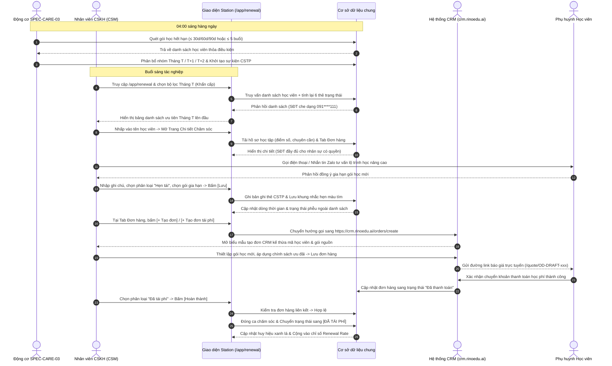

# FLOW-CARE-02: Quy trình Chăm sóc Tái phí, Tạo đơn CRM & Gia hạn Khóa học Toàn trình (End-to-End Renewal Flow)

> **Capability:** CAP-CARE (Nghiệp vụ Chăm sóc Học viên & Giữ chân Khách hàng)  
> **Parent BF:** `BF-CARE-02` (Nghiệp vụ Quản lý & Chăm sóc Tái phí Học viên)  
> **User Stories:** `US-CARE-02-01`, `US-CARE-02-02`, `US-CARE-02-03`  
> **Giai đoạn:** Vận hành hàng ngày & Giữ chân học viên  
> **Tham chiếu Động cơ Điều kiện:** `SPEC-CARE-03: Bộ tiêu chí & Mốc kích hoạt - Gói học, Định kỳ` (Folder 133955752)  

---

## Lịch sử cập nhật tài liệu (Changelog)

| Ngày cập nhật | Nội dung cập nhật | Lý do cập nhật |
|---|---|---|
| 14/08/2026 | Phát hành tài liệu luồng FLOW-CARE-02 ban đầu | Định nghĩa toàn trình luồng quét hạn học phí, tư vấn tái phí, tạo đơn CRM và gia hạn số buổi học |
| 17/08/2026 | Cập nhật nguyên tắc chuyển hướng tạo đơn sang CRM | Chuẩn hóa bước tạo đơn gia hạn từ Station chuyển hướng gọi sang hệ thống CRM (`crm.rinoedu.ai`) |
| 17/08/2026 | Tích hợp mốc kích hoạt SPEC-CARE-03 & Chuẩn hóa Tháng T/T+1/T+2 | Bổ sung chi tiết bước 1 tự động quét lúc 04:00 sáng theo tiêu chí SPEC-CARE-03 phân bổ vào 3 nhóm Tháng T, Tháng T+1, Tháng T+2 |
| 18/08/2026 | Bổ sung Sơ đồ Trình tự Toàn trình Mermaid & Chuẩn hóa TEMPLATE-FLOW | Chuẩn hóa cấu trúc 6 mục theo TEMPLATE-FLOW, bổ sung sơ đồ Mermaid sequenceDiagram toàn trình kết nối Động cơ quét, Station, CRM và Phụ huynh |

---

## 1. Bối cảnh Nghiệp vụ & Mốc Kích hoạt Tự động (Context)

Quy trình toàn trình kết nối từ **Động cơ Quy tắc Điều kiện chăm sóc (`SPEC-CARE-03`)** tự động quét lúc **04:00 sáng** hàng ngày để phát hiện học viên có số ngày còn hạn (≤ 30/60/90 ngày) hoặc số buổi còn lại (≤ 5 buổi), phân bổ vào 3 nhóm quản trị (**Tháng T, Tháng T+1, Tháng T+2**), hỗ trợ nhân viên CSM nắm bắt kết quả học tập để tư vấn thuyết phục, chuyển hướng tạo đơn gia hạn sang CRM chuyên trách (`crm.rinoedu.ai`) và ghi nhận thanh toán đóng ca thành công.

---

## 2. Đối tượng & Hệ thống tham gia (RACI Matrix)

| Bước quy trình | Nhân viên CSKH (CSM) | Quản lý Cơ sở (BM) | Giáo viên (Teacher) | Hệ thống (Station / CRM) |
|---|:---:|:---:|:---:|:---:|
| **1. Quét & Phân nhóm Tháng T/T+1/T+2** | I (Theo dõi) | I (Theo dõi) | I | **R / A (Tự động quét SPEC-CARE-03 lúc 04:00 sáng)** |
| **2. Rà soát Hồ sơ & Thành tích học tập** | **R / A (Thực hiện chính)** | I | C (Cung cấp nhận xét) | S (Cung cấp dữ liệu toàn diện) |
| **3. Tác nghiệp Liên hệ & Tư vấn Tái phí** | **R / A (Thực hiện chính)** | C (Hỗ trợ ca khó) | C | S (Tích hợp kênh liên lạc) |
| **4. Ghi nhận Tương tác & Lịch hẹn** | **R / A (Nhập liệu)** | I (Giám sát) | I | S (Lưu trữ lịch sử thẻ CSTP) |
| **5. Chuyển hướng Tạo đơn Gia hạn CRM** | **R / A (Kích hoạt nút)** | C (Duyệt chiết khấu) | I | **S (Gọi sang crm.rinoedu.ai)** |
| **6. Gửi Báo giá & Theo dõi Đóng phí** | **R / A (Gửi link PH)** | I | I | S (Sinh trang báo giá `/quote/`) |
| **7. Xác nhận Thanh toán & Đóng ca** | **R (Cập nhật)** | A (Duyệt xác nhận) | I | **S (Chuyển trạng thái Đã tái phí)** |

---

## 3. Sơ đồ Trình tự Nghiệp vụ Toàn trình (End-to-End Sequence Diagram)

---

## 4. Diễn giải Chi tiết Từng Bước Thực Hiện

| Bước | Tác nhân | Giao diện | Hành động | Dữ liệu đầu vào | Kết quả mong đợi |
|---|---|---|---|---|---|
| **1. Quét & Phân nhóm Tháng T/T+1/T+2** | Hệ thống (Động cơ SPEC-CARE-03) | Màn hình Danh sách Tái phí (`/app/renewal`) | Hệ thống tự động chạy lúc 04:00 sáng: lọc các gói học có số ngày còn hạn ≤ 30 ngày (Tháng T), 31 – 60 ngày (Tháng T+1), 61 – 90 ngày (Tháng T+2) hoặc số buổi ≤ 5 buổi | Hạn kết thúc học phí dự kiến, Số buổi còn lại | Hiển thị danh sách học viên theo thứ tự ưu tiên (Tháng T lên trên cùng), cập nhật số lượng trên các khối thẻ trạng thái |
| **2. Rà soát Hồ sơ & Thành tích** | CSM | Trang Chi tiết Chăm sóc Tái phí (Cột trái) | Nhấp vào tên học viên để mở trang chi tiết, chuyển đổi giữa Tab Học tập và Tab Đơn hàng để nắm thành tích | Mã học viên, Mã gói học | Hiển thị đầy đủ chuyên cần, điểm kiểm tra, bài tập, lịch sử chuyển lớp và danh sách các gói học đã mua |
| **3. Tác nghiệp Liên hệ & Tư vấn** | CSM | Trang Chi tiết Chăm sóc Tái phí (Cột phải) | Nhấp nút Bắt đầu cuộc gọi hoặc mở kênh Zalo trao đổi với phụ huynh về sự tiến bộ của con và đề xuất lộ trình khóa học mới | Số điện thoại phụ huynh, Kịch bản tư vấn tái phí | Phụ huynh tiếp nhận thông tin tư vấn và phản hồi nguyện vọng (đồng ý, cần cân nhắc hoặc hẹn ngày đóng phí) |
| **4. Ghi nhận Tương tác & Lịch hẹn** | CSM | Dòng thời gian Nhật ký Tái phí (`RenewalChatFeed`) | Chọn gói học gia hạn, chọn kênh liên lạc, chọn phân loại tái phí (Cân nhắc / Tiềm năng / Hẹn tái), chọn ngày giờ hẹn gọi lại, nhập ghi chú trao đổi và ý kiến phụ huynh $\rightarrow$ Bấm **Lưu** | Gói học gia hạn, Kênh liên lạc, Trạng thái tái phí mới, Lịch hẹn, Nội dung ghi chú, Ý kiến phụ huynh | Lưu 1 bản ghi vào dòng thời gian (thẻ CSTP), cập nhật huy hiệu trạng thái trên bảng danh sách, hiển thị lịch nhắc hẹn màu tím |
| **5. Chuyển hướng Tạo đơn Gia hạn CRM** | CSM | Tab Đơn hàng (`StudentOrdersTab`) | Bấm nút **[Tạo đơn tái phí]** tại dòng gói học hiện tại (hoặc nút **[+ Tạo đơn]** trên cùng) $\rightarrow$ Giao diện tự động chuyển hướng gọi sang hệ thống CRM `crm.rinoedu.ai` | Mã gói nguồn, Mã đơn cũ, Mã học viên | Hệ thống chuyển hướng gọi sang `crm.rinoedu.ai`, khởi tạo đơn hàng gia hạn kế thừa thông tin gói nguồn |
| **6. Gửi Báo giá Trực tuyến** | CSM | Tab Đơn hàng & Trang Báo giá CRM | Nhấp biểu tượng sao chép đường link báo giá `/quote/OD-DRAFT-xxx` $\rightarrow$ Gửi qua Zalo/tin nhắn cho phụ huynh | Đường dẫn báo giá trực tuyến | Phụ huynh mở xem chi tiết đơn hàng, lịch học dự kiến, số tiền cần thanh toán và các chính sách ưu đãi |
| **7. Xác nhận Đóng phí & Đóng ca** | CSM / BM | Dòng thời gian Nhật ký Tái phí | Phụ huynh chuyển khoản thanh toán thành công $\rightarrow$ CSM chọn phân loại **Đã tái phí** $\rightarrow$ Bấm **Hoàn thành** | Biên lai chuyển khoản / Xác nhận thanh toán từ CRM | Cập nhật trạng thái ca thành **Đã tái phí**, hiển thị huy hiệu xanh lá, cộng vào chỉ số Renewal Rate của cơ sở |

---

## 5. Luồng Ngoại lệ & Xử lý Rủi ro (Exceptions & Risk Mitigation)

| Tình huống ngoại lệ | Rủi ro phát sinh | Cơ chế xử lý của Hệ thống & Người dùng |
|---|---|---|
| **Học viên thuộc nhóm Tháng T+1 nhưng số buổi còn lại ≤ 3 buổi** | Học viên hết buổi sớm hơn dự kiến do học tăng cường/đúp buổi | Động cơ quy tắc tự động nâng độ ưu tiên của học viên lên nhóm Tháng T (Khẩn cấp) và gắn cờ cảnh báo cận buổi. |
| **Mốc giao thời đêm chuyển giao tháng (31/08 $\rightarrow$ 01/09)** | Sai lệch nhóm thời hạn quản trị giữa các tháng | Động cơ quét 04:00 sáng ngày 1 đầu tháng tự động dịch chuyển toàn bộ học viên nhóm Tháng T+1 thành nhóm Tháng T và nhóm Tháng T+2 thành Tháng T+1. |
| **Học viên bảo lưu trong kỳ tái phí** | Gửi nhầm thông báo giục phí cho học viên đang tạm dừng học | Hệ thống kiểm tra trạng thái bảo lưu, tạm đóng băng việc tính hạn học phí cho đến khi học viên mở lại lớp. |
| **Mất kết nối khi chuyển hướng gọi sang CRM** | Không thể mở trang tạo đơn của CRM, gián đoạn tác nghiệp | Giao diện hiển thị thông báo lỗi thân thiện: *"Không thể kết nối đến hệ thống đơn hàng CRM, vui lòng thử lại sau vài giây"*. Nhân viên có thể bấm lại nút tạo đơn khi đường truyền ổn định. |

---

## 6. Tiêu chí Nghiệm thu Luồng (Flow Acceptance Criteria)

* **AC-FLOW-01 (Happy Path - Quét hạn & Xử lý ca Tháng T):**
  - **Giả sử:** Học viên có gói học rơi vào nhóm Tháng T (≤ 1 tháng).
  - **Khi:** Nhân viên CSM mở trang chi tiết, rà soát kết quả học tập, gọi điện tư vấn, cập nhật trạng thái "Hẹn tái" và bấm "Tạo đơn tái phí" từ gói học hiện tại.
  - **Thì:** Hệ thống chuyển hướng gọi thành công sang CRM `crm.rinoedu.ai` kế thừa mã gói cũ, lưu nhật ký tương tác thẻ `CSTP` và hỗ trợ sinh link báo giá hợp lệ.
* **AC-FLOW-02 (Liên thông CRM & Chuyển đổi thành công):**
  - **Giả sử:** Đơn hàng gia hạn đã được tạo trên CRM.
  - **Khi:** Phụ huynh hoàn tất thanh toán và nhân viên chọn phân loại "Đã tái phí" rồi bấm "Hoàn thành".
  - **Thì:** Hệ thống kiểm tra đơn hàng hợp lệ, cập nhật trạng thái đơn hàng sang Đã thanh toán, đóng ca chăm sóc và tăng chỉ số Renewal Rate của cơ sở.
* **AC-FLOW-03 (Chuyển tiếp Tháng T+1 $\rightarrow$ Tháng T):**
  - **Giả sử:** Hệ thống bước sang ngày 01 của tháng mới.
  - **Khi:** Động cơ SPEC-CARE-03 chạy quét lúc 04:00 sáng.
  - **Thì:** Toàn bộ học viên nhóm Tháng T+1 tự động được gán vào nhóm Tháng T để CSM bắt đầu đợt chăm sóc cao điểm.
