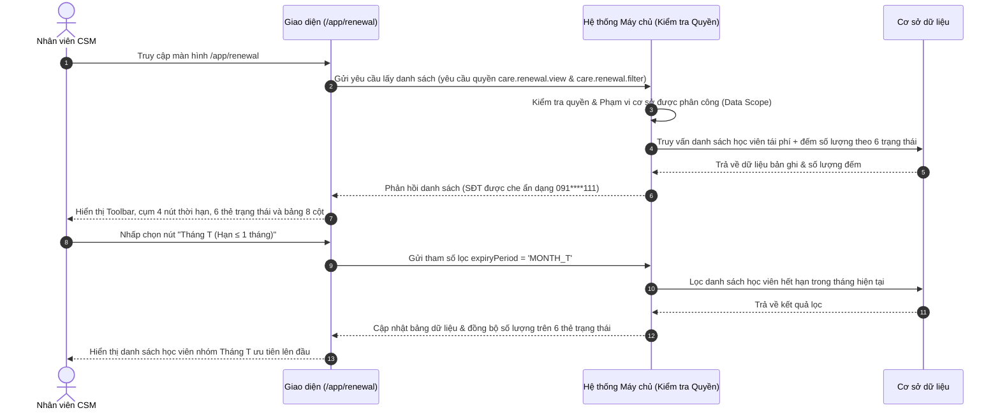

# US-CARE-02-01: Màn hình Danh sách Tái phí học viên (Renewal List Screen)

> **Tham chiếu:** `BF-CARE-02` · `FLOW-CARE-02` · `SR-CSM-002` · `[DS-P1]` · `[POLICY-DS-05]`  
> **Đường dẫn màn hình & Trạng thái liên quan:**  
> - `/app/renewal` $\rightarrow$ Trạng thái: `MỚI`, `CÂN NHẮC`, `TIỀM NĂNG`, `HẸN TÁI`, `ĐÃ TÁI PHÍ`, `THẤT BẠI`  
> **Tham chiếu Động cơ Điều kiện:** `SPEC-CARE-03: Bộ tiêu chí & Mốc kích hoạt - Gói học, Định kỳ` (Folder 133955752)  

---

## 1. NHẬT KÝ THAY ĐỔI & BỐI CẢNH (CHANGELOG & CONTEXT)

### Lịch sử cập nhật tài liệu (Changelog)

| Ngày cập nhật | Nội dung cập nhật | Lý do cập nhật |
|---|---|---|
| 14/08/2026 | Phát hành tài liệu US-CARE-02-01 ban đầu | Đặc tả giao diện danh sách tái phí, bộ lọc nhanh thời hạn và bảng dữ liệu 8 cột |
| 17/08/2026 | Bổ sung chi tiết bộ lọc Tháng T, T+1, T+2 và đồng bộ số đếm thẻ trạng thái | Chuẩn hóa bộ lọc thời hạn theo 3 mốc quản trị và bảo đảm số lượng đếm trên thẻ trạng thái khớp 100% với bộ lọc |
| 18/08/2026 | Chuẩn hóa theo Golden Template TEMPLATE-US-LIST & Quality Gate 2 | Bổ sung Mermaid sequenceDiagram ở Mục 2, Bảng Capability Gating Mục 3.1, đồng bộ giờ quét tự động 04:00 sáng và chuẩn hóa 5 Corner Cases |

### Bối cảnh & Vấn đề nghiệp vụ (Context & Problem)
* **Bối cảnh:** Màn hình Danh sách Tái phí học viên (`/app/renewal`) tiếp nhận dữ liệu được Động cơ Quy tắc Điều kiện chăm sóc (`SPEC-CARE-03`) quét tự động lúc **04:00 sáng** hàng ngày để phân nhóm học viên có gói học đến hạn trong vòng 90 ngày vào 3 mốc thời hạn quản trị (Tháng T, Tháng T+1, Tháng T+2).
* **Vấn đề hiện tại:** Nhân viên CSM gặp khó khăn trong việc phân loại độ khẩn cấp của các ca đến hạn, dễ bỏ sót học viên có số buổi còn lại ít (≤ 5 buổi) và nguy cơ lộ số điện thoại phụ huynh khi nhân viên sao chép hàng loạt ngoài danh sách.
* **Mục tiêu & Giá trị mang lại:** Cung cấp bộ lọc nhanh 4 nút thời hạn, 6 thẻ trạng thái động cập nhật số đếm tức thì, bảng dữ liệu 8 cột bảo mật SĐT `091****111` và bảng nổi xem nhanh lịch sử chăm sóc tại dòng.
* **Quy tắc nghiệp vụ liên quan:** Kế thừa toàn bộ 8 quy tắc nghiệp vụ tổng thể (Business Rules) từ tài liệu cha `BF-CARE-02`.

### Hiểu người dùng & Tình huống sử dụng (User Needs & Use Cases)
* **Người dùng chính (Persona):** `SR-CSM-002` (Nhân viên Chăm sóc Khách hàng / Chuyên viên Tái phí) và Quản lý cơ sở (BM).
* **Nhu cầu thực tế:** Cần lọc nhanh danh sách học viên theo từng mốc Tháng T (Khẩn cấp), Tháng T+1 (Tiềm năng), Tháng T+2 (Nuôi dưỡng) và từng cơ sở/môn học; xem nhanh tiến độ chăm sóc gần nhất để ưu tiên liên hệ.
* **Câu phát biểu nghiệp vụ:** **Là một** Nhân viên CSM, **tôi muốn** xem bảng danh sách học viên tái phí được phân nhóm rõ ràng theo mốc thời hạn và trạng thái chuyển đổi, **để** tôi chủ động tiếp cận phụ huynh đúng thời điểm và tối ưu tỷ lệ tái phí thành công.

### Phạm vi kiểm soát (Scope)
* **Phạm vi hiển thị:** Toàn bộ danh sách học viên có gói học thỏa mãn tiêu chí quét của `SPEC-CARE-03` tại cơ sở được phân quyền.

---

## 2. LUỒNG XỬ LÝ CHÍNH (MAIN FLOW - HAPPY PATH)

---

## 3. GIAO DIỆN, RÀNG BUỘC DỮ LIỆU & PHÂN QUYỀN (UI, VALIDATION & PERMISSION)

### 3.1. Cấu trúc các vùng giao diện & Ràng buộc Quyền hạn (Capability Gating)

Màn hình áp dụng cơ chế kiểm soát hiển thị theo **Mã Quyền Động (Atomic Permissions)** được định nghĩa tại `BF-CARE-02` §5.2:

| Vùng Giao diện / Nút Thao Tác | Loại Hiển Thị | Mã Quyền Yêu Cầu (Required Capability) | Xử Lý Khi Không Đủ Quyền |
| :--- | :--- | :--- | :--- |
| **Truy cập Màn hình `/app/renewal`** | Toàn bộ giao diện | `care.renewal.view` | Chặn truy cập, hiển thị màn hình 403 Không có quyền |
| **Thanh công cụ Bộ lọc & Tìm kiếm** | Ô thả xuống & Ô tìm kiếm | `care.renewal.filter` | Vô hiệu hóa hoặc ẩn thanh công cụ lọc |
| **Cụm 4 nút lọc nhanh Thời hạn** | Cụm nút bấm chọn | `care.renewal.filter` | Vô hiệu hóa cụm nút lọc thời hạn |
| **Nhấp Tên học viên Mở Chi tiết** | Liên kết dòng | `care.renewal.view_detail` | Không kích hoạt chuyển hướng sang trang chi tiết |
| **Nút [Xuất dữ liệu]** | Nút bấm biểu tượng tải xuống | `care.renewal.export` | Ẩn nút xuất dữ liệu |

### 3.2. Bảng đặc tả Thanh công cụ & Bộ lọc nhanh Thời hạn

| Thành phần giao diện | Kiểu hiển thị | Nguồn dữ liệu | Các tùy chọn chọn lựa | Logic xử lý & Ràng buộc hiển thị |
|---|---|---|---|---|
| **Bộ chọn Cơ sở** | Ô chọn thả xuống | Danh mục Cơ sở | Tất cả cơ sở / Tên từng cơ sở cụ thể | Lọc danh sách học viên theo cơ sở được chọn. Tự động khóa nếu tài khoản chỉ được phân quyền 1 cơ sở duy nhất. |
| **Bộ chọn Môn học** | Ô chọn thả xuống | Danh mục Môn học | Tất cả môn học (Mặc định), Tiếng Anh, Toán tư duy | Lọc học viên theo môn học của gói đăng ký hiện tại. |
| **Bộ chọn Trạng thái HV / Liên hệ** | Ô chọn thả xuống | Hệ thống | Tất cả, Chưa liên hệ, Đã gọi điện, Không nghe máy (KNM), Đã nhắn Zalo, Đã gặp trực tiếp | Lọc danh sách học viên theo hình thức và kết quả liên hệ gần nhất của nhân viên CSKH. |
| **Ô Tìm kiếm thông minh** | Ô nhập chữ | Người dùng nhập | Tên học viên, Tên tiếng Anh, Mã học viên, Mã khách hàng, Mã lớp, SĐT | Tự động kích hoạt lọc sau 300 miligiây dừng gõ. Tự động cắt khoảng trắng thừa hai đầu. |
| **Bộ lọc nhanh Thời hạn Học phí** | Cụm nút chọn dạng tròn | Hệ thống & Động cơ SPEC-CARE-03 | 1. **Tất cả (Mặc định)** 2. **Tháng T (Hạn ≤ 1 tháng)** — Viền đỏ 3. **Tháng T+1 (Hạn 1 – 2 tháng)** — Viền cam 4. **Tháng T+2 (Hạn 2 – 3 tháng)** — Viền xanh lá | Nằm ở góc trên bên phải thanh công cụ. Khi chọn một mốc hạn, bảng danh sách và khối thẻ trạng thái tự động lọc theo khoảng ngày hết hạn tương ứng. |
| **Nút Mở bảng lọc nâng cao** | Nút bấm biểu tượng phễu lọc | Hệ thống | Hiển thị số lượng bộ lọc đang kích hoạt | Nhấp vào mở Bảng lọc nâng cao trượt từ cạnh phải màn hình (8 nhóm tiêu chí nâng cao). |
| **Nút Xuất dữ liệu** | Nút bấm biểu tượng tải xuống | Hệ thống | Chọn các trường thông tin cần xuất, chọn tháng hoặc khoảng ngày | Cho phép xuất danh sách học viên ra tệp bảng tính Excel theo các trường đã chọn (Yêu cầu quyền `care.renewal.export`). |

### 3.3. Bảng Dữ liệu Tái phí Học viên (8 Cột Chuẩn)

| Cột thông tin | Kiểu hiển thị | Nguồn dữ liệu | Quy tắc thị giác & Hiển thị chi tiết | Tương tác Rê chuột & Nhấp chuột |
|---|---|---|---|---|
| **Ô chọn dòng (Checkbox)** | Ô chọn vuông `[ ]` | Hệ thống | Tích chọn dòng để thực hiện tác vụ hàng loạt. Ô chọn trên cùng chọn tất cả. | Nhấp chọn một hoặc nhiều dòng dữ liệu. |
| **Học viên** | Ảnh đại diện + Tên in đậm + Môn & Trình độ | Cơ sở dữ liệu học viên | Dòng 1: Ảnh đại diện/chữ viết tắt + Họ tên học viên in đậm. Dòng 2: Môn học và Cấp độ. Biểu tượng sao chép link báo cáo học tập. | **Nhấp Tên học viên:** Mở Trang Chi tiết Chăm sóc Tái phí. **Nhấp Biểu tượng sao chép:** Sao chép link báo cáo học tập. |
| **Liên hệ** | Văn bản che ẩn bảo mật | Cơ sở dữ liệu học viên | Dòng 1: Đại diện liên hệ (Bố/Mẹ/Giám hộ). Dòng 2: Số điện thoại che ẩn ở giữa dạng `091****111` kèm icon sao chép. | **Nhấp Biểu tượng nhóm người:** Mở bảng nhỏ hiển thị danh sách người liên hệ gia đình kèm số điện thoại đầy đủ (đối với tài khoản có quyền). |
| **Phụ trách** | Khối dòng đôi nhãn phân loại | Danh mục nhân sự lớp/gói | Dòng 1: Nhãn CS (xanh lá) + Tên chuyên viên CS. Dòng 2: Nhãn GV (tím) + Tên giáo viên. | **Rê chuột Tên nhân sự:** Hiển thị thẻ thông tin liên hệ nội bộ (Số máy lẻ, Email, Phòng ban). |
| **Lớp học** | Văn bản dòng đôi + Huy hiệu trạng thái | Cơ sở dữ liệu lớp học | Dòng 1: Tên lớp học. Dòng 2: Mã lớp + Huy hiệu trạng thái (Đang học, Chờ chuyển lớp, Bảo lưu). Icon đổi lớp nếu có lịch sử chuyển đổi. | **Nhấp Icon đổi lớp:** Mở bảng nổi xem Lịch sử chuyển lớp và ghép lớp. **Rê chuột Mã lớp:** Xem phòng học, ca học. |
| **Gói sản phẩm** | Văn bản dòng đôi + Icon chuyển gói | Cơ sở dữ liệu gói học | Dòng 1: Tên gói sản phẩm / Level. Dòng 2: Hết hạn: `DD/MM/YYYY` (Tô đỏ nếu thuộc Tháng T). | **Nhấp Icon chuyển đổi gói:** Mở bảng nổi xem Lịch sử chuyển đổi các gói sản phẩm của học viên. |
| **Lịch sử chăm sóc** | Khối văn bản nhiều dòng | Cơ sở dữ liệu chăm sóc học viên | Dòng 1: Nhãn Chăm sóc (n) + Lịch hẹn gọi lại màu tím. Dòng 2: Ngày thực hiện + Ghi chú tóm tắt. Dòng 3: Ý kiến phản hồi phụ huynh. | **Nhấp / Rê chuột Cột Lịch sử:** Mở Hộp thoại thông tin nổi (`CSTPHistoryPopover`) xem nhanh chi tiết các lần tương tác gần nhất. |
| **Trạng thái tái phí** | Huy hiệu màu phân loại chuẩn | Cơ sở dữ liệu chăm sóc học viên | Huy hiệu: **MỚI** (xám), **CÂN NHẮC** (vàng), **TIỀM NĂNG** (xanh dương), **HẸN TÁI** (tím), **ĐÃ TÁI PHÍ** (xanh lá), **THẤT BẠI** (đỏ). | Hiển thị trạng thái phân loại tái phí hiện tại của học viên theo gói. |
| **Đơn hàng** | Khối văn bản liên kết đơn nháp | Cơ sở dữ liệu đơn hàng CRM | Dòng 1: Tên gói + Giá tiền dẫn link `/quote/OD-DRAFT-xxx`; Dòng 2: Mã đơn `OD-DRAFT-xxx` • Trạng thái cọc / thanh toán. | **Nhấp Link Đơn hàng / Mã đơn:** Mở trang Landing Page Báo giá & Chi tiết đơn hàng trực tuyến. |

---

## 4. KHỐI CHỨC NĂNG CHI TIẾT: ACTION & LUỒNG KÍCH HOẠT (ACTIONS & EVENTS)

### Khối chức năng 1: Lọc nhanh Thời hạn & Đồng bộ Trạng thái

#### Action 1.1: Chọn bộ lọc nhanh Thời hạn Tháng T / T+1 / T+2
* **Luồng kích hoạt:** Khi người dùng click vào một trong 4 nút lọc thời hạn ở góc phải Toolbar.
* **Tiêu chí nghiệm thu (Acceptance Criteria):**
  - **AC-1 (Happy Path - Lọc nhóm Tháng T / Khẩn cấp):**
    - **Giả sử:** Người dùng đang ở màn hình Danh sách Tái phí.
    - **Khi:** Nhấp vào nút "Tháng T (Hạn ≤ 1 tháng)".
    - **Thì:** Hệ thống lọc hiển thị các học viên có ngày hết hạn học phí trong tháng hiện tại (hoặc ≤ 30 ngày / ≤ 5 buổi), tự động cập nhật lại số lượng trên 6 thẻ trạng thái động.
  - **AC-2 (Happy Path - Lọc nhóm Tháng T+1 / Tháng T+2):**
    - **Giả sử:** Người dùng nhấp vào nút "Tháng T+1 (Hạn 1 – 2 tháng)" hoặc "Tháng T+2 (Hạn 2 – 3 tháng)".
    - **Khi:** Bộ lọc được kích hoạt.
    - **Thì:** Danh sách hiển thị các học viên trong phễu tư vấn lộ trình và nuôi dưỡng tương ứng.

#### Action 1.2: Lọc Cơ sở, Môn học & Tìm kiếm thông minh
* **Luồng kích hoạt:** Người dùng thay đổi ô thả xuống Cơ sở / Môn học hoặc nhập từ khóa tìm kiếm.
* **Tiêu chí nghiệm thu:**
  - **AC-3 (Happy Path - Đồng bộ số đếm thời gian thực):**
    - **Giả sử:** Người dùng thay đổi bộ chọn Cơ sở, Môn học hoặc nhập từ khóa tìm kiếm.
    - **Khi:** Bộ lọc thay đổi.
    - **Thì:** Số lượng đếm trên cả 6 thẻ trạng thái và số bản ghi của 4 nút lọc thời hạn tự động cập nhật lại chính xác 100% theo dữ liệu bảng hiển thị.

---

### Khối chức năng 2: Bảo mật Dữ liệu & Điều hướng Tác nghiệp

#### Action 2.1: Bảo mật thông tin số điện thoại phụ huynh
* **Luồng kích hoạt:** Khi bảng dữ liệu hiển thị dòng học viên.
* **Tiêu chí nghiệm thu:**
  - **AC-4 (Happy Path - Che ẩn SĐT chống sao chép):**
    - **Giả sử:** Bảng danh sách đang tải dữ liệu.
    - **Khi:** Hiển thị cột Liên hệ.
    - **Thì:** Số điện thoại phụ huynh bắt buộc phải hiển thị dạng `091****111`, không cho phép người dùng bôi đen sao chép toàn bộ 10 chữ số từ màn hình danh sách chính.

#### Action 2.2: Điều hướng mở Trang Chi tiết Chăm sóc
* **Luồng kích hoạt:** Người dùng nhấp chuột vào Tên học viên trên dòng dữ liệu.
* **Tiêu chí nghiệm thu:**
  - **AC-5 (Happy Path - Mở trang chi tiết học viên):**
    - **Giả sử:** Người dùng nhấp vào tên học viên "Nguyễn Hà Phương".
    - **Khi:** Nhấp chuột vào dòng hoặc tên.
    - **Thì:** Hệ thống điều hướng vào Trang Chi tiết Chăm sóc Tái phí của học viên đó với tab Đơn hàng được mở sẵn.

---

## 5. CÁC TRƯỜNG HỢP GÓC CẠNH & LUỒNG NGOẠI LỆ (CORNER CASES & EXCEPTION FLOWS)

- **[CASE-01] Học viên thuộc nhóm Tháng T+1 nhưng số buổi còn lại ≤ 3 buổi:**
  - *Tình huống:* Học viên hết buổi sớm hơn dự kiến do học tăng cường hoặc đúp buổi.
  - *Cách xử lý:* Hệ thống tự động nâng ưu tiên của học viên lên nhóm Tháng T (Khẩn cấp) và đưa lên đầu danh sách kèm huy hiệu cảnh báo cận buổi.
- **[CASE-02] Học viên học đồng thời 2 môn (Toán hết hạn Tháng T, Tiếng Anh hết hạn Tháng T+2):**
  - *Tình huống:* Học viên đăng ký 2 môn học có chu kỳ hết hạn khác nhau.
  - *Cách xử lý:* Hệ thống tách thành 2 dòng độc lập trên bảng danh sách, gắn đúng môn học, mã lớp, giáo viên và mốc thời hạn tương ứng.
- **[CASE-03] Chuyển giao mốc tháng (Đêm 31/08 $\rightarrow$ 01/09):**
  - *Tình huống:* Thời điểm giao thời bước sang ngày đầu tiên của tháng mới.
  - *Cách xử lý:* Động cơ quét `SPEC-CARE-03` chạy lúc 04:00 sáng ngày đầu tháng tự động dịch chuyển toàn bộ học viên nhóm Tháng T+1 thành nhóm Tháng T và nhóm Tháng T+2 thành Tháng T+1.
- **[CASE-04] Học viên bảo lưu trong kỳ tái phí:**
  - *Tình huống:* Học viên đang trong thời gian bảo lưu khóa học khi đến hạn quét tái phí.
  - *Cách xử lý:* Động cơ tự động tạm dừng tính hạn tái phí cho học viên đang ở trạng thái Bảo lưu và hiển thị nhãn màu cam `Bảo lưu` tại Cột Lớp học.
- **[CASE-05] Mất kết nối mạng hoặc kết quả lọc rỗng:**
  - *Tình huống:* Mất mạng khi tải bảng hoặc bộ lọc kết hợp không tìm thấy học viên nào.
  - *Cách xử lý:* Nếu mất mạng, hiển thị thông báo lỗi kèm nút thử lại mà không mất bộ lọc đã chọn; nếu rỗng, hiển thị hình ảnh trạng thái trống (Empty State) kèm hướng dẫn thiết lập lại bộ lọc.

---

## 6. YÊU CẦU PHI CHỨC NĂNG & KẾT NỐI HỆ THỐNG (NON-FUNCTIONAL & SYSTEM INTEGRATION)

* **Thời gian phản hồi:** Tải dữ liệu danh sách $\le 1.2$ giây; phản hồi lọc thẻ trạng thái và thời hạn $\le 200$ miligiây.
* **Kế thừa kết nối hệ thống:** Đồng bộ hai chiều với Động cơ Điều kiện chăm sóc `SPEC-CARE-03` và liên kết dữ liệu với hệ thống CRM qua mã định danh học viên.
