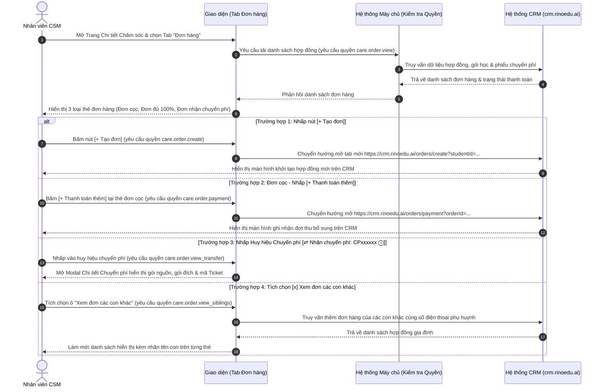

# US-CARE-02-02: Màn hình Chi tiết Chăm sóc Tái phí & Tab Đơn hàng - Liên thông Gọi sang CRM

> **Tham chiếu:** `BF-CARE-02` · `FLOW-CARE-02` · `SR-CSM-002` · `[DS-P2]` · `[DS-P4]` · `[POLICY-DS-05]`  
> **Vị trí màn hình & Trạng thái:** Trang Chi tiết Chăm sóc · Panel trái · **Tab Đơn hàng** (`StudentCareDetailPage` - `/app/renewal`) $\rightarrow$ Trạng thái: `Đang học`, `Chờ chuyển lớp`, `Bảo lưu`  

---

## 1. NHẬT KÝ THAY ĐỔI & BỐI CẢNH (CHANGELOG & CONTEXT)

### Lịch sử cập nhật tài liệu (Changelog)

| Ngày cập nhật | Nội dung cập nhật | Lý do cập nhật |
|---|---|---|
| 14/08/2026 | Phát hành tài liệu US-CARE-02-02 ban đầu | Đặc tả Tab Đơn hàng và nút Tạo đơn liên thông CRM |
| 17/08/2026 | Chuẩn hóa phạm vi hiển thị danh sách đơn hàng & liên thông gọi sang CRM | Làm rõ Tab Đơn hàng trên Station chỉ hiển thị danh sách, tất cả các nút hành động đều chuyển hướng gọi sang hệ thống CRM (`crm.rinoedu.ai`) |
| 18/08/2026 | Tách riêng từng bảng cho từng loại thẻ đơn hàng, bóc tách dòng theo dòng (Row-by-Row) | Tuân thủ nghiêm ngặt chuẩn biên tập Rinov5: không gom chung dòng, mỗi thẻ đơn là một bảng độc lập, bóc tách toàn bộ dòng dữ liệu chi tiết và liên thông CRM |
| 18/08/2026 | Chuẩn hóa theo Golden Template TEMPLATE-US-DETAIL & Bổ sung Mermaid | Sửa lỗi mã tham chiếu BF cha thành `BF-CARE-02`, bổ sung sơ đồ Mermaid sequenceDiagram ở Mục 2, chuyển phần đặc tả Form sang `US-CARE-02-03` và bổ sung đủ 5 Corner Cases |

### Bối cảnh & Vấn đề nghiệp vụ (Context & Problem)
* **Bối cảnh:** Khi nhân viên CSM mở Trang Chi tiết Chăm sóc Tái phí của một học viên, Tab Đơn hàng ở Panel trái đóng vai trò là nơi tổng hợp toàn bộ các hợp đồng, gói học đang có hiệu lực, số tiền đã thanh toán, các đơn nợ cọc và lịch sử các phiếu chuyển đổi học phí của học viên và gia đình.
* **Vấn đề hiện tại:** Nhân viên CSM thường không nắm rõ học viên còn nợ bao nhiêu tiền cọc, đã từng chuyển phí từ khóa nào sang khóa nào, hoặc phụ huynh có bao nhiêu con đang cùng theo học dẫn đến tư vấn sai lệch gói học hoặc bỏ lỡ cơ hội bán thêm.
* **Mục tiêu & Giá trị mang lại:** Phân loại rõ ràng 3 dạng thẻ đơn hàng (Đơn cọc/chưa hoàn tất, Đơn đã thanh toán 100%, Đơn nhận chuyển phí), hỗ trợ tùy chọn xem đơn của các con khác trong gia đình và cung cấp các nút liên thông gọi sang CRM chính xác với từng ngữ cảnh.
* **Quy tắc nghiệp vụ liên quan:** Kế thừa toàn bộ 8 quy tắc nghiệp vụ tổng thể (Business Rules) từ tài liệu cha `BF-CARE-02`.

### Hiểu người dùng & Tình huống sử dụng (User Needs & Use Cases)
* **Người dùng chính (Persona):** `SR-CSM-002` (Nhân viên Chăm sóc Khách hàng / Chuyên viên Tái phí).
* **Nhu cầu thực tế:** Cần nắm bắt toàn diện danh sách các gói học đang có hiệu lực, số tiền đã thanh toán, đơn nợ cọc cần thu thêm, các phiếu chuyển phí giữa các khóa và lịch sử đơn hàng của anh/chị/em trong cùng gia đình để tư vấn chính xác.
* **Câu phát biểu nghiệp vụ:** **Là một** Nhân viên CSM, **tôi muốn** xem danh sách các loại thẻ đơn hàng được phân loại rõ ràng cùng các nút hành động liên kết tương ứng, **để** tôi kích hoạt đợt thu thanh toán thêm, tạo đơn tái phí mới hoặc tra cứu lịch sử chuyển phí nhanh chóng trên CRM.

### Phạm vi kiểm soát (Scope)
* **Phạm vi hiển thị:** Toàn bộ hợp đồng, gói sản phẩm, lịch sử chuyển đổi của học viên và gia đình tải từ dịch vụ CRM.

---

## 2. LUỒNG XỬ LÝ CHÍNH (MAIN FLOW - HAPPY PATH)

---

## 3. GIAO DIỆN, RÀNG BUỘC DỮ LIỆU & PHÂN QUYỀN (UI, VALIDATION & PERMISSION)

### 3.1. Cấu trúc Vùng Giao diện & Ràng buộc Quyền hạn (Capability Gating)

Màn hình áp dụng cơ chế kiểm soát hiển thị theo **Mã Quyền Động (Atomic Permissions)** được định nghĩa tại `BF-CARE-02` §5.2:

| Vùng Giao diện / Nút Thao Tác | Loại Hiển Thị | Mã Quyền Yêu Cầu (Required Capability) | Xử Lý Khi Không Đủ Quyền |
| :--- | :--- | :--- | :--- |
| **Xem Tab Đơn hàng** | Tab nội dung Panel trái | `care.order.view` | Ẩn tab Đơn hàng hoặc báo lỗi không đủ quyền truy cập |
| **Nút [+ Tạo đơn]** | Button Header Tab Đơn hàng | `care.order.create` | Ẩn nút tạo đơn mới |
| **Nút [+ Thanh toán thêm]** | Button trên thẻ đơn cọc | `care.order.payment` | Ẩn nút thanh toán thêm |
| **Xem Modal Chuyển phí** | Hộp thoại nổi / Popup | `care.order.view_transfer` | Không kích hoạt mở modal khi bấm huy hiệu chuyển phí |
| **Xem đơn các con khác** | Hộp kiểm (Checkbox) | `care.order.view_siblings` | Vô hiệu hóa hoặc ẩn hộp kiểm xem đơn con khác |

### 3.2. Bảng đặc tả Thanh Công Cụ Tab Đơn Hàng (Orders Header Toolbar)

| Thành phần giao diện | Kiểu điều khiển | Trạng thái mặc định | Logic xử lý & Ràng buộc hiển thị |
|---|---|---|---|
| **Bộ đếm Gói hiện tại** | Nhãn chữ + Badge | `Gói hiện tại 3` | Hiển thị tổng số hợp đồng / gói học đang có hiệu lực của học viên. |
| **Ô chọn "Xem đơn các con khác"** | Hộp kiểm (Checkbox) | Bỏ chọn (`false`) | • **Khi BỎ CHỌN:** Chỉ hiển thị danh sách đơn hàng của chính học viên đang mở. • **Khi TÍCH CHỌN:** Hệ thống truy vấn từ CRM toàn bộ đơn hàng của các con khác trong cùng gia đình (cùng số điện thoại phụ huynh), hiển thị kèm nhãn tên con trên từng thẻ đơn hàng để phân biệt. |
| **Nút [+ Tạo đơn]** | Button màu xanh tím kèm icon `+` | Nổi bật góc trên phải | **Liên thông CRM:** Khi bấm vào, kích hoạt mở trang tạo đơn hàng mới trên CRM: `https://crm.rinoedu.ai/orders/create?studentId={studentId}&branchId={branchId}`. |

### 3.3. Bảng đặc tả Thẻ Đơn Đặt cọc / Thanh toán 1 phần (Đơn chưa hoàn tất)
*Dấu hiệu nhận diện:* Tổng tiền đã thanh toán < Tổng tiền đơn hàng (Ví dụ mẫu: `OD800436 / T3-COD`, đã trả 5.000.000 đ / 8.400.000 đ).

| Dòng dữ liệu / Thành phần trên thẻ | Kiểu hiển thị | Giá trị mẫu trên giao diện | Quy tắc nghiệp vụ & Liên kết |
|---|---|---|---|
| **Mã đơn hàng & Phân loại** | Link màu xanh dương in đậm + Text xám | `OD800436 / T3-COD` | Mã đơn trên CRM; `T3-COD` là phân loại đơn cọc/thu hộ. Bấm mã đơn mở chi tiết trên CRM. |
| **Người lên đơn & Ngày tạo** | Text màu xám bên phải | `Người lên đơn: Vũ Thị Lan 1 (25-07-2026)` | Họ tên nhân viên phụ trách tạo hợp đồng kèm ngày ghi nhận (`DD-MM-YYYY`). |
| **Tên gói sản phẩm & Nhãn đơn** | Icon cuốn sách 📖 + Text đậm + Badge xám | `📖 [IE_TUTOR] Ielts Intermediate PLUS 5.0_40 buổi` `[Gia Hạn]` | Tên khóa học kèm nhãn phân loại `Gia Hạn` hoặc `Đơn mới`. |
| **Số lượng & Thành tiền gói** | Text in đậm bên phải | `SL: 1  TT: 8.400.000 đ` | Số lượng sản phẩm và tổng giá trị niêm yết của gói học. |
| **Chi tiết thời lượng & Quà tặng** | Dòng icon thời gian 🕒, đồng hồ cát ⌛, hộp quà 🎁 | `🕒 40 buổi  ⌛ Tặng thêm 4 buổi  🎁 1 x [IELTS] Khóa 5.0` | Hiển thị chi tiết số buổi chính, số buổi ưu đãi tặng thêm và quà tặng kèm theo. |
| **Khối mở rộng Lịch sử thanh toán** | Link chữ hoa kèm mũi tên xổ xuống ▾ | `LỊCH SỬ THANH TOÁN (1 chuyển khoản) ▾` | Bấm vào mở rộng bảng chi tiết từng đợt thanh toán: Ngày thu, số tiền, phương thức và mã giao dịch. |
| **Tổng tiền đã thu / Tổng tiền đơn** | Text in đậm có màu sắc phân biệt | `Tổng tiền đã thanh toán: 5.000.000 đ / 8.400.000 đ` | Số tiền đã thu (`5.000.000 đ`) được **tô màu cam đậm / đỏ** cảnh báo đơn chưa hoàn tất thanh toán. |
| **Nút [+ Thanh toán thêm]** | Button nền xanh lá nổi bật | `+ Thanh toán thêm` (hoặc `Hoàn tất thanh toán`) | **Liên thông CRM:** Nhấp vào chuyển hướng gọi sang CRM để ghi nhận đợt thu bổ sung hoặc hoàn tất đơn cọc: `https://crm.rinoedu.ai/orders/payment?orderId=OD800436&studentId={studentId}`. |

### 3.4. Bảng đặc tả Thẻ Đơn Đã thanh toán đủ 100% (Đơn hoàn thành)
*Dấu hiệu nhận diện:* Tổng tiền đã thanh toán bằng 100% giá trị đơn hàng (Ví dụ mẫu: `OD777752 / T5-Thành công`, đã trả 7.400.000 đ / 7.400.000 đ).

| Dòng dữ liệu / Thành phần trên thẻ | Kiểu hiển thị | Giá trị mẫu trên giao diện | Quy tắc nghiệp vụ & Liên kết |
|---|---|---|---|
| **Mã đơn hàng & Phân loại** | Link màu xanh dương in đậm + Text xám | `OD777752 / T5-Thành công` | Mã đơn trên CRM; `T5-Thành công` là đơn đã thu đủ tiền và kích hoạt thành công. |
| **Người lên đơn & Ngày tạo** | Text màu xám bên phải | `Người lên đơn: Vũ Thị Thảo Huyền 3 (05-02-2026)` | Họ tên nhân sự lên đơn và ngày tạo đơn. |
| **Sản phẩm 1 (Gói tự học / Tặng kèm)** | Icon cuốn sách 📖 + Badge [Gia Hạn] | `📖 [IE] Tự học Ielts 4.0 (1 tháng) [Gia Hạn]` `SL: 1  TT: 0 đ` · `🕒 1 tháng  ⌛ --` | Dòng sản phẩm tự học đi kèm có giá trị 0 đ. |
| **Sản phẩm 2 (Khóa học chính)** | Icon cuốn sách 📖 + Badge [Gia Hạn] | `📖 [IE_TUTOR] Ielts Foundation PLUS 4.0_36 buổi [Gia Hạn]` `SL: 1  TT: 7.400.000 đ` `🕒 36 buổi  ⌛ Tặng thêm 2 buổi  🎁 1 x [IELTS] Khóa 4.0` | Khóa học chính kèm số buổi và quà tặng ưu đãi. |
| **Khối mở rộng Lịch sử thanh toán** | Link chữ hoa kèm mũi tên xổ xuống ▾ | `LỊCH SỬ THANH TOÁN (1 chuyển khoản) ▾` | Bấm vào mở rộng bảng chi tiết đợt thanh toán đã hoàn tất. |
| **Tổng tiền đã thu / Tổng tiền đơn** | Text in đậm màu xanh lá | `Tổng tiền đã thanh toán: 7.400.000 đ / 7.400.000 đ` | Toàn bộ giá trị được **tô màu xanh lá đậm** biểu thị đã thu đủ 100%. |
| **Nút hành động thanh toán** | *(Không có)* | *(Ẩn / Không hiển thị)* | **Không hiển thị nút thanh toán** vì hợp đồng đã thanh toán trọn vẹn, không còn nợ đọng. |

### 3.5. Bảng đặc tả Thẻ Đơn Nhận chuyển phí (Đơn có nguồn gốc điều chuyển)
*Dấu hiệu nhận diện:* Đơn hàng có chứa huy hiệu màu tím `[⇄ Nhận chuyển phí: CPxxxxxx ⓘ]` (Ví dụ mẫu: `OD794023 / T5-Thành công`).

| Dòng dữ liệu / Thành phần trên thẻ | Kiểu hiển thị | Giá trị mẫu trên giao diện | Quy tắc nghiệp vụ & Liên kết |
|---|---|---|---|
| **Mã đơn hàng & Phân loại** | Link màu xanh dương in đậm + Text xám | `OD794023 / T5-Thành công` | Mã đơn hàng trên hệ thống CRM. |
| **Huy hiệu Nhận chuyển phí** | Badge bo góc màu tím kèm icon ⇄ và ⓘ | `⇄ Nhận chuyển phí: CP00013581 ⓘ` | Biểu thị đơn hàng được thanh toán bằng nguồn tiền/số buổi chuyển từ hợp đồng khác sang. **Nhấp vào kích hoạt mở Modal Chi tiết Chuyển phí.** |
| **Người lên đơn & Ngày tạo** | Text màu xám bên phải | `Người lên đơn: Nguyễn Như Ngọc (17-06-2026)` | Họ tên nhân sự thực hiện điều chuyển phí kèm ngày tạo. |
| **Tên gói sản phẩm & Nhãn đơn** | Icon cuốn sách 📖 + Text đậm + Badge xám | `📖 [TUTOR][THCS] Skill Builder 2.0_1:7_72 buổi [Gia Hạn]` | Gói học nhận chuyển giao số buổi. |
| **Số lượng & Thành tiền gói** | Text in đậm bên phải | `SL: 1  TT: 7.550.000 đ` | Tổng giá trị ghi nhận của gói học mới. |
| **Chi tiết thời lượng & Quà tặng** | Dòng icon thời gian 🕒, đồng hồ cát ⌛ | `🕒 72 buổi  ⌛ Tặng thêm 6 buổi` | Số buổi học nhận được sau khi quy đổi từ nguồn chuyển phí. |
| **Khối mở rộng Lịch sử thanh toán** | Link chữ hoa kèm mũi tên xổ xuống ▾ | `LỊCH SỬ THANH TOÁN (2 chuyển khoản) ▾` | Bấm vào mở rộng xem các nguồn tiền cấn trừ từ phiếu chuyển phí. |
| **Tổng tiền đã thu / Tổng tiền đơn** | Text in đậm màu xanh lá | `Tổng tiền đã thanh toán: 7.550.000 đ / 7.550.000 đ` | Tô màu xanh lá đậm (đã thanh toán đủ 100%). |
| **Nút hành động thanh toán** | *(Không có)* | *(Ẩn / Không hiển thị)* | Không có nút thanh toán thêm do đơn đã được cấn trừ đủ. |

### 3.6. Bảng đặc tả Khối Gói đã mua & Lịch sử Chuyển đổi
*Vị trí:* Nửa dưới của Tab Đơn hàng · `Gói đã mua & Lịch sử chuyển đổi 10` (*5 gói đã mua • 5 phiếu chuyển phí*).

| Dòng dữ liệu / Cột thông tin | Kiểu hiển thị | Giá trị mẫu trên giao diện | Quy tắc nghiệp vụ & Liên thông CRM |
|---|---|---|---|
| **Ngày chuyển đổi** | Text in đậm | `Ngày chuyển: 15-08-2026` | Thời gian thực hiện giao dịch chuyển đổi (`DD-MM-YYYY`). |
| **Loại nghiệp vụ chuyển đổi** | Text màu cam nổi bật | `Loại : Chuyển đổi sản phẩm` | Phân loại giao dịch: `Chuyển đổi sản phẩm`, `Chuyển học phí sang con khác`, `Bảo lưu hoàn phí`. |
| **Mã Ticket hỗ trợ CRM** | Link màu xanh dương kèm icon ↗ | `Mã ticket: 03650 ↗` | **Liên thông CRM:** Nhấp vào mở trực tiếp Ticket phê duyệt trên hệ thống CRM: `https://crm.rinoedu.ai/tickets/03650`. |
| **Người thực hiện** | Text in đậm | `Người thực hiện: Lê Đức Anh 4` | Họ tên nhân sự vận hành xử lý giao dịch chuyển đổi. |

### 3.7. Bảng đặc tả Modal Chi tiết Chuyển phí (Transfer Details Modal)
Kích hoạt khi người dùng bấm vào Huy hiệu `[⇄ Nhận chuyển phí: CP00013581 ⓘ]` hoặc dòng phiếu chuyển phí trong lịch sử.

| Trường thông tin trên Modal | Kiểu hiển thị | Nguồn dữ liệu | Diễn giải chi tiết |
|---|---|---|---|
| **Mã phiếu chuyển phí** | Text in đậm màu tím | CRM Transfer Service | Mã định danh phiếu chuyển tiền/buổi học: `CP00013581`. |
| **Gói học nguồn (Từ gói)** | Khối thông tin hộp xám | Hợp đồng nguồn cũ | Tên gói nguồn, số buổi còn lại trước khi chuyển, số tiền được phép quy đổi. |
| **Gói học đích (Đến gói)** | Khối thông tin hộp xanh | Đơn hàng mới `OD794023` | Tên gói mới tiếp nhận, số buổi tương đương được cộng vào, số tiền ghi nhận. |
| **Mã Ticket phê duyệt CRM** | Link màu xanh kèm icon ↗ | CRM Ticket Service | Link mã ticket liên kết (VD: `03650 ↗`) kèm người phê duyệt đề xuất chuyển phí. |
| **Nút [Đóng]** | Button viền xám | Giao diện | Đóng cửa sổ modal và quay về Tab Đơn hàng. |

### 3.8. Ma trận Liên Thông Gọi Sang CRM (CRM Integration Matrix)

| Nút bấm / Tác vụ trên Station | Vị trí trên giao diện | Endpoint / URL đích trên CRM | Tham số truyền đi (Payload / Query) |
|---|---|---|---|
| **[+ Tạo đơn]** | Header Tab Đơn hàng | `https://crm.rinoedu.ai/orders/create` | `studentId={studentId}&branchId={branchId}` |
| **[+ Thanh toán thêm] / [Hoàn tất thanh toán]** | Thẻ đơn cọc / thanh toán 1 phần | `https://crm.rinoedu.ai/orders/payment` | `orderId={orderId}&studentId={studentId}` |
| **[Mã ticket: xxxxx ↗]** | Dòng lịch sử chuyển đổi | `https://crm.rinoedu.ai/tickets/{ticketId}` | `ticketId={ticketId}` |
| **[Mã đơn hàng: ODxxxxxx]** | Tiêu đề thẻ đơn hàng | `https://crm.rinoedu.ai/orders/detail/{orderId}` | `orderId={orderId}` |

---

## 4. TIÊU CHÍ NGHIỆM THU (ACCEPTANCE CRITERIA)

* **AC-1 (Happy Path - Phân biệt các loại thẻ đơn hàng và nút hành động):**
  - **Giả sử:** Người dùng mở Tab "Đơn hàng" của học viên "Nguyễn Hà Phương".
  - **Khi:** Hệ thống tải dữ liệu đơn hàng thành công.
  - **Thì:** Hệ thống hiển thị 3 thẻ đơn hàng trong mục "Gói hiện tại":
    - Đơn `OD800436` (đã trả 5.000.000 đ / 8.400.000 đ) hiển thị nút `[+ Thanh toán thêm]` màu xanh lá.
    - Đơn `OD777752` (đã trả 7.400.000 đ / 7.400.000 đ) **KHÔNG** hiển thị nút thanh toán.
    - Đơn `OD794023` hiển thị badge tím `[⇄ Nhận chuyển phí: CP00013581 ⓘ]` và không có nút thanh toán.
* **AC-2 (Happy Path - Tích chọn xem đơn các con khác trong gia đình):**
  - **Giả sử:** Phụ huynh "Lê Thu Thủy" có từ 2 con trở lên theo học tại trung tâm.
  - **Khi:** Người dùng tích chọn ô "Xem đơn các con khác".
  - **Thì:** Danh sách đơn hàng làm mới, hiển thị thêm các đơn hàng của con thứ hai kèm nhãn tên học viên phân biệt.
* **AC-3 (Happy Path - Bấm nút Tạo đơn mới chuyển hướng sang CRM):**
  - **Giả sử:** Người dùng đang ở Tab Đơn hàng.
  - **Khi:** Người dùng nhấp nút `[+ Tạo đơn]` ở góc trên bên phải.
  - **Thì:** Hệ thống mở tab mới dẫn đến `https://crm.rinoedu.ai/orders/create?studentId=...` kèm thông tin học viên được điền sẵn.
* **AC-4 (Happy Path - Bấm nút Thanh toán thêm trên đơn cọc):**
  - **Giả sử:** Đơn hàng `OD800436` đang còn thiếu 3.400.000 đ.
  - **Khi:** Người dùng bấm nút `[+ Thanh toán thêm]`.
  - **Thì:** Hệ thống mở luồng ghi nhận thanh toán bổ sung trên CRM với đúng mã đơn `OD800436`.
* **AC-5 (Happy Path - Bấm link Ticket trong khối Lịch sử chuyển đổi):**
  - **Giả sử:** Dòng lịch sử hiển thị `Mã ticket: 03650 ↗`.
  - **Khi:** Người dùng nhấp vào link mã ticket.
  - **Thì:** Hệ thống mở trực tiếp giao diện chi tiết Ticket "03650" trên hệ thống CRM.

---

## 5. CÁC TRƯỜNG HỢP GÓC CẠNH & LUỒNG NGOẠI LỆ (CORNER CASES & EXCEPTION FLOWS)

- **[CASE-01] Phụ huynh chỉ có 1 con:**
  - *Tình huống:* Người dùng mở hồ sơ của học viên mà phụ huynh chỉ đăng ký 1 con duy nhất.
  - *Cách xử lý:* Ô checkbox "Xem đơn các con khác" hiển thị mờ (disabled) hoặc khi tích chọn hiển thị thông báo nhẹ: *"Phụ huynh chỉ có 1 học viên đăng ký trên hệ thống."*
- **[CASE-02] Đơn hàng bị Hủy (Cancelled):**
  - *Tình huống:* Đơn hàng trên CRM bị hủy do quá hạn cọc hoặc phụ huynh rút phí.
  - *Cách xử lý:* Đơn hiển thị trạng thái `Đã hủy` với màu xám, ẩn hoàn toàn các nút thanh toán hoặc tạo đơn.
- **[CASE-03] Mất kết nối khi gọi sang CRM:**
  - *Tình huống:* Đường truyền gián đoạn khi người dùng bấm Tạo đơn hoặc Thanh toán thêm.
  - *Cách xử lý:* Hệ thống hiển thị thông báo *"Không thể kết nối đến hệ thống CRM, vui lòng thử lại sau"* và không làm gián đoạn màn hình Station hiện tại.
- **[CASE-04] Đơn hàng có nhiều đợt thanh toán (Từ 3 đợt trở lên):**
  - *Tình huống:* Phụ huynh chia nhỏ tiền đóng thành nhiều đợt.
  - *Cách xử lý:* Danh sách thả xuống tự động có thanh cuộn mượt để không làm vỡ bố cục thẻ đơn hàng.
- **[CASE-05] Phiếu chuyển phí bị Từ chối / Hủy duyệt trên CRM:**
  - *Tình huống:* Đề xuất chuyển phí chưa được kế toán CRM phê duyệt hoặc bị từ chối.
  - *Cách xử lý:* Huy hiệu chuyển phí hiển thị trạng thái `[Chờ duyệt chuyển phí]` màu vàng và vô hiệu hóa việc ghi nhận số buổi mới cho đến khi ticket được duyệt thành công.

---

## 6. YÊU CẦU PHI CHỨC NĂNG & KẾT NỐI HỆ THỐNG (NON-FUNCTIONAL & SYSTEM INTEGRATION)

* **Thời gian phản hồi:** Tải dữ liệu danh sách đơn hàng $\le 800$ miligiây; mở Modal Chuyển phí $\le 150$ miligiây.
* **Kế thừa kết nối hệ thống:** Liên thông một chiều từ Station sang CRM thông qua URL Query Parameters bảo mật theo Token phiên làm việc.
