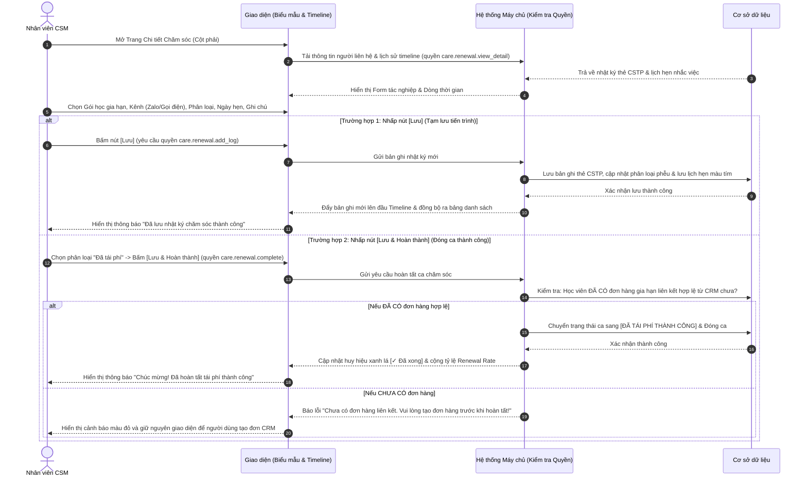

# US-CARE-02-03: Biểu mẫu & Dòng thời gian Nhật ký Chăm sóc Tái phí (Renewal Interaction Feed & Popover)

> **Tham chiếu:** `BF-CARE-02` · `FLOW-CARE-02` · `SR-CSM-002` · `[DS-P3]` · `[POLICY-DS-04]` · `[POLICY-DS-05]`  
> **Vị trí màn hình:** Cột phải Trang Chi tiết Chăm sóc Học viên (`RenewalChatFeed`) & Bảng thông tin nổi tại dòng (`CSTPHistoryPopover`)  
> **Tham chiếu Động cơ Điều kiện:** `SPEC-CARE-03: Bộ tiêu chí & Mốc kích hoạt - Gói học, Định kỳ` (Folder 133955752)  

---

## 1. NHẬT KÝ THAY ĐỔI & BỐI CẢNH (CHANGELOG & CONTEXT)

### Lịch sử cập nhật tài liệu (Changelog)

| Ngày cập nhật | Nội dung cập nhật | Lý do cập nhật |
|---|---|---|
| 14/08/2026 | Phát hành tài liệu US-CARE-02-03 ban đầu | Đặc tả chi tiết biểu mẫu ghi nhận tương tác tái phí, dòng thời gian nhật ký tương tác CSTP và bảng nổi xem nhanh tại dòng |
| 17/08/2026 | Chuẩn hóa tinh gọn & Làm rõ Selection gia hạn | Tập trung đặc tả Biểu mẫu ghi nhận tái phí, bộ chọn gói học gia hạn, lịch hẹn gọi lại và bảng nổi Popover |
| 17/08/2026 | Chuẩn hóa Action Acceptance Criteria & Corner Cases gắn với mốc Tháng T/T+1/T+2 | Chi tiết hóa 5 tiêu chí nghiệm thu và 5 trường hợp góc cạnh khi chọn gói gia hạn, đặt lịch hẹn nhắc phí và xem Popover |
| 18/08/2026 | Chuẩn hóa theo Golden Template & Tiếp nhận đặc tả từ US-02 | Bổ sung sơ đồ Mermaid sequenceDiagram ở Mục 2, Bảng Capability Gating Mục 3.1, tiếp nhận bảng đặc tả logic Hoàn thành & Lọc Tất cả môn từ US-02 |

### Bối cảnh & Vấn đề nghiệp vụ (Context & Problem)
* **Bối cảnh:** Khác với việc chăm sóc học vụ thường nhật tại phân hệ *Chăm sóc học viên (`BF-CARE-01`)* nhằm giải quyết các sự vụ (nghỉ học, điểm danh, nộp bài tập), phân hệ **Chăm sóc Tái phí (`BF-CARE-02`)** tập trung vào nghiệp vụ **tư vấn gia hạn và giữ chân học viên (Retention & Renewal)** theo các mốc thời hạn **Tháng T, Tháng T+1, Tháng T+2**.
* **Vấn đề hiện tại:** Nhân viên CSM thường quên gắn tương tác với gói học cụ thể khi học viên học nhiều môn, thiếu cơ chế chặn bấm Hoàn thành khi chưa có đơn hàng liên kết, hoặc phải chuyển màn hình nhiều lần chỉ để xem lịch sử trao đổi cũ.
* **Mục tiêu & Giá trị mang lại:** Cung cấp biểu mẫu ghi nhận tái phí gắn chặt với gói học gia hạn, hỗ trợ đặt lịch hẹn nhắc gọi lại màu tím, kiểm soát điều kiện Hoàn thành chặt chẽ và tích hợp bảng thông tin nổi xem nhanh tại dòng (`CSTPHistoryPopover`).
* **Quy tắc nghiệp vụ liên quan:** Kế thừa toàn bộ 8 quy tắc nghiệp vụ tổng thể (Business Rules) từ tài liệu cha `BF-CARE-02`.

### Hiểu người dùng & Tình huống sử dụng (User Needs & Use Cases)
* **Người dùng chính (Persona):** `SR-CSM-002` (Nhân viên Chăm sóc Khách hàng / Chuyên viên Tái phí).
* **Nhu cầu thực tế:** Cần ghi nhận nhanh nội dung cuộc gọi/Zalo, cập nhật phân loại mức độ tiềm năng (Cân nhắc, Tiềm năng, Hẹn tái), lên lịch nhắc hẹn gọi lại và xem lại toàn bộ dòng thời gian chăm sóc của tất cả các môn.
* **Câu phát biểu nghiệp vụ:** **Là một** Nhân viên CSM, **tôi muốn** có biểu mẫu ghi nhận tương tác chuyên biệt cho tái phí và xem nhanh lịch sử tại bảng danh sách, **để** tôi theo sát tiến độ tư vấn và không bỏ lỡ lịch hẹn đóng học phí của phụ huynh.

### Phạm vi kiểm soát (Scope)
* **Phạm vi hiển thị:** Toàn bộ biểu mẫu tác nghiệp tại Cột phải trang chi tiết và Bảng nổi `CSTPHistoryPopover` tại Cột 6 bảng danh sách chính.

---

## 2. LUỒNG XỬ LÝ CHÍNH (MAIN FLOW - HAPPY PATH)

---

## 3. GIAO DIỆN, RÀNG BUỘC DỮ LIỆU & PHÂN QUYỀN (UI, VALIDATION & PERMISSION)

### 3.1. Cấu trúc Vùng Giao diện & Ràng buộc Quyền hạn (Capability Gating)

Màn hình áp dụng cơ chế kiểm soát hiển thị theo **Mã Quyền Động (Atomic Permissions)** được định nghĩa tại `BF-CARE-02` §5.2:

| Vùng Giao diện / Nút Thao Tác | Loại Hiển Thị | Mã Quyền Yêu Cầu (Required Capability) | Xử Lý Khi Không Đủ Quyền |
| :--- | :--- | :--- | :--- |
| **Ghi nhận Nhật ký Tái phí** | Biểu mẫu nhập liệu Cột phải | `care.renewal.add_log` | Ẩn biểu mẫu hoặc vô hiệu hóa nút Lưu |
| **Nút [Lưu & Hoàn thành]** | Button xác nhận đóng ca | `care.renewal.complete` | Ẩn nút Hoàn thành |
| **Xem Bảng nổi tại dòng (`Popover`)** | Hộp thoại thông tin nổi tại dòng | `care.renewal.view` | Không kích hoạt mở popover khi nhấp/rê chuột |
| **Nút Bắt đầu cuộc gọi** | Button kích hoạt tổng đài | `care.renewal.add_log` | Vô hiệu hóa nút gọi điện |

### 3.2. Khối Đầu trang Tương tác & Liên hệ (Cột phải trên cùng)

| Thành phần giao diện | Kiểu hiển thị | Nguồn dữ liệu | Các tùy chọn chọn lựa | Logic xử lý & Ràng buộc hiển thị |
|---|---|---|---|---|
| **Bộ chọn Người liên hệ** | Ô chọn thả xuống dạng thẻ | Cơ sở dữ liệu học viên | Bố / Mẹ / Giám hộ | Mặc định chọn người liên hệ chính. Khi đổi người liên hệ, số điện thoại tự động cập nhật theo. |
| **Số điện thoại đầy đủ** | Văn bản in đậm kèm icon | Cơ sở dữ liệu học viên | Số điện thoại 10 chữ số | Tại màn hình chi tiết, hiển thị đầy đủ số điện thoại phụ huynh cho nhân sự có thẩm quyền. |
| **Nút Bắt đầu cuộc gọi** | Nút bấm màu đỏ hồng kèm icon điện thoại | Hệ thống | Bắt đầu cuộc gọi | Nhấp vào kích hoạt tính năng đàm thoại qua tổng đài nội bộ hoặc mở ứng dụng gọi điện thoại. |

### 3.3. Biểu mẫu Ghi nhận Tương tác Tái phí (Renewal Interaction Form)

| Trường thông tin | Kiểu ô chọn / Nhập liệu | Nguồn dữ liệu | Ràng buộc dữ liệu | Logic xử lý nghiệp vụ |
|---|---|---|---|---|
| **Bộ chọn Gói học gia hạn (Selection gia hạn)** | Ô chọn thả xuống | Danh mục gói học của học viên | Chọn 1 gói học đang cận hạn Tháng T / T+1 / T+2 | Gắn tương tác chăm sóc với gói học cụ thể (ví dụ: `[IE_TUTOR] Ielts Intermediate PLUS 5.0`). |
| **Kênh liên lạc** | Cụm nút bấm chuyển kênh | Hệ thống | 1. **Zalo (Mặc định)** 2. **Điện thoại** 3. **Trực tiếp** | Chọn hình thức tương tác nhân viên vừa thực hiện với phụ huynh. |
| **Phân loại tái phí (6 nấc)** | Ô chọn thả xuống | Hệ thống | `Mới`, `Cân nhắc`, `Tiềm năng`, `Hẹn tái`, `Đã tái phí`, `Thất bại` | Cập nhật mức độ tiềm năng tái phí của học viên theo phễu chuyển đổi. |
| **Lịch hẹn gọi lại** | Ô chọn ngày & giờ | Người dùng chọn | Ngày giờ tương lai $\ge$ thời điểm hiện tại | **Bắt buộc khi phân loại là Hẹn tái.** Sinh khung nhắc hẹn màu tím tại Dòng thời gian và bảng danh sách. |
| **Ghi chú trao đổi** | Ô nhập văn bản nhiều dòng | Người dùng nhập | Tối đa 1000 ký tự | Tóm tắt các nội dung tư vấn lộ trình học, phản hồi của học viên và ưu đãi gói mới. |
| **Ý kiến phụ huynh** | Ô nhập văn bản một dòng | Người dùng nhập | Tối đa 500 ký tự (Bắt buộc khi chọn Thất bại) | Ghi nhận phản hồi, nguyện vọng hoặc lý do đắn đo / từ chối của phụ huynh. |
| **Nút [Lưu]** | Button nền xanh dương, chữ trắng | Hệ thống | Tạm lưu tương tác | Lưu bản ghi mới vào dòng thời gian (thẻ `CSTP`), cập nhật trạng thái phễu ngoài danh sách (`CÂN NHẮC`, `TIỀM NĂNG`, `HẸN TÁI`) mà **không bắt buộc phải có đơn hàng**. |
| **Nút [Lưu & Hoàn thành]** | Button viền xanh, nền trắng, chữ xanh | Hệ thống | Hoàn tất tái phí | **Ràng buộc bắt buộc:** Bắt buộc học viên phải có đơn hàng gia hạn hợp lệ từ CRM. Nếu chưa có đơn, hệ thống chặn lưu và hiển thị cảnh báo yêu cầu tạo đơn CRM trước. |

### 3.4. Bảng đặc tả Tính năng Lọc "Tất cả môn" trên Dòng thời gian

| Dòng dữ liệu / Thành phần | Kiểu hiển thị | Giá trị mẫu trên giao diện | Quy tắc nghiệp vụ & Hiển thị |
|---|---|---|---|
| **Hộp kiểm "Tất cả môn" (Trạng thái Bỏ chọn - Mặc định)** | Checkbox vuông chưa tích `[ ]` + Text | `[ ] Tất cả môn` | Mặc định chưa chọn. Dòng thời gian chỉ hiển thị lịch sử chăm sóc của **duy nhất môn học hiện tại** đang chọn ở Panel trái. |
| **Dòng nhật ký khi BỎ CHỌN "Tất cả môn"** | Badge vai trò + Tên nhân sự *(Ẩn nhãn môn)* | `GV Hoàng Thị Mai` `CS Nguyễn Thị Ngọc Anh` | **Ẩn hoàn toàn nhãn môn học.** Huy hiệu chỉ hiển thị vai trò `GV` (tím) hoặc `CS` (xanh) và họ tên nhân sự. |
| **Hộp kiểm "Tất cả môn" (Trạng thái Tích chọn)** | Checkbox vuông có tích xanh `[x]` + Text | `[x] Tất cả môn` | Khi người dùng tích chọn, hệ thống gộp toàn bộ lịch sử chăm sóc của **tất cả các môn học** (Tiếng Anh, Toán tư duy,...), sắp xếp theo trình tự thời gian mới nhất giảm dần. |
| **Dòng nhật ký khi TÍCH CHỌN "Tất cả môn"** | Badge vai trò + **Badge môn học** + Tên nhân sự | `GV` `[TA]` `Hoàng Thị Mai` `CS` `[TA]` `Nguyễn Thị Ngọc Anh` | **Hiển thị thêm nhãn môn học** (Subject Badge: `[TA]`, `[TO]`,...) ngay cạnh vai trò để phân biệt rõ nguồn gốc môn học của từng tương tác. |

### 3.5. Bảng đặc tả Bảng thông tin nổi Xem nhanh tại dòng (`CSTPHistoryPopover`)
Kích hoạt khi người dùng nhấp hoặc rê chuột vào ô `Chăm sóc (n)` tại Cột 6 bảng danh sách chính `/app/renewal`.

| Thành phần trên Popover | Kiểu hiển thị | Nguồn dữ liệu | Diễn giải chi tiết |
|---|---|---|---|
| **Khung nhắc hẹn gọi lại (Lịch hẹn)** | Khung nền tím nhạt, viền tím | Lịch hẹn gần nhất | Hiển thị: `🕒 Hẹn gọi lại: DD/MM/YYYY HH:mm` kèm nội dung nhắc việc. |
| **Danh sách các lần tương tác gần nhất** | Danh sách dòng rút gọn | Nhật ký chăm sóc | Hiển thị 3 – 5 lần chăm sóc mới nhất: Ngày, Kênh (Zalo/ĐT), Phân loại (Màu chuẩn), Tên CSM, Ghi chú tóm tắt. |
| **Liên kết Xem toàn bộ lịch sử** | Link màu xanh dương | Giao diện | Nhấp vào mở trực tiếp Trang Chi tiết Chăm sóc của học viên. |

---

## 4. KHỐI CHỨC NĂNG & TIÊU CHÍ CHẤP NHẬN (ACCEPTANCE CRITERIA)

* **AC-1 (Happy Path - Ghi nhận tương tác Zalo & Gói gia hạn):**
  - **Giả sử:** Người dùng chọn gói "Tiếng Anh Level 5" thuộc nhóm Tháng T, chọn kênh Zalo, chọn phân loại "Tiềm năng", nhập ghi chú "Đã gửi lộ trình và ưu đãi qua Zalo".
  - **Khi:** Bấm nút [Lưu].
  - **Thì:** 1 bản ghi mới xuất hiện ngay trên đầu Dòng thời gian với thẻ `CSTP` và trạng thái học viên ngoài danh sách chuyển sang Tiềm năng.
* **AC-2 (Happy Path - Đặt lịch hẹn gọi lại):**
  - **Giả sử:** Người dùng chọn phân loại "Hẹn tái" và chọn lịch hẹn là "22/07/2026 15:30".
  - **Khi:** Bấm nút [Lưu].
  - **Thì:** Khung nhắc hẹn màu tím xuất hiện ở đầu Dòng thời gian với nội dung "Hẹn: 22/07/2026 15:30", đồng thời trên Cột 6 bảng danh sách hiển thị lịch hẹn màu tím tương ứng.
* **AC-3 (Happy Path - Hoàn tất ca Đã tái phí thành công):**
  - **Giả sử:** Học viên đã có đơn hàng gia hạn được thanh toán thành công qua CRM.
  - **Khi:** Người dùng chọn phân loại "Đã tái phí" và bấm [Lưu & Hoàn thành].
  - **Thì:** Hệ thống kiểm tra đơn hàng hợp lệ, cập nhật trạng thái học viên sang Đã tái phí với huy hiệu xanh lá, đóng ca và tăng tỷ lệ Renewal Rate.
* **AC-4 (Exception Path - Chặn hoàn thành khi chưa có đơn hàng liên kết):**
  - **Giả sử:** Học viên chưa có đơn hàng gia hạn nào được tạo trên CRM.
  - **Khi:** Người dùng bấm [Lưu & Hoàn thành].
  - **Thì:** Hệ thống chặn thao tác, hiển thị thông báo lỗi màu đỏ: *"Chưa có đơn hàng liên kết. Vui lòng tạo đơn hàng tái phí trước khi hoàn tất ca chăm sóc!"*.
* **AC-5 (Happy Path - Xem nhanh qua Popover tại dòng):**
  - **Giả sử:** Người dùng đang ở bảng danh sách chính `/app/renewal`.
  - **Khi:** Nhấp vào ô "Chăm sóc (3)" tại cột Lịch sử chăm sóc.
  - **Thì:** Bảng nổi Popover hiển thị ngay lập tức đầy đủ 3 lần tương tác gần nhất và khung nhắc hẹn tím mà không cần chuyển trang.

---

## 5. CÁC TRƯỜNG HỢP GÓC CẠNH & LUỒNG NGOẠI LỆ (CORNER CASES & EXCEPTION FLOWS)

- **[CASE-01] Học viên có 2 gói học cùng đến hạn trong Tháng T:**
  - *Tình huống:* Học viên học nhiều môn cùng đến hạn tái phí.
  - *Cách xử lý:* Bộ chọn Gói học gia hạn cho phép chuyển đổi giữa các gói để gắn đúng nội dung tương tác vào môn học tương ứng.
- **[CASE-02] Đặt lịch hẹn gọi lại sau ngày kết thúc gói học:**
  - *Tình huống:* Nhân viên chọn ngày hẹn sau ngày gói học đã hết hạn hoàn toàn.
  - *Cách xử lý:* Hệ thống hiển thị cảnh báo nhẹ màu cam *"Lịch hẹn sau ngày hết hạn gói học (DD/MM/YYYY)"* để nhắc nhở CSM cân nhắc hẹn sớm hơn nhằm tránh đứt quãng việc học.
- **[CASE-03] Phụ huynh từ chối tái phí (Thất bại):**
  - *Tình huống:* Phụ huynh dứt khoát không gia hạn tiếp.
  - *Cách xử lý:* Hệ thống bắt buộc người dùng nhập lý do từ chối vào ô Ý kiến phụ huynh trước khi cho phép lưu trạng thái Thất bại.
- **[CASE-04] Lịch sử tương tác có hơn 20 bản ghi:**
  - *Tình huống:* Học viên có lịch sử chăm sóc qua nhiều năm dày đặc.
  - *Cách xử lý:* Dòng thời gian mặc định hiển thị 5 lần tương tác gần nhất và cung cấp nút "Xem thêm lịch sử cũ" để tối ưu tốc độ hiển thị giao diện.
- **[CASE-05] Mất kết nối khi lưu tương tác:**
  - *Tình huống:* Gián đoạn mạng khi đang bấm Lưu.
  - *Cách xử lý:* Giao diện hiển thị thông báo lỗi mạng, giữ nguyên toàn bộ nội dung đã nhập trong form để người dùng bấm lưu lại khi có mạng mà không bị mất dữ liệu.

---

## 6. YÊU CẦU PHI CHỨC NĂNG & KẾT NỐI HỆ THỐNG (NON-FUNCTIONAL & SYSTEM INTEGRATION)

* **Thời gian phản hồi:** Lưu tương tác và cập nhật giao diện dòng thời gian $\le 300$ miligiây; hiển thị Popover $\le 100$ miligiây.
* **Kế thừa kết nối hệ thống:** Lưu vết các bản ghi nhật ký chăm sóc tái phí (thẻ `CSTP`) vào cơ sở dữ liệu chung để liên kết đồng bộ với màn hình danh sách `/app/renewal` và hệ thống CRM.
