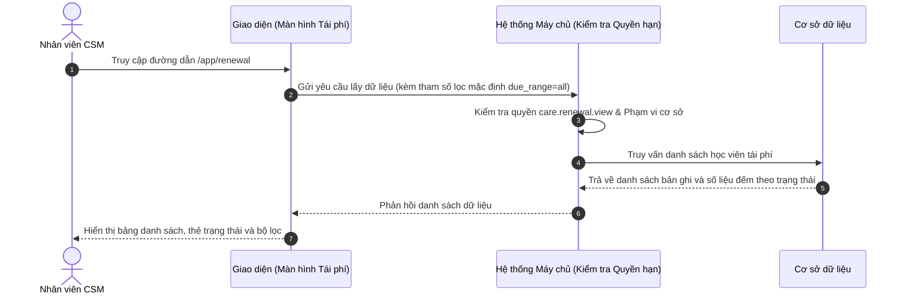

# US-CARE01-01: Quản lý Danh sách Học viên Tái phí (Renewal List View)

> **Tham chiếu:** `BF-CARE-01` · `SR-CSM-001`  
> **Đường dẫn màn hình & Trạng thái liên quan:**  
> - `/app/renewal` -> Trạng thái: `MỚI`, `TIỀM NĂNG`, `CÂN NHẮC`, `HẸN TÁI`, `ĐÃ TẠO ĐƠN`, `ĐÃ TÁI PHÍ THÀNH CÔNG`, `KHÔNG TÁI PHÍ`  

---

## 1. NHẬT KÝ THAY ĐỔI & BỐI CẢNH (CHANGELOG & CONTEXT)

### Lịch sử cập nhật tài liệu (Changelog)

| Ngày cập nhật | Nội dung cập nhật | Lý do cập nhật |
|---|---|---|
| 17/08/2026 | Khởi tạo tài liệu đặc tả chuẩn Rinov5 | Bóc tách tự động qua công cụ html-to-doc từ màn hình `/app/renewal` |

### Bối cảnh & Vấn đề nghiệp vụ (Context & Problem)
* **Bối cảnh:** [Người dùng tự điền bối cảnh nghiệp vụ từ tài liệu BF cha]
* **Vấn đề hiện tại:** [Người dùng tự điền khó khăn/vấn đề cụ thể mà màn hình này giải quyết]
* **Mục tiêu & Giá trị mang lại:** [Người dùng tự điền mục tiêu khi màn hình này đi vào vận hành]

### Hiểu người dùng & Tình huống sử dụng (User Needs & Use Cases)
* **Người dùng chính (Persona):** `PERSONA-CSM` (Nhân viên Chăm sóc Khách hàng)
* **Nhu cầu thực tế (Needs):** Cần bộ lọc mốc hạn T1/T2/T3 rõ ràng, có nút gọi điện một chạm qua máy tính và mở Drawer chi tiết nhanh.
* **Câu phát biểu nghiệp vụ:** **Là một** Nhân viên CSM, **tôi muốn** xem danh sách học viên đến hạn tái phí có bộ lọc đa chiều và các nút thao tác nhanh, **để** tôi có thể chủ động liên hệ phụ huynh và cập nhật tiến trình chăm sóc kịp thời.

### Phạm vi kiểm soát (Scope)
* **Phạm vi hiển thị:** Bảng dữ liệu học viên đến hạn tái phí, thanh công cụ bộ lọc, thẻ lọc trạng thái phễu, bộ chọn mốc hạn học phí.

---

## 2. LUỒNG XỬ LÝ CHÍNH (MAIN FLOW - HAPPY PATH)

---

## 3. GIAO DIỆN & KIỂM SOÁT QUYỀN HẠN (UI & CAPABILITY GATING)

### 3.1. Cấu trúc các vùng giao diện & Ràng buộc Quyền hạn (Capability Gating)

Màn hình áp dụng cơ chế kiểm soát hiển thị theo **Mã Quyền Động (Atomic Permissions)** được định nghĩa tại `BF-CARE-01` §5.2:

| Vùng Giao diện / Nút Thao Tác | Loại Hiển Thị | Mã Quyền Yêu Cầu (Required Capability) | Xử Lý Khi Không Đủ Quyền |
| :--- | :--- | :--- | :--- |
| **Truy cập Màn hình `/app/renewal`** | Toàn bộ giao diện | `care.renewal.view` | Chặn truy cập, hiển thị màn hình 403 Forbidden |
| **Thanh công cụ Bộ lọc & Tìm kiếm** | Ô thả xuống & Ô tìm kiếm | `care.renewal.filter` | Vô hiệu hóa hoặc ẩn thanh công cụ lọc |
| **Nhấp dòng Xem Chi tiết Hồ sơ** | Hộp thoại trượt (Drawer) | `care.renewal.view_detail` | Không kích hoạt mở Drawer khi nhấp dòng |
| **Nút [📞 Gọi điện]** | Nút biểu tượng trên dòng | `care.renewal.call` | Ẩn biểu tượng gọi điện |
| **Nút [➕ Tạo thẻ Tái phí mới]** | Nút hành động trên dòng | `care.renewal.create_order` | Ẩn nút tạo thẻ tái phí |
| **Nút [📝 Yêu cầu điều chỉnh]** | Nút trên thanh Header | `care.renewal.adjust_request` | Ẩn nút yêu cầu điều chỉnh |
| **Hiển thị Số điện thoại đầy đủ** | Cột Liên hệ | `care.renewal.view_full_phone` | Mặc định che 6 số đầu (`xxxxxx122`) |

### 3.2. Cấu trúc dữ liệu bảng chính (`#renewal-table`)

| Cột thông tin | Kiểu hiển thị | Nguồn dữ liệu | Quy tắc thị giác (Visual Mapping) |
|---|---|---|---|
| **Checkbox** | Hộp kiểm | Client-side State | Chọn từng dòng hoặc chọn toàn trang |
| **Học viên** | Tên chữ đậm + Môn học/Level mờ bên dưới | Thực thể Học viên | `Nguyễn Hà Phương (Fiona)` / `Tiếng Anh - Level 5` |
| **Liên hệ** | Tên đại diện + SĐT che `xxxxxx122` + Nút gọi + Nút copy | Liên hệ Học viên | Kèm icon điện thoại và icon sao chép |
| **Phụ trách** | Tên CSM phụ trách + Mã Giáo viên đứng lớp | Nhân sự phụ trách | `CS: Nguyễn Thị Ngọc Anh` / `GV: GV_F010` |
| **Lớp học** | Badge trạng thái + Sub-text | Lớp học hiện tại | Badge cam `Đang chuyển lớp` / `Chờ ghép lớp mới` |
| **Gói sản phẩm** | Tên gói + Ngày hết hạn | Hợp đồng khóa học | `Level 5` / `Hết hạn: 28/12/2024` |
| **Trạng thái tái phí** | Badge màu phân loại phễu | Trạng thái phễu | `MỚI` (xanh dương), `TIỀM NĂNG` (xanh lá) |
| **Thao tác** | Nút viền cam nổi bật | Nút hành động | `➕ Tạo thẻ Tái phí mới` |

---

## 4. KHỐI CHỨC NĂNG CHI TIẾT: ACTION & LUỒNG KÍCH HOẠT (ACTIONS & EVENTS)

### Khối chức năng 1: Lọc và Tra cứu

#### Action 1.1: Chuyển đổi Mốc Hạn Học Phí (Radio Filter)
* **Luồng kích hoạt:** Khi người dùng click chọn radio `Hạn T1 (≤ 1T)`, hệ thống gửi yêu cầu lọc danh sách học viên có ngày hết hạn trong vòng 30 ngày tới.
* **Tiêu chí nghiệm thu (Acceptance Criteria):**
  - **AC-1 (Happy Path):**
    - **Giả sử:** Bảng danh sách đang hiển thị tất cả bản ghi.
    - **Khi:** Người dùng chọn radio `Hạn T1 (≤ 1T)`.
    - **Thì:** Bảng làm mới và chỉ hiển thị các học viên có ngày hết hạn trong tháng hiện tại.

#### Action 1.2: Nhập từ khóa tìm kiếm (Debounced Search)
* **Luồng kích hoạt:** Người dùng nhập từ khóa và dừng gõ 300ms, hệ thống tự động lọc danh sách.
* **Tiêu chí nghiệm thu:**
  - **AC-1 (Happy Path):** Tìm đúng học viên khi gõ "Fiona" hoặc "xxxxxx122".

---

### Khối chức năng 2: Thao tác Dòng dữ liệu

#### Action 2.1: Bấm biểu tượng [📞 Gọi điện]
* **Luồng kích hoạt:** Người dùng bấm `📞 Gọi điện` trên dòng học viên (yêu cầu quyền `care.renewal.call`).
* **Quy tắc:** Hệ thống giải mã số điện thoại an toàn tại máy chủ và kích hoạt cuộc gọi WebRTC mà không để lộ số điện thoại thô trên giao diện.
* **Tiêu chí nghiệm thu:**
  - **AC-1 (Happy Path):** Cuộc gọi được kết nối, giao diện hiển thị hộp thoại đàm thoại và ghi nhận thời lượng cuộc gọi.

#### Action 2.2: Bấm nút [➕ Tạo thẻ Tái phí mới]
* **Luồng kích hoạt:** Mở hộp thoại nổi `US-CARE01-02` để lập đơn hàng gia hạn gói học (yêu cầu quyền `care.renewal.create_order`).

#### Action 2.3: Nhấp vào dòng học viên
* **Luồng kích hoạt:** Mở hộp thoại trượt (Drawer) `US-CARE01-03` hiển thị hồ sơ chi tiết và dòng thời gian chăm sóc (yêu cầu quyền `care.renewal.view_detail`).

---

## 5. CÁC TRƯỜNG HỢP GÓC CẠNH & LUỒNG NGOẠI LỆ (CORNER CASES)

- **[CASE-01] Mất kết nối mạng khi đang lọc dữ liệu:** Hiển thị thông báo lỗi kèm nút "Thử lại", giữ nguyên các tiêu chí lọc đã chọn.
- **[CASE-02] Kết quả lọc không có bản ghi:** Hiển thị hình ảnh minh họa trạng thái trống (Empty State) kèm thông báo "Không tìm thấy học viên phù hợp".
- **[CASE-03] Gọi điện WebRTC thất bại:** Tự động ghi log trạng thái cuộc gọi là `Máy bận / Không nghe máy` vào dòng thời gian.
- **[CASE-04] Học viên đã được người khác tạo đơn tái phí trước đó:** Cảnh báo "Học viên này vừa được tạo đơn bởi CSM khác" và làm mới lại bảng.
- **[CASE-05] Không đủ quyền truy cập cơ sở (Data Scope):** Nếu người dùng cố tình chuyển sang cơ sở không được cấp quyền, hệ thống báo lỗi 403 và chỉ hiển thị dữ liệu của cơ sở được phân quyền.
