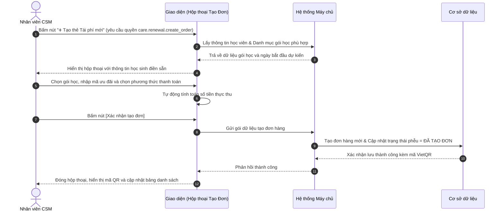

# US-CARE01-02: Lập Thẻ và Đơn hàng Tái phí Mới (Create Renewal Order Modal)

> **Tham chiếu:** `BF-CARE-01` · `SR-CSM-001` · Giao diện Mẫu §4.4 (Hộp thoại biểu mẫu)  
> **Đường dẫn màn hình & Trạng thái liên quan:**  
> - Hộp thoại nổi kích hoạt từ nút `➕ Tạo thẻ Tái phí mới` trên màn hình `/app/renewal` hoặc từ Drawer chi tiết.  
> - Trạng thái áp dụng: `MỚI`, `TIỀM NĂNG`, `CÂN NHẮC`, `HẸN TÁI`.  

---

## 1. NHẬT KÝ THAY ĐỔI & BỐI CẢNH (CHANGELOG & CONTEXT)

### Lịch sử cập nhật tài liệu (Changelog)

| Ngày cập nhật | Nội dung cập nhật | Lý do cập nhật |
|---|---|---|
| 17/08/2026 | Khởi tạo tài liệu đặc tả chuẩn Rinov5 TEMPLATE-US-FORM | Phân rã từ nút `➕ Tạo thẻ Tái phí mới` |
| 17/08/2026 | Để trống bối cảnh cho người dùng tự điền | Tuân thủ nguyên tắc không suy diễn bối cảnh thực tế |

### Bối cảnh & Vấn đề nghiệp vụ (Context & Problem)
* **Bối cảnh:** [Người dùng tự điền bối cảnh phát sinh biểu mẫu này]
* **Vấn đề hiện tại:** [Người dùng tự điền khó khăn/vấn đề cụ thể mà biểu mẫu này giải quyết]
* **Mục tiêu & Giá trị mang lại:** [Người dùng tự điền mục tiêu khi biểu mẫu này đi vào vận hành]

### Hiểu người dùng & Tình huống sử dụng (User Needs & Use Cases)
* **Người dùng chính (Persona):** `PERSONA-CSM` (Nhân viên Chăm sóc Khách hàng / Tư vấn viên)
* **Nhu cầu thực tế:** Cần chọn nhanh gói học gia hạn, nhập mã ưu đãi là hệ thống tự trừ tiền, và tạo ngay mã QR thanh toán để gửi cho phụ huynh.
* **Câu phát biểu nghiệp vụ:** **Là một** Nhân viên CSM, **tôi muốn** nhập thông tin gói gia hạn trên hộp thoại Tạo đơn tái phí, **để** hệ thống tạo đơn hàng và chuyển trạng thái học viên sang "ĐÃ TẠO ĐƠN".

---

## 2. LUỒNG XỬ LÝ CHÍNH (MAIN FLOW - HAPPY PATH)



---

## 3. GIAO DIỆN & CẤU TRÚC BIỂU MẪU (DATA & UI STATE)

### 3.1. Cấu trúc các trường nhập liệu & Ràng buộc kiểm tra

| Tên trường thông tin | Kiểu hiển thị | Bắt buộc | Nguồn dữ liệu | Định dạng & Giới hạn | Diễn giải quy tắc kiểm duyệt dữ liệu |
|---|---|:---:|---|---|---|
| **Học viên** | Văn bản chỉ đọc (Readonly) | Có | Dòng được chọn | Họ tên + Mã HV | Tự động điền, không cho phép sửa |
| **Gói học gia hạn** | Ô chọn danh sách thả xuống | **Có (*)** | Danh mục sản phẩm | Danh sách gói học | Bắt buộc chọn gói học mới (Gói 3T, 6T, 12T) |
| **Ngày bắt đầu gói mới** | Ô chọn ngày (Date Picker) | **Có (*)** | Người dùng chọn | `DD/MM/YYYY` | Mặc định là ngày kế tiếp sau ngày hết hạn gói cũ |
| **Đơn giá niêm yết** | Văn bản hiển thị số tiền | - | Hệ thống | Định dạng VNĐ | Tự động lấy theo đơn giá của gói học được chọn |
| **Mã ưu đãi (Voucher)** | Ô nhập chữ + Nút [Áp dụng] | Không | Người dùng nhập | 3 - 20 ký tự chữ | Kiểm tra tính hợp lệ của mã và trừ tiền tự động |
| **Học phí thực thu** | Chữ số tiền in đậm nổi bật | - | Hệ thống tính | Định dạng VNĐ | `Đơn giá` - `Số tiền giảm trừ` |
| **Phương thức thanh toán** | Nhóm nút chọn duy nhất (Radio) | **Có (*)** | Danh mục hệ thống | VietQR / Tiền mặt / POS | Mặc định chọn `Chuyển khoản VietQR` |
| **Ghi chú đơn hàng** | Ô nhập văn bản nhiều dòng | Không | Người dùng nhập | Tối đa 500 ký tự | Ghi chú yêu cầu xuất hóa đơn hoặc lưu ý |

### 3.2. Nút hành động biểu mẫu
| Tên nút | Kiểu hiển thị | Logic xử lý nghiệp vụ |
|---|---|---|
| **Hủy bỏ** | Nút viền xám | Đóng hộp thoại, hủy bỏ toàn bộ dữ liệu vừa nhập |
| **Xác nhận tạo đơn** | Nút màu cam nhấn | Kiểm tra các trường bắt buộc $\rightarrow$ Tạo đơn hàng $\rightarrow$ Sinh mã VietQR $\rightarrow$ Đóng hộp thoại |

---

## 4. TIÊU CHÍ NGHIỆM THU (ACCEPTANCE CRITERIA - BDD GHERKIN)

```gherkin
Scenario: Tạo đơn tái phí thành công có áp dụng mã giảm giá (Happy Path)
  Given Hộp thoại Tạo thẻ tái phí đang mở với học viên "Nguyễn Hà Phương"
  When Người dùng chọn Gói học = "Tiếng Anh Level 6 (12 Tháng)"
    And nhập Mã ưu đãi = "RENEWAL10" và bấm "Áp dụng"
    And chọn Phương thức = "Chuyển khoản VietQR"
    And bấm "Xác nhận tạo đơn"
  Then Hệ thống tạo đơn hàng ở trạng thái "Chờ thanh toán"
    And chuyển trạng thái học viên sang "ĐÃ TẠO ĐƠN" trên bảng danh sách
    And hiển thị mã VietQR động với đúng số tiền thực thu.

Scenario: Chặn lưu khi chưa chọn gói học bắt buộc (Validation Error)
  Given Người dùng mở hộp thoại nhưng chưa chọn Gói học gia hạn
  When Người dùng bấm "Xác nhận tạo đơn"
  Then Hệ thống cảnh báo viền đỏ tại ô Gói học và thông báo "Vui lòng chọn gói học gia hạn"
    And không gửi yêu cầu tạo đơn lên máy chủ.
```

---

## 5. CÁC TRƯỜNG HỢP GÓC CẠNH (CORNER CASES)
- **[CASE-01] Mã giảm giá hết hạn hoặc không đủ điều kiện:** Hệ thống hiển thị cảnh báo đỏ "Mã ưu đãi không hợp lệ hoặc đã hết lượt sử dụng", giữ nguyên đơn giá gốc.
- **[CASE-02] Ngày bắt đầu gói mới trước ngày hết hạn gói cũ:** Hệ thống hiển thị hộp cảnh báo xác nhận "Ngày bắt đầu gói mới bị trùng lặp với gói cũ đang học. Bạn có chắc chắn muốn ghi đè?".
