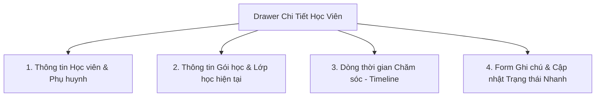

# US-CARE01-03: Xem Chi tiết Hồ sơ & Dòng thời gian CSKH (Renewal Detail Drawer)

> **Tham chiếu:** `BF-CARE-01` · `SR-CSM-001` · Giao diện Mẫu §4.3 (Hộp thoại trượt chi tiết)  
> **Đường dẫn màn hình & Trạng thái liên quan:**  
> - Hộp thoại trượt từ cạnh phải (Drawer) kích hoạt khi nhấp vào dòng học viên tại `/app/renewal`.  

---

## 1. NHẬT KÝ THAY ĐỔI & BỐI CẢNH (CHANGELOG & CONTEXT)

### Lịch sử cập nhật tài liệu (Changelog)

| Ngày cập nhật | Nội dung cập nhật | Lý do cập nhật |
|---|---|---|
| 17/08/2026 | Khởi tạo tài liệu đặc tả chuẩn Rinov5 TEMPLATE-US-DETAIL | Phân rã từ tương tác nhấp dòng học viên |
| 17/08/2026 | Để trống bối cảnh cho người dùng tự điền | Tuân thủ nguyên tắc không suy diễn bối cảnh thực tế |

### Bối cảnh & Vấn đề nghiệp vụ (Context & Problem)
* **Bối cảnh:** [Người dùng tự điền bối cảnh phát sinh Drawer này]
* **Vấn đề hiện tại:** [Người dùng tự điền khó khăn/vấn đề cụ thể mà Drawer này giải quyết]
* **Mục tiêu & Giá trị mang lại:** [Người dùng tự điền mục tiêu khi Drawer này đi vào vận hành]

---

## 2. GIAO DIỆN & CẤU TRÚC CHI TIẾT (DRAWER LAYOUT)



### 2.1. Cấu trúc các vùng thông tin
1. **Khối 1: Thông tin Học viên & Gia đình:**
   - Họ và tên, Tên thân mật (Fiona), Mã học viên (`HV-01283`).
   - Tên người đại diện (Phụ huynh), Số điện thoại che `xxxxxx122`, Nút gọi điện WebRTC (yêu cầu quyền `care.renewal.call`).
2. **Khối 2: Thông tin Khóa học & Lớp học:**
   - Môn học: `Tiếng Anh - Level 5`, Lớp: `ENG-L5-CS1`.
   - Giáo viên đứng lớp: `GV_F010`, CSM phụ trách: `Nguyễn Thị Ngọc Anh`.
   - Ngày hết hạn: `28/12/2024`, Số buổi học còn lại: `4/48 buổi`.
3. **Khối 3: Dòng thời gian Chăm sóc (Care Timeline):**
   - Danh sách các cuộc gọi, tin nhắn, ghi chú trao đổi trước đây (sắp xếp theo thời gian mới nhất ở trên).
4. **Khối 4: Form Thêm tương tác nhanh:**
   - Ô chọn Kết quả tương tác (Dropdown: `Quan tâm gói 1 năm`, `Hẹn gọi lại`, `Từ chối / Không tái phí`, `Đồng ý tái phí`).
   - Ô nhập Ghi chú trao đổi (Textarea).
   - Ô chọn Ngày hẹn nhắc việc tiếp theo (Date Picker).
   - Nút [Lưu tương tác] (yêu cầu quyền `care.renewal.add_log`).

---

## 3. TIÊU CHÍ NGHIỆM THU (ACCEPTANCE CRITERIA - BDD GHERKIN)

```gherkin
Scenario: Ghi nhận tương tác chăm sóc và cập nhật trạng thái phễu (Happy Path)
  Given Drawer chi tiết của học viên "Nguyễn Hà Phương" đang mở
  When Người dùng chọn Kết quả = "Đồng ý tái phí"
    And nhập Ghi chú = "Phụ huynh đồng ý gói 1 năm, hẹn gửi mã QR"
    And bấm "Lưu tương tác"
  Then Hệ thống lưu bản ghi tương tác vào Dòng thời gian
    And tự động chuyển trạng thái học viên sang "HẸN TÁI" trên bảng danh sách ngoài.

Scenario: Chuyển trạng thái học viên sang "KHÔNG TÁI PHÍ" khi phụ huynh từ chối
  Given Drawer chi tiết của học viên đang mở ở trạng thái bất kỳ (ví dụ: TIỀM NĂNG)
  When Người dùng chọn Kết quả = "Từ chối / Không tái phí"
    And nhập lý do: "Gia đình chuyển nơi sinh sống sang tỉnh khác"
    And bấm "Lưu tương tác"
  Then Hệ thống cập nhật trạng thái phễu của học viên sang "KHÔNG TÁI PHÍ" (Global Terminal State).
```
