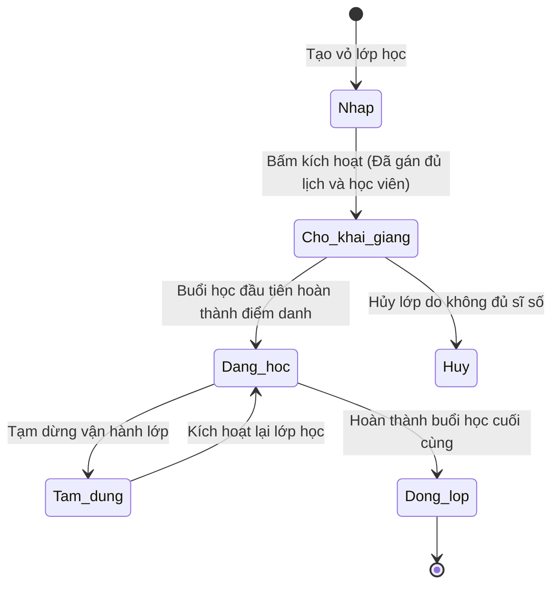

# BF-CLS-02: Quản lý Lớp học (Class Lifecycle & Syllabus Attachment)

> **Capability:** CAP-OPS (Năng lực Quản lý Học viên & Vận hành Lớp)
> **Giai đoạn:** 2 - Vận hành
> **Nhóm chức năng:** Quản lý Học viên
> **Mã màn hình:** `classes`

---

## 1. Mô tả tổng quan

Phân hệ thiết lập và quản lý các "vỏ hộp" Lớp học (Class) dài hạn. Mô hình vận hành lớp học được cấu thành từ ba trụ cột nghiệp vụ chặt chẽ:
1.  **Vỏ lớp và thông tin hành chính tĩnh:** Tên lớp, cơ sở quản lý, sĩ số tối đa, giáo viên chủ nhiệm, trợ giảng chỉ định.
2.  **Lịch học tuần và giáo trình (Khung tĩnh):** Khung thời gian ca học cố định hàng tuần, phòng học mặc định và Khung chương trình đào tạo áp dụng cho lớp.
3.  **Buổi học thực tế và học viên (Vận hành động):** Danh sách các học viên được xếp lớp (Roster) và toàn bộ các buổi học cụ thể được tự động sinh ra theo thời gian thực. Phân hệ cho phép giáo vụ quản lý linh hoạt các biến động thực tế (như đổi lịch từng buổi lẻ, phòng học đột xuất, giáo viên dạy thay) và ghi nhận dòng nhật ký tương tác hoặc nhật ký hoạt động của hệ thống.

---

## 2. Đối tượng sử dụng (Vai trò)

- **Quản lý Chi nhánh:** Phê duyệt việc mở lớp mới dựa trên nhu cầu học viên chờ.
- **Nhân viên Giáo vụ (Vận hành):** Trực tiếp khởi tạo, cấu hình lịch tuần, gán giáo trình, theo dõi tiến độ và xử lý các biến động của lớp học.
- **Giáo viên:** Xem thông tin lớp học mình được phân công phụ trách, theo dõi lộ trình bài giảng và danh sách học viên.

---

## 3. Ranh giới Nghiệp vụ (Scope)

### Có bao gồm (In Scope)
- Khởi tạo vỏ Lớp học mới (Tên lớp, mã lớp, cơ sở chi nhánh, sĩ số tối đa).
- Thiết lập khung thời gian ca học cố định hàng tuần và phòng học mặc định của lớp.
- Gán một Khung chương trình đào tạo cụ thể để tự động sinh toàn bộ lộ trình và tài liệu bài giảng từng buổi.
- Xử lý xếp học viên từ trạng thái chờ xếp lớp vào danh sách học viên chính thức của lớp.
- Vận hành các buổi học lẻ (cho phép thay đổi phòng, dời lịch, gán giáo viên dạy thay cho từng buổi riêng biệt).
- Đóng lớp, xét tốt nghiệp cho học viên và giải phóng các tài nguyên giáo viên/phòng học cố định.
- Ghi nhận các phản hồi, tương tác nội bộ và nhật ký hoạt động hệ thống liên quan đến lớp.

### Không bao gồm (Out of Scope)
- Đăng ký hồ sơ học viên mới hoặc ghi nhận học phí/đơn hàng thành công → Xử lý tại `CAP-COM`, `CAP-FIN`.
- Quản lý hồ sơ gốc của giáo viên hoặc quỹ thời gian rảnh → Xử lý tại `CAP-HR`.
- Nghiệp vụ điểm danh và chấm điểm thi của từng buổi học cụ thể → Xử lý tại `BF-CLS-05`.

---

## 4. Mô hình Dữ liệu Nghiệp vụ (Data Entities)

| Tên Thực thể | Trường định danh | Thuộc tính quan trọng | Ràng buộc quan hệ | Diễn giải |
|--------------|------------------|-----------------------|-------------------|----------|
| Lớp học (Class Record) | Mã lớp | Tên lớp, chi nhánh, sĩ số hiện tại, trạng thái lớp | Trỏ về Chi nhánh | Thực thể quản lý vỏ lớp dài hạn. |
| Học viên lớp (Roster Student) | Mã học viên | Nhãn trạng thái hệ thống, Nhãn hình thức lớp, Ngày nhập học | Trỏ về Học viên & Lớp | Danh sách học viên thuộc lớp học. |
| Lịch cố định (Schedule Slot) | Mã lịch tuần | Ngày trong tuần, Giờ học, Phòng mặc định, Giáo viên mặc định | Trỏ về Lớp học | Khung lịch lặp lại hàng tuần của lớp. |
| Buổi học thực tế (Class Session)| Mã buổi học | Ngày học thực tế, Chủ đề bài học, Giáo viên thực tế, Phòng thực tế, Trạng thái buổi | Trỏ về Lớp học & Chương trình | Buổi học cụ thể sinh ra từ Lịch tuần. |
| Ghi chú tương tác (Interaction Note) | Mã ghi chú | Nội dung ghi chú, Người viết, Ngày viết | Trỏ về Lớp học | Ý kiến nội bộ phản hồi về lớp. |
| Nhật ký hệ thống (Audit Log) | Mã nhật ký | Nội dung hành động, Người thực hiện, Thời gian thực hiện | Trỏ về Lớp học | Lịch sử tự động lưu lại các biến động. |

### 4.1. Vòng đời Trạng thái (Status Lifecycle)

*Sơ đồ dưới đây xác định tất cả trạng thái hợp lệ và các phép chuyển đổi được phép đối với một Lớp học.*

**Quy tắc chuyển đổi:**

| Từ trạng thái | Sang trạng thái | Điều kiện bắt buộc | Vai trò được phép |
|---------------|-----------------|---------------------|-------------------|
| Nháp | Chờ khai giảng | Người dùng gán đủ Lịch học tuần và danh sách Học viên, sau đó bấm Kích hoạt | Giáo vụ / Quản lý |
| Chờ khai giảng | Đang học | Giáo viên hoàn thành việc điểm danh buổi học đầu tiên của lớp | Hệ thống tự động |
| Chờ khai giảng | Hủy | Người dùng bấm hủy lớp, hệ thống đẩy toàn bộ học viên roster ra hàng chờ xếp lớp | Giáo vụ / Quản lý |
| Đang học | Tạm dừng | Người dùng chuyển trạng thái thủ công khi có lý do tạm hoãn lớp | Giáo vụ / Quản lý |
| Tạm dừng | Đang học | Người dùng bấm kích hoạt lại lớp học sau thời gian tạm hoãn | Giáo vụ / Quản lý |
| Đang học | Đóng lớp | Buổi học cuối cùng được giáo viên điểm danh và hoàn thành | Hệ thống tự động hoặc Giáo vụ |

### 4.2. Ví dụ Dữ liệu mẫu

*Giúp tạo dữ liệu kiểm thử chính xác.*

| Tình huống | Dữ liệu đầu vào | Kết quả mong đợi |
|------------|-----------------|-------------------|
| Tạo Lớp mới | Tên: "IELTS Junior 1A", Chi nhánh: Linh Đàm | Lớp được tạo trạng thái "Nháp", sẵn sàng chờ xếp lịch và thêm học viên. |
| Khóa thông tin cơ bản | Lớp có học viên, giáo vụ cố sửa Khung chương trình | Hệ thống khóa trường nhập liệu, chỉ cho phép chỉnh sửa Tên lớp và Sĩ số tối đa. |
| Hủy lớp Chờ khai giảng | Lớp "KET Prep 1C" có 5 học viên bị hủy | Trạng thái lớp chuyển sang "Hủy", 5 học viên tự động được đẩy ra danh sách Chờ xếp lớp. |
| Lớp hoàn thành | Buổi học thứ 30/30 kết thúc và điểm danh xong | Lớp TỰ ĐỘNG chuyển trạng thái thành "Đóng lớp". |

---

## 5. Quy tắc Nghiệp vụ Tổng thể (Business Rules)

1. **[RULE-CLS-02-01] Chốt phiên bản Khung chương trình:** Khi Lớp đã được gắn Syllabus và chuyển sang trạng thái `Chờ khai giảng` hoặc `Đang học`, cấu trúc bài học của Lớp đó bị khóa cứng theo phiên bản Syllabus đã chọn. Nếu có cập nhật bản Syllabus mới, Lớp này không bị ảnh hưởng.
2. **[RULE-CLS-02-02] Ngày kết thúc linh hoạt:** Ngày dự kiến kết thúc của Lớp là dữ liệu động, được hệ thống tự tính toán và cập nhật liên tục dựa trên ngày tổ chức thực tế của Buổi học cuối cùng.
3. **[RULE-CLS-02-03] Bảo lưu thông tin và nhãn học viên:** Khi học viên thực hiện bảo lưu hoặc chuyển sang lớp khác, hệ thống giữ nguyên thông tin của họ trong Roster của lớp cũ kèm nhãn trạng thái (Bảo lưu/Đã chuyển) và hỗ trợ bộ lọc lọc theo trạng thái.
4. **[RULE-CLS-02-04] Ràng buộc địa điểm phòng học cố định:** Phòng học được lựa chọn gán cho lịch cố định hàng tuần bắt buộc phải thuộc Chi nhánh cơ sở đang quản lý lớp học.
5. **[RULE-CLS-02-05] Ràng buộc giáo viên dạy thay:** Khi gán giáo viên dạy thay đột xuất cho một buổi học thực tế, tên giáo viên chính trên buổi đó sẽ bị gạch ngang và hệ thống tự động ghi lại lịch sử thao tác vào nhật ký hệ thống.
6. **[RULE-CLS-02-06] Quy tắc đổi lịch ca học lẻ:** Cho phép dời lịch học hoặc giờ học của từng buổi lẻ riêng biệt. Các buổi học tương lai sẽ tự động được dịch ngày tương ứng nếu giáo vụ yêu cầu dời lịch toàn bộ.
7. **[RULE-CLS-02-07] Tự động cập nhật nhật ký tương tác:** Mọi phản hồi nội bộ của giáo vụ ghi nhận tại thanh tương tác sẽ được lưu tức thì vào đầu dòng nhật ký kèm mốc ngày giờ và tên người dùng thực hiện.
8. **[RULE-CLS-02-08] Chỉ số cảnh báo sĩ số:** Khi sĩ số thực tế của lớp đạt từ 80% định mức tối đa của lớp học, hệ thống tự động đổi màu sắc hiển thị chỉ số sĩ số lớp sang màu đỏ cảnh báo.

### 5.1. Thông số & Định mức cấp Phân hệ (Global Metrics & Thresholds)
- **[GLOBAL-METRIC-CLS-02-01] Sĩ số lớp tối đa mặc định:** 20 học viên cho mỗi lớp học.
- **[GLOBAL-METRIC-CLS-02-02] Số lượng buổi học tối đa:** Mỗi lớp học được gán Syllabus không vượt quá 120 bài học/buổi học để đảm bảo hiệu năng tải lộ trình.

---

## 6. Danh sách Yêu cầu Người dùng (User Stories)

| Mã Yêu cầu | Tên Yêu cầu (Loại màn hình) | Đường dẫn truy cập | Trạng thái |
|------------|-----------------------------|--------------------|------------|
| US-CLS02-01 | Quản lý danh sách Lớp học (Danh sách) | /app/classes | Đang hoạt động |
| US-CLS02-02 | Tạo mới vỏ Lớp học & Xếp lịch tuần (Hộp thoại nổi) | /app/classes (Hộp thoại) | Đang hoạt động |
| US-CLS02-03 | Gắn Khung chương trình (Syllabus) vào Lớp (Hộp thoại nổi) | /app/classes (Hộp thoại) | Đang hoạt động |
| US-CLS02-05 | Tốt nghiệp & Đóng lớp học (Hộp thoại nổi) | /app/classes (Hộp thoại) | Đang hoạt động |
| US-CLS02-06 | Hộp thoại Chi tiết Lớp học Trung tâm (Bản Lớn) (Hộp thoại nổi) | /app/classes (Hộp thoại) | Đang hoạt động |
| US-CLS03-02 | Thêm học viên vào lớp (Hộp thoại nổi) | /app/classes (Hộp thoại) | Đang hoạt động |
| US-CLS04-01 | Phân công Giáo viên chủ nhiệm & Giáo viên giảng dạy (Hộp thoại nổi) | /app/classes (Hộp thoại) | Đang hoạt động |
| US-OPS02-01 | Thiết lập lịch học tuần & Phòng học theo chi nhánh (Hộp thoại nổi) | /app/classes (Hộp thoại) | Đang hoạt động |
