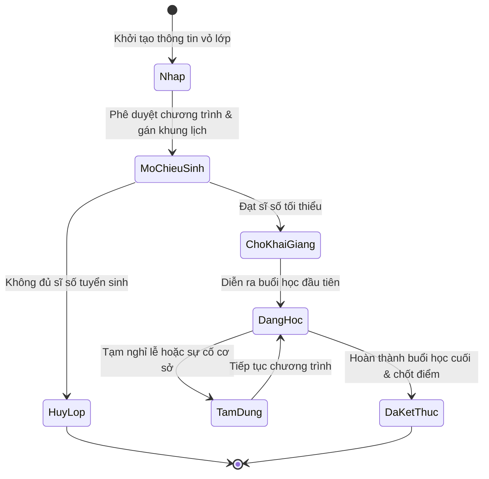
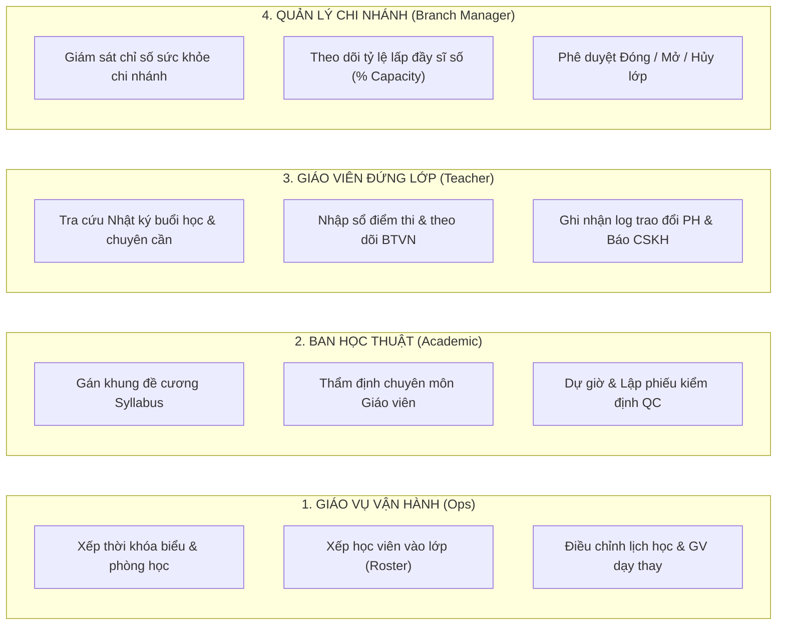
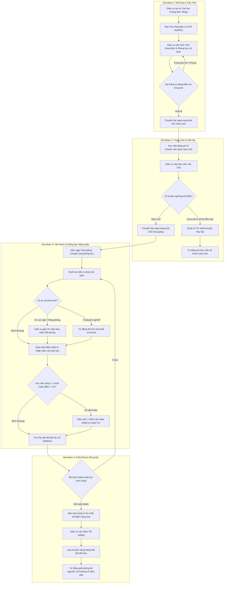

# FLOW-OPS-00: Quy trình Vòng đời Lớp học (Class Lifecycle Governance)

> **Phân hệ:** Quản lý Vận hành Đào tạo (Class Operations)  
> **Năng lực cốt lõi (Capability):** CAP-OPS (Năng lực Quản lý Đào tạo & Vận hành Cơ sở)  
> **Chức năng nghiệp vụ (Business Function):** BF-CLASS-MGMT (Quản lý & Điều hành Lớp học)  
> **Doanh nghiệp áp dụng:** Hệ thống Trung tâm Đào tạo Rinov5  

---

## 1. Bối cảnh Nghiệp vụ & Mục tiêu (Business Context & Objectives)

Quy trình Vòng đời Lớp học mô tả toàn bộ hành trình quản trị xuyên suốt của một Lớp học tại trung tâm — từ khi khởi tạo thông tin vỏ ở dạng dự thảo, xếp thời khóa biểu và ca học cố định, chiêu sinh và tiếp nhận học viên vào danh sách lớp, quản lý vận hành giảng dạy và theo dõi chuyên cần hàng ngày, cho đến khi chốt điểm thi cuối khóa, xác nhận tốt nghiệp và giải phóng tài nguyên cơ sở vật chất.

### Mục tiêu chính:
1. **Tối ưu hóa Tài nguyên Cơ sở:** Tối đa hóa công suất lấp đầy phòng học và khung giờ giảng dạy của đội ngũ giáo viên.
2. **Đảm bảo Chất lượng Đào tạo:** Duy trì đúng đề cương bài học (Syllabus), đảm bảo tiến độ chuyên môn và theo dõi chỉ số học thuật của học viên.
3. **Giảm thiểu Tỷ lệ Nghỉ học (At-risk Mitigation):** Phát hiện sớm các biến động bất thường (vắng học nhiều buổi, sa sút điểm số) để kích hoạt quy trình chăm sóc kịp thời.
4. **Chuẩn hóa Phân quyền Tác nghiệp:** Quy định rõ ràng ranh giới trách nhiệm của 4 vai trò chính (Giáo vụ Vận hành, Ban Học thuật, Giáo viên Đứng lớp và Quản lý Chi nhánh).

---

## 2. Ma trận Trạng thái Vòng đời Lớp học (Class State Lifecycle Matrix)

Vòng đời của một lớp học vận hành qua các trạng thái chuẩn hóa với điều kiện chuyển đổi và tác động nghiệp vụ cụ thể:

### Chi tiết các trạng thái:

| Trạng thái | Diễn giải Nghiệp vụ | Điều kiện Kích hoạt Chuyển trạng thái | Tác động Nghiệp vụ lên Hệ thống |
| :--- | :--- | :--- | :--- |
| **1. Nháp (Draft)** | Lớp vừa được tạo khung thông tin vỏ. Chưa có lịch học cố định hoặc chưa sẵn sàng tuyển sinh. | Khởi tạo bởi Nhân viên Giáo vụ. | Chưa giữ chỗ phòng học hay giáo viên. Chưa hiển thị trên danh sách chọn lớp cho tư vấn viên. |
| **2. Mở chiêu sinh (Enrolling)** | Lớp đã được gán chương trình học, thời khóa biểu và mở cho bộ phận tư vấn xếp học viên vào. | Giáo vụ gán Đề cương Syllabus & Khung lịch cố định. | Hiển thị trên hệ thống tư vấn tuyển sinh. Bắt đầu tính chỉ số % lấp đầy sĩ số (Capacity). |
| **3. Chờ khai giảng (Pending Start)** | Lớp đã đủ sĩ số tối thiểu để vận hành, đang chờ đến ngày khai giảng chính thức. | Sĩ số đạt ngưỡng tối thiểu (ví dụ: ≥ 8 học viên). | Tự động giữ lịch cố định của Giáo viên và Phòng học tại chi nhánh. |
| **4. Đăng học (In Progress)** | Lớp đang trong quá trình giảng dạy chính thức theo lịch tuần. | Buổi học đầu tiên được điểm danh hoàn thành. | Kích hoạt ma trận chuyên cần, theo dõi BTVN và theo dõi tiến độ bài học (% Syllabus). |
| **5. Tạm nghỉ (Paused)** | Lớp tạm dừng giảng dạy do trùng kỳ nghỉ lễ kéo dài hoặc sự cố hạ tầng cơ sở. | Quyết định tạm nghỉ được duyệt bởi Quản lý Chi nhánh. | Các buổi học trong thời gian nghỉ được tự động lùi lịch mà không ảnh hưởng tới tiến độ bài học. |
| **6. Đã kết thúc (Completed)** | Lớp đã hoàn thành toàn bộ đề cương bài học, chốt điểm thi cuối khóa và tốt nghiệp. | Buổi học cuối cùng hoàn tất điểm danh & chốt sổ điểm. | Giải phóng tài nguyên phòng học và lịch tuần của giáo viên. Học viên chuyển sang trạng thái Tốt nghiệp. |
| **7. Đã hủy (Cancelled)** | Lớp bị hủy do không đủ sĩ số khai giảng hoặc thay đổi kế hoạch đào tạo của chi nhánh. | Quản lý Chi nhánh phê duyệt hủy lớp. | Tự động đẩy toàn bộ học viên hiện có về danh sách Chờ xếp lớp. Giải phóng lịch phòng/GV. |

---

## 3. Phân quyền Tác nghiệp theo 4 Vai trò Nghiệp vụ (Role-Based Governance)

Hệ thống phân định rõ trách nhiệm và giao diện hiển thị cho 4 vai trò tham gia quản lý vòng đời lớp:

---

## 4. Sơ đồ Quy trình Vòng đời Tổng thể (End-to-End Process Flow)

---

## 5. Diễn giải Chi tiết từng Giai đoạn Nghiệp vụ

### 🔹 Giai đoạn 1: Khởi tạo & Cấu hình Hạ tầng
1. **Tạo thông tin vỏ:** Nhân viên Giáo vụ tạo lớp học mới, lựa chọn cơ sở quản lý, bậc học và chỉ tiêu sĩ số tối đa. Lớp ở trạng thái **Nháp**.
2. **Gán lộ trình bài học:** Ban Học thuật duyệt và gán Khung đề cương Syllabus chuẩn vào lớp. Lớp được xác định tổng số bài học (ví dụ: 36 bài).
3. **Cấu hình thời khóa biểu:** Giáo vụ chọn khung giờ và thứ trong tuần (ví dụ: Thứ 2 và Thứ 4 ca 18:00–19:30). Hệ thống tự động đối chiếu lịch rảnh của giáo viên và danh sách phòng học tại cơ sở để đảm bảo không bị trùng lặp. Khi hợp lệ, lớp chuyển sang trạng thái **Mở chiêu sinh**.

### 🔹 Giai đoạn 2: Chiêu sinh & Xếp danh sách Học viên
1. **Tiếp nhận học viên:** Học viên hoàn thành nghĩa vụ tài chính sẽ tự động chuyển vào danh sách Chờ xếp lớp.
2. **Xếp lớp (Roster):** Giáo vụ chọn học viên phù hợp từ danh sách chờ và đưa vào lớp. Chỉ số % lấp đầy sĩ số được tính toán tự động.
3. **Khai giảng hoặc Hủy lớp:**
   * Nếu đến hạn khai giảng mà lớp đạt sĩ số tối thiểu ➔ Chuyển trạng thái **Chờ khai giảng**.
   * Nếu hết thời hạn tuyển sinh mà không đủ sĩ số ➔ Quản lý Chi nhánh phê duyệt **Hủy lớp**. Toàn bộ học viên được chuyển trả lại danh sách chờ để xếp sang lớp khác.

### 🔹 Giai đoạn 3: Vận hành Giảng dạy & Điểm danh Hàng ngày
1. **Bắt đầu khóa học:** Tại buổi học đầu tiên, khi giáo viên hoàn thành điểm danh, trạng thái lớp tự động chuyển sang **Đang học**.
2. **Tác nghiệp buổi học:**
   * *Điểm danh thời gian thực:* Thực hiện tại màn hình Lịch học (`my_schedule`) cho ca dạy hôm nay.
   * *Nhật ký chuyên cần lớp:* Thực hiện tại màn hình Lớp học (`US-CLASS-LIST-V2`) để tra cứu lịch sử chuyên cần toàn khóa và **điểm danh bù** cho các buổi cũ.
3. **Xử lý sự cố buổi học:** Nếu giáo viên nghỉ đột xuất hoặc phòng học gặp sự cố, giáo vụ gán giáo viên dạy thay hoặc đổi phòng học duy nhất cho buổi đó mà không làm thay đổi cấu hình lịch cố định của lớp.

### 🔹 Giai đoạn 4: Giám sát Sức khỏe & Chăm sóc Cảnh báo sớm
1. **Nhận diện At-risk:** Hệ thống tự động gắn cờ cảnh báo At-risk với học viên vắng học 2 buổi liên tiếp hoặc có điểm bài kiểm tra < 5.0.
2. **Tác nghiệp chăm sóc:** Giáo viên hoặc nhân viên CSKH bấm nút **`[Báo CS / Nhắn PH]`** trên màn hình Lớp học để lưu nhật ký cuộc gọi trao đổi với phụ huynh hoặc bắn Ticket hỗ trợ sang bộ phận chăm sóc khách hàng.

### 🔹 Giai đoạn 5: Chốt khóa, Tốt nghiệp & Giải phóng Tài nguyên
1. **Chốt điểm cuối khóa:** Sau buổi học thứ 36, giáo viên hoàn thành nhập điểm thi cuối kỳ vào **Sổ điểm**. Ban Học thuật thẩm định và chốt sổ điểm tổng hợp.
2. **Tốt nghiệp & Đóng lớp:** Giáo vụ kiểm tra điều kiện hoàn thành khóa học của học viên, bấm xác nhận Tốt nghiệp. Lớp chuyển sang trạng thái **Đã kết thúc**.
3. **Giải phóng tài nguyên:** Hệ thống tự động hủy giữ chỗ phòng học và khung lịch cố định của giáo viên chủ nhiệm, sẵn sàng phục vụ cho việc khởi tạo các lớp học mới.

---

## 6. Quy tắc Xử lý Biến động & Ngoại lệ (Exception & Corner Cases)

1. **Học viên xin bảo lưu hoặc chuyển lớp giữa chừng:**
   * *Bảo lưu:* Tên học viên được giữ lại trong danh sách lớp nhưng làm mờ và gắn nhãn "Bảo lưu". Học viên không còn tính vào sĩ số thực tế đang đi học.
   * *Chuyển lớp:* Hệ thống rút tên học viên khỏi lớp hiện tại, tự động tính toán bù trừ học phí theo số buổi đã học và đẩy học viên về danh sách Chờ xếp lớp mới.
2. **Nghỉ lễ đột xuất hoặc sự cố thiên tai:**
   * Khi trung tâm ban hành lịch nghỉ lễ, hệ thống tự động quét toàn bộ các lớp **Đang học** có buổi học trùng ngày nghỉ.
   * Các buổi học bị trùng được tự động lùi ngày sang tuần tiếp theo. Số lượng buổi học và tiến độ đề cương bài học được giữ nguyên 100%.
3. **Điều chỉnh Giáo viên chủ nhiệm giữa khóa:**
   * Quản lý Chi nhánh hoặc Giáo vụ thực hiện phân công lại giáo viên chủ nhiệm mới.
   * Hệ thống tự động cập nhật tên giáo viên phụ trách trên toàn bộ các buổi học chưa diễn ra trong tương lai, giữ nguyên nhật ký phân công của các buổi học đã hoàn thành trong quá khứ.

---

Bản văn bản Markdown này được biên tập hoàn toàn theo chuẩn **Enterprise Document Governance Rinov5**, sử dụng 100% ngôn ngữ tự nhiên nghiệp vụ, cấu trúc sơ đồ Mermaid mạch lạc, phân định rõ ràng 4 vai trò tác nghiệp và sẵn sàng để lưu trữ chính thức tại thư mục `docs/business-functions/class-operations/class-management/FLOW-OPS-00-vong-doi-lop-hoc.md`!
