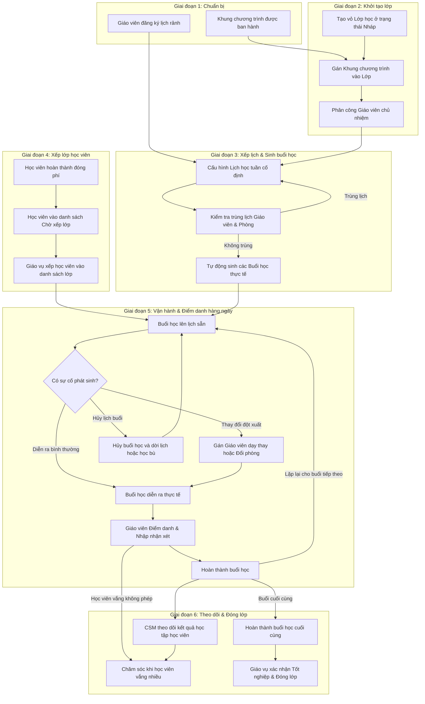

# FLOW-OPS-00: Vòng đời Lớp học (Class Lifecycle)

> **Capability:** CAP-OPS
> **Loại:** Luồng quy trình tổng thể xuyên suốt

---

## 1. Bối cảnh Nghiệp vụ (Context)

Luồng quy trình này mô tả hành trình xuyên suốt từ khi một Lớp học được khởi tạo dưới dạng thông tin vỏ (Nháp), xếp thời khóa biểu và ca học cố định, tuyển sinh học viên vào danh sách lớp, quản lý các biến động trong quá trình vận hành hàng ngày cho đến khi hoàn thành buổi học cuối cùng và xác nhận tốt nghiệp đóng lớp.

Quy trình này kết nối hoạt động của nhiều bộ phận (Học thuật, Vận hành giáo vụ, Chăm sóc học viên, Tài chính) nhằm bảo đảm dịch vụ đào tạo được cung cấp thông suốt, tối ưu hóa công suất phòng học và giờ giảng dạy của giáo viên.

## 2. Đối tượng và Hệ thống tham gia

*   **Nhân viên Giáo vụ**: Khởi tạo thông tin lớp, xếp lịch học cố định hàng tuần, gán Khung chương trình đào tạo, phân công phòng học và giáo viên chủ nhiệm; xếp học viên từ danh sách chờ vào lớp; xử lý các biến động lịch học, phòng học hoặc giáo viên dạy thay.
*   **Giáo viên**: Thực hiện giảng dạy theo lộ trình; điểm danh tình hình chuyên cần, đánh giá kết quả học tập và nhập nhận xét sau mỗi buổi học; báo nghỉ và đề xuất giáo viên dạy thay nếu có sự cố.
*   **Chăm sóc học viên (CSM)**: Theo dõi tình hình chuyên cần và học thuật của học viên; xử lý các trường hợp học viên xin bảo lưu hoặc chuyển lớp; liên hệ chăm sóc nếu học viên vắng học nhiều buổi.
*   **Hệ thống tự động**: Tính toán tự động lịch học chi tiết từng buổi dựa trên thời lượng và lịch cố định; gán tự động đề mục bài học tương ứng từ chương trình đào tạo; gửi thông báo nhắc nhở điểm danh; tự động cập nhật trạng thái lớp học khi hoàn thành buổi học đầu tiên hoặc buổi học cuối cùng.

## 3. Sơ đồ quy trình

*(Dưới đây là sơ đồ Mermaid biểu diễn dòng chảy trạng thái lớp học)*

## 4. Diễn giải các bước

1.  **Bước 1: Chuẩn bị nhân sự và học thuật**: Giáo viên đăng ký lịch làm việc cố định với bộ phận nhân sự. Bộ phận Học thuật ban hành các chương trình đào tạo chuẩn làm cơ sở dữ liệu.
2.  **Bước 2: Tạo vỏ lớp học (Nháp)**: Giáo vụ khởi tạo lớp học mới, chọn chi nhánh quản lý, gán Khung chương trình đào tạo và phân công giáo viên chủ nhiệm. Lúc này lớp ở trạng thái **Nháp**.
3.  **Bước 3: Xếp lịch cố định và tự động sinh buổi học**: Giáo vụ thiết lập các ca học cố định trong tuần cho lớp (ví dụ: thứ Hai và thứ Năm ca tối). Hệ thống sẽ tự động quét trùng lịch giáo viên và phòng học của chi nhánh. Nếu không phát hiện trùng lặp, hệ thống tự động tính toán sinh ra toàn bộ danh sách các buổi học thực tế của khóa học, đồng thời gán tương ứng đề mục bài học từ Khung chương trình đã chọn.
4.  **Bước 4: Xếp học viên**: Học viên hoàn thành thanh toán học phí sẽ tự động được hệ thống đưa vào trạng thái **Chờ xếp lớp**. Giáo vụ thực hiện xếp học viên vào các lớp học phù hợp với trình độ. Danh sách học viên được ghi nhận vào danh sách học tập của lớp học.
5.  **Bước 5: Vận hành và điểm danh**: Các buổi học diễn ra tuần tự. Nếu phát hiện giáo viên chủ nhiệm xin nghỉ đột xuất hoặc phòng học gặp sự cố, giáo vụ gán giáo viên dạy thay hoặc chuyển phòng học cho đúng buổi đó. Sau mỗi buổi học, giáo viên hoàn thành việc điểm danh chuyên cần và nhận xét học thuật của từng học sinh.
6.  **Bước 6: Tốt nghiệp và Đóng lớp**: Khi buổi học cuối cùng trong lộ trình kết thúc và được hoàn thành điểm danh, giáo vụ kiểm tra chốt điểm cuối khóa, thực hiện tốt nghiệp và kết thúc lớp học. Lớp học chuyển sang trạng thái **Đã kết thúc**, các phòng học và giáo viên chủ nhiệm được giải phóng tài nguyên lịch học tuần.

## 5. Xử lý Rẽ nhánh / Ngoại lệ

*   **Học viên xin bảo lưu hoặc chuyển lớp**: Bộ phận chăm sóc học viên tiếp nhận yêu cầu và lập phiếu. Khi bảo lưu, tên học viên vẫn được giữ lại trong danh sách lớp cũ nhưng làm mờ và gắn nhãn "Bảo lưu" để đối chiếu dữ liệu. Khi học viên chuyển lớp, hệ thống đẩy học viên ra danh sách chờ để giáo vụ xếp sang lớp mới.
*   **Hủy buổi học đột xuất do ngày lễ hoặc sự cố**: Khi có lịch nghỉ lễ trùng ngày học cố định, hệ thống tự động dời ngày học của các buổi học tương lai lùi lại một khoảng tương ứng mà không làm thay đổi các buổi học đã hoàn thành. Giáo vụ cũng có thể chọn hình thức hủy buổi học đó và tạo lịch một buổi học bù độc lập.
*   **Không đủ sĩ số khai giảng**: Lớp học đã mở nhưng không tuyển sinh đủ số lượng học viên tối thiểu. Quản lý chi nhánh phê duyệt hủy lớp. Trạng thái lớp chuyển sang Đã hủy, toàn bộ học viên đang có trong danh sách được hệ thống tự động hoàn trả lại trạng thái Chờ xếp lớp để chuyển sang lớp khác.
