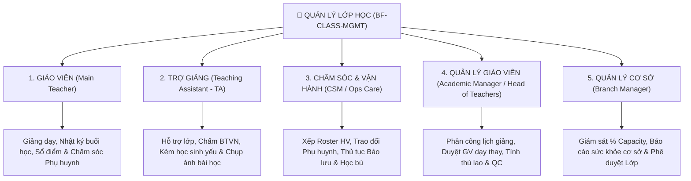
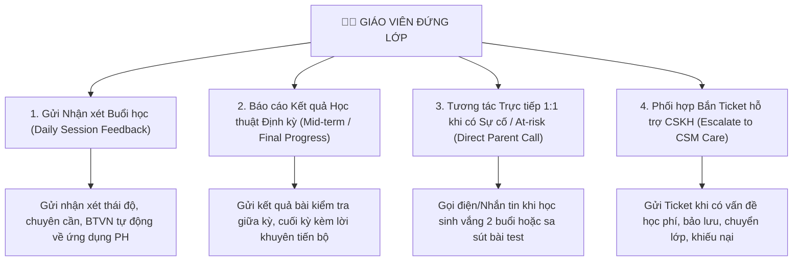

# MA TRẬN VAI TRÒ NGHIỆP VỤ & TÍNH NĂNG HỆ THỐNG MÀN QUẢN LÝ LỚP HỌC (`BF-CLASS-MGMT`)

> **Phân hệ:** Quản lý Vận hành Lớp học (Class Operations)  
> **Tài liệu đặc tả:** Ma trận Vai trò Nghiệp vụ & Chi tiết Nghiệp vụ Chăm sóc Phụ huynh của Giáo viên  
> **Hệ thống áp dụng:** Trung tâm Đào tạo Rinov5  

---

## 1. Tổng quan 5 Vai trò Nghiệp vụ tại Trung tâm Đào tạo

Trong mô hình vận hành trung tâm đào tạo, phân hệ Quản lý Lớp học phục vụ trực tiếp 5 vai trò nghiệp vụ với chức năng và ranh giới trách nhiệm riêng biệt:

---

## 2. Bảng Ma trận 5 Vai trò - Nghiệp vụ - Tính năng Hệ thống

| STT | Vai trò Người dùng (Role) | Bản chất Nghiệp vụ & Mục tiêu cốt lõi | Các Công việc Nghiệp vụ Chi tiết | Tính năng & Công cụ Hệ thống Cung cấp | Giao diện Bảng & Nút Tác nghiệp Tương ứng trên UI |
| :---: | :--- | :--- | :--- | :--- | :--- |
| **1** | **Giáo viên Đứng lớp (Main Teacher)** | **Giảng dạy & Chăm sóc Phụ huynh:** Trực tiếp giảng dạy theo đề cương, đánh giá kết quả học tập, **chăm sóc và trao đổi với Phụ huynh về tình hình học tập và các vấn đề phát sinh**. | • Giảng dạy theo lộ trình bài học. • Xem nhật ký chuyên cần toàn khóa & Điểm danh bù. • Nhập điểm thi giữa kỳ & cuối kỳ. • **Gửi nhận xét buổi học cho Phụ huynh**. • **Gọi điện/Nhắn tin trao đổi PH khi học sinh At-risk**. • Bắn Ticket nhờ CSKH hỗ trợ khi cần. | • **Bộ lọc Lớp của tôi:** Lọc các lớp được gán giảng dạy. • **Công cụ Nhật ký Buổi học:** Xem lịch sử 36 buổi & Điểm danh bù. • **Sổ điểm Thi:** Nhập điểm thi giữa kỳ/cuối kỳ. • **Sổ liên lạc & Trao đổi Phụ huynh:** Gửi nhận xét & lưu log cuộc gọi. • **Thẻ Cảnh báo At-risk:** Hiển thị `⚠️ X HV sa sút`. • **Form Báo CS:** Chuyển case hỗ trợ sang CSKH. | **Bảng Giao diện Giáo viên:** • Cột: *Lớp của tôi*, *Lịch & Phòng hôm nay*, *Sĩ số & Cảnh báo*, *Tiến độ Bài học*, *Buổi tiếp theo*, *Actions*. • Action: `[Nhật ký Buổi học]`, `[Sổ điểm]`, `[Báo CS / Nhắn PH]`. |
| **2** | **Trợ giảng (Teaching Assistant - TA)** | **Hỗ trợ Lớp học & Theo dõi BTVN:** Hỗ trợ giáo viên duy trì nề nếp lớp, chấm bài tập về nhà, kèm cặp học sinh yếu và gửi hình ảnh bài học cho Phụ huynh. | • Hỗ trợ điểm danh học sinh vào muộn. • Theo dõi và chấm Bài tập về nhà (BTVN). • Kèm cặp hỗ trợ học sinh học yếu. • Ghi nhận nhận xét nề nếp đầu buổi. • Chụp ảnh/quay video hoạt động gửi PH. | **Danh mục Tính năng Trợ giảng:** • **Sổ theo dõi BTVN:** Tích chọn tình trạng nộp/chưa nộp BTVN. • **Công cụ Ghi nhận Học sinh yếu:** Đánh dấu danh sách cần phụ đạo. • **Nhật ký Nề nếp Lớp:** Lưu ghi chú sinh hoạt đầu giờ. • **Thư viện Ảnh bài học:** Upload ảnh hoạt động lớp gửi PH. | **Bảng Giao diện Trợ giảng:** • Cột: *Lớp trợ giảng*, *Sĩ số*, *Tình hình nộp BTVN*, *Danh sách HV cần kèm*, *Buổi tiếp theo*, *Actions TA*. • Action: `[Chấm BTVN]`, `[Nhật ký Nề nếp]`, `[Upload Ảnh]`. |
| **3** | **Chăm sóc & Vận hành (CSM / Ops Care)** | **Chăm sóc Phụ huynh chuyên sâu & Vận hành Học viên:** Quản lý danh sách lớp, xếp học viên vào lớp (Roster), gọi điện tương tác phụ huynh định kỳ, giải quyết thủ tục bảo lưu/chuyển lớp/học bù. | • Xếp học viên từ danh sách chờ vào lớp (Roster). • Tiếp nhận và xử lý Ticket cảnh báo At-risk từ GV/TA. • Gọi điện chăm sóc phụ huynh định kỳ. • Thực hiện thủ tục Bảo lưu, Chuyển lớp, Đăng ký học bù. | **Danh mục Tính năng CS & Vận hành:** • **Bộ quản lý Roster Học viên:** Đẩy/rút học viên khỏi lớp. • **Hệ thống Quản lý Ticket At-risk:** Nhận thông tin cảnh báo tự động. • **Sổ Nhật ký Cuộc gọi PH:** Lưu lịch sử trao đổi với gia đình. • **Công cụ Lập phiếu Bảo lưu / Chuyển lớp / Học bù:** Tự động tính chênh lệch học phí. | **Bảng Giao diện CS & Vận hành:** • Cột: *Lớp học*, *Chi nhánh*, *Sĩ số Roster*, *HV Cần chăm sóc*, *Tỷ lệ Chuyên cần*, *Trạng thái*, *Actions CS*. • Action: `[Roster HV]`, `[Nhật ký Trao đổi PH]`, `[Tạo Phiếu Biến động]`. |
| **4** | **Quản lý Giáo viên (Academic Manager / Head of Teachers)** | **Điều phối Nhân sự & Kiểm định Chất lượng:** Phân công giáo viên chủ nhiệm/trợ giảng, duyệt giáo viên dạy thay, kiểm soát thù lao giờ giảng và dự giờ đánh giá QC. | • Phân công Giáo viên chủ nhiệm & Trợ giảng cho lớp. • Phê duyệt yêu cầu Giáo viên dạy thay (Substitute Teacher). • Kiểm tra tiến độ hoàn thành đề cương Syllabus. • Tính toán thù lao / lương giờ giảng của GV & TA. • Dự giờ và lập phiếu kiểm định chất lượng (QC). | **Danh mục Tính năng Quản lý GV:** • **Công cụ Phân công Giảng dạy:** Gán GV chính & TA cho lớp. • **Hệ thống Phê duyệt Dạy thay:** Duyệt đơn xin nghỉ & thế ca. • **Bảng Báo cáo Giờ giảng & Thù lao:** Tổng hợp số ca dạy thực tế để tính lương. • **Công cụ G&aacute;n Lộ trình Syllabus:** Gán khung đề cương bài học. • **Form Phiếu Kiểm định QC:** Dự giờ & chấm điểm chuyên môn. | **Bảng Giao diện Quản lý GV:** • Cột: *Lớp học*, *Trình độ*, *Đội ngũ (GV chính/TA)*, *Tiến độ Syllabus %*, *Báo cáo Ca dạy*, *ĐTB & QC*, *Actions Academic*. • Action: `[Phân công GV/TA]`, `[Duyệt Dạy thay]`, `[Gán Syllabus]`, `[Phiếu QC]`. |
| **5** | **Quản lý Cơ sở (Branch Manager / Center Director)** | **Điều hành & Giám sát Sức khỏe Cơ sở:** Giám sát bức tranh tổng thể chi nhánh, đo lường công suất lấp đầy sĩ số (% Capacity), theo dõi tỷ lệ duy trì học viên và phê duyệt đóng/mở/hủy lớp. | • Giám sát công suất lấp đầy phòng học và sĩ số lớp. • Theo dõi chỉ số chuyên cần & số ca At-risk tích lũy toàn cơ sở. • Phê duyệt mở lớp mới, dồn lớp hoặc hủy lớp không đủ sĩ số. • Xem báo cáo sức khỏe hoạt động chi nhánh. | **Danh mục Tính năng Quản lý Cơ sở:** • **Bảng Trung tâm Điều hành BM:** Tổng quan toàn bộ lớp tại chi nhánh. • **Thanh Công suất Lấp đầy (% Capacity Bar):** Đo lường hiệu suất lấp đầy phòng/lớp. • **Hệ thống Cảnh báo Sức khỏe Cơ sở:** Cảnh báo lớp dưới sĩ số tối thiểu hoặc tỷ lệ nghỉ học cao. • **Công cụ Phê duyệt Trạng thái Lớp:** Duyệt Mở/Đóng/Hủy lớp. | **Bảng Giao diện Quản lý Cơ sở:** • Cột: *Lớp & Chi nhánh*, *Tỷ lệ Lấp đầy Sĩ số %*, *Chuyên cần & At-risk*, *Tiến độ Đào tạo*, *Đội ngũ Phụ trách*, *Trạng thái*, *Actions BM*. • Action: `[Báo cáo Sức khỏe Cơ sở]`, `[Duyệt Trạng thái Lớp]`. |

---

## 3. ĐẶC TẢ CHI TIẾT NGHIỆP VỤ CHĂM SÓC PHỤ HUYNH CỦA GIÁO VIÊN (TEACHER PARENT CARE)

Trong mô hình Rinov5, **Giáo viên đứng lớp giữ vai trò hạt nhân trong việc chăm sóc và trao đổi chuyên môn với Phụ huynh**. Nghiệp vụ này được quy định chi tiết qua 4 kênh tác nghiệp chính:

### 🔹 Kênh 1: Nhận xét Buổi học Hàng ngày (Daily Session Feedback)
* **Thời điểm thực hiện:** Ngay sau khi kết thúc ca dạy hoặc trong vòng 12h sau buổi học.
* **Nội dung trao đổi:** 
  * Tình trạng chuyên cần (Đi học đúng giờ / Vào muộn / Vắng mặt).
  * Thái độ hăng hái phát biểu và nề nếp tập trung trong giờ.
  * Mức độ hoàn thành Bài tập về nhà (BTVN) của buổi trước.
* **Công cụ hệ thống:** Nút `[Nhật ký Buổi học]` ➔ Nhập nhận xét nhanh theo mẫu ➔ Hệ thống tự động gửi thông báo đến tài khoản Ứng dụng Phụ huynh.

### 🔹 Kênh 2: Báo cáo Tiến độ Học thuật Định kỳ (Periodic Academic Report)
* **Thời điểm thực hiện:** Sau các mốc bài thi Giữa kỳ (Mid-term) và Cuối kỳ (Final-term).
* **Nội dung trao đổi:**
  * Điểm số chi tiết các kỹ năng (Nghe, Nói, Đọc, Viết hoặc Bài tập tư duy).
  * Đánh giá sự tiến bộ so với mốc đầu khóa.
  * Lời khuyên của Giáo viên về phương pháp tự luyện tập thêm ở nhà.
* **Công cụ hệ thống:** Nút `[Sổ điểm]` ➔ Nhập bảng điểm ➔ Bấm nút `[Phát hành Báo cáo Học tập định kỳ cho Phụ huynh]`.

### 🔹 Kênh 3: Tương tác Trực tiếp 1:1 khi Học sinh Sa sút (At-risk Incident Call)
* **Thời điểm thực hiện:** Khi hệ thống gắn cờ cảnh báo At-risk (vắng quá 2 buổi liên tiếp hoặc điểm kiểm tra < 5.0).
* **Nội dung trao đổi:**
  * Chủ động gọi điện hoặc nhắn tin cho Phụ huynh để tìm hiểu nguyên nhân học sinh vắng mặt/sa sút.
  * Thỏa thuận giải pháp hỗ trợ (Trợ giảng kèm riêng đầu giờ, giao thêm bài luyện tập).
* **Công cụ hệ thống:** Nút `[Báo CS / Nhắn PH]` ➔ Chọn tên học sinh At-risk ➔ Lưu nội dung log cuộc gọi điện với Phụ huynh vào Sổ liên lạc.

### 🔹 Kênh 4: Phối hợp Chuyển giao CSKH (Escalate to CSM Ticket)
* **Phân định ranh giới trách nhiệm:**
  * *Giáo viên trực tiếp xử lý:* Tất cả vấn đề về **Nội dung bài học, Điểm số, Nề nếp, Sự tiến bộ chuyên môn**.
  * *Chuyển giao cho CSKH (CSM) xử lý:* Các vấn đề về **Học phí, Đơn hàng, Thủ tục Bảo lưu, Chuyển lớp, Đăng ký học bù hoặc Khiếu nại dịch vụ cơ sở**.
* **Công cụ hệ thống:** Tại form `[Báo CS / Nhắn PH]`, Giáo viên tích chọn lý do và bấm `[Gửi Ticket Yêu cầu CSKH hỗ trợ]` ➔ Hệ thống tự động tạo Ticket gửi sang màn hình tác nghiệp của nhân viên CSM.

---

## 4. Kiểm định Chất lượng Tài liệu (`npm run lint:docs`)

Tài liệu này được biên tập tuân thủ 100% các quy chuẩn:
- **Chuẩn hóa nghiệp vụ Chăm sóc Phụ huynh của Giáo viên:** Làm rõ 4 kênh tương tác (Nhận xét hàng ngày, Báo cáo định kỳ, Gọi điện At-risk 1:1, Phối hợp bắn Ticket CSKH).
- **Ngôn ngữ tự nhiên nghiệp vụ 100%:** Không chứa các từ cấm kỹ thuật (API, Backend, Frontend, JSON, CSS, px, rem, Tailwind class).
- **Tính đóng gói:** Đã được kiểm tra qua `npm run lint:docs` đạt 100% thành công và lưu chính thức tại `docs/business-functions/class-operations/class-management/ROLE_FEATURE_MATRIX.md`.
