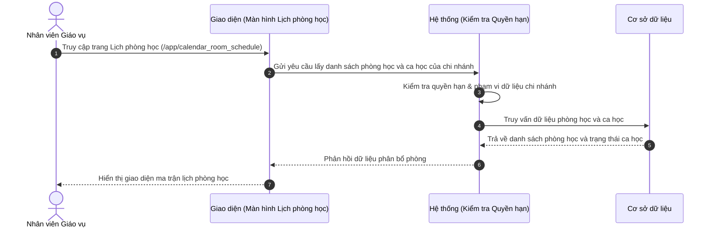

# US-OPS02-02: Quản lý và điều phối lịch phòng học theo chi nhánh

> **Tham chiếu:** BF-CLS-02 (Quản lý Lớp học) · SR-OPS-001 · Giao diện Mẫu §4.2 (Danh sách)
> **Đường dẫn màn hình & Trạng thái liên quan:**
> - `/app/calendar_room_schedule` -> Trạng thái phòng: `Đang có lớp`, `Phòng trống`, `Cảnh báo trùng phòng`

---

## 1. NHẬT KÝ THAY ĐỔI & BỐI CẢNH (CHANGELOG & CONTEXT)

### Lịch sử cập nhật tài liệu (Changelog)

| Ngày cập nhật | Nội dung cập nhật | Lý do cập nhật |
|---|---|---|
| 20/07/2026 | Khởi tạo tài liệu đặc tả nghiệp vụ quản lý lịch phòng học theo giao diện lịch biểu ma trận | Đáp ứng yêu cầu chuẩn hóa giao diện vận hành lịch phòng học của hệ thống Rinov5 |

### Bối cảnh & Vấn đề nghiệp vụ (Context & Problem)
* **Bối cảnh:** Tại các chi nhánh trung tâm đào tạo, tài nguyên phòng học vật lý là yếu tố giới hạn cần được phân bổ tối ưu theo các ca học trong ngày và tuần.
* **Vấn đề hiện tại:** Giáo vụ thường gặp khó khăn khi theo dõi phòng trống bằng bảng tính thủ công, dễ dẫn đến tình trạng hai lớp bị xếp trùng một phòng học hoặc xếp lớp lớn vào phòng nhỏ.
* **Mục tiêu & Giá trị mang lại:** Cung cấp màn hình ma trận lịch phòng học trực quan giúp giáo vụ phát hiện ngay ô thời gian trống, cảnh báo kịp thời xung đột trùng phòng và tối ưu công suất lấp đầy phòng học.

### Hiểu người dùng & Tình huống sử dụng (User Needs & Use Cases)
* **Người dùng chính (Persona):** Nhân viên Giáo vụ (PERSONA-OPS) và Quản lý Chi nhánh (PERSONA-BM).
* **Khó khăn lớn nhất (Pain-points):** Mất nhiều thời gian dò tìm phòng trống khi cần xếp lớp mới hoặc xếp lịch học bù.
* **Nhu cầu thực tế (Needs):** Muốn nhìn lướt ma trận phòng học trong 2 giây để biết ngay phòng nào rảnh ở ca học nào và thực hiện gán lớp trực tiếp.
* **Câu phát biểu nghiệp vụ:** **Là một** Nhân viên Giáo vụ, **tôi muốn** xem ma trận lịch phân bổ các phòng học theo khung giờ trong ngày và tuần, **để** điều phối phòng học chính xác, tránh trùng lịch và tối ưu công suất phòng học tại cơ sở.

### Phạm vi kiểm soát (Scope)
* **Phạm vi hiển thị:** Toàn bộ danh sách phòng học thuộc chi nhánh và các ca học đã được phân bổ.
* **Ràng buộc nghiệp vụ toàn cục (Global Rules):**
  - **[RULE-ROOM-01] Nguyên tắc chống trùng phòng:** Hệ thống không cho phép hai lớp học cùng được xếp vào một phòng học trong cùng một khung giờ ca học.
  - **[RULE-ROOM-02] Giới hạn phạm vi chi nhánh:** Màn hình chỉ hiển thị các phòng học thuộc chi nhánh mà người dùng được phân quyền quản lý.
  - **[GLOBAL-METRIC-01] Số lượng bản ghi mặc định:** Hiển thị mặc định 20 dòng phòng học trên một trang ma trận lịch biểu.

---

## 2. LUỒNG XỬ LÝ CHÍNH (MAIN FLOW - HAPPY PATH)

*Mô tả luồng đi của người dùng từ khi truy cập màn hình lịch phòng học, lọc ca học cho đến khi thực hiện tác nghiệp xếp phòng.*



---

## 3. GIAO DIỆN & TRẠNG THÁI TĨNH (DATA & UI STATE)

### 3.1. Thiết kế trực quan (Figma)
* **Link/Hình ảnh Figma:** Đang cập nhật

### 3.2. Cấu trúc các vùng giao diện
Màn hình ma trận lịch phòng học gồm: Thanh công cụ bộ lọc → Thẻ trạng thái nhanh → Bảng ma trận ca học theo phòng → Bộ phân trang ở dưới cùng.

#### A. Thanh công cụ & Bộ lọc nhanh
| Thành phần | Loại hiển thị | Giá trị mặc định | Logic xử lý / Điều kiện hiển thị | Mobile Responsive |
|------------|---------------|------------------|----------------------------------|-------------------|
| Lọc theo Chi nhánh | Ô chọn danh sách thả xuống | Chi nhánh hiện tại | Lọc danh sách phòng học thuộc chi nhánh được chọn | Thu gọn trên di động |
| Ô tìm kiếm phòng | Ô nhập chữ | Trống | Tìm theo tên phòng hoặc mã phòng | Đầy đủ |
| Bộ lọc loại phòng | Ô chọn danh sách thả xuống | Tất cả loại phòng | Lọc theo phòng lý thuyết hoặc phòng máy tính | Thu gọn thành nút phễu |
| Nút Đăng ký ca mới | Nút màu nhấn | - | Bấm để mở hộp thoại gán lớp vào phòng học | Chuyển thành nút dấu cộng (+) |

#### B. Khối lọc nhanh theo trạng thái (Status Tiles)
| Thẻ Trạng thái | Nhóm màu hiển thị | Điều kiện lọc | Diễn giải | Mobile Responsive |
|----------------|-------------------|----------------|-----------|-------------------|
| Tất cả phòng | Mặc định | Bỏ lọc trạng thái | Hiển thị tổng số phòng học tại cơ sở | Cuộn ngang hiển thị |
| Đang có lớp | Xanh lá | Trạng thái = "Đang có lớp" | Số lượng ô ca học đang có lớp diễn ra | Cuộn ngang hiển thị |
| Phòng trống | Xanh dương | Trạng thái = "Phòng trống" | Số lượng ô ca học đang rảnh khả dụng | Cuộn ngang hiển thị |
| Cảnh báo trùng | Đỏ | Trạng thái = "Cảnh báo trùng phòng" | Số lượng ô ca học bị phát hiện xung đột | Cuộn ngang hiển thị |

#### C. Bảng dữ liệu ma trận chính
| Cột thông tin | Kiểu hiển thị | Nguồn dữ liệu | Quy tắc thị giác & Trạng thái (Visual Mapping) | Mobile Responsive |
|---------------|---------------|----------------|------------------------------------------------|-------------------|
| **Tên phòng học** | Chữ đậm lớn | Thực thể phòng học | Đi kèm thông tin sức chứa tối đa ở dòng bên dưới | Giữ nguyên trên di động |
| **Sức chứa** | Văn bản thường | Trường sức chứa | Hiển thị số lượng chỗ ngồi tối đa của phòng | Ẩn trên di động |
| **Các ca học trong ngày** | Ô chứa thẻ thông tin | Dữ liệu buổi học | Ô trống hiển thị màu nhạt, ô có lớp hiển thị thẻ màu kèm tên lớp | Cuộn ngang hiển thị |
| **Hành động dòng** | Nút biểu tượng | Hệ thống | Nút xem chi tiết phòng học xuất hiện khi chọn dòng | Luôn hiện nút biểu tượng bên phải dòng |

### 3.3. Các trạng thái giao diện mặc định
1. **Trạng thái đang tải (Loading state):** Hiển thị hiệu ứng chờ tải dữ liệu giả lập tương ứng với cấu trúc bảng ma trận lịch.
2. **Trạng thái chưa có dữ liệu (Trống - Empty state):** Hiển thị hình ảnh minh họa mờ kèm thông điệp báo chưa có phòng học nào tại chi nhánh.
3. **Trạng thái lỗi tải dữ liệu (Error state):** Hiển thị cảnh báo lỗi kết nối và nút bấm để người dùng tải lại trang.

### 3.4. Ma trận phân quyền (Permission Matrix)

| Vai trò người dùng | Xem danh sách (View) | Lọc & Tìm kiếm | Xuất dữ liệu (Export) | Xem chi tiết (Detail) | Tạo mới / Sửa / Xóa |
|---|:---:|:---:|:---:|:---:|:---:|
| **Quản trị viên (Admin / Owner)** | ✅ | ✅ | ✅ | ✅ | ✅ |
| **Quản lý cơ sở (Branch Manager)** | ✅ | ✅ | ✅ | ✅ | ✅ |
| **Nhân viên Giáo vụ (Ops)** | ✅ | ✅ | ✅ | ✅ | ✅ |
| **Nhân viên CSKH (CSM)** | ✅ | ✅ | ❌ | ✅ | ❌ |
| **Giáo viên (Teacher)** | ✅ | ✅ | ❌ | ✅ | ❌ |

---

## 4. KHỐI CHỨC NĂNG CHI TIẾT: ACTION & LUỒNG KÍCH HOẠT (ACTIONS & EVENTS)

### Khối chức năng 1: Lọc và Tìm kiếm phòng học

#### Action 1.1: Nhập từ khóa tìm kiếm phòng
* **Luồng kích hoạt (Event/Flow):** Khi người dùng nhập tên phòng vào ô tìm kiếm và dừng gõ 300ms, hệ thống lọc danh sách phòng khớp với từ khóa.
* **Quy tắc kiểm soát & Kiểm tra dữ liệu (Validation & Rules):**
  - Hệ thống tự động cắt bỏ khoảng trắng thừa ở hai đầu từ khóa trước khi truy vấn.
* **Tiêu chí nghiệm thu (Acceptance Criteria):**
  - **AC-1 (Happy Path - Tìm thấy phòng):**
    - **Giả sử:** Danh sách lịch phòng học đang hiển thị phòng "Phòng 101".
    - **Khi:** Người dùng nhập "Phòng 101" vào ô tìm kiếm.
    - **Thì:** Bảng ma trận tự động lọc và chỉ hiển thị dòng thông tin của Phòng 101.
  - **AC-2 (Alternate Path - Không tìm thấy phòng):**
    - **Giả sử:** Danh sách lịch phòng học đang hiển thị.
    - **Khi:** Người dùng nhập từ khóa "Phòng 999" không tồn tại.
    - **Thì:** Bảng ma trận hiển thị thông báo trạng thái trống, không tìm thấy phòng học phù hợp.
  - **AC-3 (Alternate Path - Tìm theo loại phòng):**
    - **Giả sử:** Danh sách phòng gồm cả phòng lý thuyết và phòng máy tính.
    - **Khi:** Người dùng chọn bộ lọc loại phòng là "Phòng máy tính".
    - **Thì:** Bảng ma trận cập nhật chỉ hiển thị các phòng có trang bị máy tính.

#### Action 1.2: Chọn ô ca học trống để xếp lớp
* **Luồng kích hoạt (Event/Flow):** Người dùng nhấp vào một ô ca học đang ở trạng thái phòng trống trên bảng ma trận, hệ thống mở hộp thoại gán lớp học vào khung giờ đó.
* **Tiêu chí nghiệm thu (Acceptance Criteria):**
  - **AC-1 (Happy Path - Mở hộp thoại gán lớp):**
    - **Giả sử:** Ô ca học 18:00 tại Phòng 101 đang ở trạng thái phòng trống.
    - **Khi:** Người dùng nhấp vào ô ca học trống này.
    - **Thì:** Hệ thống bật hộp thoại gán lớp học với thông tin phòng và khung giờ đã được điền sẵn.

---

## 5. ĐẶC TẢ KẾT NỐI HỆ THỐNG (API SPECIFICATION)

*   **Endpoint:** `GET /api/v1/room-schedules`
*   **Tham số gửi đi (Request Query Parameters):**
    *   `branch_id` (string, optional): Mã chi nhánh.
    *   `search` (string, optional): Từ khóa tìm tên phòng.
    *   `room_type` (string, optional): Loại phòng học.
    *   `page` (number, optional, default: 1): Trang dữ liệu.
    *   `limit` (number, optional, default: 20): Số bản ghi trên trang.
*   **Cấu trúc dữ liệu phản hồi thành công (Response JSON - 200 OK):**
    ```json
    {
      "success": true,
      "data": [
        {
          "room_id": "ROOM-101",
          "room_name": "Phòng 101",
          "capacity": 20,
          "sessions": [
            {
              "time_slot": "18:00 - 19:30",
              "class_name": "IELTS Junior 1A",
              "status": "active"
            }
          ]
        }
      ],
      "pagination": {
        "total": 15,
        "page": 1,
        "limit": 20
      }
    }
    ```
*   **Mã lỗi thường gặp (Response Error Codes):**
    *   `400 Bad Request`: Tham số truy vấn không hợp lệ.
    *   `401 Unauthorized`: Chưa đăng nhập hoặc hết phiên làm việc.
    *   `403 Forbidden`: Không có quyền truy cập dữ liệu chi nhánh.
    *   `500 Internal Server Error`: Lỗi máy chủ xử lý dữ liệu.

---

## 6. CÁC TRƯỜNG HỢP GÓC CẠNH & LUỒNG NGOẠI LỆ (CORNER CASES & EXCEPTION FLOWS)

- **[CASE-01] Mất kết nối mạng khi đang tải ma trận phòng (Exception Flow - Network Loss):**
  - *Tình huống:* Người dùng mở trang lịch phòng học nhưng bị đứt kết nối internet.
  - *Cách xử lý:* Hiển thị màn hình báo lỗi kết nối kèm nút bấm thử lại để người dùng tải lại dữ liệu.
- **[CASE-02] Phát hiện xung đột trùng phòng (Exception Flow - Room Conflict):**
  - *Tình huống:* Hai lớp học bị xếp trùng vào cùng một phòng và khung giờ do thao tác đồng thời.
  - *Cách xử lý:* Ô ma trận tương ứng chuyển sang trạng thái cảnh báo trùng với sắc đỏ rực, hiển thị biểu tượng cảnh báo và tên cả hai lớp để giáo vụ điều chỉnh.
- **[CASE-03] Chi nhánh chưa có dữ liệu phòng học (Exception Flow - Empty Branch Rooms):**
  - *Tình huống:* Chi nhánh mới thành lập chưa được khởi tạo danh sách phòng học.
  - *Cách xử lý:* Hiển thị màn hình trạng thái trống với thông điệp hướng dẫn quản lý cơ sở khởi tạo danh sách phòng học trước.
- **[CASE-04] Thời gian phản hồi dữ liệu quá chậm (Exception Flow - Gateway Timeout):**
  - *Tình huống:* Máy chủ xử lý dữ liệu ma trận phòng kéo dài quá 10 giây.
  - *Cách xử lý:* Ngắt kết nối chờ, hiển thị thông báo hệ thống phản hồi chậm và gợi ý người dùng thử lại.
- **[CASE-05] Thay đổi chi nhánh khi đang xem dữ liệu (Exception Flow - Branch Switch):**
  - *Tình huống:* Người dùng đổi chi nhánh trên bộ lọc khi đang xem ma trận của chi nhánh cũ.
  - *Cách xử lý:* Tải lại toàn bộ ma trận phòng học tương ứng với chi nhánh mới được chọn.
