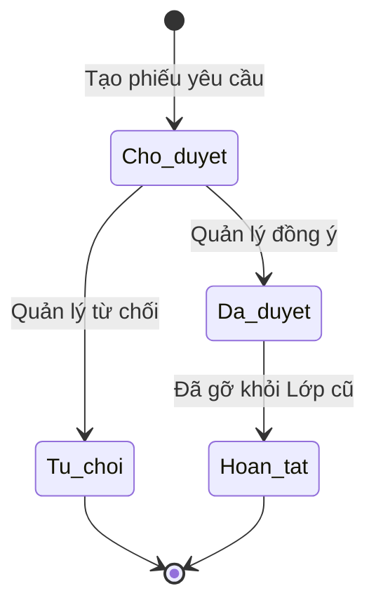

# BF-CLS-06: Nghỉ học, Bảo lưu & Chuyển lớp (Absence & Transfer)

> **Capability:** CAP-OPS (Năng lực Quản lý Học viên & Vận hành Lớp)
> **Giai đoạn:** 2 - Vận hành
> **Nhóm chức năng:** Vận hành lớp
> **Mã màn hình:** `leave_reserve`

---

## 1. Mô tả tổng quan

Phân hệ xử lý các gián đoạn trong quá trình học tập của Học viên. Nó hỗ trợ hai cấp độ gián đoạn: Báo nghỉ phép cho từng Buổi học cụ thể (Session-level) và xử lý Bảo lưu/Chuyển lớp dài hạn rút khỏi Lớp học (Class-level).

## 2. Đối tượng sử dụng (Vai trò)

- **Nhân viên Giáo vụ (Vận hành):** Trực tiếp thao tác chuyển lớp, bảo lưu trên hệ thống.
- **Quản lý Chi nhánh:** Phê duyệt các yêu cầu bảo lưu dài hạn hoặc chuyển lớp có thay đổi học phí.
- **Chuyên viên Chăm sóc (CSM):** Người tiếp nhận yêu cầu từ phụ huynh và tạo phiếu đề xuất (Ticket).

## 3. Ranh giới Nghiệp vụ (Scope)

### Có bao gồm (In Scope)
- **Nghỉ phép ngắn hạn (Session-level):** Nhận báo nghỉ cho 1 vài buổi cụ thể. Tự động ghi chú "Vắng có phép" vào Buổi học.
- **Bảo lưu (Suspend - Class-level):** Tạm dừng học tập dài hạn. Gỡ học viên khỏi danh sách (Roster) của lớp hiện tại.
- **Chuyển lớp (Transfer - Class-level):** Rút học viên khỏi lớp cũ và ghi danh (Enroll) ngay lập tức vào một lớp mới.

### Không bao gồm (Out of Scope)
- Tính toán và hoàn phí (Refund) bằng tiền mặt khi học viên rút hẳn → Thuộc `CAP-FIN`.
- Điểm danh trực tiếp tại lớp → Xử lý tại `BF-CLS-05`.

## 4. Mô hình Dữ liệu Nghiệp vụ (Data Entities)

| Tên Thực thể | Trường định danh | Thuộc tính quan trọng | Ràng buộc quan hệ | Diễn giải |
|--------------|------------------|-----------------------|-------------------|----------|
| Đơn xin nghỉ phép | Mã đơn | Ngày xin nghỉ, Lý do | Trỏ về Mã Học viên & Mã Buổi học | Ghi nhận nghỉ ngắn hạn. |
| Phiếu Chuyển/Bảo lưu | Mã phiếu | Loại (Chuyển lớp/Bảo lưu), Trạng thái duyệt | Trỏ về Mã Học viên, Lớp cũ, Lớp mới | Chứng từ vận hành. |

### 4.1. Vòng đời Trạng thái (Status Lifecycle)

*Sơ đồ dưới đây xác định trạng thái của một Phiếu Chuyển lớp/Bảo lưu.*

**Quy tắc chuyển đổi:**

| Từ trạng thái | Sang trạng thái | Điều kiện bắt buộc | Vai trò được phép |
|---------------|-----------------|---------------------|-------------------|
| Chờ duyệt | Đã duyệt | Phải ghi chú lý do duyệt | Quản lý Chi nhánh |
| Đã duyệt | Hoàn tất | Gọi API gỡ học viên khỏi Roster thành công | Hệ thống tự động |

### 4.2. Ví dụ Dữ liệu mẫu

*Giúp AI và Lập trình viên tạo dữ liệu kiểm thử chính xác.*

| Tình huống | Dữ liệu đầu vào | Kết quả mong đợi |
|------------|-----------------|-------------------|
| Xin nghỉ 1 buổi | Chọn Học sinh A, Ngày nghỉ 15/10, Lý do: Ốm | Buổi học ngày 15/10 của A tự động chuyển thành "Vắng có phép". |
| Chuyển lớp | Chọn Học sinh B, Lớp cũ: IELTS-01, Lớp mới: IELTS-02 | Gỡ B khỏi IELTS-01, thêm B vào IELTS-02. |
| Bảo lưu | Chọn Học sinh C, thời hạn 3 tháng | Trạng thái của C trong lớp chuyển thành "Bảo lưu", sĩ số trống 1 chỗ. |

## 5. Quy tắc Nghiệp vụ Tổng thể (Business Rules)

1. **[RULE-CLS-06-01] Thời hạn xin nghỉ:** Xin nghỉ phép 1 buổi phải được thực hiện TRƯỚC thời điểm bắt đầu Buổi học (Session) ít nhất 2 giờ. Nếu sát giờ mới báo, hệ thống ghi nhận là "Vắng không phép".
2. **[RULE-CLS-06-02] Thời hạn Bảo lưu:** Thời hạn bảo lưu tối đa cho 1 học viên là 6 tháng. Sau 6 tháng, nếu học viên không làm thủ tục xếp lớp lại, hệ thống sẽ tự động hủy thẻ và xóa số dư buổi học.

## 6. Danh sách Yêu cầu Người dùng (User Stories)

| Mã Yêu cầu | Tên Yêu cầu (Loại màn hình) | Đường dẫn truy cập | Trạng thái |
|------------|-----------------------------|--------------------|------------|
| US-CLS06-01 | Phụ huynh/CSM báo nghỉ phép 1 buổi (Biểu mẫu) | /app/leave_reserve | Đang soạn thảo |
| US-CLS06-02 | Tạo và phê duyệt Phiếu Bảo lưu (Danh sách & Form) | /app/leave_reserve | Đang soạn thảo |
| US-CLS06-03 | Tạo và phê duyệt Phiếu Chuyển lớp (Danh sách & Form) | /app/leave_reserve | Đang soạn thảo |
