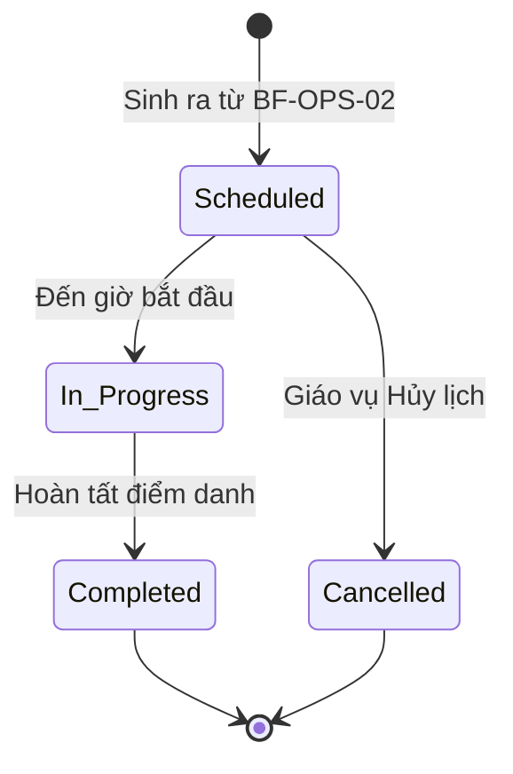

# BF-OPS-03: Vòng đời buổi học (Session Delivery Lifecycle)

> **Capability:** CAP-OPS (Năng lực Quản lý Học viên & Vận hành Lớp)
> **Giai đoạn:** 2 - Vận hành
> **Nhóm chức năng:** Lịch
> **Mã màn hình:** `calendar_event_schedule`, `session_management`

---

## 1. Mô tả tổng quan

Phân hệ này quản lý trạng thái và các biến động thực tế của từng Buổi học (Session) độc lập sau khi chúng đã được sinh ra từ `BF-OPS-02`. Nghiệp vụ bao gồm việc giải quyết các sự cố hàng ngày như: đổi lịch do thời tiết, xin dạy thay do giáo viên ốm, đổi phòng học do thiết bị hỏng, hủy buổi học, hoặc tạo các buổi học bù (Makeup Class). Mọi thao tác ở đây chỉ ảnh hưởng đến duy nhất 1 Buổi học đó, không làm thay đổi Khung lịch (Schedule) gốc của toàn bộ Lớp.

## 2. Đối tượng sử dụng (Vai trò)

- **Quản lý Chi nhánh / Giáo vụ:** Người có quyền ra quyết định hủy lịch, điều phối giáo viên dạy thay hoặc phòng học.
- **Giáo viên:** Nhận lịch dạy thay, xem lịch đã cập nhật.

## 3. Ranh giới Nghiệp vụ (Scope)

### Có bao gồm (In Scope)
- **Dạy thay (Substitute):** Thay đổi Giáo viên phụ trách cho 1 Session cụ thể (Hệ thống có kiểm tra chống trùng lịch).
- **Đổi phòng (Room Change):** Chuyển 1 Session sang phòng học khác do lỗi kỹ thuật hoặc thiếu chỗ.
- **Hủy & Lùi lịch (Cancel & Reschedule):** Hủy 1 Session và tự động đẩy tiến độ các bài học (Topic) phía sau lùi lại 1 buổi.
- **Học bù (Makeup Class):** Tạo 1 Session hoàn toàn mới, độc lập với Schedule gốc để học bù cho buổi đã hủy.
- Hiển thị tất cả các biến động này lên giao diện Lịch sự kiện tổng.

### Không bao gồm (Out of Scope)
- Thay đổi Khung lịch gốc (Ví dụ: Đổi toàn bộ lịch học từ T3-T5 sang T2-T4) → Xử lý tại `BF-OPS-02`.
- Điểm danh, chấm điểm cho Buổi học → Xử lý tại `BF-CLS-05`.

## 4. Mô hình Dữ liệu Nghiệp vụ (Data Entities)

| Tên Thực thể | Trường định danh | Thuộc tính quan trọng | Ràng buộc quan hệ | Diễn giải |
|--------------|------------------|-----------------------|-------------------|----------|
| Buổi học (Session) | Mã Buổi học | Ngày, Giờ, Trạng thái, Lý do thay đổi | Trỏ về Mã Lớp học | Kế thừa từ `BF-OPS-02`. |
| Lịch sử Biến động | Mã Record | Loại (Đổi GV, Đổi Phòng, Hủy), Dữ liệu cũ, Dữ liệu mới | Trỏ về Mã Buổi học | Lưu vết Audit Log. |

### 4.1. Vòng đời Trạng thái (Status Lifecycle)

*Sơ đồ dưới đây xác định vòng đời của một Buổi học (Session).*

**Quy tắc chuyển đổi:**

| Từ trạng thái | Sang trạng thái | Điều kiện bắt buộc | Vai trò được phép |
|---------------|-----------------|---------------------|-------------------|
| Scheduled | In Progress | Thời gian hiện tại khớp với Giờ bắt đầu | Hệ thống tự động |
| In Progress | Completed | Giáo viên đã submit kết quả Điểm danh ở `BF-CLS-05` | Hệ thống tự động |
| Đã lên lịch | Đã hủy | Phải nhập Lý do hủy (VD: Bão, Mất điện) | Quản lý / Giáo vụ |

### 4.2. Ví dụ Dữ liệu mẫu

*Giúp AI và Lập trình viên tạo dữ liệu kiểm thử chính xác.*

| Tình huống | Dữ liệu đầu vào | Kết quả mong đợi |
|------------|-----------------|-------------------|
| Xin dạy thay | Session A đang do GV Trần X dạy. Giáo vụ chọn đổi sang GV Nguyễn Y. | Session A cập nhật GV mới là Nguyễn Y. Báo cho Nguyễn Y. Lịch sử lưu vết sự thay đổi. |
| Đổi phòng báo trùng | Session B đang ở Phòng 101, đổi sang Phòng 102. Nhưng Phòng 102 đang kẹt lớp khác. | Báo lỗi: "Phòng 102 đang bận trong khung giờ này". Chặn thao tác. |
| Hủy lịch do Bão | Hủy Session ngày 15/10. | Session 15/10 chuyển thành Cancelled. Bài học (Topic) của ngày 15/10 tự động đẩy sang Session kế tiếp (17/10). |

## 5. Quy tắc Nghiệp vụ Tổng thể (Business Rules)

1. **[RULE-OPS-03-01] Bảo vệ tính nhất quán (Strict Conflict Check):** Mọi thao tác Dạy thay (Substitute Teacher) hoặc Đổi phòng (Room Change) trên 1 Session cục bộ ĐỀU BẮT BUỘC phải gọi lại bộ Thuật toán kiểm tra xung đột (Conflict Check API) từ `BF-OPS-02`. Hệ thống chặn tuyệt đối nếu GV thay thế đã kẹt lịch.
2. **[RULE-OPS-03-02] Dồn bài học (Shift Forward):** Khi một Buổi học bị Hủy (Cancelled), nội dung bài học (Syllabus Topic) được gán cho buổi đó không biến mất, mà hệ thống sẽ tự động đẩy Topic đó xuống Buổi học tương lai gần nhất (Session n+1), và tạo hiệu ứng dây chuyền đẩy toàn bộ Syllabus lùi lại 1 bước, làm tăng tổng thời gian kết thúc khóa học.

## 6. Danh sách Yêu cầu Người dùng (User Stories)

| Mã Yêu cầu | Tên Yêu cầu (Loại màn hình) | Đường dẫn truy cập | Trạng thái |
|------------|-----------------------------|--------------------|------------|
| US-OPS-03-01 | Điều phối Dạy thay và Đổi phòng (Popup) | Click vào Event trên Lịch | Đang soạn thảo |
| US-OPS-03-02 | Hủy Buổi học và Dịch lịch (Xử lý ngầm) | Click vào Event trên Lịch | Đang soạn thảo |
| US-OPS-03-03 | Tạo Buổi học Bù (Biểu mẫu) | /app/calendar_event_schedule | Đang soạn thảo |
