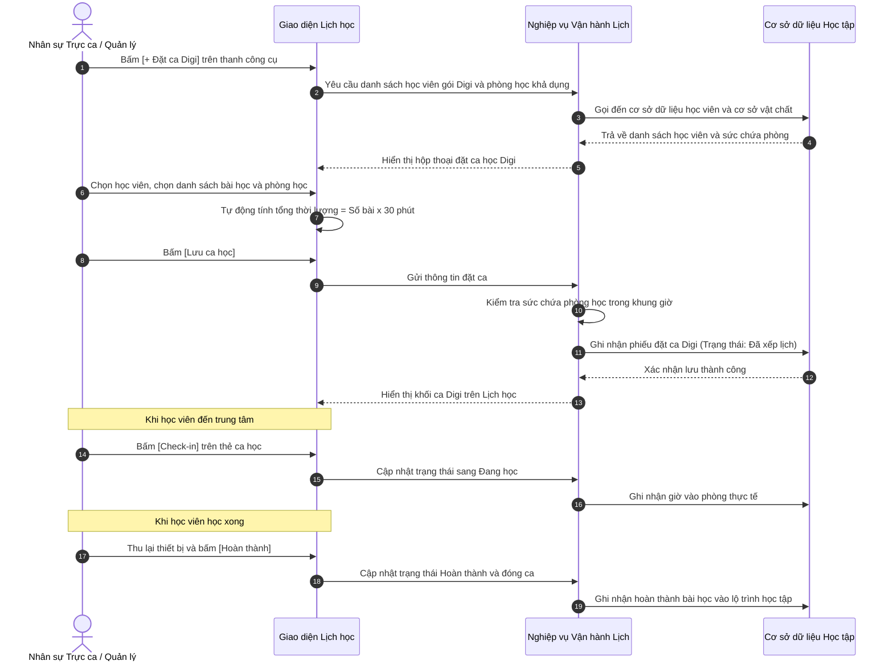

# US-OPS02-05: Quản lý Lịch học Digi và Tiếp đón Tự học tại Trạm

> **Tham chiếu:** `BF-OPS-02` · `CAP-OPS` · `CAP-FCM`  
> **Đường dẫn màn hình & Trạng thái liên quan:**  
> - `/app/calendar_class_schedule` -> Trạng thái: `da_xep_lich`, `dang_hoc`, `completed`, `da_vang`, `cancelled`  

---

## 1. NHẬT KÝ THAY ĐỔI & BỐI CẢNH (CHANGELOG & CONTEXT)

### Lịch sử cập nhật tài liệu (Changelog)

| Ngày cập nhật | Nội dung cập nhật | Lý do cập nhật |
|---|---|---|
| 19/08/2026 | Nâng cấp giao diện Đặt ca tự học Digi sang bố cục 2 cột, giới hạn khung giờ từ 18:00 đến 21:00 | Chuẩn hóa trải nghiệm đồng bộ với biểu mẫu Đặt lịch Đánh giá năng lực và khung giờ tự học thực tế |
| 19/08/2026 | Khởi tạo tài liệu đặc tả quản lý ca tự học Digi tại trạm | Bổ sung hình thức tự học số linh hoạt trên thiết bị trung tâm |

### Bối cảnh & Vấn đề nghiệp vụ (Context & Problem)
* **Bối cảnh:** Học viên đăng ký gói học số (Digi) có nhu cầu linh hoạt học tại nhà hoặc lên trung tâm để sử dụng không gian yên tĩnh và thiết bị máy tính của cơ sở.
* **Vấn đề hiện tại:** Trước đây lịch học chỉ quản lý theo lớp cố định có giáo viên giảng dạy, chưa hỗ trợ ca tự học cá nhân ghép nhiều học viên trong cùng một phòng theo sức chứa.
* **Mục tiêu & Giá trị mang lại:** Cho phép học viên đặt ca tự học theo số lượng bài học linh hoạt (công thức 25 phút học + 5 phút nghỉ), tự động kiểm soát sức chứa phòng học và hỗ trợ nhân sự trực trạm tiếp đón, bàn giao thiết bị qua thao tác một chạm nhanh chóng.

### Hiểu người dùng & Tình huống sử dụng (User Needs & Use Cases)
* **Người dùng chính (Persona):** `PERSONA-BRANCH_MANAGER`, Nhân viên trực trạm, Nhân viên lễ tân.
* **Nhu cầu thực tế (Needs):** Nhân viên cần xem được bao quát các phòng học đang có bao nhiêu học viên tự học Digi, tiếp đón học viên vào phòng và thu hồi thiết bị khi học xong một cách dễ dàng.
* **Câu phát biểu nghiệp vụ:** **Là một** nhân viên quản lý cơ sở, **tôi muốn** theo dõi và điều phối các ca tự học Digi trực tiếp trên Lịch học của trung tâm, **để** tối ưu công suất phòng học và phục vụ học viên chu đáo.

---

## 2. LUỒNG XỬ LÝ CHÍNH (MAIN FLOW - HAPPY PATH)



---

## 3. QUY TẮC NGHIỆP VỤ & TÍNH TOÁN THỜI LƯỢNG

### 3.1. Công thức thời lượng theo bài học
1. **Đơn vị bài học:** Mỗi bài học Digi chuẩn hóa có thời lượng **30 phút** (gồm **25 phút học bài** trên phần mềm và **5 phút nghỉ giải lao/chuyển tiếp**).
2. **Thời lượng ca học:** Bằng **Số lượng bài học đã chọn nhân với 30 phút**.
   - 1 bài = 30 phút.
   - 2 bài = 60 phút (1 tiếng).
   - 3 bài = 90 phút (1.5 tiếng).
   - 4 bài = 120 phút (2 tiếng).
3. **Giờ kết thúc:** Tự động tính toán bằng Giờ bắt đầu cộng với Tổng thời lượng.

### 3.2. Quy tắc Sức chứa Phòng học (Room Capacity)
1. **Ghép nhiều học viên:** Một phòng học có thể tiếp nhận nhiều học viên tự học Digi cùng lúc.
2. **Kiểm tra chỗ trống:** Tại mọi thời điểm trong khung giờ ca học, tổng số học viên trong phòng không được vượt quá Sức chứa tối đa của phòng đó.

---

## 4. GIAO DIỆN & CẤU TRÚC BIỂU MẪU (DATA & UI STATE)

### 4.1. Cấu trúc các trường nhập liệu Đặt ca Digi

| Tên trường thông tin | Kiểu hiển thị | Bắt buộc | Nguồn dữ liệu | Định dạng & Giới hạn | Diễn giải quy tắc kiểm duyệt dữ liệu |
|---|---|:---:|---|---|---|
| **Học viên gói Digi** | Ô chọn tìm kiếm | **Có (*)** | Cơ sở dữ liệu học viên | Danh sách học viên có gói Digi | Chỉ hiển thị các học viên đang có gói Digi hợp lệ |
| **Danh sách bài học** | Danh sách ô chọn nhiều | **Có (*)** | Lộ trình học viên | Chọn 1 đến 4 bài học | Tự động tính lại tổng thời lượng ca học |
| **Ngày học** | Ô chọn ngày | **Có (*)** | Người dùng chọn | Ngày hợp lệ | Mặc định là ngày đang xem trên lịch |
| **Giờ bắt đầu** | Lưới chọn ca 30 phút | **Có (*)** | Danh mục khung giờ | `HH:mm` (18:00 - 21:00) | Khung giờ tự học buổi tối khả dụng tại cơ sở |
| **Giờ kết thúc** | Ô văn bản chỉ đọc | **Có (*)** | Hệ thống tự tính | `HH:mm` | Tự động tính từ Giờ bắt đầu + Tổng thời lượng |
| **Phòng học** | Ô chọn thả xuống | **Có (*)** | Danh mục phòng cơ sở | Tên phòng kèm số chỗ trống | Chỉ cho chọn phòng còn đủ chỗ trong khung giờ |
| **Thiết bị mượn** | Ô chọn thả xuống | Không | Danh mục thiết bị | Tên thiết bị hoặc tự mang | Tùy chọn, cho phép để trống nếu học viên tự mang máy |

### 4.2. Nút hành động trên Giao diện
| Tên nút | Kiểu hiển thị | Logic xử lý nghiệp vụ | Mã Quyền Yêu Cầu (Required Capability) |
|---|---|---|---|
| **Hủy bỏ** | Nút viền nhạt | Đóng biểu mẫu, không lưu dữ liệu | `ops.schedule.view` |
| **Lưu ca học** | Nút màu nhấn | Kiểm tra sức chứa phòng $\rightarrow$ Ghi nhận đặt ca $\rightarrow$ Hiển thị lên Lịch học | `ops.schedule.create` |
| **Check-in vào phòng** | Nút thao tác một chạm | Ghi nhận học viên đã vào phòng, chuyển trạng thái sang Đang học | `ops.schedule.checkin` |
| **Hoàn thành thu máy** | Nút thao tác một chạm | Xác nhận thu thiết bị, chuyển trạng thái sang Hoàn thành và đóng ca | `ops.schedule.complete` |

---

## 5. TIÊU CHÍ NGHIỆM THU (ACCEPTANCE CRITERIA - BDD GHERKIN)

```gherkin
Scenario: Đặt ca học Digi thành công và tự tính thời lượng (Happy Path)
  Given Người dùng mở biểu mẫu Đặt ca Digi
  When Người dùng chọn học viên và tích chọn 2 bài học
  Then Hệ thống tự động tính tổng thời lượng là 60 phút
    And tự động cập nhật Giờ kết thúc bằng Giờ bắt đầu cộng 60 phút
    And cho phép chọn phòng học còn chỗ trống để lưu ca thành công.

Scenario: Kiểm soát sức chứa phòng học không cho đặt quá số lượng
  Given Phòng học 101 có sức chứa tối đa là 8 chỗ và đang có 8 học viên trong khung giờ 18:00 - 19:00
  When Người dùng cố gắng đặt thêm 1 học viên vào phòng 101 trong khung giờ đó
  Then Hệ thống cảnh báo phòng đã kín chỗ
    And yêu cầu chọn phòng học khác hoặc khung giờ khác.

Scenario: Tiếp đón Check-in một chạm khi học viên đến
  Given Ca học Digi đang ở trạng thái Đã xếp lịch
  When Học viên đến trung tâm và nhân sự bấm nút [Check-in]
  Then Hệ thống chuyển trạng thái ca học sang Đang học
    And ghi nhận thời gian vào phòng của học viên.

Scenario: Hoàn thành buổi học và thu hồi thiết bị
  Given Ca học Digi đang ở trạng thái Đang học
  When Học viên hoàn thành buổi học và nhân sự bấm nút [Hoàn thành]
  Then Hệ thống chuyển trạng thái ca học sang Hoàn thành
    And ghi nhận hoàn tất các bài học vào lộ trình học tập của học viên.
```
