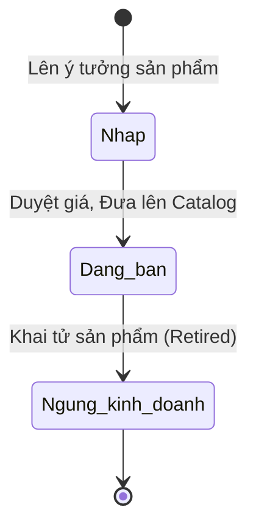

# BF-PRD-01: Quản lý Sản phẩm (Product Catalog Management)

> **Capability:** CAP-COM (Năng lực Thương mại & Bán hàng)
> **Giai đoạn:** 3 - Hồ sơ & Sản phẩm
> **Nhóm chức năng:** Sản phẩm
> **Mã màn hình:** `products`, `product_groups`, `combos`, `product_settings`

---

## 1. Mô tả tổng quan

Business function quản lý danh mục sản phẩm và chiến lược ưu đãi. Quản lý toàn bộ vòng đời của các "Hàng hóa" có thể bán được để thu tiền, bao gồm việc thiết lập cấu trúc sản phẩm đơn lẻ (Khóa học, Sách, Đồng phục), nhóm sản phẩm, các gói combo ưu đãi và các quy tắc định giá. 

Mục tiêu là tạo ra một Catalog đồng nhất, tách biệt với "Khung chương trình học thuật" (`BF-ACD-01`), sẵn sàng phục vụ cho quy trình Lập Đơn hàng (`BF-SAL-01`).

## 2. Đối tượng sử dụng (Vai trò)

- **Quản lý Sản phẩm (Product Admin):** Định nghĩa cấu trúc sản phẩm mới, đóng gói combo, ra mắt sản phẩm.
- **Giám đốc Kinh doanh (Sales Admin):** Thiết lập các mức giá (Pricing), cấu hình giảm giá cho Combo.
- **Nhân viên Tư vấn (Sales):** Sử dụng danh mục sản phẩm (View-only) để báo giá và lên đơn hàng.

## 3. Ranh giới Nghiệp vụ (Scope)

### Có bao gồm (In Scope)
- Định nghĩa Sản phẩm đơn lẻ (Tên, Mã SKU, Loại sản phẩm, Đơn giá chuẩn).
- Quản lý Nhóm sản phẩm (Product Groups) để phục vụ cho các quy tắc giảm giá chung.
- Cấu hình Gói ưu đãi (Combos): Ghép nhiều Sản phẩm vào 1 mã duy nhất với mức giá chiết khấu.
- Thiết lập trạng thái vòng đời sản phẩm: Bản nháp, Đang bán, Ngừng kinh doanh.

### Không bao gồm (Out of Scope)
- Tạo Đơn hàng (Order) và xuất Hóa đơn thanh toán → Thuộc `BF-SAL-01`.
- Quản lý Khung chương trình học thuật, số buổi học, bài giảng → Thuộc `BF-ACD-01` (Sản phẩm chỉ là lớp vỏ tài chính bọc bên ngoài Khung chương trình học thuật).
- Quản lý Kho vật lý (Nhập/Xuất sách, balo) → Thuộc hệ thống Inventory riêng biệt.

## 4. Mô hình Dữ liệu Nghiệp vụ (Data Entities)

| Tên Thực thể | Trường định danh | Thuộc tính quan trọng | Ràng buộc quan hệ | Diễn giải |
|--------------|------------------|-----------------------|-------------------|----------|
| Sản phẩm (Product) | Mã Sản phẩm (SKU) | Tên, Loại (Dịch vụ/Hàng hóa), Đơn giá, Trạng thái | Độc lập | Đơn vị bán lẻ nhỏ nhất. |
| Gói ưu đãi (Combo) | Mã Combo | Tên, Tổng giá sau chiết khấu, Trạng thái | Độc lập | Bao gồm nhiều Sản phẩm. |
| Chi tiết Combo | ID liên kết | Số lượng, Tỷ lệ giảm giá riêng | Trỏ về Mã Combo & Mã Sản phẩm | Thành phần của Combo. |

### 4.1. Vòng đời Trạng thái (Status Lifecycle)

*Sơ đồ dưới đây xác định vòng đời của một Sản phẩm/Combo.*

**Quy tắc chuyển đổi:**

| Từ trạng thái | Sang trạng thái | Điều kiện bắt buộc | Vai trò được phép |
|---------------|-----------------|---------------------|-------------------|
| Bất kỳ | Ngừng kinh doanh | Không được xóa cứng. Phải giữ lại để tra cứu lịch sử Đơn hàng | Product Admin |

### 4.2. Ví dụ Dữ liệu mẫu

*Giúp AI và Lập trình viên tạo dữ liệu kiểm thử chính xác.*

| Tình huống | Dữ liệu đầu vào | Kết quả mong đợi |
|------------|-----------------|-------------------|
| Tạo Sản phẩm | SKU: CRS-01, Tên: "IELTS 6.0", Giá: 10,000,000 VND, Loại: Dịch vụ | Lưu thành công. Trạng thái Đang bán. |
| Tạo Combo | Combo "Back to School": Gồm "IELTS 6.0" (giảm 10%) + "Sách giáo khoa" (miễn phí) | Tính toán Tổng giá = 9,000,000 VND. Sinh SKU Combo mới. |
| Xóa sản phẩm cũ | Admin bấm Xóa sản phẩm "IELTS 5.0" (Đã bán từ năm ngoái) | Hệ thống chặn thao tác Xóa, chỉ cho phép chuyển sang "Ngừng kinh doanh". |

## 5. Quy tắc Nghiệp vụ Tổng thể (Business Rules)

1. **[RULE-PRD-01-01] Tách bạch Học thuật và Thương mại (Decoupled Offering):** Hệ thống không được bán trực tiếp "Lớp học" hay "Khung chương trình". Hệ thống chỉ được phép bán "Sản phẩm" (Product). Sau khi Đơn hàng thanh toán thành công, hệ thống mới dùng Mã Sản phẩm đó để quy đổi (Mapping) ra số buổi học hay khóa học tương ứng ở phân hệ Academic.
2. **[RULE-PRD-01-02] Không hồi tố giá (Non-Retroactive Pricing):** Việc thay đổi Đơn giá của một Sản phẩm đang lưu hành (Active) không được phép làm thay đổi Giá trị của các Đơn hàng (Orders) ĐÃ ĐƯỢC TẠO trong quá khứ. Mức giá mới chỉ có tác dụng đối với Đơn hàng tạo từ thời điểm cập nhật trở đi.

## 6. Danh sách Yêu cầu Người dùng (User Stories)

| Mã Yêu cầu | Tên Yêu cầu (Loại màn hình) | Đường dẫn truy cập | Trạng thái |
|------------|-----------------------------|--------------------|------------|
| US-PRD-01 | Quản lý danh mục Sản phẩm đơn lẻ (Danh sách & Biểu mẫu) | /app/products | Đang soạn thảo |
| US-PRD-02 | Quản lý Nhóm sản phẩm (Danh sách) | /app/product_groups | Đang soạn thảo |
| US-PRD-03 | Cấu hình và quản lý Combo ưu đãi (Biểu mẫu cấu trúc cây) | /app/combos | Đang soạn thảo |
