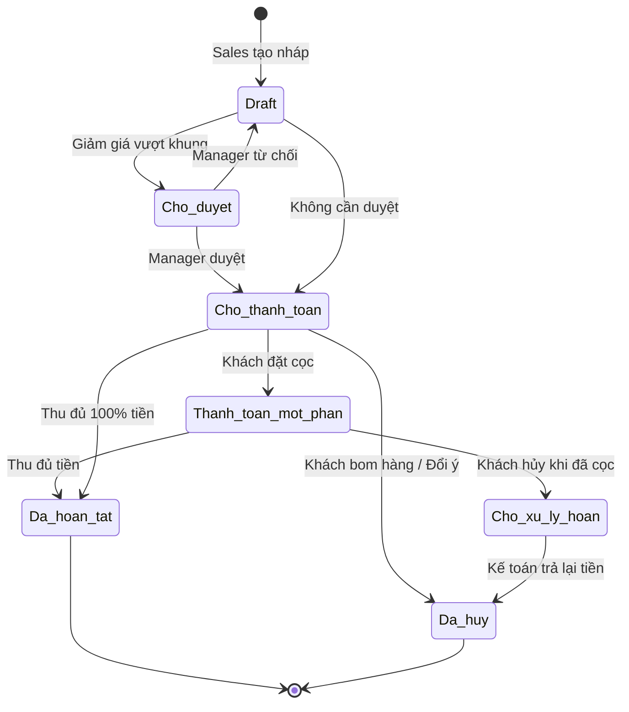

# BF-SAL-01: Quản lý Đơn hàng (Sales Order)

> **Capability:** CAP-COM (Năng lực Thương mại & Bán hàng)
> **Giai đoạn:** 4 - Tuyển sinh & Bán hàng
> **Nhóm chức năng:** Bán hàng
> **Mã màn hình:** `orders`

---

## 1. Mô tả tổng quan

Business function lõi để quản lý giao dịch kinh doanh. Quá trình bắt đầu từ khâu chọn Sản phẩm (`BF-PRD-01`), áp dụng chiết khấu/mã giảm giá, tạo Báo giá/Đơn hàng (Sales Order) cho học viên. Phân hệ này chịu trách nhiệm tính toán chính xác tổng số tiền khách hàng phải thanh toán dựa trên các cấu trúc thương mại phức tạp, đảm bảo doanh thu được ghi nhận đúng chính sách.

## 2. Đối tượng sử dụng (Vai trò)

- **Nhân viên Tư vấn (Sales):** Lên đơn hàng, áp dụng các mã giảm giá cho học viên.
- **Quản lý Sales (Sales Manager):** Duyệt các đơn hàng có mức giảm giá vượt khung quy định.
- **Thu ngân (Cashier) / Kế toán:** Xem thông tin Đơn hàng để tiến hành thu tiền (`BF-SAL-02`).

## 3. Ranh giới Nghiệp vụ (Scope)

### Có bao gồm (In Scope)
- Tạo Đơn hàng (Sales Order) mới từ giỏ hàng (Cart) gồm các Sản phẩm và Combo.
- Cơ chế tính toán giá: Tính tổng tiền, trừ chiết khấu, cộng thuế VAT (nếu có).
- Áp dụng các Mã giảm giá (Voucher / Promo Code) và kiểm tra tính hợp lệ.
- Luồng phê duyệt đơn hàng (Approval Workflow) nếu Sales giảm giá vượt mức cho phép.
- Quản lý trạng thái Đơn hàng: Nháp, Chờ thanh toán, Đã thanh toán, Đã hủy.

### Không bao gồm (Out of Scope)
- Tạo Mã giảm giá (Promo Code) hoặc thiết lập Chính sách giá → Thuộc `BF-PRD-01`.
- Ghi nhận dòng tiền thực tế (Cash/Chuyển khoản) và In Biên lai → Thuộc `BF-SAL-02`.
- Hoàn tiền (Refund) → Thuộc hệ thống Tài chính `CAP-FIN`.

## 4. Mô hình Dữ liệu Nghiệp vụ (Data Entities)

| Tên Thực thể | Trường định danh | Thuộc tính quan trọng | Ràng buộc quan hệ | Diễn giải |
|--------------|------------------|-----------------------|-------------------|----------|
| Đơn hàng (Order) | Mã Đơn hàng | Ngày tạo, Tổng tiền, Số tiền đã thu, Trạng thái | Trỏ về Mã Học viên (Person) | Thông tin chung của giao dịch. |
| Chi tiết Đơn (Order Item) | Mã Line Item | Số lượng, Đơn giá lúc bán, Thành tiền | Trỏ về Mã Đơn hàng & Mã Sản phẩm | Chốt cứng giá tại thời điểm bán. |

### 4.1. Vòng đời Trạng thái (Status Lifecycle)

*Sơ đồ dưới đây xác định vòng đời của một Đơn hàng (Order).*

**Quy tắc chuyển đổi:**

| Từ trạng thái | Sang trạng thái | Điều kiện bắt buộc | Vai trò được phép |
|---------------|-----------------|---------------------|-------------------|
| Chờ thanh toán | Đã hoàn tất | `Số tiền đã thu` >= `Tổng tiền đơn hàng` | Hệ thống tự động khi nhận đủ Phiếu thu |
| Chờ duyệt | Chờ thanh toán | Quản lý Sales bấm nút Duyệt (Approve) | Sales Manager |

### 4.2. Ví dụ Dữ liệu mẫu

*Giúp AI và Lập trình viên tạo dữ liệu kiểm thử chính xác.*

| Tình huống | Dữ liệu đầu vào | Kết quả mong đợi |
|------------|-----------------|-------------------|
| Lên đơn thường | Chọn Combo "IELTS Standard" giá 10tr. Khách là "Nguyễn Văn A". | Lưu Đơn hàng trạng thái Chờ thanh toán. Tổng tiền = 10tr. |
| Vượt khung | Sales giảm giá 20% cho Đơn hàng 10tr (Luật chỉ cho giảm max 10%). | Đơn hàng rơi vào trạng thái "Chờ duyệt", báo Noti cho Manager. |
| Thu tiền cọc | Thu ngân nhập 1 Phiếu thu (`BF-SAL-02`) 2tr vào Đơn hàng 10tr trên. | Đơn tự đổi sang "Thanh toán một phần". Còn nợ 8tr. |

## 5. Quy tắc Nghiệp vụ Tổng thể (Business Rules)

1. **[RULE-SAL-01-01] Đóng băng Dữ liệu (Immutability):** Khi một Đơn hàng đã ở trạng thái `Cho_thanh_toan`, các thông tin về Sản phẩm, Giá bán, Chiết khấu bên trong Đơn hàng đó TUYỆT ĐỐI không được phép sửa đổi (Chỉ-đọc). Nếu có sai sót, Sales bắt buộc phải thực hiện thao tác Hủy đơn (Cancel) và làm lại đơn mới.
2. **[RULE-SAL-01-02] Không hồi tố Sản phẩm (Snapshot Pricing):** `Order Item` phải lưu bản sao cứng (Snapshot) của Đơn giá tại thời điểm chốt đơn. Việc sửa đổi giá Sản phẩm trong Danh mục `BF-PRD-01` sau đó không được phép làm thay đổi tổng tiền của Đơn hàng cũ này.
3. **[RULE-SAL-01-03] Kiểm soát chiết khấu (Discount Limit):** Hệ thống phải có bảng phân quyền hạn mức chiết khấu. (VD: Cấp Sales max 5%, Branch Manager max 15%, Vượt mức phải xin duyệt).

## 6. Danh sách Yêu cầu Người dùng (User Stories)

| Mã Yêu cầu | Tên Yêu cầu (Loại màn hình) | Đường dẫn truy cập | Trạng thái |
|------------|-----------------------------|--------------------|------------|
| US-SAL-01-01 | Quản lý danh sách Đơn hàng (Dashboard & List) | /app/orders | Đang soạn thảo |
| US-SAL-01-02 | Tạo Đơn hàng mới và Giỏ hàng (Form Builder) | /app/orders/create | Đang soạn thảo |
| US-SAL-01-03 | Phê duyệt Đơn hàng giảm giá vượt khung | /app/orders | Đang soạn thảo |
| US-SAL-01-04 | Xem chi tiết Đơn hàng & Tiến độ thanh toán | /app/orders/[id] | Đang soạn thảo |
