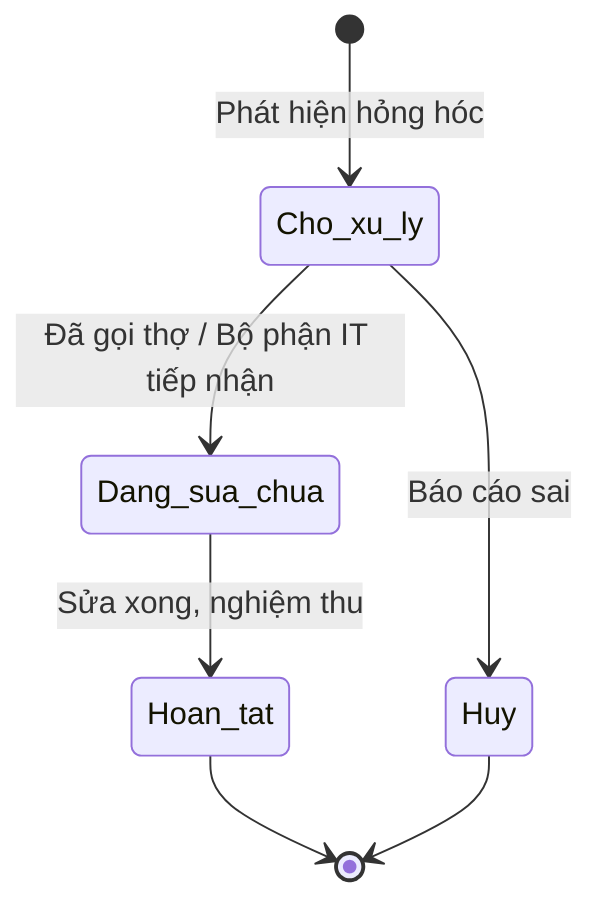

# BF-QA-02: Kiểm tra Cơ sở Vật chất (Facility Checklist)

> **Capability:** CAP-FCM (Quản trị Vận hành & Cơ sở vật chất)
> **Giai đoạn:** 4 - Vận hành hàng ngày
> **Nhóm chức năng:** Chất lượng
> **Mã màn hình:** `facility_checklist`

---

## 1. Mô tả tổng quan

Phân hệ số hóa quy trình kiểm tra, bảo trì và đảm bảo an toàn cơ sở vật chất tại chi nhánh (Branch). Cung cấp các biểu mẫu kiểm tra (Checklist) động cho nhân viên Lễ tân, Tạp vụ, hoặc Bảo vệ thực hiện định kỳ (Hàng ngày, Hàng tuần). Các hạng mục kiểm tra bao gồm: Vệ sinh lớp học, Tình trạng thiết bị PCCC, Tình trạng máy chiếu/điều hòa, và Báo cáo sự cố (Incident Reporting).

## 2. Đối tượng sử dụng (Vai trò)

- **Nhân viên Vận hành / Lễ tân:** Thực hiện đánh tick vào checklist hàng ngày trước khi mở cửa và sau khi đóng cửa.
- **Giám đốc Chi nhánh (Branch Manager):** Nhận báo cáo tổng hợp, phê duyệt yêu cầu sửa chữa cơ sở vật chất.
- **Phòng Hành chính (Admin Dept):** Định nghĩa cấu trúc các bộ Checklist chuẩn cho toàn hệ thống.

## 3. Ranh giới Nghiệp vụ (Scope)

### Có bao gồm (In Scope)
- Tạo và định nghĩa các Bộ tiêu chí kiểm tra (Checklist Templates) đa dạng (Mở cửa, Đóng cửa, Vệ sinh tuần).
- Giao việc (Assign) checklist cho một nhân sự cụ thể vào một ngày cụ thể.
- Thực hiện đánh giá (Submit Checklist) kèm theo hình ảnh bằng chứng (Proof picture).
- Tạo Phiếu báo lỗi sự cố (Incident Ticket) nếu phát hiện trang thiết bị hỏng hóc trong lúc kiểm tra.

### Không bao gồm (Out of Scope)
- Quy trình mua sắm, đấu thầu tài sản mới → Thuộc phân hệ Kế toán Mua sắm (Procurement).
- Tính khấu hao tài sản cố định → Thuộc `CAP-FIN`.
- Quản lý danh sách Phòng học, diện tích, sức chứa → Thuộc `BF-ORG-01`.

## 4. Mô hình Dữ liệu Nghiệp vụ (Data Entities)

| Tên Thực thể | Trường định danh | Thuộc tính quan trọng | Ràng buộc quan hệ | Diễn giải |
|--------------|------------------|-----------------------|-------------------|----------|
| Mẫu Checklist (Template) | Mã Mẫu | Tên mẫu, Tần suất, Danh sách câu hỏi (JSON) | Độc lập | Khuôn mẫu định nghĩa sẵn. |
| Biên bản Kiểm tra (Record) | Mã Biên bản | Ngày thực hiện, Tỷ lệ hoàn thành (%), Hình ảnh | Trỏ về Mã Mẫu & Mã Chi nhánh | Kết quả thực tế. |
| Sự cố (Incident) | Mã Sự cố | Mô tả hỏng hóc, Mức độ nghiêm trọng, Trạng thái | Trỏ về Mã Biên bản & Mã Phòng học | Dữ liệu phát sinh khi có lỗi. |

### 4.1. Vòng đời Trạng thái (Status Lifecycle)

*Sơ đồ dưới đây xác định vòng đời của một Phiếu báo Sự cố (Incident Ticket).*

**Quy tắc chuyển đổi:**

| Từ trạng thái | Sang trạng thái | Điều kiện bắt buộc | Vai trò được phép |
|---------------|-----------------|---------------------|-------------------|
| Chờ xử lý | Đang sửa chữa | Phải chỉ định người/đối tác phụ trách sửa chữa | Quản lý Chi nhánh |
| Đang sửa chữa | Hoàn tất | Bắt buộc có hình ảnh nghiệm thu sau sửa chữa | Quản lý Chi nhánh |

### 4.2. Ví dụ Dữ liệu mẫu

*Giúp AI và Lập trình viên tạo dữ liệu kiểm thử chính xác.*

| Tình huống | Dữ liệu đầu vào | Kết quả mong đợi |
|------------|-----------------|-------------------|
| Làm checklist | Lễ tân mở "Checklist Đóng cửa" lúc 21h. Tick chọn "Đã tắt máy chiếu", "Đã khóa cửa". | Lưu Biên bản với tỷ lệ hoàn thành 100%. |
| Báo sự cố | Khi kiểm tra, thấy Điều hòa phòng 101 chảy nước. Lễ tân tick "Lỗi" và chụp ảnh đính kèm. | Hệ thống tự động sinh 1 Incident Ticket "Điều hòa chảy nước" gửi cho BM. |

## 5. Quy tắc Nghiệp vụ Tổng thể (Business Rules)

1. **[RULE-QA-02-01] Ràng buộc Bằng chứng (Proof of Work):** Đối với các mục kiểm tra mang tính quan trọng cao (Ví dụ: Chốt khóa cửa từ, Tủ điện chính), hệ thống BẮT BUỘC người thực hiện phải tải lên hình ảnh chụp thực tế (Photo Proof) tại thời điểm đó, không cho phép chỉ đánh tick (Checkbox).
2. **[RULE-QA-02-02] Độc lập Cơ sở (Branch Isolation):** Các báo cáo sự cố (Incident) và kết quả Checklist chỉ được nhìn thấy bởi Quản lý của Chi nhánh đó và Ban Giám đốc cấp cao. Nhân viên chi nhánh này không được xem tình trạng cơ sở vật chất của chi nhánh khác.

## 6. Danh sách Yêu cầu Người dùng (User Stories)

| Mã Yêu cầu | Tên Yêu cầu (Loại màn hình) | Đường dẫn truy cập | Trạng thái |
|------------|-----------------------------|--------------------|------------|
| US-QA-02-01 | Thực hiện Checklist cơ sở vật chất (Giao diện Mobile/Tablet) | /app/facility_checklist | Đang soạn thảo |
| US-QA-02-02 | Quản lý Phiếu báo sự cố hỏng hóc (Danh sách & Bảng phụ) | /app/facility_checklist | Đang soạn thảo |
| US-QA-02-03 | Quản lý Cấu trúc Mẫu Checklist (Form Builder) | Chức năng Cấu hình | Đang soạn thảo |
