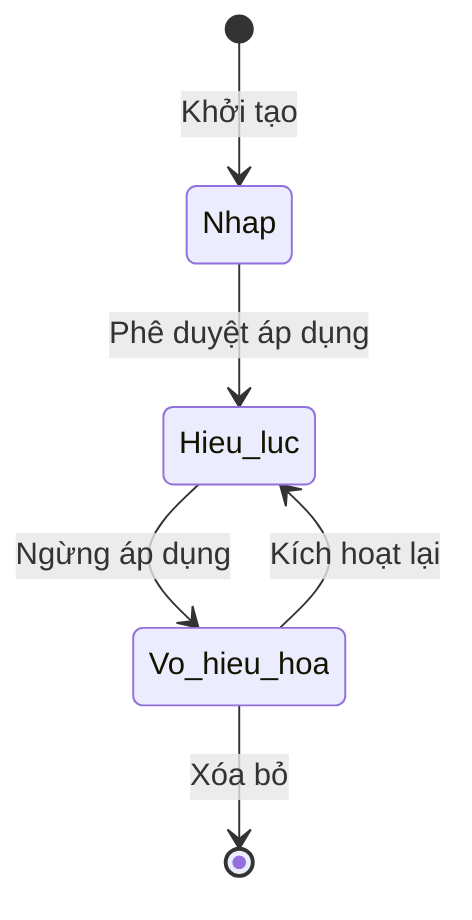

# BF-FIN-01: Thiết lập Chính sách Tài chính (Financial Policies Setup)

> **Capability:** CAP-FIN (Quản trị Tài chính)
> **Giai đoạn:** 1 - Thiết lập
> **Nhóm chức năng:** Thiết lập chung
> **Mã màn hình:** `fin_policies`

---

## 1. Mô tả tổng quan

Phân hệ cung cấp công cụ để thiết lập các chính sách tài chính chung của trung tâm, bao gồm: chính sách hoàn tiền học phí (Refund Policy), các loại thuế áp dụng (Tax Rates), và các quy định về phương thức thanh toán. Việc tách biệt các thông số này khỏi Cấu hình Hệ thống (`CAP-SYS`) giúp bộ phận Kế toán chủ động quản trị các thông số nghiệp vụ của mình mà không cần phụ thuộc IT.

## 2. Đối tượng sử dụng (Vai trò)

- **Trưởng phòng Kế toán / Giám đốc Tài chính:** Người quyết định và thiết lập các chính sách tài chính áp dụng trên toàn hệ thống.
- **Kế toán viên:** Tra cứu chính sách để áp dụng cho các trường hợp ngoại lệ.

## 3. Ranh giới Nghiệp vụ (Scope)

### Có bao gồm (In Scope)
- **Chính sách hoàn tiền (Refund Policy):** Quy định thời hạn (bao nhiêu ngày tính từ lúc khai giảng) và tỷ lệ % học phí được hoàn lại tương ứng.
- **Biểu thuế (Tax Rates):** Mức thuế VAT áp dụng cho các gói học phí, dịch vụ.
- **Phương thức thanh toán mặc định:** Chuyển khoản, tiền mặt, thẻ tín dụng.

### Không bao gồm (Out of Scope)
- Tạo Đơn hàng / Hóa đơn (Billing) → Thuộc về `BF-SAL-01`.
- Ghi nhận Giao dịch Thanh toán (Payment) → Thuộc về `BF-SAL-02`.
- Tính lương cho Giáo viên → Thuộc về `CAP-HR`.

## 4. Mô hình Dữ liệu Nghiệp vụ (Data Entities)

| Tên Thực thể | Trường định danh | Thuộc tính quan trọng | Ràng buộc quan hệ | Diễn giải |
|--------------|------------------|-----------------------|-------------------|----------|
| Chính sách Hoàn tiền | Mã chính sách | Tên, Số ngày tối đa, Tỷ lệ hoàn (%), Trạng thái | Độc lập | Các mức độ hoàn phí. |
| Biểu thuế | Mã loại thuế | Tên, Thuế suất (%), Trạng thái | Độc lập | Ví dụ: VAT 8%, VAT 10%. |

### 4.1. Vòng đời Trạng thái (Status Lifecycle)

*Sơ đồ dưới đây xác định vòng đời trạng thái của một Chính sách Hoàn tiền.*

**Quy tắc chuyển đổi:**

| Từ trạng thái | Sang trạng thái | Điều kiện bắt buộc | Vai trò được phép |
|---------------|-----------------|---------------------|-------------------|
| Nháp | Hiệu lực | Đầy đủ thông số (ngày, phần trăm) | Trưởng phòng Kế toán |
| Vô hiệu hóa | Xóa bỏ | Chưa từng được áp dụng vào bất kỳ khoản hoàn tiền thực tế nào | Trưởng phòng Kế toán |

### 4.2. Ví dụ Dữ liệu mẫu

*Giúp AI và Lập trình viên tạo dữ liệu kiểm thử chính xác.*

| Tình huống | Dữ liệu đầu vào | Kết quả mong đợi |
|------------|-----------------|-------------------|
| Tạo chính sách | Tên: "Hoàn tiền trước khai giảng", Số ngày: 0, Tỷ lệ: 100% | Lưu thành công. Áp dụng cho học sinh chưa học buổi nào. |
| Tạo chính sách | Tên: "Hoàn tiền 2 tuần", Số ngày: 14, Tỷ lệ: 70% | Lưu thành công. Học sinh nghỉ trong vòng 14 ngày được trả 70%. |
| Xóa chính sách cũ | Nhấn Xóa vào chính sách "Hoàn tiền 50%" đã được dùng năm ngoái | Báo lỗi: "Chính sách đã phát sinh dữ liệu quá khứ, chỉ được Khóa". |

## 5. Quy tắc Nghiệp vụ Tổng thể (Business Rules)

1. **[RULE-FIN-01-01] Áp dụng hồi tố (Retroactive):** Khi thay đổi tỷ lệ phần trăm của một Chính sách Hoàn tiền hoặc Biểu thuế đang có Hiệu lực, các Đơn hàng (Orders) đã được tạo trong QUÁ KHỨ VẪN GIỮ NGUYÊN mức áp dụng cũ. Mức mới chỉ áp dụng cho Đơn hàng tạo từ thời điểm sửa đổi trở đi.

## 6. Danh sách Yêu cầu Người dùng (User Stories)

| Mã Yêu cầu | Tên Yêu cầu (Loại màn hình) | Đường dẫn truy cập | Trạng thái |
|------------|-----------------------------|--------------------|------------|
| US-FIN-01-01 | Quản lý Chính sách Hoàn tiền học phí (Danh sách & Biểu mẫu) | /app/fin_policies | Đang soạn thảo |
| US-FIN-01-02 | Quản lý Biểu thuế (Tax Rates) (Danh sách & Biểu mẫu) | /app/fin_policies | Đang soạn thảo |
