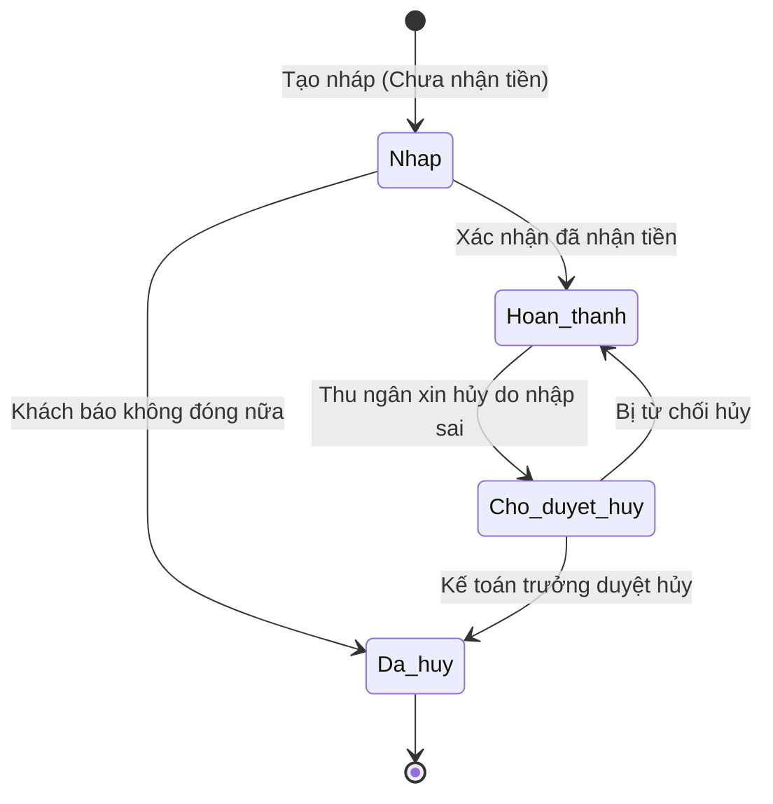

# BF-SAL-02: Quản lý Phiếu thu (Receipts & Payments)

> **Capability:** CAP-FIN (Năng lực Quản trị Tài chính)
> **Giai đoạn:** 4 - Tuyển sinh & Bán hàng
> **Nhóm chức năng:** Bán hàng / Thu ngân
> **Mã màn hình:** `receipts`

---

## 1. Mô tả tổng quan

Business function chịu trách nhiệm trực tiếp ghi nhận dòng tiền thực tế chảy vào hệ thống. Phân hệ này cho phép Thu ngân (Cashier) tạo các Phiếu thu (Receipts) dựa trên các Đơn hàng (Sales Order) đã chốt ở `BF-SAL-01`. Nó quản lý phương thức thanh toán (Tiền mặt, Chuyển khoản, Thẻ tín dụng), đối soát công nợ, và đóng dấu "Đã thanh toán" cho Đơn hàng.

## 2. Đối tượng sử dụng (Vai trò)

- **Thu ngân (Cashier) / Kế toán viên:** Người trực tiếp tạo phiếu thu, nhận tiền và in biên lai cho khách hàng.
- **Kế toán trưởng (Chief Accountant):** Phê duyệt các giao dịch bất thường hoặc hoàn tiền.
- **Nhân viên Tư vấn (Sales):** Xem tiến độ thu tiền (View-only) để biết khách hàng đã nộp tiền chưa.

## 3. Ranh giới Nghiệp vụ (Scope)

### Có bao gồm (In Scope)
- Tạo Phiếu thu (Receipt) tham chiếu tới một Đơn hàng (Order) cụ thể.
- Ghi nhận số tiền thực thu, ngày thu, người thu và phương thức thanh toán.
- Xử lý thu tiền cọc (Deposit) hoặc thu theo từng đợt (Installment).
- In Biên lai (Print Receipt) định dạng PDF/A5 giao cho phụ huynh.
- Quản lý trạng thái Phiếu thu: Nháp, Đã hoàn thành, Đã hủy.

### Không bao gồm (Out of Scope)
- Tạo Đơn hàng, chốt giá, tính chiết khấu → Thuộc `BF-SAL-01`.
- Quản lý chính sách hoãn, hủy, hoàn phí → Thuộc `BF-FIN-01`.
- Hạch toán sổ cái (General Ledger) và báo cáo thuế nhà nước → Thuộc hệ thống ERP Kế toán lõi.

## 4. Mô hình Dữ liệu Nghiệp vụ (Data Entities)

| Tên Thực thể | Trường định danh | Thuộc tính quan trọng | Ràng buộc quan hệ | Diễn giải |
|--------------|------------------|-----------------------|-------------------|----------|
| Phiếu thu (Receipt) | Mã Phiếu thu | Số tiền, Ngày thu, Phương thức (Tiền mặt/Bank), Trạng thái | Trỏ về Mã Đơn hàng (`Order`) | Bằng chứng nhận tiền hợp lệ. |

### 4.1. Vòng đời Trạng thái (Status Lifecycle)

*Sơ đồ dưới đây xác định vòng đời của một Phiếu thu (Receipt).*

**Quy tắc chuyển đổi:**

| Từ trạng thái | Sang trạng thái | Điều kiện bắt buộc | Vai trò được phép |
|---------------|-----------------|---------------------|-------------------|
| Nháp | Hoàn thành | Bắt buộc chọn Phương thức thanh toán | Thu ngân |
| Hoàn thành | Chờ duyệt hủy | Bắt buộc nhập lý do hủy phiếu (Ghi chú) | Thu ngân |

### 4.2. Ví dụ Dữ liệu mẫu

*Giúp AI và Lập trình viên tạo dữ liệu kiểm thử chính xác.*

| Tình huống | Dữ liệu đầu vào | Kết quả mong đợi |
|------------|-----------------|-------------------|
| Khách đặt cọc | Đơn hàng 10tr. Khách nộp tiền mặt 2tr. | Lưu Phiếu thu số PT-001, giá trị 2tr. Đơn hàng tự cập nhật còn nợ 8tr. |
| Khách chuyển khoản nốt | Vài ngày sau, khách chuyển khoản bank nốt 8tr. | Lưu Phiếu thu số PT-002, giá trị 8tr. Tổng 2 phiếu = 10tr. Đơn hàng tự động báo "Hoàn tất". |
| Thu ngân nhập nhầm | Thu ngân lỡ nhập số tiền 80tr thay vì 8tr, đã bấm Hoàn thành. | Bấm "Xin Hủy Phiếu". Chờ Kế toán trưởng duyệt. Sau khi duyệt, phiếu bị hủy, Đơn hàng quay về trạng thái còn nợ 8tr. |

## 5. Quy tắc Nghiệp vụ Tổng thể (Business Rules)

1. **[RULE-SAL-02-01] Ràng buộc Không vượt mức (No Overpayment):** Tổng giá trị các Phiếu thu (đã Hoàn thành) của một Đơn hàng KHÔNG ĐƯỢC PHÉP lớn hơn Tổng tiền phải thanh toán của Đơn hàng đó. Nếu khách trả thừa, phải ghi nhận phần dư vào "Ví điện tử" (E-Wallet) của khách (Nếu hệ thống có hỗ trợ), hoặc không cho nhập phiếu thu.
2. **[RULE-SAL-02-02] Đóng băng Dữ liệu Tài chính (Financial Immutability):** Phiếu thu Đã Hoàn Thành (Completed) là chứng từ tài chính. TUYỆT ĐỐI không được phép sửa (Edit) số tiền hoặc ngày tháng. Nếu sai, quy trình bắt buộc là: Hủy phiếu cũ (có duyệt) và Tạo phiếu mới.

## 6. Danh sách Yêu cầu Người dùng (User Stories)

| Mã Yêu cầu | Tên Yêu cầu (Loại màn hình) | Đường dẫn truy cập | Trạng thái |
|------------|-----------------------------|--------------------|------------|
| US-SAL-02-01 | Quản lý danh sách Phiếu thu (Danh sách & Lọc) | /app/receipts | Đang soạn thảo |
| US-SAL-02-02 | Tạo Phiếu thu mới cho Đơn hàng (Biểu mẫu/Popup) | /app/orders/[id] | Đang soạn thảo |
| US-SAL-02-03 | Phê duyệt yêu cầu Hủy Phiếu thu (Danh sách duyệt) | /app/receipts | Đang soạn thảo |
