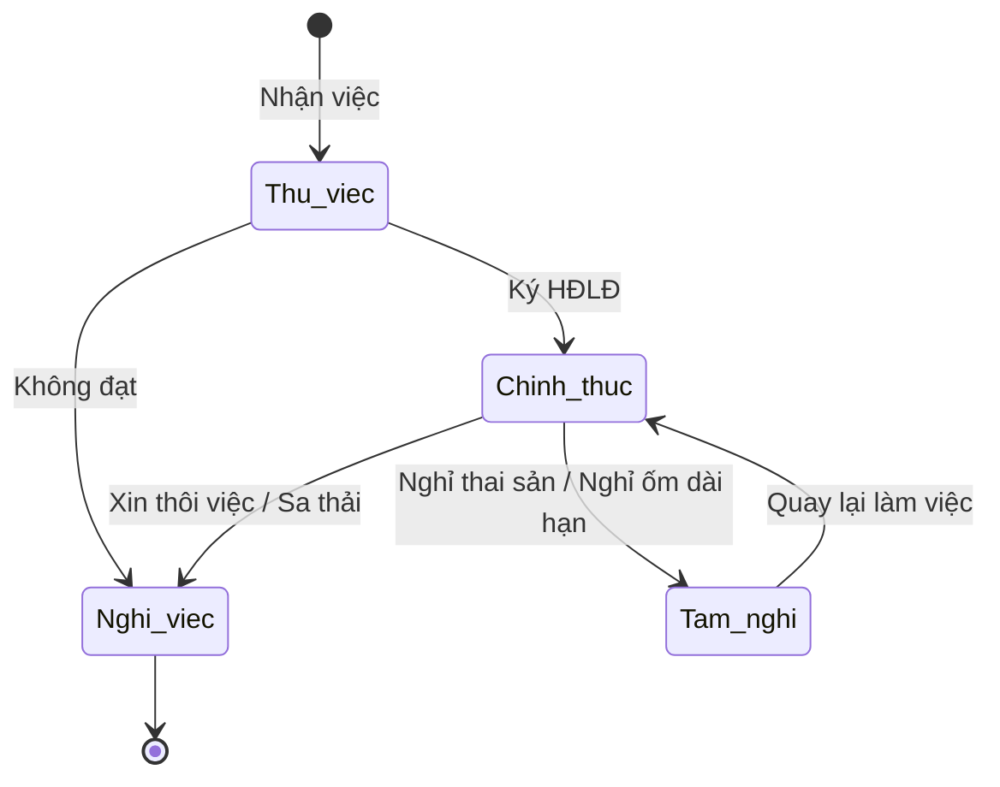

# BF-HR-01: Quản lý Nhân sự (Employee Management)

> **Capability:** CAP-HR (Quản trị Nguồn nhân lực)
> **Giai đoạn:** 1 - Thiết lập nền tảng
> **Nhóm chức năng:** Thiết lập tổ chức
> **Mã màn hình:** `hr_employees`

---

## 1. Mô tả tổng quan

Phân hệ cốt lõi để quản lý hồ sơ nhân viên trong tổ chức. Chức năng bao gồm việc tạo mới, cập nhật hồ sơ cá nhân, gán nhân viên vào các phòng ban/chi nhánh (Organizational Units), phân bổ chức danh (Titles) và quản lý trạng thái làm việc (Active/Resigned). Phân hệ này là nền tảng để cấp quyền truy cập hệ thống ở `CAP-SYS`.

## 2. Đối tượng sử dụng (Vai trò)

- **Chuyên viên Nhân sự (HR):** Cập nhật hồ sơ, theo dõi hợp đồng, quản lý trạng thái nhân sự.
- **Quản lý Hệ thống (Admin):** Đồng bộ tài khoản đăng nhập dựa trên hồ sơ nhân sự.
- **Quản lý Chi nhánh (BM):** Xem danh sách nhân viên thuộc chi nhánh mình quản lý.

## 3. Ranh giới Nghiệp vụ (Scope)

### Có bao gồm (In Scope)
- Tạo mới và quản lý Hồ sơ Nhân viên (Họ tên, Liên hệ, CCCD, Ngân hàng).
- Quản lý quá trình công tác: Chức danh, Phòng ban, Chi nhánh làm việc.
- Quản lý trạng thái làm việc: Thử việc, Chính thức, Nghỉ việc.
- Quản lý Hồ sơ Giáo viên (Teacher Profile) như một loại nhân sự đặc biệt.

### Không bao gồm (Out of Scope)
- Tính lương, thưởng, thuế thu nhập (Payroll & C&B) → Thuộc hệ thống tính lương riêng.
- Chấm công hàng ngày (Time & Attendance) → Thuộc `BF-HR-02` (Quản lý Quỹ thời gian).
- Quản lý Tài khoản Đăng nhập & Quyền hạn truy cập → Thuộc `BF-SYS-01` và `BF-SYS-04`.

## 4. Mô hình Dữ liệu Nghiệp vụ (Data Entities)

| Tên Thực thể | Trường định danh | Thuộc tính quan trọng | Ràng buộc quan hệ | Diễn giải |
|--------------|------------------|-----------------------|-------------------|----------|
| Hồ sơ Nhân viên (Employee) | Mã NV | Tên, CCCD, SĐT, Ngày vào làm, Trạng thái | Nối với `Person` ở Master Data | Thông tin lõi. |
| Vị trí công tác (Job Assignment) | Mã phân bổ | Chi nhánh, Phòng ban, Chức danh | Trỏ về Mã NV | Một NV có thể có nhiều vị trí (Kiêm nhiệm). |

### 4.1. Vòng đời Trạng thái (Status Lifecycle)

*Sơ đồ dưới đây xác định vòng đời làm việc của một Nhân viên.*

**Quy tắc chuyển đổi:**

| Từ trạng thái | Sang trạng thái | Điều kiện bắt buộc | Vai trò được phép |
|---------------|-----------------|---------------------|-------------------|
| Thử việc | Chính thức | Phải có số Hợp đồng lao động | Chuyên viên HR |
| Bất kỳ | Nghỉ việc | Bắt buộc chọn Ngày nghỉ việc chính thức | Chuyên viên HR |

### 4.2. Ví dụ Dữ liệu mẫu

*Giúp AI và Lập trình viên tạo dữ liệu kiểm thử chính xác.*

| Tình huống | Dữ liệu đầu vào | Kết quả mong đợi |
|------------|-----------------|-------------------|
| Thêm mới nhân viên | Nhập Tên "Nguyễn Văn A", SĐT, Ngày bắt đầu 01/10 | Tạo Employee "A", trạng thái "Thử việc". Chưa có tài khoản login. |
| Ký hợp đồng | Chọn Employee A, bấm Chuyển chính thức | Trạng thái thành "Chính thức". Đủ điều kiện nhận phúc lợi. |
| Nghỉ việc | Chọn Employee A, Ngày nghỉ 15/10, Lý do "Cá nhân" | Trạng thái thành "Nghỉ việc". Hệ thống ngắt quyền truy cập (nếu có). |

## 5. Quy tắc Nghiệp vụ Tổng thể (Business Rules)

1. **[RULE-HR-01-01] Tính duy nhất (Unique Identity):** Mỗi nhân viên chỉ có 1 Mã Nhân viên (Employee ID) duy nhất trên toàn hệ thống. Nếu một người đã nghỉ việc và quay lại làm việc, họ sử dụng lại Mã Nhân viên cũ thay vì tạo mới.
2. **[RULE-HR-01-02] Độc lập với Tài khoản Đăng nhập:** Một nhân viên có thể có hồ sơ trên hệ thống nhưng KHÔNG CÓ tài khoản đăng nhập (ví dụ: Bảo vệ, Tạp vụ). Việc cấp tài khoản là một bước riêng rẽ (`BF-SYS-01`).
3. **[RULE-HR-01-03] Kiêm nhiệm (Multiple Assignments):** Một nhân viên có thể giữ nhiều chức danh ở nhiều chi nhánh khác nhau. Hệ thống phải ghi nhận rõ một "Vị trí chính" (Primary) để phục vụ cho việc phê duyệt (Approval flow).

## 6. Danh sách Yêu cầu Người dùng (User Stories)

| Mã Yêu cầu | Tên Yêu cầu (Loại màn hình) | Đường dẫn truy cập | Trạng thái |
|------------|-----------------------------|--------------------|------------|
| US-HR-01-01 | Quản lý Danh sách Nhân sự | /app/hr_employees | Đã chuẩn hóa |
| US-HR-01-02 | Tạo mới Nhân sự | Biểu mẫu hộp thoại | Đã chuẩn hóa |
| US-HR-01-03 | Chi tiết Hồ sơ Nhân sự | Màn hình Chi tiết | Đã chuẩn hóa |
