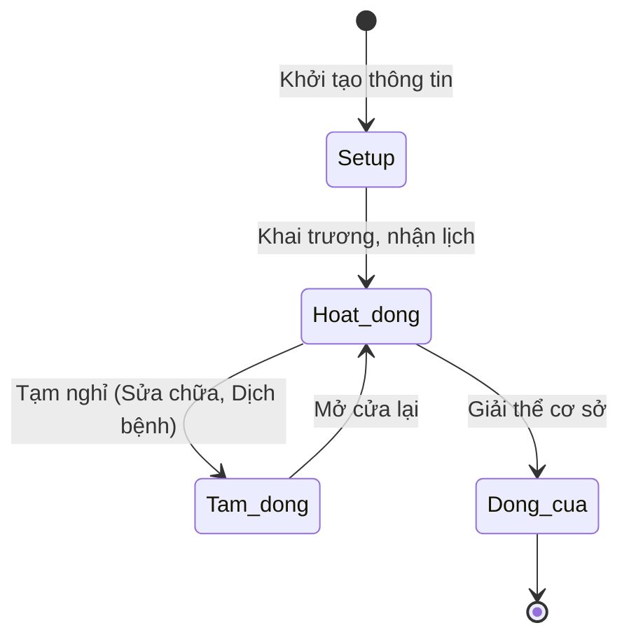

# BF-ORG-01: Thiết lập Chi nhánh (Branch Setup & Opening Process)

> **Capability:** CAP-HR (Quản trị Nguồn nhân lực)
> **Giai đoạn:** 1 - Thiết lập nền tảng
> **Nhóm chức năng:** Thiết lập tổ chức
> **Mã màn hình:** `branch_list`

---

## 1. Mô tả tổng quan

Business function cốt lõi phục vụ việc quản lý cơ sở vật chất ở mức vĩ mô. Bao gồm quy trình tạo mới một Chi nhánh (Branch), cấu hình địa điểm trên bản đồ (Coordinates), thiết lập giờ hoạt động và khai báo các danh mục phòng học (Rooms), sức chứa (Capacity) bên trong chi nhánh đó để làm dữ liệu nền tảng phục vụ cho công tác xếp lịch ở `BF-OPS-02`.

## 2. Đối tượng sử dụng (Vai trò)

- **Quản trị Hệ thống (Admin):** Khởi tạo chi nhánh mới trên hệ thống phần mềm khi công ty mở cơ sở.
- **Quản lý Vận hành / Giáo vụ:** Thiết lập danh sách phòng học, giờ mở cửa/đóng cửa của chi nhánh.

## 3. Ranh giới Nghiệp vụ (Scope)

### Có bao gồm (In Scope)
- Quản lý danh sách Chi nhánh (Tạo mới, Sửa, Vô hiệu hóa).
- Thiết lập địa chỉ và vị trí bản đồ (Map Coordinates) cho Chi nhánh.
- Định nghĩa khung giờ hoạt động tiêu chuẩn (Business Hours) của Chi nhánh.
- Thiết lập danh mục Phòng học (Rooms) thuộc Chi nhánh (Tên phòng, Sức chứa tối đa, Phân loại phòng).

### Không bao gồm (Out of Scope)
- Quản lý tài sản, trang thiết bị cụ thể trong phòng học (Máy chiếu, Bàn ghế) → Thuộc `CAP-FCM`.
- Phân bổ nhân sự, chỉ định Giám đốc chi nhánh → Thuộc `BF-ORG-02` (Sơ đồ tổ chức).
- Tính toán chi phí thuê mặt bằng, điện nước vận hành → Thuộc `CAP-FIN`.

## 4. Mô hình Dữ liệu Nghiệp vụ (Data Entities)

| Tên Thực thể | Trường định danh | Thuộc tính quan trọng | Ràng buộc quan hệ | Diễn giải |
|--------------|------------------|-----------------------|-------------------|----------|
| Chi nhánh (Branch) | Mã Chi nhánh | Tên, Địa chỉ, Tọa độ, Giờ mở cửa, Trạng thái | Độc lập | Đại diện cơ sở vật lý. |
| Phòng học (Room) | Mã Phòng | Tên phòng, Sức chứa tối đa, Trạng thái | Trỏ về Mã Chi nhánh | Đơn vị không gian học. |

### 4.1. Vòng đời Trạng thái (Status Lifecycle)

*Sơ đồ dưới đây xác định vòng đời của một Chi nhánh trên hệ thống.*

**Quy tắc chuyển đổi:**

| Từ trạng thái | Sang trạng thái | Điều kiện bắt buộc | Vai trò được phép |
|---------------|-----------------|---------------------|-------------------|
| Setup | Hoạt động | Phải khai báo ít nhất 1 Phòng học | Admin |
| Hoạt động | Đóng cửa | Không được phép nếu còn Lớp học đang Active tại cơ sở này | Admin |

### 4.2. Ví dụ Dữ liệu mẫu

*Giúp AI và Lập trình viên tạo dữ liệu kiểm thử chính xác.*

| Tình huống | Dữ liệu đầu vào | Kết quả mong đợi |
|------------|-----------------|-------------------|
| Tạo cơ sở mới | Tên: "CS Cầu Giấy", Tọa độ: [21.0, 105.8], Giờ: 08:00 - 21:00 | Lưu thành công, Branch ở trạng thái Setup. |
| Khai báo phòng | Tại "CS Cầu Giấy", tạo Phòng 101, Sức chứa: 15 | Room 101 được lưu và trỏ về CS Cầu Giấy. |
| Tạm đóng cửa | Đổi trạng thái CS Cầu Giấy sang "Tạm đóng" | Hệ thống tự động ẩn chi nhánh này khỏi dropdown Xếp lịch mới. |

## 5. Quy tắc Nghiệp vụ Tổng thể (Business Rules)

1. **[RULE-ORG-01-01] Ràng buộc Không xóa (No Delete Rule):** Một Chi nhánh hoặc Phòng học khi ĐÃ ĐƯỢC GẮN vào bất kỳ Lớp học hoặc Buổi học (Session) nào trong quá khứ thì TUYỆT ĐỐI không được phép Xóa (Delete Hard). Chỉ được phép đổi trạng thái sang Vô hiệu hóa/Đóng cửa (Inactive/Closed) để bảo toàn dữ liệu lịch sử.
2. **[RULE-ORG-01-02] Ràng buộc Sức chứa (Capacity Constraint):** Sức chứa tối đa (Max Capacity) của Phòng học là điều kiện chặn cứng (Hard constraint). Thuật toán sinh lịch (`BF-OPS-02`) hoặc xếp học thử (`BF-ENR-02`) sẽ báo lỗi và chặn lại nếu tổng số học viên trong buổi học vượt quá con số này.

## 6. Danh sách Yêu cầu Người dùng (User Stories)

| Mã Yêu cầu | Tên Yêu cầu (Loại màn hình) | Đường dẫn truy cập | Trạng thái |
|------------|-----------------------------|--------------------|------------|
| US-ORG-01-01 | Thiết lập Giờ Hoạt động Chi nhánh | Chi tiết Chi nhánh | Đã chuẩn hóa |
| US-ORG-01-02 | Quản lý danh sách Phòng học và Sức chứa | Chi tiết Chi nhánh | Đã chuẩn hóa |
| US-ORG-01-03 | Quản lý Danh sách Chi nhánh | /app/branch_list | Đã chuẩn hóa |
| US-ORG-01-04 | Tạo mới Chi nhánh | Biểu mẫu hộp thoại | Đã chuẩn hóa |
| US-ORG-01-05 | Quản lý Chi tiết Chi nhánh | Màn hình Chi tiết | Đã chuẩn hóa |
