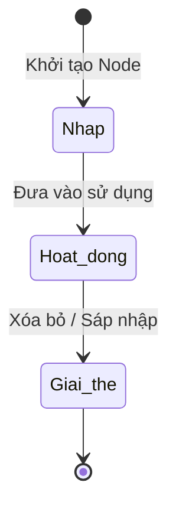

# BF-ORG-02: Quản lý Cơ cấu Tổ chức (Organization Structure)

> **Capability:** CAP-HR (Quản trị Nguồn nhân lực)
> **Giai đoạn:** 1 - Thiết lập nền tảng
> **Nhóm chức năng:** Thiết lập tổ chức
> **Mã màn hình:** `org_structure`

---

## 1. Mô tả tổng quan

Phân hệ xây dựng và quản trị sơ đồ tổ chức (Org Chart) của toàn bộ doanh nghiệp. Nó định nghĩa các cấp bậc phân cấp (Khối → Vùng → Chi nhánh → Phòng ban → Tổ nhóm) và thực hiện việc gán nhân sự (Staff Mapping) vào đúng vị trí của họ trong sơ đồ. Điều này là nền tảng cốt lõi phục vụ cho các logic phân quyền dữ liệu (Data Scope), luồng phê duyệt (Approval Flow) và báo cáo.

## 2. Đối tượng sử dụng (Vai trò)

- **Quản trị Hệ thống (System Admin):** Cấu hình cây sơ đồ gốc và các Vùng lớn.
- **Chuyên viên Nhân sự (HR):** Quản trị danh sách nhân sự, điều chuyển phòng ban và chức danh.

## 3. Ranh giới Nghiệp vụ (Scope)

### Có bao gồm (In Scope)
- Xây dựng cây phân cấp (Hierarchical Tree) cho các Node tổ chức (Phòng ban, Vùng, Tổ).
- Định nghĩa các cấp bậc (Level/Tier) trong tổ chức (Cấp Công ty, Cấp Vùng, Cấp Chi nhánh, Cấp Phòng).
- Gán Chi nhánh vật lý (`BF-ORG-01`) vào một Node trên Cây (Ví dụ: Chi nhánh Cầu Giấy trực thuộc Node Vùng Miền Bắc).
- Điều chuyển nhân sự (Transfer Staff) giữa các phòng ban hoặc chi nhánh.
- Tra cứu danh bạ nội bộ hiển thị theo sơ đồ tổ chức.

### Không bao gồm (Out of Scope)
- Khai báo Chi nhánh vật lý và Phòng học (Vị trí, tọa độ) → Thuộc `BF-ORG-01`.
- Quản lý hồ sơ nhân sự cá nhân, quá trình làm việc, hợp đồng → Thuộc `BF-HR-01`.
- Phân quyền tính năng (Role-based Access Control) → Thuộc `CAP-SYS`.

## 4. Mô hình Dữ liệu Nghiệp vụ (Data Entities)

| Tên Thực thể | Trường định danh | Thuộc tính quan trọng | Ràng buộc quan hệ | Diễn giải |
|--------------|------------------|-----------------------|-------------------|----------|
| Nút Tổ chức (Org Node) | Mã Node | Tên phòng ban, Cấp bậc, Trạng thái | Nối với Mã Node cha | Xây dựng cây phân cấp. |
| Phân bổ Nhân sự (Staff Assignment) | Mã phân bổ | Ngày bắt đầu, Chức danh, Là Vị trí chính (Yes/No) | Trỏ về Mã Node & Mã Nhân viên | Bảng mapping n-n. |

### 4.1. Vòng đời Trạng thái (Status Lifecycle)

*Sơ đồ dưới đây xác định vòng đời của một Nút Tổ chức (Phòng ban/Vùng).*

**Quy tắc chuyển đổi:**

| Từ trạng thái | Sang trạng thái | Điều kiện bắt buộc | Vai trò được phép |
|---------------|-----------------|---------------------|-------------------|
| Hoạt động | Giải thể | Bắt buộc phải chuyển toàn bộ Nhân sự và Node con sang Node khác, Node phải trống rỗng | Quản trị Hệ thống |

### 4.2. Ví dụ Dữ liệu mẫu

*Giúp AI và Lập trình viên tạo dữ liệu kiểm thử chính xác.*

| Tình huống | Dữ liệu đầu vào | Kết quả mong đợi |
|------------|-----------------|-------------------|
| Xây dựng cây | Tạo Node "Vùng miền Bắc", tạo Node con "Khu vực HN" | Cây hiển thị quan hệ Cha-Con. |
| Gán Chi nhánh | Map "CS Cầu Giấy" (BF-ORG-01) vào "Khu vực HN" | Dữ liệu của CS Cầu Giấy sẽ được tổng hợp lên Khu vực HN. |
| Điều chuyển NV | Nhân viên A đang ở CS Cầu Giấy, chọn Điều chuyển sang CS Đống Đa | Record Assignment cũ cập nhật "Ngày kết thúc". Tạo Record Assignment mới gắn với Node CS Đống Đa. |

## 5. Quy tắc Nghiệp vụ Tổng thể (Business Rules)

1. **[RULE-ORG-02-01] Ràng buộc Không Vòng lặp (No Circular Dependency):** Cây sơ đồ tổ chức là cây phân cấp tuyến tính. Tuyệt đối không được phép thiết lập quan hệ vòng lặp (Ví dụ: Node A là cha của Node B, nhưng Node B lại là cha của Node A). Hệ thống phải kiểm tra validation lúc chọn Node Cha.
2. **[RULE-ORG-02-02] Đa vị trí & Vị trí Chính (Primary Assignment):** Một nhân sự có thể được phân bổ (Assign) vào nhiều phòng ban/chi nhánh khác nhau cùng lúc (Ví dụ: Giáo viên chạy show liên chi nhánh). Tuy nhiên, BẮT BUỘC phải có đúng 1 vị trí được đánh dấu là "Vị trí chính" (Primary) để làm căn cứ tính KPI và Tuyến phê duyệt.
3. **[RULE-ORG-02-03] Giải thể an toàn (Safe Deletion):** Khi Giải thể hoặc Xóa một Node tổ chức, hệ thống chặn thao tác nếu Node đó vẫn còn chứa Nhân sự hoặc Node con. Phải làm thao tác "Chuyển giao" (Transfer) sạch sẽ trước khi xóa.

## 6. Danh sách Yêu cầu Người dùng (User Stories)

| Mã Yêu cầu | Tên Yêu cầu (Loại màn hình) | Đường dẫn truy cập | Trạng thái |
|------------|-----------------------------|--------------------|------------|
| US-ORG-02-01 | Danh sách Sơ đồ tổ chức | /app/org_structure | Đã chuẩn hóa |
| US-ORG-02-02 | Điều chuyển nhân sự | Công cụ / Hộp thoại | Đã chuẩn hóa |
| US-ORG-02-03 | Tạo mới Đơn vị Tổ chức | Biểu mẫu hộp thoại | Đã chuẩn hóa |
| US-ORG-02-04 | Chi tiết Đơn vị Tổ chức | Màn hình Chi tiết | Đã chuẩn hóa |
