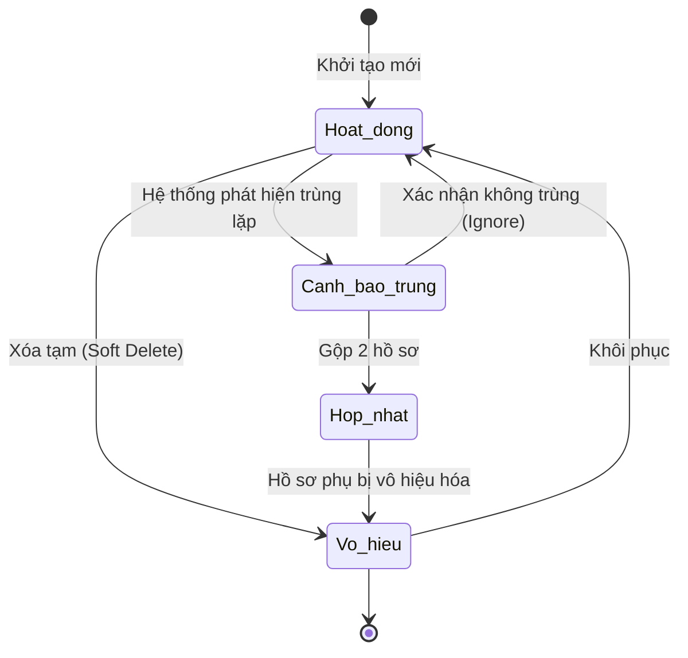

# BF-MDM-01: Vòng đời Định danh Cá nhân (Person Identity Lifecycle)

> **Capability:** CAP-MDM (Quản trị Dữ liệu Gốc)
> **Giai đoạn:** 3 - Hồ sơ & Sản phẩm
> **Nhóm chức năng:** Dữ liệu Gốc
> **Mã màn hình:** `mdm_persons`

---

## 1. Mô tả tổng quan

Quản lý vòng đời hồ sơ cá nhân (Golden Record) dựa trên nguyên tắc **Party Data Model**. Trọng tâm của phân hệ này là trả lời câu hỏi **"ĐÂY LÀ AI?"**, tách biệt hoàn toàn khỏi việc người đó đóng vai trò gì trong hệ thống (Học viên, Phụ huynh, Nhân viên hay Đối tác). 

Áp dụng chuẩn MDM phân tách rõ Bản dạng (Identity) và Liên hệ (Contact):
- **Identity:** Mọi con người đều có 1 `Person` record duy nhất chứa thông tin cá nhân bất biến (Tên, Ngày sinh, CCCD, Giới tính).
- **Contact:** Một Person có thể có nhiều `Contact` record (SĐT 1, SĐT 2, Email trường, Email nhà, Địa chỉ), phục vụ liên lạc đa kênh.

## 2. Đối tượng sử dụng (Vai trò)

- **Nhân viên Tư vấn (Sale):** Tạo profile khi tiếp nhận Lead mới.
- **Chăm sóc Học viên (CSM):** Cập nhật profile khi có thay đổi thông tin liên lạc.
- **Chuyên viên Nhân sự (HR):** Chọn profile từ kho MDM khi thêm mới nhân viên.
- **Quản trị Hệ thống (System Admin):** Xử lý xung đột dữ liệu, gộp hồ sơ trùng lặp (Merge).

## 3. Ranh giới Nghiệp vụ (Scope)

### Có bao gồm (In Scope)
- Tạo mới và cập nhật Hồ sơ cá nhân (Tên, Ngày sinh, CCCD, Giới tính, Avatar).
- Thêm/sửa/xóa các phương thức liên lạc (Email, SĐT, Địa chỉ) gắn với Person. Đánh dấu Liên hệ chính (Primary).
- Cơ chế phát hiện trùng lặp (Duplicate Detection) theo SĐT, Email, CCCD.
- Cơ chế hợp nhất (Merge) nhiều hồ sơ bị trùng thành 1 Golden Record.
- Vô hiệu hóa / Khôi phục hồ sơ (Soft-delete).

### Không bao gồm (Out of Scope)
- Gán Chức danh, phòng ban, chi nhánh → Thuộc `CAP-HR`.
- Cấp Username, password, phân quyền → Thuộc `CAP-SYS`.
- Ghép mối quan hệ gia đình (Phụ huynh - Học sinh) → Thuộc `BF-MDM-02`.
- Quản lý hồ sơ doanh nghiệp B2B → Thuộc `BF-MDM-03`.

## 4. Mô hình Dữ liệu Nghiệp vụ (Data Entities)

| Tên Thực thể | Trường định danh | Thuộc tính quan trọng | Ràng buộc quan hệ | Diễn giải |
|--------------|------------------|-----------------------|-------------------|----------|
| Cá nhân (Person) | Mã Cá nhân | Tên, CCCD, Giới tính, Ngày sinh, Hình ảnh | Độc lập | Master Data về 1 con người. |
| Liên hệ (Contact) | Mã Liên hệ | Loại (SĐT, Email), Giá trị, Là Mặc định (Yes/No) | Trỏ về Mã Cá nhân | Một người có nhiều phương thức liên lạc. |

### 4.1. Vòng đời Trạng thái (Status Lifecycle)

*Sơ đồ dưới đây xác định vòng đời của một Định danh Cá nhân.*

**Quy tắc chuyển đổi:**

| Từ trạng thái | Sang trạng thái | Điều kiện bắt buộc | Vai trò được phép |
|---------------|-----------------|---------------------|-------------------|
| Bất kỳ | Cảnh báo trùng | Quét thấy 2 Person có cùng 1 SĐT hoặc CCCD | Hệ thống tự động |
| Cảnh báo trùng | Hợp nhất | Phải chọn 1 Hồ sơ làm Master (Giữ lại), hồ sơ kia sẽ bị Vô hiệu | Quản trị Hệ thống |

### 4.2. Ví dụ Dữ liệu mẫu

*Giúp AI và Lập trình viên tạo dữ liệu kiểm thử chính xác.*

| Tình huống | Dữ liệu đầu vào | Kết quả mong đợi |
|------------|-----------------|-------------------|
| Tạo Person | Tên: "Trần C", SĐT: 09112233 | Hệ thống sinh ra 1 record Person, và 1 record Contact (Type: Phone) trỏ về Person đó. |
| Thêm Email | Vào Person "Trần C", thêm Email c@gmail.com | Sinh thêm 1 record Contact (Type: Email). Person giữ nguyên. |
| Gộp hồ sơ | Merge Person "Nguyễn A" và Person "Nguyễn A (SĐT cũ)" | Dữ liệu giao dịch của 2 profile gom về "Nguyễn A", profile phụ bị Vô hiệu hóa. |

## 5. Quy tắc Nghiệp vụ Tổng thể (Business Rules)

1. **[RULE-MDM-01-01] Golden Record (Bản ghi Vàng):** Chỉ có duy nhất một `Person` record đại diện cho một con người vật lý trên toàn hệ thống (Bao gồm cả các cơ sở, chi nhánh khác nhau). Không được phép tạo nhiều Profile cho cùng 1 người chỉ vì họ học ở 2 cơ sở khác nhau.
2. **[RULE-MDM-01-02] Độc lập Liên hệ (Decoupled Contact):** Hệ thống không được thiết kế cột `phone` hay `email` trực tiếp trong bảng `Person`. Bắt buộc phải thiết kế bảng `Contact` riêng biệt để cho phép một Person sở hữu nhiều SĐT/Email cùng lúc.

## 6. Danh sách Yêu cầu Người dùng (User Stories)

| Mã Yêu cầu | Tên Yêu cầu (Loại màn hình) | Đường dẫn truy cập | Trạng thái |
|------------|-----------------------------|--------------------|------------|
| US-MDM-01-01 | Quản lý danh sách định danh cá nhân (Danh sách) | /app/mdm_persons | Đang soạn thảo |
| US-MDM-01-02 | Tạo mới & Cập nhật Hồ sơ cá nhân (Biểu mẫu) | /app/mdm_persons/[id] | Đang soạn thảo |
| US-MDM-01-03 | Quản lý phương thức Liên lạc (Tab trong Chi tiết) | /app/mdm_persons/[id] | Đang soạn thảo |
| US-MDM-01-04 | Hợp nhất hồ sơ trùng lặp (Công cụ Merge) | Không có | Đang soạn thảo |
