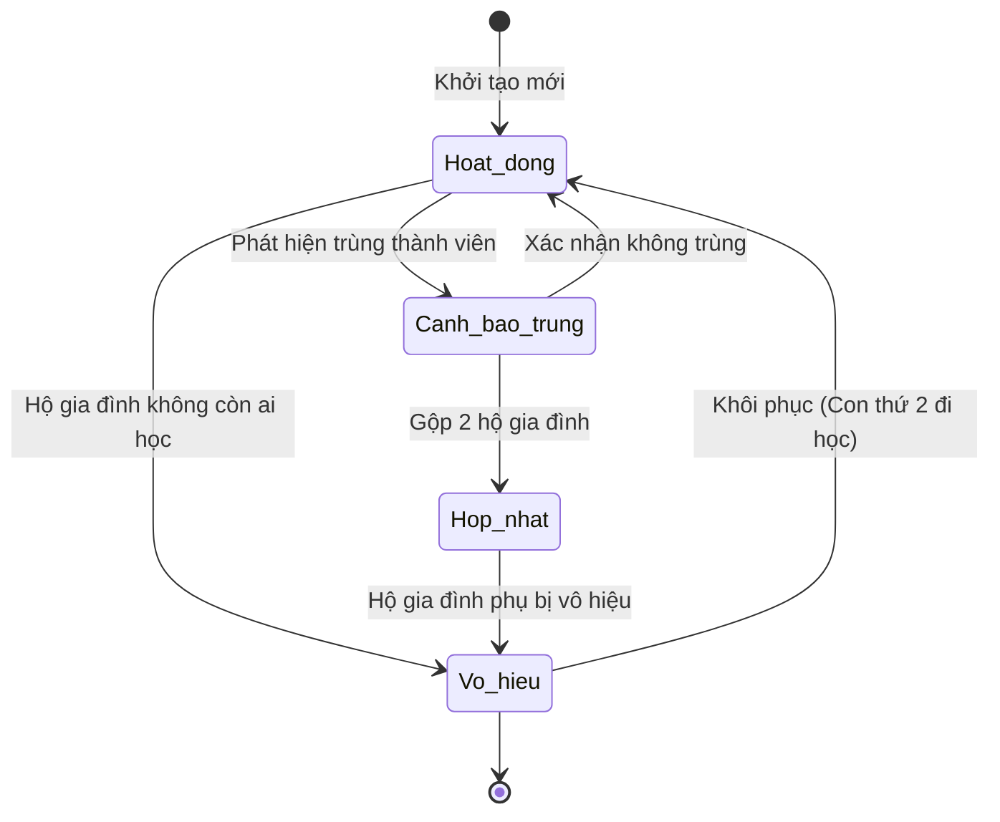

# BF-MDM-02: Quản trị Hộ gia đình (Household & Relationship Governance)

> **Capability:** CAP-MDM (Quản trị Dữ liệu Gốc)
> **Giai đoạn:** 3 - Hồ sơ & Sản phẩm
> **Nhóm chức năng:** Dữ liệu Gốc
> **Mã màn hình:** `mdm_households`

---

## 1. Mô tả tổng quan

Nghiệp vụ cốt lõi của nhánh B2C theo chuẩn **Party Data Model**. `Household Account` (Hộ gia đình) là một thực thể bao bọc (Container) chứa nhiều `Person`. Phân hệ này giải quyết bài toán cốt lõi của mảng giáo dục: **Gộp học phí (Billing) và Quản lý mối quan hệ (Relationships)**. 

Thay vì bắt nhân viên nhập lại thông tin Phụ huynh cho mỗi đứa trẻ, các Person (Bố, Mẹ, Con 1, Con 2) sẽ được gom chung vào 1 Household.

## 2. Đối tượng sử dụng (Vai trò)

- **Nhân viên Tư vấn (Sale):** Gom nhóm học viên và phụ huynh lúc tư vấn.
- **Chăm sóc Học viên (CSM):** Quản lý mối quan hệ phụ huynh trong quá trình học.
- **Kế toán / Tài chính:** Tra cứu Hộ gia đình để biết ai là người thanh toán hóa đơn.

## 3. Ranh giới Nghiệp vụ (Scope)

### Có bao gồm (In Scope)
- Khởi tạo một Hộ gia đình (Ví dụ: "Gia đình anh Nguyễn Văn A").
- Thêm/bớt các thành viên (Person) đã có từ `BF-MDM-01` vào Hộ gia đình.
- Thiết lập Đồ thị Quan hệ (Relationship Graph): Định nghĩa vai trò của từng Person trong Household (Bố, Mẹ, Con cái).
- Phân vai trò Hành chính:
  - Đánh dấu **Người thanh toán (Billing Account):** Nhằm xuất hóa đơn gộp.
  - Đánh dấu **Người giám hộ chính (Primary Guardian):** Để nhận tin nhắn thông báo.
- Hợp nhất (Merge) 2 Hộ gia đình bị trùng.

### Không bao gồm (Out of Scope)
- Quản lý thông tin định danh tĩnh (PII) của từng thành viên → Xử lý tại `BF-MDM-01`.
- Áp dụng mã giảm giá anh em ruột (Sibling Discount) → Xử lý tại `CAP-FIN`.
- Quản lý Khách hàng Doanh nghiệp (B2B) → Xử lý tại `BF-MDM-03`.

## 4. Mô hình Dữ liệu Nghiệp vụ (Data Entities)

| Tên Thực thể | Trường định danh | Thuộc tính quan trọng | Ràng buộc quan hệ | Diễn giải |
|--------------|------------------|-----------------------|-------------------|----------|
| Hộ gia đình (Household) | Mã Hộ gia đình | Tên hộ, Trạng thái | Độc lập | Container chứa người. |
| Thành viên Hộ gia đình | Mã liên kết | Vai trò (Bố/Mẹ/Con), Là Người thanh toán (Yes/No), Là Giám hộ chính (Yes/No) | Trỏ về Mã Hộ gia đình & Mã Person | Bảng mapping n-n. |

### 4.1. Vòng đời Trạng thái (Status Lifecycle)

*Sơ đồ dưới đây xác định vòng đời của một Hộ gia đình.*

**Quy tắc chuyển đổi:**

| Từ trạng thái | Sang trạng thái | Điều kiện bắt buộc | Vai trò được phép |
|---------------|-----------------|---------------------|-------------------|
| Hoạt động | Cảnh báo trùng | Quét thấy 2 Hộ gia đình có cùng Người thanh toán hoặc Người giám hộ | Hệ thống tự động |
| Bất kỳ | Vô hiệu hóa | Phải ngắt kết nối với tất cả Person đang hoạt động | Quản trị / Quản lý |

### 4.2. Ví dụ Dữ liệu mẫu

*Giúp AI và Lập trình viên tạo dữ liệu kiểm thử chính xác.*

| Tình huống | Dữ liệu đầu vào | Kết quả mong đợi |
|------------|-----------------|-------------------|
| Tạo Hộ gia đình | Tên: "Gia đình chị Lan" | Sinh Household Account mới. |
| Thêm thành viên | Chọn Person "Chị Lan" (Mẹ), Person "Bé Mai" (Con). Đánh dấu Chị Lan là Người thanh toán. | Tạo 2 record trong bảng Thành viên, gán quyền Billing cho Chị Lan. |
| Cập nhật giám hộ | Thêm Person "Anh Hùng" (Bố), chuyển cờ Người giám hộ chính sang Anh Hùng. | Anh Hùng sẽ là người nhận SMS thay vì Chị Lan. |

## 5. Quy tắc Nghiệp vụ Tổng thể (Business Rules)

1. **[RULE-MDM-02-01] Ràng buộc vai trò bắt buộc:** Một `Household` đang ở trạng thái Hoạt động BẮT BUỘC phải có đúng 1 Person được đánh dấu là `isBillingAccount = true` và ít nhất 1 Person được đánh dấu là `isPrimaryGuardian = true`. (Có thể là cùng 1 người).
2. **[RULE-MDM-02-02] Đa quan hệ (Multiple Memberships):** Một `Person` được phép nằm trong nhiều `Household` khác nhau (Ví dụ: Đứa trẻ nằm trong Household của Bố Mẹ đẻ, nhưng cũng nằm trong Household của Ông Bà).

## 6. Danh sách Yêu cầu Người dùng (User Stories)

| Mã Yêu cầu | Tên Yêu cầu (Loại màn hình) | Đường dẫn truy cập | Trạng thái |
|------------|-----------------------------|--------------------|------------|
| US-MDM-02-01 | Quản lý danh sách Hộ gia đình (Danh sách) | /app/mdm_households | Đang soạn thảo |
| US-MDM-02-02 | Thêm/Bớt thành viên vào Hộ gia đình (Bảng gán) | /app/mdm_households/[id] | Đang soạn thảo |
| US-MDM-02-03 | Thiết lập Cây Quan hệ & Phân vai trò (Biểu mẫu cây) | /app/mdm_households/[id] | Đang soạn thảo |
