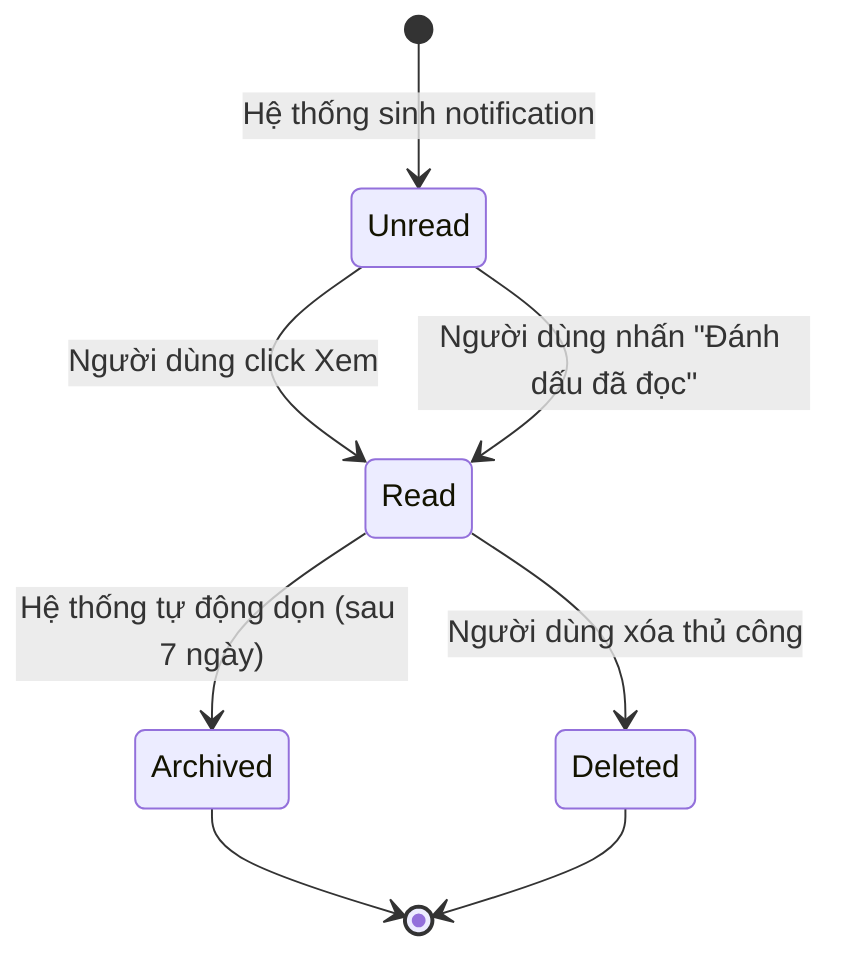

# BF-NOTIF-01: Quản lý Trung tâm Thông báo (Notification Center)

> **Capability:** CAP-NOTIFICATION (Năng lực Trung tâm Thông báo)
> **Giai đoạn:** 2 - Vận hành
> **Nhóm chức năng:** Thông báo & Tương tác
> **Mã màn hình:** — (Header component, không phải màn hình riêng)

---

## 1. Mô tả tổng quan

Phân hệ quản lý vòng đời của thông báo trong ứng dụng (In-App Notification) — từ khi được sinh ra → hiển thị trên Header Bell → người dùng đọc → đánh dấu đã đọc → lưu trữ. Cung cấp giao diện tập trung để người dùng xem, lọc và xử lý tất cả thông báo mà không cần chuyển màn hình. Đây là điểm tiếp cận duy nhất (single touchpoint) cho mọi sự kiện hệ thống quan trọng.

## 2. Đối tượng sử dụng (Vai trò)

- **Tất cả người dùng:** Xem thông báo cá nhân, đánh dấu đã đọc, click để điều hướng tới màn hình xử lý.
- **Quản lý Chi nhánh (BM):** Xem thông báo tổng hợp của chi nhánh, giám sát tỷ lệ phản hồi thông báo của nhân viên.
- **Quản trị hệ thống (Admin):** Xem tất cả thông báo hệ thống, cấu hình routing rules (xem `BF-NOTIF-02`).

## 3. Ranh giới Nghiệp vụ (Scope)

### Có bao gồm (In Scope)
- Bell Icon trên Header với Badge hiển thị số unread
- Notification Panel (Dropdown) mở khi click Bell, hiển thị danh sách thông báo
- Phân loại thông báo theo danh mục: System, Workflow, Reminder, Alert
- Phân loại theo mức độ ưu tiên: Cao, Trung bình, Thấp
- Trạng thái read/unread với đánh dấu trực quan
- Actions: Đánh dấu đã đọc (từng cái), Đánh dấu tất cả đã đọc, Xóa thông báo
- Click notification → điều hướng tới màn hình xử lý sự kiện (targetRoute)
- Relative time display: "2 phút trước", "1 giờ trước", "3 ngày trước"
- Lọc thông báo theo loại (Segmented Control: All / System / Workflow / Reminder / Alert)
- Phân trang khi số lượng thông báo lớn (> 20 items)
- Do Not Disturb mode — tạm dừng thông báo mới trong khoảng thời gian cài đặt

### Không bao gồm (Out of Scope)
- Gửi tin nhắn ngoài hệ thống (SMS, Zalo, Email) → Thuộc Communication Channel
- Toast feedback (phản hồi thao tác trực tiếp) → Thuộc sonner library
- Cấu hình routing rules → Thuộc `BF-NOTIF-02`
- Cài đặt preference cá nhân → Thuộc `BF-NOTIF-02`

## 4. Mô hình Dữ liệu Nghiệp vụ (Data Entities)

| Tên Thực thể | Trường định danh | Thuộc tính quan trọng | Ràng buộc quan hệ | Diễn giải |
|--------------|------------------|-----------------------|-------------------|----------|
| Thông báo (Notification) | Mã thông báo (UUID) | Tiêu đề, Nội dung, Loại, Mức ưu tiên, Trạng thái, Thời gian, Đường dẫn điều hướng, Nguồn sự kiện | Trỏ về Mã người nhận | Bản ghi thông báo trong hệ thống. |
| Danh mục (Category) | Mã danh mục | Tên, Biểu tượng, Màu sắc | Độc lập | Phân loại thông báo: System, Workflow, Reminder, Alert. |

### 4.1. Vòng đời Trạng thái (Status Lifecycle)

*Sơ đồ dưới đây xác định tất cả trạng thái hợp lệ và các phép chuyển đổi được phép đối với Thông báo.*

**Quy tắc chuyển đổi:**

| Từ trạng thái | Sang trạng thái | Điều kiện bắt buộc | Vai trò được phép |
|---------------|-----------------|---------------------|-------------------|
| Bất kỳ | Unread | Hệ thống sinh notification theo routing rules | Hệ thống tự động |
| Unread | Read | Người dùng click notification hoặc nhấn "Đánh dấu đã đọc" | Người nhận |
| Read | Archived | Hệ thống tự động sau 7 ngày | Hệ thống tự động |
| Read | Deleted | Người dùng xác nhận xóa | Người nhận |
| Unread | Deleted | Người dùng xác nhận xóa | Người nhận |

### 4.2. Ví dụ Dữ liệu mẫu

*Giúp AI và Lập trình viên tạo dữ liệu kiểm thử chính xác.*

| Tình huống | Dữ liệu đầu vào | Kết quả mong đợi |
|------------|-----------------|-------------------|
| Hệ thống sinh thông báo | Sự kiện: Đơn hàng mới ORD-2026-001 | Notification type=Workflow, priority=High, unread, targetRoute="/app/orders/ORD-2026-001" |
| Người dùng đọc thông báo | Click vào notification "Đơn hàng mới" | Chuyển thành Read, điều hướng trang orders |
| Badge count | 5 unread, 3 read | Badge hiển thị số "5" |
| Không có thông báo | Chưa có sự kiện nào | Panel hiển thị "Chưa có thông báo nào" |

## 5. Quy tắc Nghiệp vụ Tổng thể (Business Rules)

1. **[RULE-NOTIF-01] Unread Count Accuracy:** Badge count trên Bell Icon PHẢI bằng tổng số notificationunread của currentUser, được cập nhật real-time.
2. **[RULE-NOTIF-02] Data Scope Filtering:** Người dùng chỉ thấy thông báo trong phạm vi Data Scope của họ (`[POLICY-ORG-01]`). CSM chỉ thấy thông báo HV được phân công, BM chỉ thấy thông báo chi nhánh của mình.
3. **[RULE-NOTIF-03] Click-to-Navigate:** Khi click thông báo, hệ thống PHẢI đánh dấu notification đó thành Read TRƯỚC KHI điều hướng.
4. **[RULE-NOTIF-04] Auto-Archive:** Notification ở trạng thái Read được tự động chuyển thành Archived sau 7 ngày. Notification ở trạng thái Unread KHÔNG bị auto-archive.
5. **[RULE-NOTIF-05] Rate Limiting:** Cùng 1 sự kiện KHÔNG sinh quá 1 notification cho cùng 1 user trong vòng 5 phút. Các sự kiện giống nhau trong thời gian này được gộp thành 1 notification với count tăng lên.
6. **[RULE-NOTIF-06] Do Not Disturb:** Khi user bật DND mode, notification mới vẫn được lưu vào store nhưng KHÔNG hiển thị badge count và KHÔNG phát âm thanh.

## 6. Danh sách Yêu cầu Người dùng (User Stories)

| Mã Yêu cầu | Tên Yêu cầu (Loại màn hình) | Đường dẫn truy cập | Trạng thái |
|------------|-----------------------------|--------------------|------------|
| `US-NOTIF-01` | Trung tâm Thông báo (In-App Notification) | Header → Bell Icon → Dropdown | Đang soạn thảo |
| `US-NOTIF-02` | Cài đặt Thông báo & Do Not Disturb | Settings → Notifications | Đề xuất |
