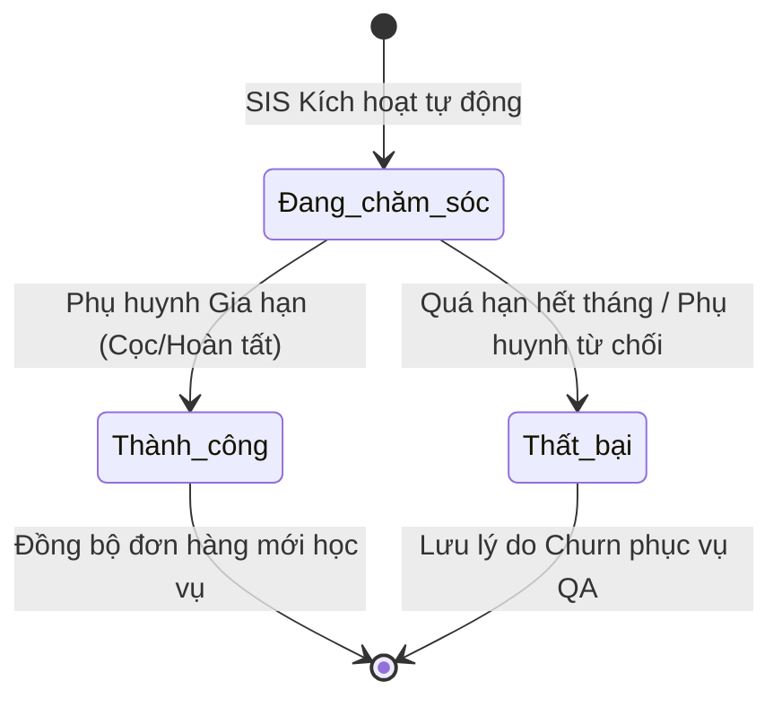

# BF-CARE-02: Chiến dịch Tái phí & Giữ chân Học viên

> **Capability:** CAP-CARE (Năng lực Chăm sóc Học viên & Vận hành)
> **Giai đoạn:** 2 - Vận hành & Phát triển Khách hàng
> **Nhóm chức năng:** Chăm sóc & Tái ký học phí
> **Mã màn hình:** `renewal`, `student_operations_alert`

---

## 1. Bản chất Nghiệp vụ Tái phí (Tuition Renewal)

Trong quản lý vận hành cơ sở giáo dục và trường học, **Tái phí (Tuition Renewal / Student Retention)** không đơn thuần là hoạt động thu học phí chu kỳ tiếp theo, mà là thước đo sống còn thể hiện **sự hài lòng của khách hàng (Customer Retention)** và **giá trị vòng đời học viên (LTV - Customer Lifetime Value)**. 

Chi phí tiếp thị để tuyển sinh một học viên mới (CAC - Customer Acquisition Cost) trung bình cao gấp **5 đến 7 lần** chi phí chăm sóc và thuyết phục một học viên cũ tiếp tục theo học. Do đó, hoạt động Tái phí là "huyết mạch" đảm bảo sự ổn định tài chính và dòng tiền dài hạn cho cơ sở giáo dục.

### 1.1. Bản chất cốt lõi:
*   **Giao thoa giữa Học thuật và Dịch vụ:** Sự tin tưởng của phụ huynh phụ thuộc vào tính tiến bộ rõ rệt của học viên (điểm số, kỹ năng học tập thực tế) kết hợp với trải nghiệm chăm sóc định kỳ chuyên nghiệp từ chuyên viên Chăm sóc (CSM).
*   **Tác nghiệp mang tính Tư vấn lộ trình:** Thay vì thúc ép phụ huynh đóng phí, hoạt động này diễn ra dưới hình thức báo cáo kết quả tiến trình học tập, phân tích những lỗ hổng kiến thức con cần bù đắp, từ đó đề xuất gói chương trình và lộ trình học tập tối ưu tiếp theo (Upsell / Level-up).

---

## 2. Đối tượng sử dụng (Vai trò)

- **Chuyên viên Chăm sóc (CSM):** Người chịu trách nhiệm chính trong việc rà soát chỉ số học thuật, liên hệ báo cáo tiến trình học tập của con, tư vấn lộ trình mới, và thuyết phục phụ huynh thực hiện gia hạn đóng phí.
- **Quản lý Chi nhánh:** Giám sát tỷ lệ chuyển đổi tái phí của toàn cơ sở, phê duyệt các trường hợp đề xuất chính sách giảm giá/Early Bird đặc biệt, hỗ trợ tháo gỡ các ca phản hồi khó hoặc khiếu nại chất lượng đào tạo.
- **Hệ thống tự động:** Tự động giám sát thời lượng, quét cảnh báo sắp hết hạn, tự động áp dụng logic trạng thái theo dòng thời gian và đóng hồ sơ khi có đơn hàng đóng đủ được thanh toán thành công.

---

## 3. Ranh giới Nghiệp vụ (Scope)

### Có bao gồm (In Scope)
- Cấu hình điều kiện cảnh báo tự động sắp hết hạn học phí (Ngưỡng cảnh báo C90B khi học viên còn dưới 5-10 buổi học hoặc dưới 30 ngày học phí).
- Quản lý chiến dịch tái phí theo phân vùng thời gian: quá khứ (vợt fail), hiện tại (tái phí chính khóa), tương lai (chồng phí đóng sớm).
- Ghi nhận lịch sử tương tác cuộc gọi tái phí, lý do từ chối học tiếp (Churn Reasons) để phục vụ cải tiến dịch vụ.
- Đề xuất chương trình học tiếp theo (Upsell) dựa trên cấp độ và sub-level.

### Không bao gồm (Out of Scope)
- Khởi tạo hóa đơn chi tiết, in biên lai vật lý và quản lý dòng tiền tại quầy thu ngân -> Xử lý tại Phân hệ Thương mại & Tài chính (`CAP-COM` & `CAP-FIN`).
- Quy trình xếp lớp mới hoặc đổi ca học sau khi tái phí thành công -> Xử lý tại Phân hệ Quản lý Lớp học (`BF-CLS-02`).

---

## 4. Mô hình Dữ liệu Nghiệp vụ (Data Entities)

| Tên Thực thể | Trường định danh | Thuộc tính quan trọng | Ràng buộc quan hệ | Diễn giải |
|--------------|------------------|-----------------------|-------------------|----------|
| Hồ sơ Tái phí | Mã hồ sơ tái phí | Ngày hết hạn cũ, Trạng thái tái phí, Kết quả hành động, Ghi chú CS | Trỏ về Mã Học viên & Mã Lớp học | Thực thể theo dõi chiến dịch chốt tái phí trên từng lớp học cụ thể của học viên. |
| Nhật ký Tương tác Tái phí | Mã nhật ký tái phí | Loại hành động, Ngày liên hệ, Nội dung trao đổi | Trỏ về Mã Hồ sơ Tái phí | Ghi lại lịch sử các cuộc gọi, tin nhắn Zalo tư vấn tái phí với phụ huynh. |
| Danh mục Lý do Từ chối | Mã lý do | Tên lý do (Chuyển nhà, Học phí cao, Mất lòng tin chất lượng) | Độc lập | Phục vụ việc phân tích thống kê tỷ lệ churn phục vụ quản trị chi nhánh. |

### 4.1. Vòng đời Trạng thái (Status Lifecycle)

*   **Đang chăm sóc (In Progress):** Chuyên viên đang trong quá trình trao đổi, tư vấn lộ trình và gửi báo cáo học tập cho phụ huynh.
*   **Thành công (Won):** Phụ huynh đồng ý cho con học tiếp, thể hiện bằng hành động đặt cọc một phần hoặc hoàn tất đóng đủ học phí gói mới.
*   **Thất bại (Lost):** Phụ huynh từ chối gia hạn vì lý do cá nhân/chất lượng hoặc hồ sơ quá hạn chăm sóc tối đa mà không phát sinh đóng phí.

---

## 5. Quy tắc Nghiệp vụ Chiến dịch theo Dòng thời gian (Business Rules)

### 5.1. Quy tắc [RULE-RENEWAL-01]: Phân nhóm Thời gian Tác nghiệp
Hồ sơ tái phí của học viên được tự động định tuyến vào 3 chiến dịch cụ thể căn cứ theo ngày hết hạn học phí so với thời điểm hiện tại (Tháng T):

1.  **Tháng đã qua (Tháng T-1 - Chiến dịch Vợt Fail):**
    *   *Mục tiêu:* Tiếp cận lại các học viên đã trễ hạn học phí ở chu kỳ trước nhưng chuyên viên chưa liên hệ được hoặc phụ huynh còn do dự trì hoãn.
    *   *Đặc thù:* Cho phép ghi nhận lịch sử tương tác mới độc lập để hồi sinh cơ hội giữ chân học viên cũ.

2.  **Tháng hiện tại (Tháng T - Chiến dịch Tái phí Chính khóa):**
    *   *Mục tiêu:* Tâm điểm chăm sóc giữ chân chính khóa. Nhân viên cần chủ động gửi báo cáo học tập và liên hệ tư vấn trước ngày hết hạn ít nhất 3 tuần.
    *   *Quy tắc hết hạn tự động:* **Khi kết thúc ngày cuối cùng của tháng T**, tất cả các hồ sơ thuộc tháng T vẫn ở trạng thái `Đang chăm sóc` mà chưa có hành động tài chính nào phát sinh sẽ **tự động chuyển sang trạng thái `Thất bại`** (lý do: "Hết hạn chăm sóc tự động").

3.  **Tháng tương lai (Tháng T+1 & T+2 - Chiến dịch Chồng Phí Sớm):**
    *   *Mục tiêu:* Đón đầu dòng tiền sớm bằng cách tư vấn trước cho phụ huynh có hạn hết phí cận kề ở 1-2 tháng tới, đi kèm các chương trình giữ chỗ hoặc Early Bird đóng sớm.
    *   *Bảo lưu trạng thái:* Khi kết thúc tháng hiện tại, các hồ sơ thuộc tháng tương lai **vẫn tiếp tục được bảo lưu trạng thái `Đang chăm sóc`** để tư vấn tiếp ở chu kỳ sau, tuyệt đối không bị quét chuyển sang thất bại tự động.

### 5.2. Quy tắc [RULE-RENEWAL-02]: Ánh xạ kết quả hành động tài chính
Khi chuyên viên Chăm sóc thực hiện tác nghiệp cập nhật giao dịch tài chính từ phụ huynh, hệ thống tự động tính toán và đưa ra kết quả phân loại nghiệp vụ tương ứng:

*   **Hành động: Khách cọc (Đặt cọc giữ chỗ):**
    *   *Logic:* Trạng thái chuyển sang **Thành công**, phân loại kết quả là **Gia hạn thời gian hết phí**.
    *   *Hành động hệ thống:* Hệ thống tự động gia hạn ngày hết hạn học phí dự kiến thêm 30 ngày trên học vụ để học viên tiếp tục được điểm danh đi học bình thường trong thời gian chờ đóng nốt phí.
*   **Hành động: Hoàn tất / Đóng full (Đóng đủ học phí gói mới):**
    *   *Nếu thuộc Tháng quá khứ (T-1):* Chuyển sang **Thành công**, kết quả hiển thị: **Vợt fail thành công** (giữ chân thành công học viên suýt mất).
    *   *Nếu thuộc Tháng hiện tại (T):* Chuyển sang **Thành công**, kết quả hiển thị: **Tái phí thành công** (hoàn thành đúng hạn hạn mục tiêu).
    *   *Nếu thuộc Tháng tương lai (T+1/T+2):* Chuyển sang **Thành công**, kết quả hiển thị: **Chồng phí tháng T thành công** (doanh thu sớm bảo đảm).

### 5.3. Quy tắc [RULE-RENEWAL-03]: Đồng bộ 360 độ chỉ số vận hành
Để phục vụ quá trình gọi điện thuyết phục phụ huynh, màn hình Tái phí học viên bắt buộc phải đồng bộ hóa đầy đủ thông tin vận hành học tập của học viên đó tương tự màn hình Theo dõi vận hành:
*   Điểm chuyên cần trung bình (Attendance) kèm thanh tiến trình trực quan.
*   Mức độ hoàn thành bài tập về nhà (Homework Completion %).
*   Điểm kiểm tra gần nhất và Điểm trung bình tổng học thuật để chứng minh sự tiến bộ.
*   Thông tin giáo viên chính và giáo viên dạy thay (đánh dấu avatar màu vàng) để hỗ trợ phản hồi thắc mắc về lớp học.
