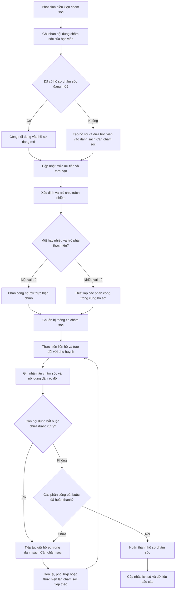

# QUY TRÌNH QUẢN LÝ CHĂM SÓC HỌC VIÊN VÀ PHỤ HUYNH (GIAI ĐOẠN 1 - MVP)

**Mã tài liệu:** QT-CSKH-01  
**Thuộc phân hệ:** Chăm sóc học viên (CARE)  
**Tài liệu liên quan:** Phụ lục danh mục điều kiện chăm sóc (`PL-CSKH-01`), Lộ trình triển khai phân kỳ (`RM-CARE-01`)  
**Phiên bản:** 1.0 (Áp dụng cho Giai đoạn 1 - MVP)  
**Ngày hiệu lực:** 01/08/2026  
**Đơn vị quản lý:** Bộ phận Chăm sóc khách hàng & Bộ phận Chuyên môn  
**Người lập:** Ban Dự án Rinov5  
**Người kiểm tra:** Quản lý Vận hành CARE  
**Người phê duyệt:** Giám đốc Sản phẩm  

---

## 1. Mục đích

Quy trình này quy định thống nhất việc tiếp nhận, phân công, thực hiện, ghi nhận và hoàn thành hoạt động chăm sóc học viên, phụ huynh trong **Giai đoạn 1 (MVP)** nhằm:
1. Nhận diện và xử lý kịp thời các trường hợp rủi ro hoặc có nhu cầu hỗ trợ của học viên.
2. Phân định rõ trách nhiệm xử lý giữa Giáo viên và Nhân sự CSKH.
3. Bảo đảm việc liên hệ được thực hiện đúng thời hạn mục tiêu (SLA), đúng đối tượng và đúng nội dung.
4. Đơn giản hóa thao tác ghi nhận của nhân sự thông qua giao diện hộp thoại thông tin nổi tinh gọn.
5. Hạn chế việc liên hệ trùng lặp hoặc bỏ sót thông tin chăm sóc.

---

## 2. Phạm vi Áp dụng Giai đoạn 1

Quy trình này áp dụng cho toàn bộ hoạt động chăm sóc phát sinh đối với học viên đang theo học tại các cơ sở trong **Giai đoạn 1 (Khởi đầu / MVP)**.

### 2.1. Phạm vi điều kiện nghiệp vụ
* Quy trình áp dụng đối với các điều kiện chăm sóc được danh mục hóa tại Phụ lục Danh mục điều kiện chăm sóc (`PL-CSKH-01`) áp dụng cho Giai đoạn 1.
* Danh mục điều kiện chi tiết, người chịu trách nhiệm chính, vai trò phối hợp, mức độ ưu tiên và thời hạn xử lý mục tiêu (SLA) được quy định linh hoạt và cập nhật tại Phụ lục `PL-CSKH-01`.

---

## 3. Tài liệu Dẫn chiếu

* `RM-CARE-01`: Lộ trình triển khai phân kỳ phân hệ Chăm sóc học viên.
* `PL-CSKH-01`: Phụ lục danh mục điều kiện chăm sóc học viên và phụ huynh.
* `BM-CSKH-01`: Biểu mẫu thao tác chăm sóc học viên và phụ huynh.
* `HD-CSKH-01`: Hướng dẫn thực hiện chăm sóc học viên và phụ huynh.
* Quy định bảo mật và sử dụng thông tin học viên, phụ huynh.

---

## 4. Thuật ngữ và Viết tắt

| Thuật ngữ / Viết tắt | Giải thích nghiệp vụ |
| :--- | :--- |
| **Chăm sóc** | Hoạt động liên hệ, trao đổi hoặc phản hồi với phụ huynh nhằm cập nhật tình hình học tập và hỗ trợ học viên. |
| **Công việc chăm sóc** | Bản ghi công việc được giao cho một cá nhân chịu trách nhiệm chính, có nội dung và thời hạn xử lý. |
| **Ghi nhận chăm sóc** | Hồ sơ lưu lại kết quả của một lần liên hệ thực tế với phụ huynh. |
| **Hẹn gọi lại** | Việc thống nhất một thời điểm khác để tiếp tục cuộc trao đổi với phụ huynh. |
| **GV** | Giáo viên phụ trách lớp học. |
| **CS** | Nhân sự chăm sóc khách hàng / giáo vụ phụ trách cơ sở. |
| **QLCM** | Quản lý chuyên môn. |
| **QLCS** | Quản lý chăm sóc khách hàng hoặc Quản lý vận hành cơ sở. |
| **PH** | Phụ huynh hoặc người giám hộ của học viên. |
| **SLA** | Thời hạn mục tiêu phải thực hiện cuộc liên hệ đầu tiên với phụ huynh theo quy định tại Phụ lục danh mục. |

---

## 5. Nguyên tắc Thực hiện Giai đoạn 1

1. **Công việc phải có căn cứ:** Mỗi công việc chăm sóc phải phát sinh từ điều kiện thuộc Phụ lục `PL-CSKH-01` hoặc phản ánh trực tiếp từ phụ huynh.
2. **Cơ chế cộng dồn nội dung (Batching):** Khi một học viên phát sinh điều kiện mới trong lúc đang có công việc chăm sóc chưa hoàn thành, hệ thống tự động gộp nội dung mới vào công việc hiện tại. Không tạo công việc mới trùng lặp.
3. **Phân định đúng vai trò:**
   - Giáo viên chịu trách nhiệm chính đối với các nội dung về học tập và chuyên môn.
   - Nhân sự CSKH chịu trách nhiệm chính đối với các nội dung về chuyên cần, dịch vụ và rủi ro dừng học.
4. **Không cam kết vượt thẩm quyền:** Nhân sự không tự ý cam kết các nội dung ngoài thẩm quyền về tài chính, miễn giảm học phí hoặc kỷ luật.
5. **Thao tác một điểm (Single Touchpoint):** Nhân sự thực hiện xem danh sách, mở hộp thoại thông tin nổi, nhập kết quả và cập nhật trạng thái ngay trên một màn hình duy nhất.

---

## 6. Vai trò và Trách nhiệm Giai đoạn 1

### 6.1. Giáo viên (GV)
* Theo dõi danh sách công việc được phân công liên quan đến học tập và bài tập.
* Chuẩn bị thông tin chuyên môn trước khi liên hệ phụ huynh.
* Thực hiện liên hệ và cập nhật kết quả trao đổi vào hệ thống đúng thời hạn SLA quy định tại Phụ lục.
* Bấm chuyển Quản lý chuyên môn khi học viên có tình trạng học tập yếu kéo dài.

### 6.2. Nhân sự CSKH (CS)
* Theo dõi danh sách công việc được phân công liên quan đến chuyên cần, dịch vụ và rủi ro dừng học.
* Làm đầu mối liên hệ phụ huynh đối với các yêu cầu hỗ trợ và phản ánh dịch vụ.
* Cập nhật kết quả cuộc gọi, lịch hẹn gọi lại đúng thời hạn SLA quy định tại Phụ lục.
* Bấm chuyển Quản lý CSKH khi phụ huynh có ý định xin dừng học hoặc phản ánh phức tạp.

### 6.3. Quản lý Chuyên môn & Quản lý CSKH (QLCM / QLCS)
* Theo dõi các trường hợp được chuyển cấp từ Giáo viên hoặc CSKH.
* Định hướng phương án xử lý đối với trường hợp điểm kém nghiêm trọng hoặc phụ huynh bức xúc.
* Trực tiếp tham gia trao đổi với phụ huynh đối với các trường hợp khẩn cấp.

---

## 7. Đầu vào và Đầu ra của Quy trình

### 7.1. Đầu vào
* Dữ liệu điểm danh, kết quả bài kiểm tra/đánh giá định kỳ hoặc ghi nhận học tập từ lớp học.
* Yêu cầu, phản ánh trực tiếp từ phụ huynh.
* Khai báo của học viên/phụ huynh về ý định bảo lưu, chuyển lớp, dừng học.

### 7.2. Đầu ra
* Công việc chăm sóc được phân công cho đúng vai trò.
* Kết quả liên hệ được lưu trữ vào lịch sử chăm sóc của học viên.
* Lịch hẹn gọi lại (nếu phụ huynh bận).
* Trạng thái công việc được cập nhật (`Mới` $\rightarrow$ `Đang xử lý` $\rightarrow$ `Hoàn thành`).
* Yêu cầu chuyển cấp được gửi đến Quản lý.

---

## 8. Sơ đồ Luồng Quy trình Tổng thể

---

## 9. Nội dung Chi tiết Các Bước Thực hiện

### 9.1. Bước 1 – Tiếp nhận và Ghi nhận nội dung chăm sóc ban đầu (Tương ứng bước A, B trên sơ đồ)
* **Người thực hiện:** Hệ thống tự động hoặc Nhân sự ghi nhận.
* **Hoạt động:**
  - Ngay khi xuất hiện điều kiện phát sinh chăm sóc (Node A) thuộc Phụ lục `PL-CSKH-01` (qua điểm danh, kết quả bài kiểm tra, phản ánh phụ huynh hoặc phát hiện thủ công), hệ thống hoặc nhân sự tiến hành ghi nhận nội dung chăm sóc của học viên (Node B).
* **Điểm kiểm soát:** Thông tin ghi nhận ban đầu phải gắn đúng mã học viên, lớp học, thời điểm phát sinh và nguồn thông tin hợp lệ.

### 9.2. Bước 2 – Kiểm tra hồ sơ đang mở, cộng dồn nội dung và cập nhật ưu tiên (Tương ứng bước C, D, E, F trên sơ đồ)
* **Người thực hiện:** Hệ thống tự động xử lý logic.
* **Hoạt động:**
  - Hệ thống kiểm tra xem học viên đã có hồ sơ chăm sóc nào đang mở hay chưa (Node C).
  - **Trường hợp đã có hồ sơ đang mở (Node D):** Tự động cộng dồn nội dung chăm sóc mới vào hồ sơ hiện tại để nhân sự trao đổi tập trung trong một lần liên hệ, tránh làm phiền phụ huynh nhiều lần.
  - **Trường hợp chưa có hồ sơ mở (Node E):** Tự động tạo hồ sơ chăm sóc mới và đưa học viên vào danh sách "Cần chăm sóc".
  - **Cập nhật ưu tiên và thời hạn (Node F):** Hệ thống tự động cập nhật lại thời hạn mục tiêu (SLA) và mức độ ưu tiên của toàn bộ hồ sơ theo điều kiện có tính chất khẩn cấp nhất hoặc thời hạn ngắn nhất.
* **Điểm kiểm soát:** Không tạo trùng hồ sơ chăm sóc độc lập cho cùng một học viên khi hồ sơ cũ chưa hoàn thành.

### 9.3. Bước 3 – Xác định vai trò chịu trách nhiệm và thiết lập phân công (Tương ứng bước G, H, I, J trên sơ đồ)
* **Người thực hiện:** Hệ thống tự động phân công theo quy tắc hoặc Quản lý điều phối.
* **Hoạt động:**
  - Xác định vai trò chịu trách nhiệm chính (Node G): Giáo viên đối với các nội dung chuyên môn/bài tập; Nhân sự CSKH đối với chuyên cần/dịch vụ/rủi ro dừng học.
  - Kiểm tra số lượng vai trò cần tham gia thực hiện (Node H).
  - **Trường hợp 1 vai trò thực hiện (Node I):** Phân công một người chịu trách nhiệm chính duy nhất để chủ động liên hệ phụ huynh.
  - **Trường hợp nhiều vai trò thực hiện (Node J):** Thiết lập các phân công xử lý song song hoặc phối hợp trong cùng một hồ sơ chăm sóc (ví dụ: Giáo viên trao đổi thông tin học tập, CSKH hỗ trợ thủ tục chuyển lớp).
* **Điểm kiểm soát:** Mỗi phân công phải có rõ người thực hiện chính, thời hạn xử lý và vai trò phối hợp.

### 9.4. Bước 4 – Chuẩn bị thông tin, thực hiện liên hệ và ghi nhận lần chăm sóc (Tương ứng bước K, L, M trên sơ đồ)
* **Người thực hiện:** Giáo viên hoặc Nhân sự CSKH được phân công.
* **Hoạt động:**
  - **Chuẩn bị thông tin (Node K):** Nhân sự kiểm tra lịch sử chăm sóc gần nhất, tổng hợp kết quả học tập, tình hình chuyên cần và các nội dung cần trao đổi.
  - **Thực hiện liên hệ (Node L):** Gọi điện, nhắn tin hoặc gặp trực tiếp phụ huynh/người giám hộ theo kịch bản giao tiếp chuẩn tại tài liệu `HD-CSKH-01`.
  - **Ghi nhận lần chăm sóc (Node M):** Ngay sau khi liên hệ, nhân sự mở bảng thông tin nổi (hộp thoại) trên giao diện để ghi nhận kết quả liên hệ thực tế, nội dung đã trao đổi và ý kiến phản hồi của phụ huynh.
* **Điểm kiểm soát:** Phải liên hệ trong thời hạn SLA quy định. Ghi nhận nội dung phải ngắn gọn, khách quan, trung thực với thực tế trao đổi.

### 9.5. Bước 5 – Đánh giá hoàn thành, hẹn lại hoặc đóng hồ sơ chăm sóc (Tương ứng bước N, O, P, Q, R, S trên sơ đồ)
* **Người thực hiện:** Người phụ trách hồ sơ và Hệ thống tự động.
* **Hoạt động:**
  - Kiểm tra còn nội dung bắt buộc nào chưa được xử lý hay không (Node N).
  - **Nếu còn nội dung hoặc phụ huynh bận (Node O, P):** Giữ hồ sơ trong danh sách "Cần chăm sóc", chọn lịch hẹn gọi lại hoặc chuyển phối hợp để thực hiện lần chăm sóc tiếp theo (Node P $\rightarrow$ Quay lại Node L).
  - **Nếu hết nội dung bắt buộc (Node N -- Không):** Hệ thống kiểm tra tiếp xem tất cả các phân công bắt buộc trong hồ sơ đã hoàn thành hay chưa (Node Q).
  - **Nếu tất cả phân công đã hoàn thành (Node Q -- Rồi):** Chuyển hồ sơ sang trạng thái 🟢 **Hoàn thành hồ sơ chăm sóc** (Node R).
  - **Cập nhật dữ liệu (Node S):** Tự động lưu toàn bộ nhật ký vào lịch sử học viên và cập nhật dữ liệu báo cáo vận hành.
* **Điểm kiểm soát:** Hồ sơ chỉ được xác nhận hoàn thành khi 100% nội dung và phân công bắt buộc đã được xử lý xong.

---

## 10. Báo cáo và Kiểm soát Vận hành Giai đoạn 1

Hàng tuần, Quản lý cơ sở thực hiện kiểm tra 2 chỉ số vận hành cơ bản:
1. **Tỷ lệ hoàn thành đúng hạn (SLA Compliance):** Số công việc hoàn thành trong SLA / Tổng số công việc phát sinh (Mục tiêu $\ge 85\%$).
2. **Tỷ lệ ghi nhận đầy đủ:** Số công việc có đầy đủ ý kiến phụ huynh / Tổng số công việc đã hoàn thành (Mục tiêu $\ge 90\%$).

---

## 11. Kết luận

Quy trình `QT-CSKH-01` phiên bản Giai đoạn 1 (MVP) giúp tối giản hóa tối đa các bước vận hành, giúp Giáo viên và Nhân sự CSKH dễ dàng tiếp nhận công việc, thực hiện cuộc gọi đúng trọng tâm và lưu lại kết quả nhanh chóng, tạo nền tảng vững chắc trước khi mở rộng sang các giai đoạn tiếp theo.
