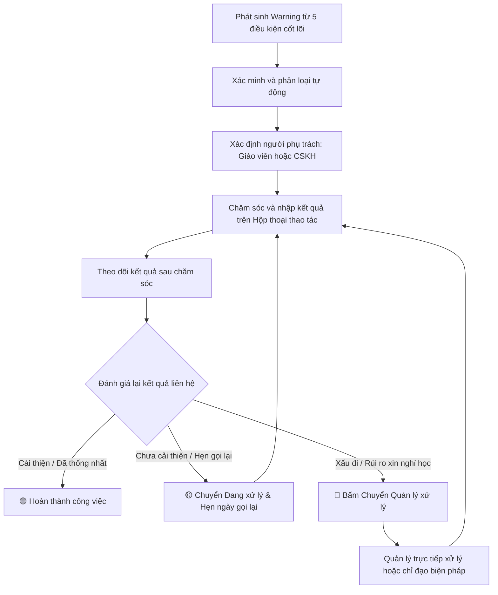

# QUY ĐỊNH XỬ LÝ CẢNH BÁO VÀ CHUYỂN CẤP (GIAI ĐOẠN 1 - MVP)

**Mã tài liệu:** QĐ-CSKH-01  
**Thuộc quy trình:** Quy trình quản lý chăm sóc học viên và phụ huynh (`QT-CSKH-01`)  
**Tài liệu liên quan:** Phụ lục danh mục điều kiện chăm sóc (`PL-CSKH-01`), Biểu mẫu thao tác chăm sóc (`BM-CSKH-01`), Lộ trình triển khai phân kỳ (`RM-CARE-01`)  
**Phiên bản:** 1.0 (Áp dụng cho Giai đoạn 1 - MVP)  
**Ngày hiệu lực:** 01/08/2026  
**Đơn vị quản lý:** Bộ phận Chăm sóc khách hàng & Bộ phận Chuyên môn  
**Người lập:** Ban Dự án Rinov5  
**Người kiểm tra:** Quản lý Vận hành CARE  
**Người phê duyệt:** Giám đốc Sản phẩm  

---

## 1. Mục đích

Quy định này thống nhất việc:
1. Quản lý tình trạng rủi ro và các cảnh báo của học viên trong **Giai đoạn 1 (MVP)**.
2. Xác định các tiêu chí bắt buộc phải chuyển cấp công việc cho cấp Quản lý xử lý.
3. Quy định trình tự xử lý các trường hợp nghiêm trọng, khẩn cấp và ngoại lệ.
4. Bảo đảm các rủi ro học viên được theo dõi chặt chẽ, không bị bỏ sót hoặc xử lý quá hạn.

---

## 2. Phạm vi Áp dụng Giai đoạn 1

Quy định này áp dụng đối với toàn bộ các tình huống cảnh báo rủi ro, yêu cầu chuyển cấp và xử lý ngoại lệ phát sinh tại các cơ sở trong **Giai đoạn 1 (Khởi đầu / MVP)**.

### 2.1. Đơn giản hóa quy định ở Giai đoạn 1
* Trong Giai đoạn 1 MVP, hệ thống **tạm thời chưa áp dụng quy trình 6 trạng thái vòng đời cảnh báo phức tạp** (Mới, Đang theo dõi, Đang can thiệp, Đã kiểm soát, Đã đóng, Không hợp lệ).
* Toàn bộ việc quản lý rủi ro và cảnh báo ở Giai đoạn 1 được thực hiện trực tiếp trên Danh sách công việc chăm sóc với **3 trạng thái vận hành cơ bản**:
  - 🔴 **Mới (Cần chăm sóc)**
  - 🟡 **Đang xử lý (Đang theo dõi / Hẹn gọi lại)**
  - 🟢 **Hoàn thành (Đã trao đổi & thống nhất xong)**
* Việc chuyển cấp được thực hiện thông qua thao tác bấm chọn **[Chuyển Quản lý]** ngay trên Hộp thoại thao tác chăm sóc (`BM-CSKH-01`).

---

## 3. Tài liệu Dẫn chiếu

* `QT-CSKH-01`: Quy trình quản lý chăm sóc học viên và phụ huynh (Giai đoạn 1 - MVP).
* `PL-CSKH-01`: Phụ lục danh mục điều kiện chăm sóc học viên và phụ huynh.
* `BM-CSKH-01`: Biểu mẫu thao tác chăm sóc học viên và phụ huynh.
* `RM-CARE-01`: Lộ trình triển khai phân kỳ phân hệ Chăm sóc học viên.

---

## 4. Thuật ngữ và Viết tắt

| Thuật ngữ / Viết tắt | Giải thích nghiệp vụ |
| :--- | :--- |
| **Cảnh báo rủi ro** | Ghi nhận phản ánh dấu hiệu bất thường về chuyên cần, điểm số, bài tập hoặc dịch vụ của học viên. |
| **Chuyển cấp (Escalation)** | Việc chuyển công việc chăm sóc lên Quản lý chuyên môn hoặc Quản lý CSKH khi tình huống vượt quá thẩm quyền hoặc có rủi ro lớn. |
| **Công việc bị quá hạn** | Công việc chăm sóc chưa được thực hiện liên hệ khi đã vượt quá thời hạn mục tiêu (SLA). |
| **Rủi ro dừng học** | Trường hợp phụ huynh hoặc học viên thể hiện ý định muốn nghỉ học, bảo lưu hoặc chuyển cơ sở. |
| **QLCM** | Quản lý chuyên môn cơ sở. |
| **QLCS** | Quản lý chăm sóc khách hàng hoặc Quản lý vận hành cơ sở. |

---

## 5. Nguyên tắc Quản lý Cảnh báo Giai đoạn 1

1. **Không tạo trùng công việc:** Khi một học viên đã có công việc chăm sóc đang mở, nếu phát sinh cảnh báo mới thuộc Phụ lục `PL-CSKH-01`, hệ thống tự động cộng dồn nội dung mới vào công việc hiện tại.
2. **Cảnh báo phải có người phụ trách:** 100% công việc xuất hiện trên danh sách phải có một người chịu trách nhiệm chính (Giáo viên hoặc Nhân sự CSKH).
3. **Cập nhật dựa trên kết quả liên hệ thực tế:** Việc chuyển trạng thái công việc phải căn cứ vào thông tin đã trao đổi thực tế với phụ huynh, không chuyển trạng thái tự ý khi chưa liên hệ.
4. **Xử lý ưu tiên theo điều kiện khẩn cấp nhất:** Thời hạn xử lý (SLA) của toàn bộ công việc cộng dồn được tính theo điều kiện có thời hạn ngắn nhất.

### 5.1. Sơ đồ Luồng Xử lý Cảnh báo Giai đoạn 1 (Tối giản từ sơ đồ chuẩn)

### 5.2. Ánh xạ từ Sơ đồ chuẩn sang Giai đoạn 1 MVP

| Bước trên sơ đồ chuẩn | Áp dụng ở Giai đoạn 1 (MVP) |
| :--- | :--- |
| **Phát sinh & Phân loại (A, B, C)** | Tự động phát sinh từ 5 điều kiện cốt lõi (`PL-CSKH-01`) và gán cho GV hoặc CSKH. |
| **Chăm sóc & Theo dõi (D, E, F)** | Nhân sự gọi điện/nhắn tin và nhập kết quả trực tiếp trên **Hộp thoại thông tin nổi (`BM-CSKH-01`)**. |
| **Nhánh Cải thiện (G, H)** | Đánh giá đạt thống nhất $\rightarrow$ Chuyển thẳng sang trạng thái 🟢 **Hoàn thành** (gộp 2 bước Đã kiểm soát và Đóng). |
| **Nhánh Chưa cải thiện (I)** | Phụ huynh bận / Hẹn gọi lại $\rightarrow$ Chuyển trạng thái 🟡 **Đang xử lý** và chọn ngày hẹn gọi lại. |
| **Nhánh Nghiêm trọng (J, K)** | Có rủi ro xin nghỉ học / bức xúc $\rightarrow$ Bấm nút 🔴 **[Chuyển Quản lý]** để Quản lý chỉ đạo/trực tiếp xử lý. |

---

## 6. Tiêu chí Bắt buộc Chuyển cấp (Escalation Criteria)

Nhân sự trực tiếp (Giáo viên hoặc CSKH) bắt buộc phải bấm nút **[Chuyển Quản lý]** trên Hộp thoại thao tác (`BM-CSKH-01`) khi gặp một trong 5 trường hợp sau:

### 6.1. Trường hợp 1: Phụ huynh có ý định dừng học hoặc bảo lưu (Mã `RR-01`)
* **Dấu hiệu:** Phụ huynh trực tiếp đề nghị xin thôi học, rút phí, bảo lưu kết quả hoặc chuyển sang trung tâm khác.
* **Thời hạn chuyển cấp:** Bấm chuyển ngay lập tức sau khi tiếp nhận thông tin (Thời hạn Quản lý xử lý trong 12 giờ).

### 6.2. Trường hợp 2: Phản ánh, khiếu nại dịch vụ bức xúc (Mã `DV-01` mức độ cao)
* **Dấu hiệu:** Phụ huynh thể hiện sự bức xúc lớn về chất lượng giảng dạy của giáo viên, thái độ phục vụ hoặc điều kiện cơ sở vật chất.
* **Thời hạn chuyển cấp:** Bấm chuyển ngay trong ngày (Thời hạn Quản lý xử lý trong 24 giờ).

### 6.3. Trường hợp 3: Kết quả học tập kém kéo dài (Mã `HT-01` tái diễn)
* **Dấu hiệu:** Học viên bị điểm dưới chuẩn từ 2 bài kiểm tra liên tiếp trở lên, mặc dù Giáo viên đã trao đổi với phụ huynh nhưng không có sự cải thiện.
* **Thời hạn chuyển cấp:** Bấm chuyển cho Quản lý chuyên môn ngay sau khi có kết quả bài kiểm tra lần 2.

### 6.4. Trường hợp 4: Công việc chăm sóc bị quá hạn SLA
* **Dấu hiệu:** Công việc nghỉ học (`CC-01`) hoặc phản ánh (`DV-01`) đã quá hạn SLA 24 giờ mà nhân sự CSKH chưa liên hệ được hoặc chưa xử lý.
* **Thời hạn chuyển cấp:** Hệ thống tự động cảnh báo nổi bật và chuyển đến màn hình kiểm soát của Quản lý cơ sở.

### 6.5. Trường hợp 5: Phụ huynh đòi hỏi cam kết vượt thẩm quyền
* **Dấu hiệu:** Phụ huynh yêu cầu miễn giảm học phí, hoàn phí đặc biệt, thay đổi giáo viên riêng hoặc các cam kết chính sách ngoài quy định.
* **Thời hạn chuyển cấp:** Ghi nhận ngắn gọn yêu cầu của phụ huynh và bấm chuyển Quản lý quyết định.

---

## 7. Trách nhiệm của Quản lý khi Nhận Chuyển cấp

Khi nhận được công việc chuyển cấp (qua thông báo hệ thống hoặc danh sách chuyển cấp):

1. **Thời gian tiếp nhận:** Quản lý cơ sở (QLCM hoặc QLCS) có trách nhiệm mở xem và tiếp nhận thông tin trong vòng **2 giờ làm việc**.
2. **Phương án xử lý:**
   - *Phương án 1:* Định hướng hướng xử lý và ghi chú phản hồi để Giáo viên/CSKH tiếp tục liên hệ phụ huynh.
   - *Phương án 2:* Trực tiếp đứng ra gọi điện hoặc mời phụ huynh đến cơ sở trao đổi trực tiếp đối với các trường hợp khẩn cấp (`RR-01` hoặc khiếu nại lớn).
3. **Cập nhật kết quả:** Quản lý ghi nhận kết quả xử lý vào ô *Ghi chú chuyển cấp* và cập nhật trạng thái công việc sang 🟢 **Hoàn thành** hoặc 🟡 **Đang xử lý**.

---

## 8. Xử lý các Trường hợp Ngoại lệ Giai đoạn 1

### 8.1. Học viên theo học nhiều lớp
* **Quy tắc:** Phân công Nhân sự CSKH làm đầu mối chịu trách nhiệm chính. Giáo viên các lớp có trách nhiệm cung cấp thông tin chuyên môn khi được CSKH đề nghị, không tự ý liên hệ riêng lẻ gây trùng lặp.

### 8.2. Thay đổi Giáo viên phụ trách hoặc Nhân sự CSKH
* **Quy tắc:** Khi có sự thay đổi nhân sự phụ trách lớp/cơ sở, Toàn bộ danh sách công việc đang mở và lịch sử chăm sóc trước đó của học viên được tự động chuyển sang tài khoản của nhân sự mới.

### 8.3. Thông tin liên hệ bị sai hoặc thuê bao không liên lạc được
* **Quy tắc:** 
  - Nhân sự chọn *Kết quả liên hệ:* `Sai số điện thoại / Thuê bao`.
  - Giữ trạng thái công việc ở mức 🟡 **Đang xử lý**.
  - Gửi thông báo đề nghị Bộ phận Tuyển sinh / Giáo vụ cơ sở kiểm tra và cập nhật lại số điện thoại chính xác của phụ huynh.

---

## 9. Quy tắc Hoàn thành và Đóng Công việc Chăm sóc

Trong Giai đoạn 1 MVP, một công việc chăm sóc **chỉ được xác nhận là Hoàn thành (Đóng công việc)** khi đáp ứng đủ 3 điều kiện:

1. Nhân sự đã thực hiện liên hệ thành công (qua điện thoại, tin nhắn hoặc gặp trực tiếp).
2. Hai bên (Nhân sự & Phụ huynh) đã đạt được thống nhất về phương án phối hợp hoặc giải quyết xong nhu cầu.
3. Nhân sự đã nhập đầy đủ *Tóm tắt nội dung trao đổi* và *Ý kiến phụ huynh* trên Hộp thoại thao tác (`BM-CSKH-01`) và bấm chuyển trạng thái 🟢 **Hoàn thành**.

---

## 10. Kết luận

Quy định `QĐ-CSKH-01` phiên bản Giai đoạn 1 (MVP) giúp tối giản hóa cơ chế quản lý cảnh báo và chuyển cấp, tập trung giải quyết nhanh các tình huống rủi ro dừng học và khiếu nại bức xúc, bảo đảm mọi ca khó đều được Quản lý hỗ trợ kịp thời.
