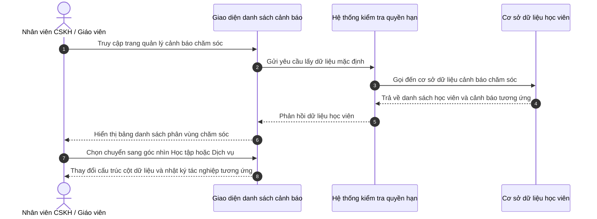

# US-CARE-01-01: Danh sách Cảnh báo Vận hành & Chăm sóc Học viên

> **Tham chiếu:** BF-CARE-01 · SR-CSM-001 · Giao diện Mẫu §4.2 (Danh sách)
> **Đường dẫn màn hình & Trạng thái liên quan:**
> - `/app/operations_alert` -> Trạng thái: Hoạt động

---

## 1. NHẬT KÝ THAY ĐỔI & BỐI CẢNH (CHANGELOG & CONTEXT)

### Lịch sử cập nhật tài liệu (Changelog)

| Ngày cập nhật | Nội dung cập nhật | Lý do cập nhật |
|---|---|---|
| 15/07/2026 | Thêm tab lọc Đã chăm sóc, chuyển các thẻ điều kiện (Học lực, BTVN, Chuyên cần) thành các checkbox lọc đa chọn nằm bên phải | Thiết lập bộ lọc nhanh trực quan và nâng cao năng lực kết hợp lọc nhiều điều kiện |
| 15/07/2026 | Thay đổi màu sắc thẻ lọc Chưa chăm sóc sang màu xanh dương (thông tin) | Tránh trùng lặp màu sắc với thẻ lọc Chuyên cần |
| 15/07/2026 | Điều chỉnh bộ lọc nhanh: Đổi tên Trễ Hẹn -> Quá hạn (đỏ), Hôm nay -> Đến hạn (cam), Chuyên cần thấp -> Chuyên cần (xanh lá) | Đồng bộ theo phản hồi nghiệp vụ mới |
| 15/07/2026 | Điều chỉnh bộ lọc nhanh: Đổi tên Trễ SLA thành Trễ Hẹn, thêm Hôm nay, đổi tên Học lực yếu thành Học lực, bỏ Xu hướng giảm, thêm BTVN | Cập nhật theo yêu cầu nghiệp vụ mới nhằm tối ưu hóa các ca cần xử lý trong ngày |
| 09/07/2026 | Khởi tạo tài liệu đặc tả và phân luồng góc nhìn Giáo viên và Chăm sóc viên | Đáp ứng yêu cầu phân định nghiệp vụ chăm sóc học tập và dịch vụ |

### Bối cảnh & Vấn đề nghiệp vụ (Context & Problem)
* **Bối cảnh:** Thuộc nghiệp vụ chăm sóc học viên tổng thể tại cơ sở nhằm tăng cường chất lượng giảng dạy và dịch vụ khách hàng.
* **Vấn đề hiện tại:** Chưa có sự phân định rõ ràng giữa nhiệm vụ chăm sóc học tập của giáo viên và nhiệm vụ chăm sóc dịch vụ của nhân viên chăm sóc khách hàng trên cùng một màn hình danh sách cảnh báo, dẫn đến việc theo dõi và xử lý các ca cảnh báo bị chồng chéo.
* **Mục tiêu & Giá trị mang lại:** Phân tách rõ ràng luồng tác nghiệp theo từng vai trò chuyên biệt, giúp nâng cao hiệu quả phối hợp và tăng tỷ lệ hài lòng của phụ huynh.

### Hiểu người dùng & Tình huống sử dụng (User Needs & Use Cases)
* **Người dùng chính (Persona):** Nhân viên chăm sóc khách hàng (CSM) và Giáo viên tại cơ sở.
* **Khó khăn lớn nhất (Pain-points):** Khó khăn trong việc xác định nhanh thông tin nào thuộc trách nhiệm của mình để tương tác với phụ huynh học viên.
* **Nhu cầu thực tế (Needs):** Mong muốn có góc nhìn tập trung theo vai trò nghiệp vụ (học tập hoặc dịch vụ) để xử lý nhanh các tác vụ hàng ngày.
* **Câu phát biểu nghiệp vụ:** **Là một** nhân viên chăm sóc khách hàng hoặc giáo viên, **tôi muốn** chuyển đổi linh hoạt giữa góc nhìn học thuật và góc nhìn dịch vụ trên danh sách học viên cần chăm sóc, **để** nhanh chóng nắm bắt các chỉ số cảnh báo liên quan trực tiếp đến trách nhiệm của mình và ghi nhận nhật ký làm việc phù hợp.

### Phạm vi kiểm soát (Scope)
* **Phạm vi hiển thị:** Hiển thị danh sách học viên có cảnh báo vận hành được chia thành hai phân khu: học viên cần chăm sóc đặc biệt và danh sách học viên thường.
* **Ràng buộc nghiệp vụ toàn cục (Global Rules):**
  - **RULE-LIST-01 Chế độ hiển thị mặc định:** Mặc định khi truy cập hiển thị ở chế độ xem toàn bộ các trạng thái lớp học.
  - **RULE-LIST-02 Tìm kiếm học viên:** Cho phép tìm kiếm nhanh không phân biệt chữ hoa chữ thường theo tên, mã số định danh học viên.
  - **RULE-LIST-03 Số điện thoại liên hệ:** Số điện thoại của phụ huynh trên bảng danh sách phải được che ẩn phần đầu dạng xxxxxxx929 để bảo mật dữ liệu, chỉ hiển thị đầy đủ trong hộp thoại chi tiết khi người dùng có quyền xem.
  - **GLOBAL-METRIC-01 Số lượng bản ghi mặc định:** Hiển thị mặc định 20 bản ghi trên mỗi trang danh sách.
  - **GLOBAL-METRIC-02 Giới hạn xuất dữ liệu:** Kế thừa từ giới hạn hệ thống cũ, cho phép hiển thị các tùy chọn phân trang gồm 20, 50, 100 bản ghi.

---

## 2. LUỒNG XỬ LÝ CHÍNH (MAIN FLOW - HAPPY PATH)

*Mô tả luồng đi của người dùng từ khi truy cập màn hình danh sách, chọn vai trò góc nhìn chăm sóc cho đến khi lọc dữ liệu.*



---

## 3. GIAO DIỆN & TRẠNG THÁI TĨNH (DATA & UI STATE)

### 3.1. Thiết kế trực quan (Figma)
* **Link/Hình ảnh Figma:** [Chưa cập nhật]

### 3.2. Cấu trúc các vùng giao diện
Màn hình danh sách gồm có: Thanh chuyển đổi vai trò tác nghiệp → Bảng danh sách chính phân chia theo học viên cần chăm sóc đặc biệt và học viên thường → Bộ phân trang ở dưới cùng.

#### A. Thanh công cụ & Bộ lọc nhanh
| Thành phần | Loại hiển thị | Giá trị mặc định | Logic xử lý / Điều kiện hiển thị | Mobile Responsive |
|------------|---------------|------------------|----------------------------------|-------------------|
| Chuyển vai trò chăm sóc | Thanh chuyển đổi không nền | Góc nhìn toàn bộ | Thay đổi cấu trúc cột hiển thị của bảng theo vai trò được chọn | Thu gọn thành các tab chữ |
| Bộ lọc nâng cao | Hộp thoại lọc nổi bên phải | Trống | Cho phép chọn các tiêu chí lọc phụ như trường, trạng thái học, cảnh báo | Thu gọn thành biểu tượng phễu |
| Ô tìm kiếm nhanh | Ô nhập chữ | Trống | Tìm kiếm theo tên học viên, mã định danh, số điện thoại | Hiển thị đầy đủ |

#### B. Khối lọc nhanh (Status Tiles - Cạnh Trái)
| Thẻ Trạng thái | Nhóm màu hiển thị | Điều kiện lọc | Diễn giải | Mobile Responsive |
|----------------|-------------------|----------------|-----------|-------------------|
| Tất cả | Màu trung tính | Không áp dụng bộ lọc | Hiển thị tổng số cảnh báo | Cuộn ngang hiển thị |
| Quá hạn | Màu tiêu cực | Học viên bị quá hạn xử lý các yêu cầu chăm sóc học viên | Số lượng cảnh báo đã quá hạn xử lý | Cuộn ngang hiển thị |
| Đến hạn | Màu cảnh báo | Học viên có buổi học trùng vào ngày hiện tại | Số lượng học viên có buổi học trong ngày | Cuộn ngang hiển thị |
| Chưa chăm sóc | Màu thông tin | Học viên chưa từng được gọi hay ghi nhận chăm sóc | Số lượng học viên cần liên hệ lần đầu | Cuộn ngang hiển thị |
| Đã chăm sóc | Màu tích cực | Học viên đã hoàn thành tối thiểu một thẻ chăm sóc hoặc có tương tác | Danh sách các học viên đã được xử lý chăm sóc | Cuộn ngang hiển thị |

#### B1. Khối lọc điều kiện theo Checkbox (Cạnh Phải)
| Checkbox lọc | Nhóm màu text | Điều kiện lọc | Diễn giải |
|--------------|---------------|----------------|-----------|
| Học lực | Màu tím nhấn | Học viên có cảnh báo học thuật hoặc điểm số kiểm tra định kỳ thấp | Lọc nhanh các ca học lực yếu để hỗ trợ |
| BTVN | Màu cảnh báo | Học viên có tỷ lệ hoàn thành bài tập về nhà dưới mức yêu cầu | Lọc nhanh các ca thiếu bài tập về nhà |
| Chuyên cần | Màu tích cực | Học viên có tỷ lệ đi học chuyên cần dưới 80% trong các buổi gần nhất | Lọc nhanh các ca nghỉ học nhiều |

#### C. Bảng dữ liệu danh sách chính (Góc nhìn Chuyên môn - Academic View)
| Cột thông tin | Kiểu hiển thị | Nguồn dữ liệu | Quy tắc thị giác & Trạng thái (Visual Mapping) | Mobile Responsive |
|---------------|---------------|----------------|------------------------------------------------|-------------------|
| **Học viên** | Chữ đậm kèm ảnh đại diện | Thông tin học viên | Đi kèm mã số học viên hiển thị mờ và thông tin môn học - trình độ (không có tiêu đề "Trình độ") bên dưới | Giữ nguyên trên di động |
| **Liên hệ** | Chữ thường kèm số điện thoại | Thông tin liên hệ | Che ẩn phần đầu của số điện thoại dạng xxxxxxx929 | Hiển thị đầy đủ |
| **Phụ trách** | Danh sách dòng gồm ảnh đại diện và tên | Dữ liệu nhân sự | CSKH hiển thị ở dòng trên với nhãn CS; Giáo viên hiển thị ở dòng dưới với nhãn GV (hỗ trợ hiển thị nhiều giáo viên) | Ẩn trên di động |
| **Lớp học** | Chữ thường | Dữ liệu lớp học | Hiển thị mã lớp và tên môn học | Ẩn trên di động |
| **Gói sản phẩm** | Chữ kèm ngày giờ và nút chuyển | Dữ liệu thẻ phí | Hiển thị tên gói sản phẩm, hạn sử dụng và số buổi đã học, tích hợp popover lịch sử | Ẩn trên di động |
| **Buổi học tiếp theo** | Chữ kèm ngày giờ và phòng | Dữ liệu lịch học | Tên bài học tiếp theo ở dòng trên; Ngày giờ và phòng học ở dòng dưới | Ẩn trên di động |
| **Đánh giá** | Sao đánh giá và nhận xét | Kết quả học tập | Sao trung bình dòng trên; Nhận xét gần nhất dòng dưới | Ẩn trên di động |
| **Chuyên cần** | Văn bản trạng thái và phần trăm | Dữ liệu điểm danh | Trạng thái buổi gần nhất dòng trên; Tỷ lệ chuyên cần tích lũy và số buổi đi muộn dòng dưới | Ẩn trên di động |
| **Bài tập về nhà** | Trạng thái nộp bài và phần trăm | Kết quả học tập | Trạng thái buổi gần nhất dòng trên; Tỷ lệ hoàn thành tích lũy dòng dưới | Ẩn trên di động |
| **Điểm (TB / Cao / Thấp)** | Điểm số và khoảng rộng | Kết quả học tập | Điểm lần gần nhất dòng trên; Điểm trung bình/Cao/Thấp dòng dưới | Ẩn trên di động |
| **Năng lực & Xu hướng** | Trạng thái năng lực | Kết quả học tập | Level dòng trên; Mũi tên và màu xu hướng dòng dưới | Ẩn trên di động |
| **Cảnh báo** | Nhãn màu (Badge) | Dữ liệu cảnh báo | Hiển thị mã cảnh báo của học viên | Thu gọn thành biểu tượng tròn |
| **Tác nghiệp Học thuật** | Văn bản ghi chú | Nhật ký học tập | Nhận xét chi tiết học thuật gần nhất của giáo viên (sử dụng nhãn GV thay thế nhãn cũ HT) | Ẩn trên di động |

#### D. Bảng dữ liệu danh sách chính (Góc nhìn Dịch vụ - Service View)
| Cột thông tin | Kiểu hiển thị | Nguồn dữ liệu | Quy tắc thị giác & Trạng thái (Visual Mapping) | Mobile Responsive |
|---------------|---------------|----------------|------------------------------------------------|-------------------|
| **Học viên** | Chữ đậm kèm ảnh đại diện | Thông tin học viên | Đi kèm mã số học viên hiển thị mờ và thông tin môn học - trình độ (không có tiêu đề "Trình độ") bên dưới | Giữ nguyên trên di động |
| **Liên hệ** | Chữ thường kèm số điện thoại | Thông tin liên hệ | Che ẩn phần đầu của số điện thoại dạng xxxxxxx929 | Hiển thị đầy đủ |
| **Phụ trách** | Danh sách dòng gồm ảnh đại diện và tên | Dữ liệu nhân sự | CSKH hiển thị ở dòng trên với nhãn CS; Giáo viên hiển thị ở dòng dưới với nhãn GV (hỗ trợ hiển thị nhiều giáo viên) | Ẩn trên di động |
| **Lớp học** | Chữ thường | Dữ liệu lớp học | Hiển thị mã lớp và tên môn học | Ẩn trên di động |
| **Gói sản phẩm** | Chữ kèm ngày giờ và nút chuyển | Dữ liệu thẻ phí | Hiển thị tên gói sản phẩm, hạn sử dụng và số buổi đã học, tích hợp popover lịch sử | Ẩn trên di động |
| **Buổi học tiếp theo** | Chữ kèm ngày giờ và phòng | Dữ liệu lịch học | Tên bài học tiếp theo ở dòng trên; Ngày giờ và phòng học ở dòng dưới | Ẩn trên di động |
| **Đánh giá** | Sao đánh giá và nhận xét | Kết quả học tập | Sao trung bình dòng trên; Nhận xét gần nhất dòng dưới | Ẩn trên di động |
| **Chuyên cần** | Văn bản trạng thái và phần trăm | Dữ liệu điểm danh | Trạng thái buổi gần nhất dòng trên; Tỷ lệ chuyên cần tích lũy và số buổi đi muộn dòng dưới | Ẩn trên di động |
| **Kiểm tra (Overall)** | Điểm số và xu hướng | Kết quả học tập | Điểm lần gần nhất dòng trên; Điểm trung bình dòng dưới | Ẩn trên di động |
| **Cảnh báo** | Nhãn màu (Badge) | Dữ liệu cảnh báo | Hiển thị mã cảnh báo của học viên | Thu gọn thành biểu tượng tròn |
| **Tác nghiệp CSKH** | Văn bản ghi chú | Nhật ký CSKH | Lần tương tác gần nhất của chăm sóc viên với phụ huynh | Ẩn trên di động |

#### E. Bảng dữ liệu danh sách chính (Góc nhìn Quản lý - Management Total View)
Góc nhìn Quản lý hiển thị kết hợp đầy đủ tất cả các cột thông tin của cả Phân hệ Chăm sóc (Dịch vụ) và Phân hệ Chuyên môn (Học tập) để phục vụ công tác giám sát toàn diện của ban lãnh đạo (Bao gồm đầy đủ các cột: Học viên, Liên hệ, Phụ trách, Lớp học, Gói sản phẩm, Buổi học tiếp theo, Đánh giá, Chuyên cần, Bài tập về nhà, Điểm, Năng lực, Cảnh báo, Tác nghiệp CSKH, Tác nghiệp Học thuật).

### 3.3. Các trạng thái giao diện mặc định
1. **Trạng thái đang tải (Loading state):** Hiển thị bộ xương giả lập (Skeleton) tương ứng với cấu trúc bảng danh sách của vai trò đang chọn.
2. **Trạng thái chưa có dữ liệu (Trống - Empty state):** Hiển thị hình vẽ minh họa mờ kèm thông điệp báo không tìm thấy kết quả phù hợp.
3. **Trạng thái lỗi tải dữ liệu (Error state):** Hiển thị thông báo lỗi kết nối máy chủ và nút tải lại trang.

### 3.4. Ma trận phân quyền (Permission Matrix)
| Vai trò người dùng | Xem danh sách (View) | Lọc & Tìm kiếm | Xuất dữ liệu (Export) | Xem chi tiết (Detail) | Tạo mới / Sửa / Xóa |
|---|:---:|:---:|:---:|:---:|:---:|
| **Quản trị viên (Admin)** | ✅ | ✅ | ✅ | ✅ | ✅ |
| **Nhân viên CSKH (CSM)** | ✅ | ✅ | ❌ | ✅ | ✅ |
| **Giáo viên (Teacher)** | ✅ | ✅ | ❌ | ✅ | ❌ |

---

## 4. KHỐI CHỨC NĂNG CHI TIẾT: ACTION & LUỒNG KÍCH HOẠT (ACTIONS & EVENTS)

### Khối chức năng 1: Chuyển đổi vai trò góc nhìn tác nghiệp

#### Action 1.1: Bấm chuyển sang Góc nhìn Học tập
* **Luồng kích hoạt (Event/Flow):** Khi người dùng click vào nút "Góc nhìn Học tập" trên thanh chuyển đổi, hệ thống thay đổi cấu trúc hiển thị của bảng dữ liệu.
* **Quy tắc kiểm soát & Kiểm tra dữ liệu (Validation & Rules):**
  - Hệ thống tự động ẩn các cột chuyên cần, số điện thoại liên hệ, số buổi và tác nghiệp CSKH.
  - Hệ thống tự động hiển thị các cột bài tập về nhà, điểm kiểm tra định kỳ và tác nghiệp học thuật của giáo viên.
* **Tiêu chí nghiệm thu (Acceptance Criteria):**
  - **AC-1 (Happy Path - Chuyển đổi thành công):**
    - **Giả sử:** Người dùng đang ở màn hình danh sách cảnh báo chăm sóc với cấu trúc mặc định.
    - **Khi:** Người dùng click vào nút "Góc nhìn Học tập" trên thanh công cụ.
    - **Thì:** Thanh công cụ chuyển trạng thái được chọn sang Học tập, bảng danh sách tự động chuyển đổi hiển thị các cột học thuật liên quan.
  - **AC-2 (Alternate Path - Giữ nguyên bộ lọc):**
    - **Giả sử:** Người dùng đang áp dụng bộ lọc nâng cao theo trường "Cơ sở Nguyễn Tuân".
    - **Khi:** Người dùng bấm chuyển sang góc nhìn Học tập.
    - **Thì:** Cấu trúc cột của bảng thay đổi sang góc nhìn học thuật nhưng dữ liệu hiển thị vẫn giữ nguyên điều kiện lọc cơ sở Nguyễn Tuân.

#### Action 1.2: Bấm chuyển sang Góc nhìn Dịch vụ
* **Luồng kích hoạt (Event/Flow):** Khi người dùng click vào nút "Góc nhìn Dịch vụ" trên thanh chuyển đổi, hệ thống thay đổi cấu trúc hiển thị của bảng dữ liệu sang các chỉ số vận hành.
* **Tiêu chí nghiệm thu (Acceptance Criteria):**
  - **AC-1 (Happy Path - Chuyển đổi dịch vụ thành công):**
    - **Giả sử:** Người dùng đang ở góc nhìn học thuật của bảng danh sách.
    - **Khi:** Người dùng click vào nút "Góc nhìn Dịch vụ" trên thanh công cụ.
    - **Thì:** Bảng danh sách tự động ẩn các cột bài tập, điểm số và hiển thị các cột chuyên cần, số điện thoại liên hệ và nhật ký tương tác CSKH.

#### Action 1.3: Ghi nhận chăm sóc học viên
* **Luồng kích hoạt (Event/Flow):** Khi người dùng chọn biểu tượng thêm hành động chăm sóc tại dòng thông tin học viên, hệ thống hiển thị danh sách thả xuống chứa các loại chăm sóc. Khi chọn một loại chăm sóc, hệ thống mở hộp thoại ghi nhận chăm sóc.
* **Quy tắc kiểm soát & Kiểm tra dữ liệu (Validation & Rules):**
  - Danh sách các loại chăm sóc bao gồm: Chăm sóc đặc biệt, Chăm sóc học tập (Theo buổi), Chăm sóc định kỳ, Chăm sóc khác.
  - Hộp thoại ghi nhận chăm sóc có thiết kế tối giản, phẳng, không sử dụng đường viền hay màu nền phân tách cho các phân khu học viên và tiêu chí.
  - Người dùng bắt buộc phải điền thông tin mô tả mục đích chăm sóc. Trường thông tin này không được phép để trống.
  - Đối với các loại chăm sóc được kích hoạt theo điều kiện, nếu xảy ra nhiều sự kiện đồng thời, hệ thống hỗ trợ tích chọn song song các tiêu chí này và tự động gom gọn lại trong một lượt ghi nhận chăm sóc duy nhất.
  - Cho phép người dùng nhập thêm các tiêu chí chăm sóc tùy chỉnh bên ngoài các tiêu chí định sẵn của hệ thống, tự động bổ sung và tích chọn tiêu chí mới đó vào danh sách.
  - Sau khi lưu biểu mẫu, hệ thống gọi đến nghiệp vụ chăm sóc học viên để khởi tạo sự kiện chăm sóc và cập nhật lại dữ liệu hiển thị trên bảng.
* **Tiêu chí nghiệm thu (Acceptance Criteria):**
  - **AC-1 (Happy Path - Ghi nhận chăm sóc thành công):**
    - **Giả sử:** Nhân viên chăm sóc khách hàng đang xem bảng danh sách cảnh báo vận hành.
    - **Khi:** Nhấp chọn biểu tượng thêm hành động chăm sóc tại dòng học viên "Trần Minh Châu", chọn loại "Chăm sóc học tập (Theo buổi)", nhập mục đích chăm sóc là "Đã nhắc nhở gia đình chuẩn bị bài và đi học đầy đủ", tích chọn cả hai tiêu chí "Thiếu bài tập về nhà" và "Nghỉ học nhiều", sau đó bấm lưu.
    - **Thì:** Hộp thoại đóng lại, hệ thống hiển thị thông báo ghi nhận thành công, và dòng thông tin của học viên được cập nhật một bản ghi tương tác mới tích hợp đầy đủ hai tiêu chí cùng nội dung mục đích đã nhập.
  - **AC-2 (Ràng buộc trường bắt buộc):**
    - **Giả sử:** Hộp thoại ghi nhận chăm sóc đang mở.
    - **Khi:** Người dùng để trống mục nhập mô tả mục đích chăm sóc và nhấp lưu.
    - **Thì:** Hệ thống hiển thị thông báo lỗi yêu cầu phải nhập thông tin mô tả và giữ nguyên giao diện hộp thoại để người dùng chỉnh sửa.
  - **AC-3 (Thêm tiêu chí tùy chỉnh):**
    - **Giả sử:** Hộp thoại ghi nhận chăm sóc đang mở.
    - **Khi:** Người dùng nhập tiêu chí mới là "Phụ huynh phản hồi học viên mệt mỏi" tại khu vực thêm tiêu chí và nhấn thêm.
    - **Thì:** Tiêu chí mới được tạo và hiển thị trong danh sách tiêu chí dưới dạng đã được tích chọn.#### Action 1.4: Tự động kích hoạt cảnh báo học vụ chủ động (CSCĐ)
* **Luồng kích hoạt (Event/Flow):** Hệ thống tự động kiểm tra định kỳ thông tin học tập và chuyên cần của học viên dựa trên kết quả học tập ghi nhận từ hệ thống. Nếu phát hiện vi phạm, hệ thống hiển thị biểu tượng cảnh báo màu đỏ cạnh bảng thống kê học tập và bổ sung nhãn cảnh báo chủ động vào danh sách loại chăm sóc.
* **Quy tắc kiểm soát & Kiểm tra dữ liệu (Validation & Rules):**
  - Cảnh báo chủ động được kích hoạt khi học viên xảy ra ít nhất một trong các điều kiện sau:
    1. Học viên nghỉ học không phép từ hai buổi trở lên trong tám buổi học gần nhất.
    2. Học viên không hoàn thành bài tập về nhà từ ba buổi trở lên trong tám buổi học gần nhất.
    3. Học viên có bất kỳ bài kiểm tra định kỳ nào đạt điểm dưới hoặc bằng sáu.
  - Khi người dùng click vào biểu tượng cảnh báo học tập, hệ thống hiển thị một hộp thoại thông tin nhỏ nổi lên chứa danh sách chi tiết các vi phạm cụ thể của học viên đó để nhân viên kịp thời theo dõi.
  - Sau khi kích hoạt cảnh báo, hệ thống tự động gọi đến nghiệp vụ chăm sóc học viên để bổ sung nhãn cảnh báo chủ động (CSCĐ) vào danh sách loại chăm sóc cần xử lý.
* **Tiêu chí nghiệm thu (Acceptance Criteria):**
  - **AC-1 (Kích hoạt cảnh báo tự động):**
    - **Giả sử:** Học viên "Nguyễn Mỹ Linh" nghỉ học không phép 2 buổi trong 8 buổi gần nhất.
    - **Khi:** Hệ thống tải dữ liệu thống kê.
    - **Thì:** Bảng hiển thị biểu tượng cảnh báo màu đỏ nhấp nháy bên cạnh phần thống kê học tập của học viên, và cột loại chăm sóc tự động hiển thị nhãn "CSCĐ".
  - **AC-2 (Xem chi tiết vi phạm):**
    - **Giả sử:** Học viên "Nguyễn Mỹ Linh" đang hiển thị biểu tượng cảnh báo đỏ.
    - **Khi:** Người dùng click vào biểu tượng cảnh báo.
    - **Thì:** Một hộp thoại nhỏ hiển thị thông tin vi phạm: "Nghỉ không phép 2 buổi trong 8 buổi gần nhất".


---

## 5. ĐẶC TẢ KẾT NỐI HỆ THỐNG (API SPECIFICATION)

*   **Endpoint:** `GET /api/v1/care-alerts`
*   **Tham số gửi đi (Request Query Parameters):**
    *   `search` (string, optional): Từ khóa tìm kiếm học viên.
    *   `viewMode` (string, optional, values: 'academic', 'service'): Chế độ xem cột học tập hoặc dịch vụ.
*   **Cấu trúc dữ liệu phản hồi thành công (Response JSON - 200 OK):**
    ```json
    {
      "success": true,
      "data": [
        {
          "studentId": "s15",
          "studentName": "Nguyễn Hà Phương",
          "status": "Đang học",
          "classCode": "LD_TA_00003",
          "remainingSessions": 95,
          "attendanceRatio": "3/3",
          "homeworkCompletion": 100,
          "lastTestScore": 7.8,
          "careAlert": "C90B"
        }
      ]
    }
    ```
*   **Mã lỗi thường gặp (Response Error Codes):**
    *   `400 Bad Request`: Tham số gửi lên không đúng định dạng.
    *   `403 Forbidden`: Người dùng không có quyền truy cập dữ liệu chăm sóc học viên này.

---

## 6. CÁC TRƯỜNG HỢP GÓC CẠNH & LUỒNG NGOẠI LỆ (CORNER CASES & EXCEPTION FLOWS)

- **[CASE-01] Mất kết nối mạng khi chuyển đổi góc nhìn hiển thị (Exception Flow - Network Loss):**
  - *Tình huống:* Người dùng click nút chuyển đổi góc nhìn nhưng kết nối mạng bị mất đột ngột.
  - *Cách xử lý:* Hệ thống vẫn thực hiện chuyển đổi cấu trúc cột giao diện tại chỗ (do cấu trúc cột được xử lý trực tiếp trên giao diện) nhưng hiển thị thông báo cảnh báo không thể tải dữ liệu mới nếu có yêu cầu truy vấn ngầm.
- **[CASE-02] Dữ liệu học thuật của học viên bị trống (Exception Flow - Empty Academic Data):**
  - *Tình huống:* Học viên mới nhập học chưa thực hiện bất kỳ bài kiểm tra định kỳ nào và chưa có bài tập về nhà.
  - *Cách xử lý:* Tại cột bài tập về nhà và điểm kiểm tra định kỳ hiển thị ký tự gạch ngang mờ đại diện cho việc chưa có dữ liệu để tránh lỗi giao diện.
- **[CASE-03] Số điện thoại phụ huynh bị lỗi định dạng (Exception Flow - Malformed Phone Number):**
  - *Tình huống:* Số điện thoại phụ huynh lưu trữ dưới cơ sở dữ liệu bị ngắn hơn 10 chữ số hoặc chứa ký tự đặc biệt.
  - *Cách xử lý:* Hệ thống vẫn thực hiện che ẩn các chữ số ở giữa dựa trên tỷ lệ độ dài chuỗi ký tự hiện có và hiển thị cảnh báo định dạng không chuẩn trong trang chi tiết.
- **[CASE-04] Học viên có cả hai loại cảnh báo cùng lúc (Exception Flow - Dual Alerts):**
  - *Tình huống:* Học viên vừa có kết quả kiểm tra dưới trung bình (cảnh báo học lực) vừa nghỉ học liên tục (cảnh báo chuyên cần thấp).
  - *Cách xử lý:* Hệ thống tự động gộp cả hai nhãn cảnh báo hiển thị cạnh nhau trên hàng học viên để cả giáo viên và chăm sóc viên đều nhìn thấy và cùng theo dõi.
- **[CASE-05] Thay đổi sĩ số lớp học bất thường khi đang mở bộ lọc (Exception Flow - Roster Changes):**
  - *Tình huống:* Sĩ số lớp học bị thay đổi đột ngột do có học viên chuyển lớp trong lúc người dùng đang mở bộ lọc nâng cao theo lớp đó.
  - *Cách xử lý:* Hệ thống tự động làm mới danh sách dữ liệu hiển thị trên bảng sau khi đóng mở lại bộ lọc nâng cao để cập nhật đúng sĩ số thực tế.
