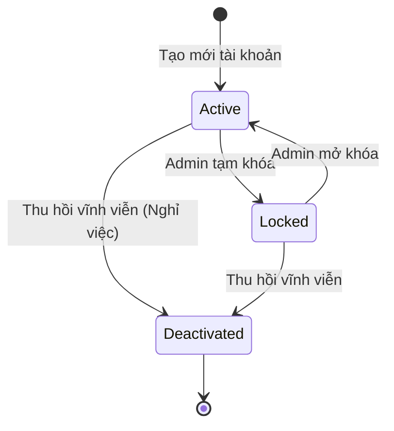

# BF-SYS-01: Identity Lifecycle Management (Vòng đời Tài khoản)

> **Capability:** CAP-SYS (Năng lực Quản trị Hệ thống)
> **Giai đoạn:** 1 - Thiết lập nền tảng
> **Nhóm chức năng:** Quản lý tài khoản
> **Mã màn hình:** `users`

---

## 1. Mô tả tổng quan

Quản lý vòng đời Tài khoản người dùng (User Account Lifecycle) — quy trình Joiner-Mover-Leaver (JML). Đóng vai trò là "Identity Store" nội bộ của hệ thống, trả lời câu hỏi "Bạn là ai trên hệ thống?". Đây là mô-đun độc lập với phân quyền (Entitlement) để đảm bảo nguyên tắc Segregation of Duties.

## 2. Đối tượng sử dụng (Vai trò)

- **Quản trị Hệ thống (System Admin):** Quản trị toàn bộ tài khoản trên hệ thống.
- **IAM Administrator:** Chuyên viên quản lý danh tính (nếu có).

## 3. Ranh giới Nghiệp vụ (Scope)

### Có bao gồm (In Scope)
- **Joiner:** Tạo mới User Account (cấp phát Username, Email login mặc định).
- **Mover:** Liên kết User Account với Person (`person_id`) từ `CAP-MDM`. Cập nhật trạng thái.
- **Leaver:** Vô hiệu hóa (Deactivate), Khóa (Lock), hoặc Soft-delete tài khoản khi nhân sự nghỉ việc hoặc học viên ngừng học.
- Đặt lại mật khẩu (Force password reset) bởi Admin.

### Không bao gồm (Out of Scope)
- Định nghĩa Role, Permission, Data Scope → Nằm ở `BF-SYS-04`
- Gán Role cho User → Nằm ở `BF-SYS-04`
- Đăng nhập, SSO, Đổi mật khẩu cá nhân → Nằm ở `BF-SYS-05`
- Quản lý thông tin PII (Họ tên, SĐT) → Nằm ở `CAP-MDM`

## 4. Mô hình Dữ liệu Nghiệp vụ (Data Entities)

| Tên Thực thể | Trường định danh | Thuộc tính quan trọng | Ràng buộc quan hệ | Diễn giải |
|--------------|------------------|-----------------------|-------------------|----------|
| Tài khoản (Account) | Mã Tài khoản | Username, Email Login, Mật khẩu băm (Hash), Trạng thái | Trỏ về Mã Khách hàng/Nhân viên (Person) | Tài khoản định danh. |
| Lịch sử Tài khoản (Account History) | Mã Log | Hành động (Khóa/Mở/Đổi Pass), Thời gian | Trỏ về Mã Tài khoản | Lưu vết thay đổi hệ thống. |

### 4.1. Vòng đời Trạng thái (Status Lifecycle)

*Sơ đồ dưới đây xác định vòng đời của một Tài khoản đăng nhập.*

**Quy tắc chuyển đổi:**

| Từ trạng thái | Sang trạng thái | Điều kiện bắt buộc | Vai trò được phép |
|---------------|-----------------|---------------------|-------------------|
| Bất kỳ | Deactivated | Xác nhận cảnh báo "Hành động không thể hoàn tác" | Admin |

### 4.2. Ví dụ Dữ liệu mẫu

*Giúp AI và Lập trình viên tạo dữ liệu kiểm thử chính xác.*

| Tình huống | Dữ liệu đầu vào | Kết quả mong đợi |
|------------|-----------------|-------------------|
| Tạo tài khoản mới | Username: `nguyenvana`, Email: `a.nguyen@rino.edu` | Lưu tài khoản trạng thái Active, trỏ về `person_id` của Nguyễn Văn A. |
| Khóa tài khoản tạm | Bấm nút Lock tài khoản `nguyenvana` | Tài khoản chuyển sang Locked, hệ thống tự động ngắt kết nối session hiện tại (`BF-SYS-05`). |

## 5. Quy tắc Nghiệp vụ Tổng thể (Business Rules)

1. **[RULE-SYS-01-01] Tách bạch Danh tính và Quyền (Decoupled IAM):** Tuân thủ `[POLICY-IAM-01]`, việc tạo Tài khoản ở phân hệ này CHỈ ĐƠN THUẦN là tạo một phương thức để Login (Đăng nhập). Tài khoản mới tạo ra KHÔNG CÓ BẤT CỨ QUYỀN GÌ. Việc cấp quyền phải được thực hiện qua `BF-SYS-04`.
2. **[RULE-SYS-01-02] Tính duy nhất (Unique Identity):** Username và Email Login là trường Unique. Hệ thống chặn việc tạo 2 người có cùng Username.
3. **[RULE-SYS-01-03] Chặn khôi phục:** Nếu tài khoản chuyển trạng thái `Deactivated` (Vô hiệu hóa vĩnh viễn), không cho phép đổi lại thành Active. Nếu người đó đi làm lại, phải tạo User Account mới.

## 6. Danh sách Yêu cầu Người dùng (User Stories)

| Mã Yêu cầu | Tên Yêu cầu (Loại màn hình) | Đường dẫn truy cập | Trạng thái |
|------------|-----------------------------|--------------------|------------|
| US-SYS-01-01 | Xem & Tìm kiếm danh sách Tài khoản (List) | /app/users | Đã có US |
| US-SYS-01-02 | Tạo tài khoản (Modal) | Nằm trong Màn danh sách | Đã có US |
| US-SYS-01-03 | Khóa/Mở khóa tài khoản (Modal) | Nằm trong Màn danh sách | Đã có US |
| US-SYS-01-04 | Cấp lại mật khẩu (Modal) | Nằm trong Màn danh sách | Đã có US |
