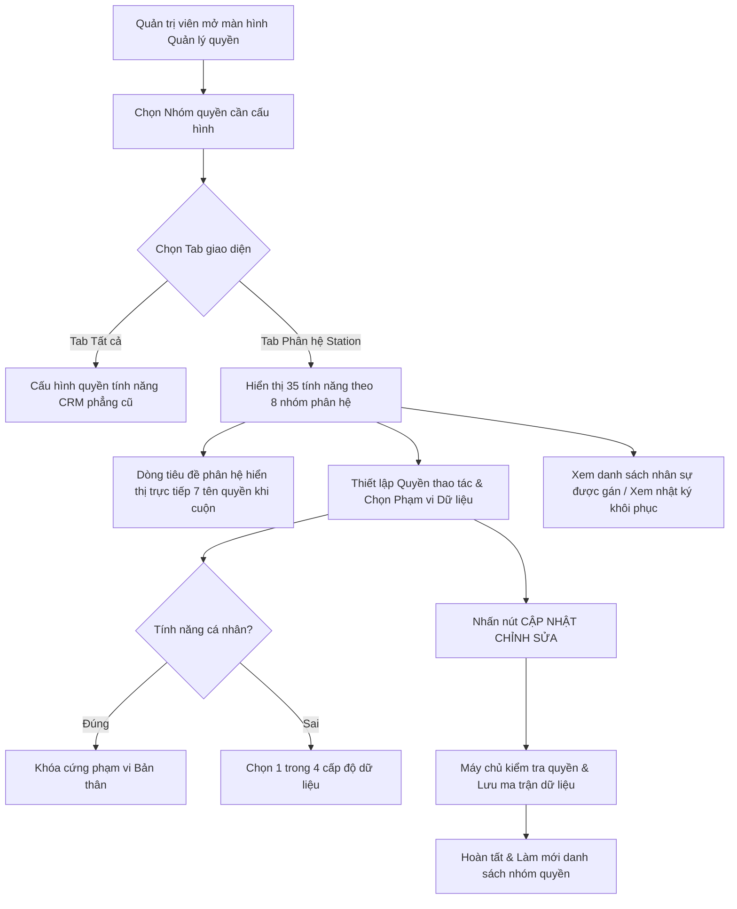

# BF-SYS-04: Nâng cấp Cơ chế Cấu hình Ma trận Quyền & Phạm vi Dữ liệu (Station & CRM)

> **Capability:** CAP-SYS (Năng lực Quản trị Hệ thống & Phân quyền)  
> **Giai đoạn:** 1 - Thiết lập nền tảng & Vận hành cơ sở  
> **Nhóm chức năng:** Cấu hình Hệ thống  
> **Mã màn hình:** `permissions` (`/app/permissions`)  

---

## Lịch sử cập nhật tài liệu (Changelog)

| Ngày cập nhật | Nội dung cập nhật | Lý do cập nhật |
|---|---|---|
| 04/09/2026 | Biên tập nâng cấp toàn diện cơ chế ma trận quyền: Tách Tab Station và Tab Tất cả, bổ sung cột Phạm vi Dữ liệu (Data Scope), chuẩn hóa bảng 35 tính năng Station | Nâng cấp từ phân quyền chức năng cũ sang mô hình quản trị dữ liệu cơ sở kết hợp quyền thao tác và biên giới dữ liệu |
| 04/09/2026 | Tối ưu Tab Phân hệ Station: Dòng tiêu đề hiển thị tên 7 quyền trên từng phân hệ, khóa cứng phạm vi "Bản thân", cụm công cụ nằm cùng hàng tab | Tối ưu trải nghiệm nhận diện cột khi cuộn trang dài, đồng bộ ngôn ngữ và tối ưu diện tích dọc |
| 04/09/2026 | Bổ sung tính năng Quản lý học viên (`students`) và chuẩn hóa cấu trúc duy nhất 1 cụm Cha - Con cho `work_registration` (Đăng ký lịch) | Khắc phục thiếu sót màn hình cốt lõi P0 và loại bỏ các nhóm cha ảo trên Confluence |
| 04/09/2026 | Tích hợp đặc tả dạng bảng cho 2 hộp thoại nổi: Danh sách nhân sự được gán quyền và Nhật ký cập nhật hành vi kèm nút khôi phục ma trận quyền | Hoàn thiện công cụ kiểm toán an ninh và truy vết phân quyền nhân sự |

---

## 1. Bối cảnh & Vấn đề hiện tại (Context & Problem Statement)
* **Bối cảnh:** Hệ sinh thái quản trị trường học vận hành tập trung trên phân hệ quản lý khách hàng cũ (CRM Core). Khi mở rộng phát triển phân hệ quản lý vận hành cơ sở (Station), danh mục quyền cũ vẫn được bảo toàn nguyên trạng, nhưng cơ chế phân quyền cần được nâng cấp để đáp ứng mô hình vận hành trực tiếp tại từng chi nhánh và cơ sở trường học.
* **Vấn đề thực tế:**
  * **Thiếu biên giới dữ liệu (Data Scope):** Cơ chế phân quyền cũ chỉ phân định hành vi thao tác (Thêm, Sửa, Xóa, Export), nhưng không kiểm soát được "Nhân sự được nhìn thấy và can thiệp vào học viên, lớp học, đơn hàng của cơ sở nào".
  * **Chưa tách bạch các phân hệ chuyên biệt:** Các nghiệp vụ đặc thù mới của Station (như Điểm danh & đánh giá buổi học, Sắp xếp học bù, Học thử, Xếp lớp học viên, Điều phối chăm sóc) cần có phân hệ hiển thị tập trung riêng biệt kèm biên giới dữ liệu.

---

## 2. Mục tiêu, Giá trị mang lại & Chỉ số đo lường (Objectives, Value & KPIs)
* **Mục tiêu:** Thiết lập cơ chế phân quyền đa chiều kết hợp giữa Quyền thao tác nghiệp vụ và Phạm vi dữ liệu cho từng tính năng, giữ nguyên thiết kế mặc định tại Tab "Tất cả" và nâng cấp giao diện dạng nhóm thu gọn/mở rộng riêng tại Tab "Phân hệ Station".
* **Giá trị mang lại:**
  * Bảo toàn 100% giao diện và cách thức vận hành quen thuộc của hệ thống cũ tại Tab Tất cả.
  * Tối ưu hóa quản trị cho phân hệ Station với tên các quyền hiển thị trực tiếp trên từng dòng tiêu đề phân hệ, giúp nhận diện cột thao tác ngay lập tức khi cuộn trang.
  * Đảm bảo tính đồng bộ và thẩm mỹ giao diện: Hiển thị phạm vi cố định mang chữ "Bản thân" dạng văn bản tĩnh cho các tính năng cá nhân.
* **Mục tiêu đo lường hiệu quả (Đề xuất chỉ số tương lai):**

| Chỉ số đo lường (KPI) | Mục tiêu đề xuất (Target) | Phương pháp đo lường |
| :--- | :--- | :--- |
| **[KPI-001] Thời gian cấu hình một nhóm quyền** | Giảm 40% thời gian thao tác | Đếm thời gian từ khi mở màn hình đến khi bấm lưu nhóm quyền |
| **[KPI-002] Tỷ lệ chặn truy cập dữ liệu sai thẩm quyền cơ sở** | 100% truy vấn trái phép bị chặn | Nhật ký an ninh kiểm toán hệ thống |

---

## 3. Hiểu người dùng (Target Users & Personas)

* **Quản trị viên Hệ thống (`PERSONA-SYSTEM_ADMIN`):**
  * *Bối cảnh sử dụng:* Thiết lập, phân loại và cấu hình quyền hạn cho các bộ phận nhân sự định kỳ hoặc khi có chức danh công việc mới.
  * *Nhu cầu thực tế:* Giữ nguyên giao diện mặc định quen thuộc ở Tab Tất cả; có thêm giao diện phân nhóm trực quan ở Tab Station với tên quyền trên từng dòng tiêu đề phân hệ để cấu hình nhanh và chính xác.
* **Giám đốc / Quản lý Cơ sở (`PERSONA-BRANCH_MANAGER`):**
  * *Bối cảnh sử dụng:* Rà soát quyền hạn của nhân sự trong cơ sở công tác.
  * *Nhu cầu thực tế:* Đảm bảo nhân sự cấp dưới chỉ xem và can thiệp đúng phạm vi công việc cá nhân hoặc trong nội bộ chi nhánh của mình.

---

## 4. Ranh giới Nghiệp vụ & Danh sách Chức năng (Scope & Classification)

### Bảng Phân loại Rủi ro (Risk Scoring Analysis)

| Tiêu chí đánh giá | Nội dung đối soát thực tế | Điểm số (0 / 1) |
|---|---|:---:|
| **Tiêu chí A: Phạm vi ảnh hưởng hệ thống** | Tác động đến cơ chế kiểm soát truy cập và dữ liệu trên toàn bộ 35 màn hình của Station | 1 |
| **Tiêu chí B: Tác động tài chính** | Ảnh hưởng đến việc bảo vệ dữ liệu doanh thu, học phí và đơn hàng | 1 |
| **Tiêu chí C1: Loại thay đổi nghiệp vụ** | Bổ sung cơ chế phân quyền phạm vi dữ liệu đa chi nhánh | 1 |
| **Tiêu chí C2: Độ mới nghiệp vụ** | Đã định hình rõ ma trận thao tác và 4 cấp độ dữ liệu | 0 |
| **Tiêu chí D: Phụ thuộc bên ngoài** | Không phụ thuộc dịch vụ hoặc cổng kết nối đối tác bên ngoài | 0 |

* **Tổng điểm:** 3/5 điểm.
* **Kết luận phân loại:** 🔴 **Risk** (Yêu cầu Project Manager và Tech Lead phê duyệt trước khi phát hành chính thức).

### Bảng Danh mục Chức năng (Feature Scope Matrix)

| Mã Yêu Cầu | Tên Chức Năng | Mức Độ Ưu Tiên | Phân Loại Rủi Ro | Ghi Chú Nghiệp Vụ |
|---|---|:---:|:---:|---|
| **BF-FEAT-01** | Quản trị thông tin nhóm quyền và Topic chỉ đọc | Bắt buộc (Must) | 🟢 Standard | Khóa trường Topic không cho chỉnh sửa |
| **BF-FEAT-02** | Phân tách hai Tab Tất cả và Phân hệ Station | Bắt buộc (Must) | 🟢 Standard | Bảo toàn CRM cũ, nâng cấp Station |
| **BF-FEAT-03** | Ma trận quyền 35 tính năng chia theo 8 phân hệ | Bắt buộc (Must) | 🔴 Risk | Thu gọn/mở rộng theo từng khối phân hệ |
| **BF-FEAT-04** | Thanh tiêu đề phân hệ cố định hiển thị 7 tên quyền | Bắt buộc (Must) | 🟢 Standard | Nhận diện cột thao tác khi cuộn trang dài |
| **BF-FEAT-05** | Phân định 4 cấp độ dữ liệu (Data Scope) | Bắt buộc (Must) | 🔴 Risk | Bản thân, Cùng nhóm, Toàn cơ sở, Toàn chuỗi |
| **BF-FEAT-06** | Khóa cứng phạm vi "Bản thân" cho tính năng cá nhân | Bắt buộc (Must) | 🟢 Standard | Hiển thị chữ tĩnh, nền trong suốt |
| **BF-FEAT-07** | Phân cấp quyền Cha - Con cho Đăng ký lịch | Bắt buộc (Must) | 🟢 Standard | Liên kết bật/tắt quyền phụ thuộc |
| **BF-FEAT-08** | Hộp thoại kiểm toán nhân sự được gán nhóm quyền | Nên có (Should) | 🟢 Standard | Hiển thị danh sách nhân viên mang vai trò |
| **BF-FEAT-09** | Hộp thoại nhật ký hành vi và khôi phục ma trận quyền | Nên có (Should) | 🔴 Risk | Khôi phục trạng thái quyền từ bản ghi lịch sử |

---

## 5. LUỒNG NGHIỆP VỤ & MÔ HÌNH HÓA DỮ LIỆU (FLOW & DATA MODEL)

### 5.1. Luồng Người dùng Thao tác (User Flow Mermaid)

### 5.2. Bảng Mô hình Thực thể Dữ liệu (Data Entities)

| Tên Thực thể | Trường định danh | Thuộc tính quan trọng | Ràng buộc quan hệ | Diễn giải |
|---|---|---|---|---|
| **Nhóm quyền (Role)** | `id` | Tên nhóm, Mã định danh, Mô tả, Mã Topic | Trỏ về Phân loại Topic | Tập hợp các thẩm quyền thao tác và phạm vi dữ liệu |
| **Phân loại Topic** | `id` | Tên Topic, Mã phân loại, Mô tả phạm vi | Khối phân loại cha | Nhóm chức năng nghiệp vụ (Tự học, CSKH, Đào tạo) |
| **Bản ghi Cấp phép** | `id` | Mã tính năng, Quyền thao tác, Phạm vi dữ liệu | Trỏ về Nhóm quyền | Chi tiết thiết lập từng tính năng cho nhóm quyền |

### 5.3. Danh mục Quyền hạn & Năng lực Nghiệp vụ Động (Atomic Permissions)

| Mã Quyền Hạn (Permission Key) | Tên Quyền Hạn | Loại Quyền | Phạm Vi Áp Dụng | Diễn Giải Nghiệp Vụ |
|---|---|---|---|---|
| `sys.role.view` | Xem danh sách nhóm quyền | Truy cập | Màn hình quản lý quyền | Xem cấu trúc các Topic và nhóm quyền |
| `sys.role.create` | Tạo mới nhóm quyền | Ghi | Khung thao tác | Khởi tạo nhóm quyền mới trực thuộc Topic |
| `sys.role.edit` | Cập nhật ma trận quyền | Ghi | Màn hình chỉnh sửa | Thay đổi các thao tác và phạm vi dữ liệu |
| `sys.role.delete` | Xóa bỏ nhóm quyền | Xóa | Thao tác dòng | Xóa nhóm quyền khỏi hệ thống qua hộp thoại xác nhận |

---

## 6. CẤU TRÚC GIAO DIỆN & QUY TẮC NGHIỆP VỤ (UI STATE & BUSINESS RULES)

### 6.1. Thiết kế Giao diện Phân hệ Station (UI Layout Pattern)
* **Bố cục màn hình:** Theo chuẩn Biểu mẫu Quản trị phân tầng hai tab.
* **Góc phải hàng Tab:** Cụm 4 nút công cụ: Nhân sự được gán, Log cập nhật, Mở tất cả, Thu gọn tất cả.
* **Cấu trúc 8 cột bảng:** Tên tính năng (32%), Truy cập (9%), Thêm (8.5%), Sửa (8.5%), Xóa (8.5%), Download/Upload (9.5%), Xem tất cả (8.5%), Phạm vi Dữ liệu (15.5%).

### 6.2. Quy tắc Nghiệp vụ Toàn cục (Business Rules)

* **[RULE-AUTH-01] Quyền Truy cập là điều kiện tiên quyết (Prerequisite Gatekeeper):** Một tính năng chỉ có ý nghĩa khi tài khoản được cấp quyền "Truy cập". Nếu thao tác "Truy cập" bị tắt, toàn bộ các quyền thao tác còn lại (Thêm, Sửa, Xóa, Download/Upload, Xem tất cả) tự động bị vô hiệu hóa, đồng thời ô chọn Phạm vi Dữ liệu bị khóa cứng và không cho phép lựa chọn.
* **[RULE-AUTH-02] Tự động kích hoạt quyền Truy cập phụ thuộc:** Nếu người dùng tích chọn bất kỳ quyền thao tác nào (Thêm, Sửa, Xóa, Download/Upload hoặc Xem tất cả), hệ thống tự động kích hoạt trạng thái "Truy cập" cho tính năng đó.
* **[RULE-AUTH-03] Tính độc lập của trường phân loại Topic:** Khi vào màn hình chỉnh sửa nhóm quyền, trường "Topic / Phân loại" hiển thị cố định ở dạng thông tin chỉ đọc để bảo toàn tính phân nhóm nghiệp vụ, không cho phép thay đổi sang Topic khác.
* **[RULE-AUTH-04] Phân tách hai Tab độc lập & Đưa quyền xuống Dòng Phân hệ:**
  * Tab 1 "Tất cả": Hiển thị toàn bộ 73 tính năng phẳng theo thiết kế mặc định nguyên bản của CRM, không thu gọn, không có cột Phạm vi Dữ liệu.
  * Tab 2 "Phân hệ Station": Đặt phía sau Tab Tất cả, gồm 35 tính năng chia làm 8 phân hệ; mỗi phân hệ hiển thị rõ ràng tên 7 cột quyền trên dòng tiêu đề phân hệ; cụm nút Mở/Thu gọn và 2 nút kiểm toán nằm cùng hàng tab phía bên phải.
* **[RULE-AUTH-05] Ràng buộc Phạm vi Dữ liệu "Bản thân" & Phân cấp Cha - Con:**
  * Đối với các tính năng cá nhân (`my_schedule`, `work_registration_mine`, `crm_my_leads`): Khóa cứng duy nhất phạm vi Bản thân dạng văn bản tĩnh, không mở menu lựa chọn.
  * Đối với các tính năng quản lý chung: Hỗ trợ lựa chọn 4 cấp độ dữ liệu (Bản thân, Cùng nhóm, Toàn cơ sở, Toàn chuỗi).
  * Quan hệ Cha - Con: Duy nhất menu `work_registration` (Đăng ký lịch) là màn chính Cấp 1 có 5 tab con Cấp 2. Bật quyền thao tác ở màn con tự động bật quyền Truy cập ở màn cha; tắt quyền Truy cập ở màn cha tự động tắt toàn bộ quyền của các màn con trực thuộc.
* **[RULE-AUTH-06] Nguyên tắc Phân định Ranh giới Phân quyền và Nghiệp vụ Tính năng (Separation of Concerns):**
  * Tầng Phân quyền: Chỉ kiểm tra điều kiện quyền truy cập và đối chiếu mã người dùng với người phụ trách được gán trên bản ghi.
  * Tầng Nghiệp vụ Tính năng: Việc trích xuất và gán người phụ trách (CSKH, Giáo viên) vào bản ghi lưu vết hoàn toàn do nghiệp vụ xử lý tự động khi tạo hoặc chuyển giao bản ghi.

---

## 7. BẢNG MÔ TẢ CHI TIẾT 35 TÍNH NĂNG PHÂN HỆ STATION

| STT | Nhóm Phân hệ | Cấp bậc | Tên Tính năng | Mã Tính năng | Đường dẫn Màn hình | Thao tác Hỗ trợ | Phạm vi Dữ liệu | Mô tả Chi tiết Nghiệp vụ & Ý nghĩa Thẩm quyền |
|:---:|---|:---:|---|---|---|---|---|---|
| 1 | LỊCH BIỂU | Cấp 1 | Lịch của tôi | `my_schedule` | `/app/my_schedule` | Truy cập, Sửa | 🔒 Bản thân (Cố định) | Xem và điều chỉnh lịch làm việc, ca dạy cá nhân của tài khoản đăng nhập |
| 2 | LỊCH BIỂU | Cấp 1 | Lịch học trung tâm | `calendar_class_schedule` | `/app/calendar_class_schedule` | Truy cập, Thêm, Sửa, Export, Xem tất cả | 4 cấp độ linh hoạt | Quản lý, điều phối và theo dõi lịch học của các lớp theo phòng học, ca học tại cơ sở |
| 3 | LỊCH BIỂU | Cấp 1 | Lịch học digi | `digi_schedule` | `/app/digi_schedule` | Truy cập, Thêm, Sửa, Export | 4 cấp độ linh hoạt | Quản lý lịch học các lớp kỹ thuật số và học trực tuyến trong hệ sinh thái đào tạo |
| 4 | LỊCH BIỂU | Cấp 1 | Lịch test | `calendar_event_schedule` | `/app/calendar_event_schedule` | Truy cập, Thêm, Sửa, Export, Xem tất cả | 4 cấp độ linh hoạt | Quản lý lịch tổ chức kiểm tra trình độ đầu vào, đánh giá năng lực học sinh tại cơ sở |
| 5 | LỊCH BIỂU | Cấp 1 (Cha) | Đăng ký lịch | `work_registration` | `/app/work_registration` | Truy cập, Thêm, Sửa, Xóa, Export | 4 cấp độ linh hoạt | Trung tâm điều phối lịch rảnh, ca làm việc và ngày nghỉ của toàn thể đội ngũ nhân sự |
| 6 | LỊCH BIỂU | └── Cấp 2 | Lịch rảnh của tôi | `work_registration_mine` | `/app/work_registration_mine` | Truy cập, Thêm, Sửa | 🔒 Bản thân (Cố định) | Nhân sự tự khai báo các khung giờ rảnh hàng tuần để bộ phận vận hành bố trí ca làm |
| 7 | LỊCH BIỂU | └── Cấp 2 | Bảng ca tổng hợp (Master Roster) | `work_registration_roster` | `/app/work_registration_roster` | Truy cập, Sửa, Export | 4 cấp độ linh hoạt | Bảng ca tổng quan điều phối lịch làm việc của tất cả nhân sự cơ sở theo tuần/tháng |
| 8 | LỊCH BIỂU | └── Cấp 2 | Lịch rảnh nhân sự | `work_registration_staff` | `/app/work_registration_staff` | Truy cập, Sửa, Export | 4 cấp độ linh hoạt | Theo dõi, tổng hợp và phê duyệt danh sách lịch rảnh đăng ký của giáo viên và nhân viên |
| 9 | LỊCH BIỂU | └── Cấp 2 | Tổng quan cơ sở | `work_registration_center` | `/app/work_registration_center` | Truy cập, Export | 4 cấp độ linh hoạt | Báo cáo tổng thể tình trạng đáp ứng nhân sự và độ phủ ca làm việc tại từng cơ sở |
| 10 | LỊCH BIỂU | └── Cấp 2 | Cấu hình ngày lễ / nghỉ lễ | `work_registration_holidays` | `/app/work_registration_holidays` | Truy cập, Thêm, Sửa, Xóa | 4 cấp độ linh hoạt | Thiết lập lịch nghỉ lễ, tạm dừng hoạt động cơ sở để phục vụ tính công và xếp lịch học |
| 11 | LỊCH BIỂU | Cấp 1 | Quản lý sự kiện | `event_management_new` | `/app/event_management_new` | Truy cập, Thêm, Sửa, Xóa, Export | 4 cấp độ linh hoạt | Khởi tạo, phê duyệt và tổ chức các sự kiện tuyển sinh, hội thảo, ngoại khóa của trường |
| 12 | CRM & THƯƠNG MẠI | Cấp 1 | Lead của tôi | `crm_my_leads` | `/app/crm_my_leads` | Truy cập, Thêm, Sửa, Export | 🔒 Bản thân (Cố định) | Quản lý danh sách khách hàng tiềm năng được phân bổ riêng cho tài khoản đăng nhập |
| 13 | CRM & THƯƠNG MẠI | Cấp 1 | Quản lý Lead | `crm_leads` | `/app/crm_leads` | Truy cập, Thêm, Sửa, Xóa, Export, Xem tất cả | 4 cấp độ linh hoạt | Trung tâm tiếp nhận, sàng lọc, phân bổ và theo dõi tiến trình chăm sóc khách hàng toàn diện |
| 14 | CRM & THƯƠNG MẠI | Cấp 1 | Quản lý đơn hàng | `orders` | `/app/orders` | Truy cập, Thêm, Sửa, Xóa, Export, Xem tất cả | 4 cấp độ linh hoạt | Quản lý danh sách đơn hàng khóa học, học cụ; theo dõi trạng thái thanh toán và bàn giao |
| 15 | CRM & THƯƠNG MẠI | Cấp 1 | Thanh toán | `payment_receipts` | `/app/payment_receipts` | Truy cập, Thêm, Sửa, Export, Xem tất cả | 4 cấp độ linh hoạt | Quản lý phiếu thu học phí, hóa đơn giao dịch, xác nhận chuyển khoản và tiền mặt |
| 16 | SẢN PHẨM & CHƯƠNG TRÌNH | Cấp 1 | Quản lý sản phẩm | `products` | `/app/products` | Truy cập, Thêm, Sửa, Xóa, Export | 4 cấp độ linh hoạt | Quản lý danh mục khóa học đào tạo, gói combo và tài liệu học tập được mở bán |
| 17 | SẢN PHẨM & CHƯƠNG TRÌNH | Cấp 1 | Quản lý Chiến dịch | `campaigns` | `/app/campaigns` | Truy cập, Thêm, Sửa, Xóa, Export | 4 cấp độ linh hoạt | Thiết lập và theo dõi các chiến dịch truyền thông tuyển sinh, thu hút học viên mới |
| 18 | SẢN PHẨM & CHƯƠNG TRÌNH | Cấp 1 | Quản lý Khuyến mãi | `promotions` | `/app/promotions` | Truy cập, Thêm, Sửa, Xóa, Export | 4 cấp độ linh hoạt | Thiết lập mã giảm giá, voucher và các chính sách ưu đãi học phí theo từng đợt |
| 19 | TUYỂN SINH & XẾP LỚP | Cấp 1 | Kiểm tra/Trải nghiệm | `booking_test` | `/app/booking_test` | Truy cập, Thêm, Sửa, Xóa, Export, Xem tất cả | 4 cấp độ linh hoạt | Quản lý đăng ký thi thử, buổi học trải nghiệm, chấm điểm bài kiểm tra đầu vào học sinh |
| 20 | TUYỂN SINH & XẾP LỚP | Cấp 1 | Lớp học thử | `trial_class` | `/app/trial_class` | Truy cập, Thêm, Sửa, Export | 4 cấp độ linh hoạt | Quản lý việc sắp xếp học viên tham gia học thử thực tế tại các lớp đang vận hành |
| 21 | TUYỂN SINH & XẾP LỚP | Cấp 1 | Xếp lớp học viên | `class_placement` | `/app/class_placement` | Truy cập, Sửa, Export | 4 cấp độ linh hoạt | Điều phối và xếp học sinh vào danh sách lớp chính thức sau khi test hoặc đóng học phí |
| 22 | VẬN HÀNH & CHĂM SÓC | Cấp 1 | Quản lý Lớp học | `classes` | `/app/classes` | Truy cập, Thêm, Sửa, Xóa, Export, Xem tất cả | 4 cấp độ linh hoạt | Quản lý thông tin lớp, sĩ số, phòng học, giáo viên phụ trách và tiến độ bài giảng |
| 23 | VẬN HÀNH & CHĂM SÓC | Cấp 1 | Quản lý học viên | `students` | `/app/students` | Truy cập, Thêm, Sửa, Xóa, Export, Xem tất cả | 4 cấp độ linh hoạt | Hồ sơ học sinh 360 độ: thông tin cá nhân, phụ huynh, quá trình học tập và chuyên cần |
| 24 | VẬN HÀNH & CHĂM SÓC | Cấp 1 | Bảo lưu & Nghỉ phép | `leave_reserve` | `/app/leave_reserve` | Truy cập, Thêm, Sửa, Export | 4 cấp độ linh hoạt | Tiếp nhận và xử lý đơn xin nghỉ học có phép, bảo lưu thời gian học và học phí học sinh |
| 25 | VẬN HÀNH & CHĂM SÓC | Cấp 1 | Học bù học viên | `makeup_class` | `/app/makeup_class` | Truy cập, Thêm, Sửa, Export | 4 cấp độ linh hoạt | Sắp xếp và điều phối lịch học bù cho học viên nghỉ phép vào các lớp tương đương |
| 26 | VẬN HÀNH & CHĂM SÓC | Cấp 1 | Chăm sóc học viên | `student_operations_alert` | `/app/student_operations_alert` | Truy cập, Thêm, Sửa, Export, Xem tất cả | 4 cấp độ linh hoạt | Tiếp nhận cảnh báo chuyên cần, học lực sút giảm để nhân viên can thiệp chăm sóc |
| 27 | VẬN HÀNH & CHĂM SÓC | Cấp 1 | Tái phí học viên | `renewal` | `/app/renewal` | Truy cập, Sửa, Export, Xem tất cả | 4 cấp độ linh hoạt | Theo dõi hạn học phí, cảnh báo sắp hết buổi và điều phối quy trình tái đăng ký khóa |
| 28 | TICKET & CHẤT LƯỢNG | Cấp 1 | Quản lý Ticket & Chất lượng | `support_tickets` | `/app/support_tickets` | Truy cập, Thêm, Sửa, Xóa, Export | 4 cấp độ linh hoạt | Tiếp nhận, xử lý khiếu nại, hỗ trợ kỹ thuật và phản ánh chất lượng dịch vụ đào tạo |
| 29 | ĐỘI NGŨ & ĐIỀU HÀNH | Cấp 1 | Executive Dashboard | `dashboard` | `/app/dashboard` | Truy cập, Export | 4 cấp độ linh hoạt | Bảng điều khiển quản trị hiển thị KPI tuyển sinh, doanh thu, sĩ số và tỷ lệ lấp đầy cơ sở |
| 30 | ĐỘI NGŨ & ĐIỀU HÀNH | Cấp 1 | Phân công Giảng dạy | `teacher_assignment` | `/app/teacher_assignment` | Truy cập, Sửa, Export | 4 cấp độ linh hoạt | Điều phối, gán giáo viên chính, giáo viên trợ giảng cho từng lớp học và ca học cụ thể |
| 31 | ĐỘI NGŨ & ĐIỀU HÀNH | Cấp 1 | Hồ sơ Nhân sự | `hr_employees` | `/app/hr_employees` | Truy cập, Thêm, Sửa, Xóa, Export | 4 cấp độ linh hoạt | Quản lý hồ sơ nhân viên, giáo viên, hợp đồng lao động, chức danh và cơ sở công tác |
| 32 | ĐỘI NGŨ & ĐIỀU HÀNH | Cấp 1 | Duyệt Dạy thay & Lương ca | `substitute_payroll` | `/app/substitute_payroll` | Truy cập, Sửa, Export | 4 cấp độ linh hoạt | Phê duyệt các ca dạy thay, dạy cover đột xuất và tính toán chi phí thù lao theo ca |
| 33 | ĐỘI NGŨ & ĐIỀU HÀNH | Cấp 1 | Báo cáo Vận hành | `reports` | `/app/reports` | Truy cập, Export | 4 cấp độ linh hoạt | Trích xuất các báo cáo chuyên sâu về hiệu suất vận hành cơ sở và tình hình học tập |
| 34 | CẤU HÌNH HỆ THỐNG | Cấp 1 | Danh mục chăm sóc | `care_conditions_config` | `/app/care_conditions_config` | Truy cập, Thêm, Sửa, Xóa | 4 cấp độ linh hoạt | Thiết lập tiêu chí và điều kiện tự động kích hoạt cảnh báo chăm sóc học sinh |
| 35 | CẤU HÌNH HỆ THỐNG | Cấp 1 | Nhóm quyền | `permissions` | `/app/permissions` | Truy cập, Thêm, Sửa, Xóa | 4 cấp độ linh hoạt | Quản trị vai trò, nhóm quyền, ma trận thao tác và phạm vi dữ liệu phân hệ Station và CRM |

---

## 8. DANH SÁCH YÊU CẦU NGƯỜI DÙNG (USER STORIES)

| Tên Yêu Cầu (Màn hình / Hộp thoại) | Phân loại | Mã Quyền Yêu Cầu |
|---|---|---|
| Màn hình Chỉnh sửa Ma trận Phân quyền & Giới hạn Phạm vi Dữ liệu (`US-SYS-04-04`) | Biểu mẫu cấu hình | `sys.role.edit` |
| Hộp thoại Thêm mới và Sửa phân loại Topic | Hộp thoại nổi | `sys.role.create` |
| Hộp thoại Xem toàn bộ danh sách nhóm quyền theo Topic | Bảng thông tin nổi | `sys.role.view` |
| Hộp thoại Nhân sự được gán vào Nhóm quyền | Hộp thoại nổi | `sys.role.view` |
| Hộp thoại Nhật ký Cập nhật Hành vi Quyền & Khôi phục Phiên bản | Hộp thoại nổi | `sys.role.edit` |
