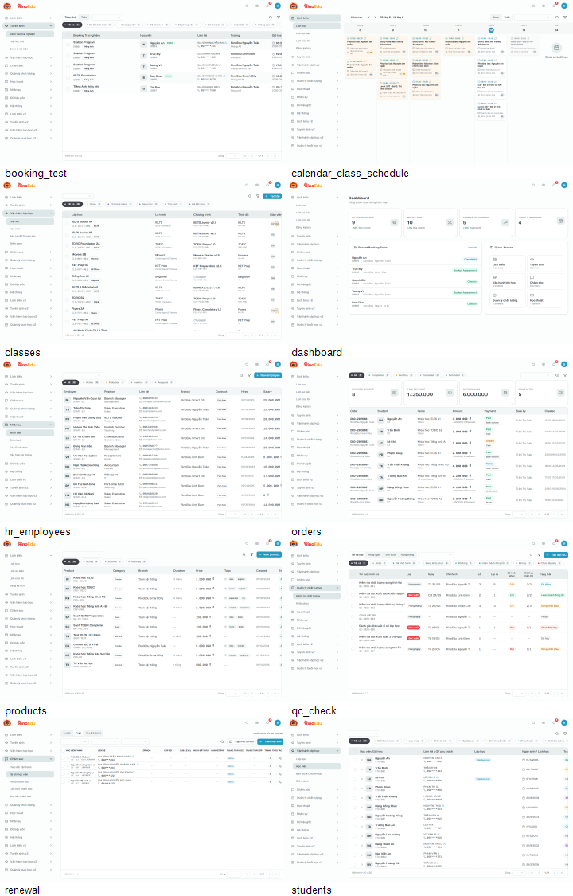
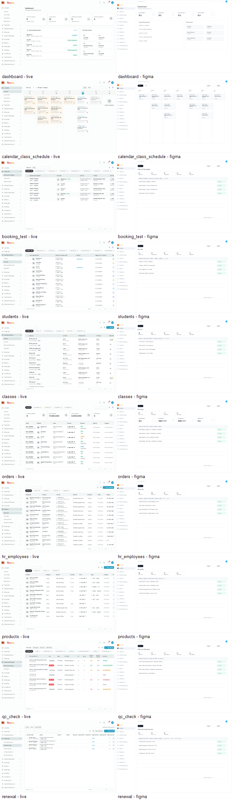
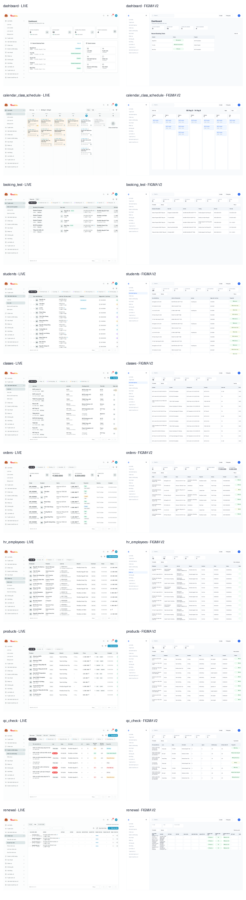
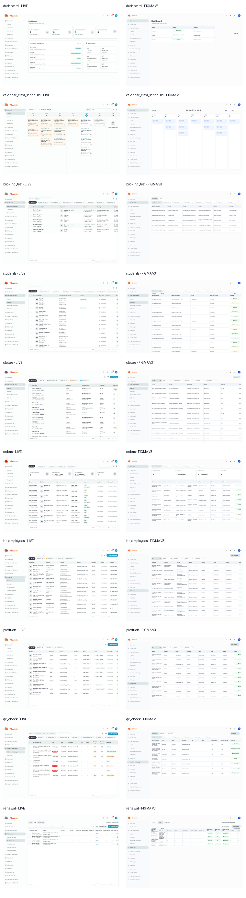

# Rino Figma Live Page Builder QA - 2026-06-12

## 1. Objective

Test the new `rino-figma-live-page-builder` skill against real Rinov5 coded screens.

The target contract:

- Create reusable Figma components first.
- Compose complete page frames from component instances.
- Do not paste live screenshots into final Figma frames.
- Match the live demo product, not an invented redesign.
- Re-check output against live screenshots and report with image evidence.

## 2. Figma Target

- File: [Rinov5 Skill QA - Live Page Builder - 2026-06-12](https://www.figma.com/design/CnIUTDl5YG2lymjWCz293p)
- File key: `CnIUTDl5YG2lymjWCz293p`
- QA pages created:
  - `00 QA Summary`
  - `01 Foundations`
  - `02 Primitives`
  - `03 App Shell`
  - `10 Live Page Samples`

## 3. Screens Tested

| # | Screen | Route | Figma node |
|---|---|---|---|
| 1 | Dashboard | `/app/dashboard` | `2:120` |
| 2 | Calendar Class Schedule | `/app/calendar_class_schedule` | `2:217` |
| 3 | Booking Test | `/app/booking_test` | `2:363` |
| 4 | Students | `/app/students` | `2:479` |
| 5 | Classes | `/app/classes` | `2:595` |
| 6 | Orders | `/app/orders` | `2:711` |
| 7 | HR Employees | `/app/hr_employees` | `2:849` |
| 8 | Products | `/app/products` | `2:959` |
| 9 | QC Check | `/app/qc_check` | `2:1069` |
| 10 | Renewal | `/app/renewal` | `2:1185` |

## 4. Evidence

Live baseline screenshots were captured from the running product at `1440x900`.

The Figma frames were rendered and compared side by side against the live product.

Evidence files:

- Live screenshots: `docs/figma-tasks/evidence/2026-06-12-skill-live-page-builder-qa/live/`
- Figma screenshots: `docs/figma-tasks/evidence/2026-06-12-skill-live-page-builder-qa/figma/`
- Live baseline JSON: `docs/figma-tasks/evidence/2026-06-12-skill-live-page-builder-qa/live-baselines.json`
- Comparison metrics: `docs/figma-tasks/evidence/2026-06-12-skill-live-page-builder-qa/comparison-metrics.json`
- Side-by-side contact sheet: `docs/figma-tasks/evidence/2026-06-12-skill-live-page-builder-qa/live-vs-figma-contact-sheet.png`

## 5. Component Audit

The generated Figma output passed the basic editability checks:

- Final screen frames: `10`
- Final frames with image fills: `0`
- Reusable component sources created:
  - `StatusTile`
  - `MetricTile`
  - `ToolbarButton`
  - `StatusBadge`
  - `DataTableShell`
  - `CalendarEventCard`
  - `App Header`
  - `Sidebar`
- Screen frames used component instances instead of a single pasted screenshot.

Representative instance counts:

| Screen | Instances | Text nodes | Main component sources |
|---|---:|---:|---|
| Dashboard | 6 | 54 | App Header, MetricTile, Sidebar |
| Calendar Class Schedule | 17 | 83 | App Header, CalendarEventCard, Sidebar, ToolbarButton |
| Booking Test | 14 | 54 | App Header, DataTableShell, Sidebar, StatusBadge, StatusTile, ToolbarButton |
| Students | 14 | 54 | App Header, DataTableShell, Sidebar, StatusBadge, StatusTile, ToolbarButton |
| Classes | 14 | 54 | App Header, DataTableShell, Sidebar, StatusBadge, StatusTile, ToolbarButton |
| Orders | 17 | 66 | App Header, DataTableShell, MetricTile, Sidebar, StatusBadge, StatusTile, ToolbarButton |
| HR Employees | 13 | 50 | App Header, DataTableShell, Sidebar, StatusBadge, StatusTile, ToolbarButton |
| Products | 13 | 50 | App Header, DataTableShell, Sidebar, StatusBadge, StatusTile, ToolbarButton |
| QC Check | 14 | 54 | App Header, DataTableShell, Sidebar, StatusBadge, StatusTile, ToolbarButton |
| Renewal | 12 | 46 | App Header, DataTableShell, Sidebar, StatusBadge, StatusTile, ToolbarButton |

## 6. Design System Discovery

The test found existing Rinoedu design-system components that future runs should import instead of replacing with generic local QA primitives:

- `Rinov5/Data/DataTableFrame`
- `Rinov5/Shared/StatusBadge`
- `Rinov5/Data/DataTablePagination`
- `Rinov5/Controls/IconActionButton`
- `Rinov5/Controls/PrimaryActionButton`
- Sidebar-related Rinoedu components and variables

This discovery exposed a skill gap: the first test run produced reusable components, but it did not strongly prefer imported Rinoedu library components when available.

## 7. Visual Fidelity Result

Verdict: **Needs Fix**

The generated Figma pages are editable and componentized, but the first run does **not** meet the user's `100% giong live` requirement.

Observed mismatches:

- Table density does not fully match the live product.
- Visible row counts and row spacing are simplified.
- Toolbar controls are structurally present but not exact enough.
- Several status tile and active-state details are approximate.
- The app shell and page content match the broad layout, but not the full live inventory.

The pixel metric file shows low average RGB difference because most screens are white, but this is weak evidence. The side-by-side screenshots are the stronger evidence and show the fidelity gap clearly.

## 8. Rerun V2

After patching the skill, a second Figma QA page was generated from live DOM inventory.

- Page: `20 QA Rerun - Inventory Match`
- Page node: `8:2`
- Component source node: `8:3`
- New frame nodes:
  - Dashboard: `8:829`
  - Calendar Class Schedule: `8:909`
  - Booking Test: `8:997`
  - Students: `8:1228`
  - Classes: `8:1811`
  - Orders: `8:2338`
  - HR Employees: `8:2584`
  - Products: `8:2906`
  - QC Check: `8:3182`
  - Renewal: `8:3401`

V2 evidence:

V2 improvements:

- Table header order now follows live DOM inventory.
- Row count now follows live DOM inventory.
- Table widths are closer to measured live table widths.
- Final frames still have `0` image fills.
- Rinoedu library components were imported for reference:
  - `Rinov5/Data/DataTableFrame`
  - `Rinov5/Shared/StatusBadge`
  - `Rinov5/Data/DataTablePagination`
- Local QA v2 reusable components were used for exact row/cell text because the imported Rinoedu components do not expose enough text override properties for per-screen live data.

V2 component audit:

| Screen | Image fills | Instances | Text nodes |
|---|---:|---:|---:|
| Dashboard | 0 | 22 | 47 |
| Calendar Class Schedule | 0 | 5 | 57 |
| Booking Test | 0 | 96 | 122 |
| Students | 0 | 264 | 290 |
| Classes | 0 | 238 | 262 |
| Orders | 0 | 102 | 128 |
| HR Employees | 0 | 139 | 162 |
| Products | 0 | 118 | 140 |
| QC Check | 0 | 90 | 114 |
| Renewal | 0 | 130 | 151 |

V2 verdict: **Improved, but still not production-pass.**

Remaining visible mismatches:

- Logo/brand treatment and sidebar visuals still differ from live.
- Header controls are structurally present but not pixel-close.
- Toolbar chips, filter controls, and active states are still approximate.
- Status chip styling and action-icon density are still not exact.
- Some live screens do not show a large page title, while V2 still labels the screen.

Skill patch after V2:

- Added explicit shell/header/sidebar/logo matching to the skill acceptance criteria.
- Added visible-title matching: do not invent a page title if live does not show one.
- Added status chip treatment and action density to the comparison checklist.

## 9. Rerun V3

A third Figma QA page was generated by cloning the V2 inventory-matched frames and correcting the largest remaining visual gaps: shell, header, sidebar active state, compact status chips, top toolbar placement, and visible-title behavior.

- Page: `30 QA V3 - Shell Match`
- Page node: `10:2`
- New frame nodes:
  - Dashboard: `10:3`
  - Calendar Class Schedule: `10:119`
  - Booking Test: `10:261`
  - Students: `10:575`
  - Classes: `10:1237`
  - Orders: `10:1839`
  - HR Employees: `10:2167`
  - Products: `10:2561`
  - QC Check: `10:2906`
  - Renewal: `10:3210`

V3 component audit:

| Screen | Image fills | Instances | Text nodes |
|---|---:|---:|---:|
| Dashboard | 0 | 20 | 62 |
| Calendar Class Schedule | 0 | 3 | 72 |
| Booking Test | 0 | 94 | 155 |
| Students | 0 | 262 | 321 |
| Classes | 0 | 236 | 290 |
| Orders | 0 | 100 | 161 |
| HR Employees | 0 | 137 | 188 |
| Products | 0 | 116 | 164 |
| QC Check | 0 | 88 | 147 |
| Renewal | 0 | 128 | 172 |

V3 metric movement:

- V3 average RGB diff improved versus V2 on most screens.
- Examples:
  - Dashboard: `2.21` -> `1.62`
  - Booking Test: `3.06` -> `2.23`
  - Students: `3.21` -> `2.58`
  - Classes: `3.24` -> `2.38`
  - Orders: `3.66` -> `2.65`
  - Renewal: `2.73` -> `2.05`

V3 verdict: **Improved again, but still not production-pass.**

Remaining visible mismatches:

- Dashboard content is still materially different from live.
- Table density, icon/action placement, and status chip treatment are still approximate.
- Some toolbar controls still do not match exact live component geometry.
- Manual reconstruction from DOM inventory alone is not enough for a reliable `100% live` claim.

Skill patch after V3:

- Added a hard expectation to use the Figma web capture workflow as a pixel/layout reference for local web screens when available.
- Clarified that the capture is reference-only and must not remain as the final screenshot-like page output.
- Added capture/reference evidence to the evidence requirements.

## 10. Skill Patch Applied

After this failed fidelity pass, the skill was patched to make the contract stricter:

- Require live UI inventory before Figma construction.
- Require `get_libraries` and targeted `search_design_system` queries.
- Prefer published Rinoedu components over local placeholders.
- Treat table density, column order, visible row count, tile count, toolbar controls, and active states as required matching criteria.
- Add component audit evidence: image fills, instance counts, source component names, dimensions, and text node counts.
- Add a QA mode requiring side-by-side screenshots and a pass/fail verdict.
- Require web capture/reference evidence before claiming 100% live fidelity for local web screens when the tooling is available.

Validation:

- `quick_validate.py` result: `Skill is valid!`

## 11. QA Verdict

| Check | Result |
|---|---|
| Skill file created | Pass |
| Skill validation script | Pass |
| 10 live screens captured | Pass |
| New Figma QA file created | Pass |
| 10 full page frames generated | Pass |
| Final frames avoid pasted screenshots | Pass |
| Componentized output | Pass for QA v2 |
| Imports available Rinoedu library components | Pass |
| Uses Rinoedu components directly for all screen data | Needs fix |
| V3 visual improvement over V2 | Pass |
| 100% live visual fidelity | Fail |
| Evidence report with screenshots | Pass |

Overall result: **the skill exists and the QA workflow works, and V3 is materially better, but the tested output is still not production-pass.**

The patched skill is stricter than the initial version, but it should be rerun again with Figma web capture as a pixel/layout reference and richer Rinoedu component property support before claiming the page-builder skill is fully reliable.
