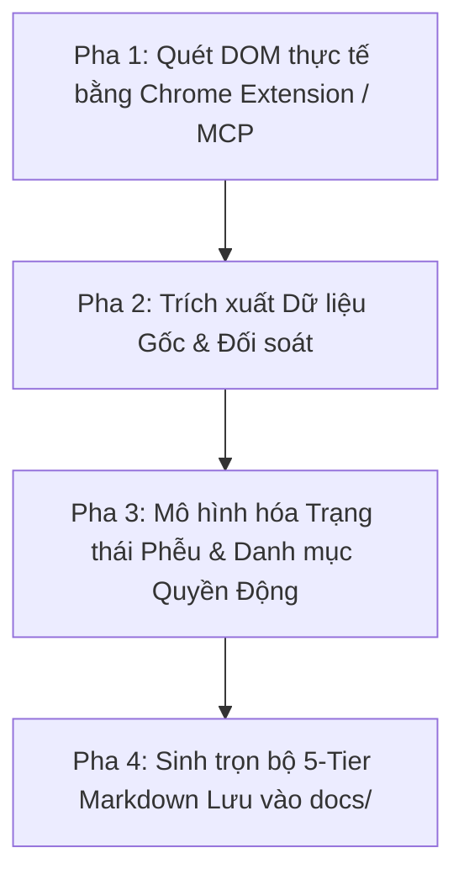

# Cẩm nang Kỹ năng Viết & Biên tập Tài liệu Nghiệp vụ (5-Tier BA Suite)

Tài liệu này quy định quy trình, nguyên tắc và hướng dẫn kỹ năng dành cho AI Agent khi tiến hành biên soạn, cập nhật các tài liệu nghiệp vụ (thuộc mô hình 5-Tier: Vision, BR, SR, Persona, CAP, BF, US, FLOW) của dự án Rinov5 EdTech ERP.

---

## 1. Nguyên tắc cốt lõi (Core First Principles)

### 1.1. Trung thực Dữ liệu & Không suy diễn Kỹ thuật / Số liệu
- **Không tự ý suy diễn bối cảnh doanh nghiệp:** Bối cảnh và vấn đề thực tế để dạng thẻ giữ chỗ `[Người dùng tự điền...]` để chủ doanh nghiệp / PO tự bổ sung.
- **Không bịa đặt số liệu hiện trạng (Baseline) và API máy chủ:** Bảng KPI chỉ đề xuất mục tiêu tương lai (Target) và phương pháp đo lường. Không vẽ ra các API endpoint / JSON payload giả định nếu không có tài liệu kỹ thuật Backend chính thức.
- **Bảo toàn dữ liệu gốc từ DOM:** Toàn bộ chuỗi ký tự, nhãn, mẫu che bảo mật (như `xxxxxx122`) phải trích xuất nguyên văn từ giao diện thực tế.

### 1.2. Phân tách Thuộc tính Thực thể & Trạng thái Phễu Vòng đời
- Các giá trị trong bộ lọc tìm kiếm (như `student_status`: `Đang học`, `Bảo lưu`) là **Thuộc tính thực thể**, không được đưa vào làm các bước chuyển đổi trong sơ đồ trạng thái phễu.
- Trạng thái kết thúc (Completed / Lost / Canceled) là **Trạng thái Kết thúc Toàn cục (Global Terminal State)**, có thể chuyển trực tiếp từ bất kỳ giai đoạn nào kèm lý do.

### 1.3. Phân quyền Động theo Năng lực Nguyên tử (Atomic Capabilities)
- **Khai báo tại BF:** Khai báo toàn bộ danh mục quyền hạn dưới dạng **Mã Quyền Hạn Nguyên Tử** (ví dụ: `<domain>.<entity>.<action>`) tại BF.
- **Không gán cứng Role:** Tuyệt đối không tạo ma trận gán quyền tĩnh cho các Role (Admin, CSM, Teacher...) vì quyền hạn được người dùng tự gán động trong phân hệ Quản trị.
- **Capability Gating tại US:** Các tài liệu User Story (US) chỉ kiểm soát hiển thị các nút/vùng giao diện theo mã quyền tương ứng.
- **Bảng User Stories tinh gọn:** Bảng danh sách User Stories con chỉ bao gồm: *Tên Yêu cầu (Màn hình / Hộp thoại), Phân loại, Mã Quyền Yêu Cầu*. Không đưa các cột mã tĩnh hoặc trạng thái tĩnh (Đã duyệt / Đang soạn thảo).

### 1.4. Quy tắc Nghiệp vụ Bám sát Giao diện Thực tế
- Quy tắc nghiệp vụ tổng thể phải được trích xuất trực tiếp từ các thành phần, bộ lọc, logic kết hợp và tương tác thực tế của trang (Page-grounded rules), không chèn các điều khoản trừu tượng hoặc mã quy tắc mẫu chung chung.

### 1.5. Ngôn ngữ Tự nhiên & Trực quan (`[POLICY-DS-05]`)
- **100% Không biệt ngữ kỹ thuật:** Tuyệt đối không đưa các thuật ngữ kỹ thuật, CSS hoặc tên biến vào nội dung nghiệp vụ chính. 
- **Bảng đối chiếu thuật ngữ bắt buộc:**
  | Thuật ngữ Kỹ thuật (Tránh dùng) | Thuật ngữ Nghiệp vụ (Bắt buộc dùng) |
  |:---|:---|
  | API, Backend, Endpoint, Server | Máy chủ, Hệ thống, Phản hồi từ máy chủ |
  | Frontend, Client, UI, DOM | Giao diện, Màn hình hiển thị |
  | Modal, Dialog, Popup | Hộp thoại nổi, Bảng thông tin nổi, Popup |
  | Dropdown, Select, Combobox | Ô chọn danh sách thả xuống, Danh sách lựa chọn |
  | Input, Textbox, Field | Ô nhập liệu, Trường nhập thông tin |
  | Checkbox, Radio button | Ô chọn, Hộp kiểm, Nút chọn duy nhất |
  | Toggle, Switch | Công tắc chuyển đổi trạng thái |
  | Hover (mouse hover) | Rê chuột, Con trỏ chuột di vào |
  | Active/Inactive, Enable/Disable | Kích hoạt / Tạm khóa, Cho phép / Vô hiệu hóa |
  | Loading skeleton, Spinner | Hiệu ứng tải dữ liệu, Màn hình chờ |
  | CSS, padding, border-radius, shadow | Bố cục co giãn, Bo góc nhẹ, Có bóng mờ |

---

## 2. Quy trình làm việc 4 pha bóc tách từ HTML to Doc

1. **Pha 1: Bóc tách DOM qua Extension / MCP:** Thu thập chính xác toàn bộ form, bảng, bộ lọc và các nút hành động.
2. **Pha 2: Phân tích Dữ liệu Gốc:** Bóc tách chính xác các trường, nhãn, mặt nạ hiển thị mà không tự ý chuẩn hóa sai lệch.
3. **Pha 3: Mô hình hóa Nghiệp vụ:** Xây dựng sơ đồ State Diagram phi tuyến tính với Global Terminal States và bảng danh mục Atomic Capabilities tại BF.
4. **Pha 4: Xuất bản Tệp Markdown:** Sinh trọn bộ tài liệu (`BF`, `US List`, `US Form`, `US Detail`) lưu trực tiếp vào thư mục `docs/business-functions/<domain>/`.
