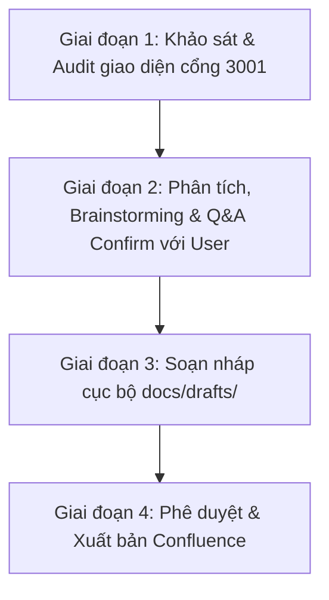

# Cẩm nang Kỹ năng Viết & Biên tập Tài liệu Nghiệp vụ (Confluence & Git)

Tài liệu này quy định quy trình, nguyên tắc và hướng dẫn kỹ năng dành cho AI Agent khi tiến hành biên soạn, cập nhật các tài liệu nghiệp vụ (thuộc mô hình 5-Tier: Vision, BR, SR, Persona, CAP, BF, US, FLOW) của dự án Rinov5 EdTech ERP, sử dụng Confluence làm nguồn sự thật duy nhất (Single Source of Truth - SSOT).

---

## 1. Nguyên tắc cốt lõi (Core Policies)

### 1.1. Chính sách Di trú & Tái sử dụng API (`[POLICY-MIG-01]`)
- **Kế thừa tuyệt đối:** Hệ thống Next.js (Rinov5 Station) chỉ làm lại giao diện và luồng tương tác phía người dùng, tái sử dụng 100% các API nghiệp vụ sẵn có từ hệ thống Backend (BE) dùng chung của CRM, ERP, CARE hiện tại. 
- **Ranh giới tài liệu:** Chỉ mô tả quy tắc kiểm soát, ràng buộc trực quan hoặc xác thực phía giao diện (client-side validation), kế thừa logic máy chủ hiện tại.

### 1.2. Chính sách Ngôn ngữ Tự nhiên & Trực quan (`[POLICY-DS-05]`)
- **100% Không biệt ngữ kỹ thuật (Áp dụng cho tài liệu hướng nghiệp vụ):** Tuyệt đối không đưa các thuật ngữ kỹ thuật, CSS hoặc tên biến vào nội dung nghiệp vụ chính. 
- **Bảng đối chiếu thuật ngữ bắt buộc:**
  | Thuật ngữ Kỹ thuật (Tránh dùng) | Thuật ngữ Nghiệp vụ (Bắt buộc dùng) |
  |:---|:---|
  | API, Backend, Endpoint, Server | Máy chủ, Hệ thống, Phản hồi từ máy chủ |
  | Frontend, Client, UI, DOM | Giao diện, Màn hình hiển thị |
  | Modal, Dialog, Popup | Hộp thoại nổi, Bảng thông tin nổi, Popup |
  | Dropdown, Select, Combobox | Ô chọn danh sách thả xuống, Danh sách lựa chọn |
  | Input, Textbox, Field | Ô nhập liệu, Trường nhập thông tin |
  | Checkbox, Radio button | Ô chọn, Hộp kiểm, Nút chọn duy nhất |
  | Toggle, Switch | Công tắc chuyển đổi trạng thái |
  | Hover (mouse hover) | Rê chuột, Con trỏ chuột di vào |
  | Active/Inactive, Enable/Disable | Kích hoạt / Tạm khóa, Cho phép / Vô hiệu hóa |
  | Loading skeleton, Spinner | Hiệu ứng tải dữ liệu, Màn hình chờ |
  | CSS, padding, border-radius, shadow | Bố cục co giãn, Bo góc nhẹ, Có bóng mờ |
  | JSON, Request/Response payload | Gói dữ liệu truyền đi, Dữ liệu phản hồi từ máy chủ |

---

## 2. Quy trình làm việc tổng quan (General Workflow)

Quy trình biên soạn tài liệu nghiệp vụ được thực hiện khép kín qua các giai đoạn sau:

### 🔍 Giai đoạn 1: Khảo sát & Audit giao diện thực tế (Rinov5 Local Audit)
Trước khi biên soạn hoặc chỉnh sửa bất kỳ tài liệu đặc tả nào, Agent bắt buộc phải nghiên cứu giao diện thật để lấy thông tin nghiệp vụ chính xác:
1. **Truy cập ứng dụng Next.js (Rinov5):** Đảm bảo ứng dụng Next.js đang chạy tại `http://localhost:3001`.
2. **Audit Giao diện & Hành vi:** Truy cập màn hình đích (ví dụ: `/app/students`), rà soát cấu trúc bố cục, các tab, vị trí nút bấm, và bảng dữ liệu hiện tại.
3. **Đọc mã nguồn giao diện:** Tìm mã nguồn tương ứng trong thư mục `src/components/screens/[menuId]/` (ví dụ: `src/components/screens/students/`) để hiểu các cơ chế xử lý logic, lọc dữ liệu, và trạng thái lỗi/thành công.
4. **Thu thập dữ liệu ban đầu:** Liệt kê sơ bộ các trường dữ liệu, các trạng thái tĩnh, và tự động đề xuất tối thiểu 11 Corner Cases nghiệp vụ từ mã nguồn và giao diện thực tế.

### 🧠 Giai đoạn 2: Phân tích, Brainstorming & Q&A Confirm với Người dùng
Sau khi hoàn thành khảo sát ở Giai đoạn 1, Agent **TUYỆT ĐỐI KHÔNG** được bắt tay vào viết nháp ngay. Phải thực hiện bước đồng bộ và làm rõ với Người dùng:
1. **Phân tích & Brainstorming:** Đề xuất tối thiểu 2-3 điểm cải tiến UI/UX hoặc làm tối ưu hóa luồng tương tác thực tế dựa trên phân tích ở Giai đoạn 1.
2. **Lập danh sách câu hỏi làm rõ (Q&A List):** Tổng hợp các điểm mâu thuẫn nghiệp vụ, các trường hợp góc cạnh (Corner Cases) hoặc các chính sách cần làm rõ.
3. **Thảo luận & Xác nhận (Q&A Confirm):** Gửi các đề xuất và danh sách câu hỏi Q&A này cho Người dùng qua chat. **Chỉ khi Người dùng phản hồi xác nhận/làm rõ xong các nội dung này**, Agent mới được phép chuyển sang Giai đoạn 3.
4. *Lưu ý về `/grill-me`:* Lệnh `/grill-me` chỉ đề xuất chạy khi phát triển một phân hệ/tính năng hoàn toàn mới (chưa có bất kỳ giao diện hay dòng code nào làm mẫu trên cổng 3001).

### 📝 Giai đoạn 3: Lựa chọn Template & Soạn nháp cục bộ (Local Drafting)
Sau khi có sự đồng thuận từ Người dùng:
1. **Lựa chọn Template:** Đối chiếu màn hình thực tế với các mẫu tài liệu tiêu chuẩn trong `docs/templates/` để chọn đúng cấu trúc:
   - **Màn hình bảng biểu / lọc / tìm kiếm:** Sử dụng `TEMPLATE-US-LIST.md`.
   - **Hộp thoại biểu mẫu / popup tạo mới / sửa:** Sử dụng `TEMPLATE-US-FORM.md`.
   - **Trang hồ sơ chi tiết / 2 cột / chuyển trạng thái:** Sử dụng `TEMPLATE-US-DETAIL.md`.
   - **Luồng quy trình liên thông nhiều bên:** Sử dụng `TEMPLATE-FLOW.md`.
2. **Soạn thảo bản nháp cục bộ:** Bản nháp được viết dưới dạng Markdown (`.md`) lưu tại thư mục tạm thời `docs/drafts/`.
3. **Đặc tả đúng cấu trúc:** Viết chi tiết các phần nghiệp vụ (Bối cảnh, Luồng sequence Mermaid, Giao diện tĩnh, Khối chức năng Action-Event) và khai báo Frontmatter liên kết Tier 0.

### 📤 Giai đoạn 4: Phê duyệt & Xuất bản (Approve & Publish to Confluence)
- **Xuất bản:** Sau khi bản nháp được người dùng phê duyệt, Agent sử dụng công cụ **Confluence MCP** (`confluence_create_page` hoặc `confluence_update_page`) để tự động đẩy tài liệu lên Confluence.
- **Dọn dẹp:** Sau khi đăng lên Confluence thành công, Agent tự động xóa file nháp cục bộ tại `docs/drafts/` để giữ repository sạch sẽ.

---

## 3. Cấu trúc tài liệu Business Feature (BF) / User Story (US) theo tư duy Data - Action - Event

Mỗi tài liệu Business Feature (BF) hoặc User Story (US) được tạo ra phải tuân thủ nghiêm ngặt cấu trúc 4 phần lớn sau:

### 3.1. NHẬT KÝ THAY ĐỔI & BỐI CẢNH (CHANGELOG & CONTEXT)
- **Lịch sử cập nhật tài liệu (Changelog):**
  | Ngày cập nhật | Nội dung cập nhật | Lý do cập nhật |
  |---|---|---|
  | DD/MM/YYYY | Tóm tắt nội dung thay đổi | Lý do (Ví dụ: Chốt luồng, thay đổi UI...) |
- **Tổng quan nghiệp vụ:** Tính năng này giải quyết bài toán gì cho doanh nghiệp?
- **Phạm vi (Scope):** Các module hoặc thực thể dữ liệu liên quan trực tiếp.
- **Ràng buộc kỹ thuật (Technical Constraints):** Ghi nhận các quy tắc hệ thống (Ví dụ: Cơ chế phân quyền - Capability Gating check quyền `approve_order` ở API Gateway/Route Middleware, tích hợp Prisma, cơ chế bọc lỗi trung tâm...).

### 3.2. LUỒNG XỬ LÝ CHÍNH (MAIN FLOW - HAPPY PATH)
- Mô tả luồng đi xuyên suốt của tính năng từ khi bắt đầu đến khi kết thúc thành công.
- **Biểu diễn luồng bằng Mermaid Code:** Bắt buộc sử dụng mã Mermaid (Sơ đồ Sequence hoặc State Diagram) mô tả rõ luồng tương tác:
  `Giao diện (Frontend) -> API Gateway/Middleware (Check Auth/Quyền) -> Services/Logic -> Cơ sở dữ liệu (Database)`.

### 3.3. GIAO DIỆN & TRẠNG THÁI TĨNH (DATA & UI STATE)
- **Link/Hình ảnh Figma:** [Ghi vị trí để User chèn link thiết kế].
- **Data hiển thị (Trạng thái tĩnh của màn hình):** Liệt kê chi tiết toàn bộ các trường thông tin hiển thị dựa trên giao diện dưới dạng bảng:
  | Tên trường thông tin | Kiểu dữ liệu | Nguồn dữ liệu (API Endpoint / Tĩnh) | Quy tắc thị giác & Trạng thái (Visual Mapping) | Quy tắc co giãn màn hình (Mobile Responsive) |
  |:---|:---|:---|:---|:---|
  | Tên học viên | `Text` | API `GET /students` | Chữ thường, cỡ chuẩn | Giữ nguyên trên di động |
  | Trạng thái | `Enum` | API `GET /students` | Áp dụng `statusColors.ts` (§3.2): Active (xanh), Inactive (xám)... | Thu gọn thành badge icon trên di động |
- **Đặc tả đầy đủ các trạng thái hiển thị của màn hình:**
  1. *Trạng thái chưa có dữ liệu (Trống - Empty state):* Hiển thị hình ảnh minh họa mờ kèm nút hướng dẫn hành động (kêu gọi tạo mới dữ liệu).
  2. *Trạng thái đang tải (Loading state):* Hiển thị Skeleton loading tương ứng với cấu trúc layout.
  3. *Trạng thái lỗi tải dữ liệu (Error state):* Hiển thị cảnh báo kèm nút tải lại trang (Retry button).

### 3.4. KHỐI CHỨC NĂNG CHI TIẾT: ACTION & LUỒNG KÍCH HOẠT (ACTIONS & EVENTS)
Phân rã màn hình thành các **Khối chức năng (Functional Blocks)**. Trong mỗi khối, mô tả chi tiết theo trục: **Hành động (Action) -> Luồng kích hoạt (Event/Flow) -> Kết quả**.

Cấu trúc chi tiết cho mỗi Action:
- **Action [Tên Action]:** (Ví dụ: Click nút [Lưu học viên], Thay đổi giá trị bộ lọc...).
- **Luồng kích hoạt (Event/Flow):** Mô tả hành động này gọi API nào? (Payload truyền đi là gì, Phương thức HTTP Method nào?).
- **Quy tắc nghiệp vụ & Kiểm soát (Validation & Rules):**
  - *Frontend Validation:* Check trống, độ dài, định dạng email/sđt, định dạng số tiền...
  - *Backend Validation:* Kiểm tra quyền (Capability Gating), check ràng buộc DB (trùng lặp ID, trùng lịch giáo viên...).
- **Tiêu chí nghiệm thu (Acceptance Criteria - AC):** Viết theo định dạng **Given - When - Then** bắt buộc cho cả 3 luồng:
  - *Happy Path* (Luồng thành công).
  - *Alternate Path* (Luồng rẽ nhánh, các trường hợp nghiệp vụ đặc thù - phải tích hợp đầy đủ các Corner Cases như lệch số buổi học, quay vòng bài học, ghi đè lộ trình...).
  - *Exception Path* (Luồng xử lý lỗi: Mất mạng, Lỗi hệ thống 500 từ máy chủ, Lỗi phân quyền 403, Lỗi trùng lặp từ DB...).

---

## 4. Quy trình biên tập trọn bộ CAP / Module nghiệp vụ lớn (Module-Level Workflow)

Khi người dùng yêu cầu biên soạn hoặc xây dựng tài liệu cho cả một **Lãnh địa Nghiệp vụ (CAP)** hoặc **Module lớn** (ví dụ: màn hình quản lý học viên `/app/students` - bao gồm các nghiệp vụ hồ sơ, lớp học, học phí, điểm danh...), Agent tuyệt đối không được viết ngay các tài liệu chi tiết. Phải thực hiện quy trình phân rã và biên tập cuốn chiếu từ cấp cao nhất (CAP) xuống các chức năng con (BF) theo 3 bước sau:

### 🔄 QUY TRÌNH BIÊN TẬP MODULE

#### BƯỚC 1: XÁC ĐỊNH KIẾN TRÚC TỔNG THỂ & KHUNG DỮ LIỆU CỦA MODULE (CAP ARCHITECTURE)
Phản hồi đầu tiên chỉ tập trung định hình khung xương sống của toàn bộ Module:
1. **Mục tiêu & Phạm vi của CAP/Module:** Xác định rõ module này giải quyết bài toán gì, ranh giới nghiệp vụ ở đâu.
2. **Sơ đồ thực thể dữ liệu (Data ERD & Schema):** Vẽ sơ đồ thực thể (dạng Mermaid hoặc văn bản) thể hiện các thực thể dữ liệu chính tham gia vào Module và mối quan hệ giữa chúng (ví dụ: Học viên, Lớp học, Gói học, Hóa đơn...).
3. **Vòng đời trạng thái toàn cục (State Lifecycle):** Mô tả vòng đời và luồng chuyển đổi trạng thái của đối tượng cốt lõi trong Module (ví dụ: Học viên từ *Chờ xếp lớp -> Đang học -> Bảo lưu -> Tốt nghiệp*).
4. **Ma trận phân quyền toàn cục (Actor & Capabilities):** Xác định rõ các đối tượng người dùng (Giáo vụ, Tư vấn viên, Quản lý...) và các quyền hạn/hành động tương ứng trong Module này.
👉 *Dừng lại và yêu cầu người dùng xác nhận hoặc sửa đổi Kiến trúc tổng thể.*

#### BƯỚC 2: PHÂN RÃ LUỒNG LIÊN THÔNG & DANH SÁCH CHỨC NĂNG (BF DECOMPOSITION)
Sau khi Bước 1 được duyệt, tiến hành:
1. **Vẽ Sơ đồ luồng đi liên thông (Main Flows - Happy Path):** Thể hiện luồng đi của người dùng qua các giao diện khác nhau trong Module bằng Mermaid.
2. **Liệt kê danh sách các Chức năng cụ thể (Business Functions - BF):** Bóc tách Module lớn thành danh sách các chức năng cần đặc tả chi tiết (ví dụ: `BF-STD-01: Quản lý Hồ sơ`, `BF-STD-02: Phân xếp lớp`, `BF-STD-03: Đóng học phí`...).
👉 *Dừng lại và yêu cầu người dùng xác nhận Luồng chính và Danh sách Business Functions.*

#### BƯỚC 3: CHI TIẾT HÓA TỪNG BUSINESS FUNCTION (BF & DETAIL)
Sau khi thống nhất danh sách chức năng con, viết chi tiết **CHO TỪNG BUSINESS FUNCTION MỘT** (hoặc tối đa 2 BF mỗi lượt trả lời để đảm bảo độ sâu của tài liệu).
Mỗi Business Function (BF) phải đặc tả đầy đủ theo đúng cấu trúc tại Mục 3:
1. Bản nháp tài liệu cục bộ tại `/docs/drafts/`.
2. Đặc tả Quy tắc Nghiệp vụ (Business Rules), Giao diện & Trạng thái (UI & States), Luồng hoạt động (Workflow), Đầy đủ 11 Corner Cases và Tiêu chí nghiệm thu (Acceptance Criteria).
3. Sau khi người dùng duyệt, gọi Confluence MCP đẩy trực tiếp trang BF lên Confluence và xóa file nháp cục bộ.
👉 *Hỏi người dùng: "Bạn muốn tôi chi tiết hóa Business Function tiếp theo chưa?"*
