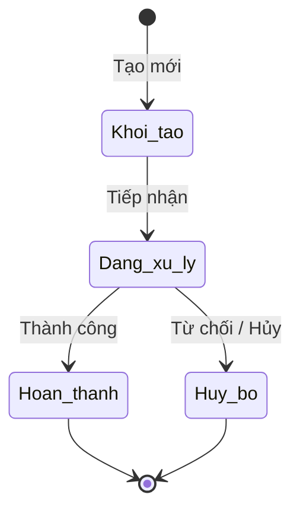

# BF-XXX-YY: [Tên Phân hệ Nghiệp vụ]

> **Capability:** CAP-XXX ([Tên Capability])  
> **Giai đoạn:** [1 - Thiết lập / 2 - Vận hành...]  
> **Nhóm chức năng:** [Tên nhóm trên thanh điều hướng]  
> **Mã màn hình:** `[menu_id]` (`/app/[menu_id]`)  

---

## Lịch sử cập nhật tài liệu (Changelog)

| Ngày cập nhật | Nội dung cập nhật | Lý do cập nhật |
|---|---|---|
| [Ngày/Tháng/Năm] | [Tóm tắt nội dung] | [Lý do cập nhật] |

---

## 1. Bối cảnh & Vấn đề hiện tại (Context & Problem Statement)
* **Bối cảnh:** [Người dùng tự điền bối cảnh phát sinh yêu cầu của phân hệ này]
* **Vấn đề thực tế:** [Người dùng tự điền khó khăn, hạn chế hoặc vấn đề thực tế đang gặp phải]

---

## 2. Mục tiêu, Giá trị mang lại & Chỉ số đo lường (Objectives, Value & KPIs)
* **Mục tiêu:** [Người dùng tự điền mục tiêu triển khai]
* **Giá trị mang lại:** [Người dùng tự điền giá trị mang lại cho người dùng và tổ chức]
* **Mục tiêu đo lường hiệu quả (Đề xuất chỉ số tương lai):**

| Chỉ số đo lường (KPI) | Mục tiêu đề xuất (Target) | Phương pháp đo lường |
| :--- | :--- | :--- |
| **[KPI-001] [Tên chỉ số 1]** | [Mục tiêu kỳ vọng] | [Cách thức thu thập / đo lường] |
| **[KPI-002] [Tên chỉ số 2]** | [Mục tiêu kỳ vọng] | [Cách thức thu thập / đo lường] |

---

## 3. Hiểu người dùng (Target Users & Personas)

* **[Persona 1 (Ví dụ: Nhân viên Chăm sóc Khách hàng - CSM)]:**
  * *Bối cảnh sử dụng:* [Khi nào, ở đâu, tần suất sử dụng]
  * *Nhu cầu thực tế:* [Mong muốn hệ thống hỗ trợ gì để tối ưu hiệu suất]
* **[Persona 2 (Ví dụ: Quản lý Cơ sở - BM)]:**
  * *Bối cảnh sử dụng:* [Khi nào, ở đâu]
  * *Nhu cầu thực tế:* [Mong muốn theo dõi, phê duyệt điều phối]

---

## 4. Ranh giới Nghiệp vụ & Phân loại Risk / Standard (Scope & Classification)

### Có bao gồm (In Scope)
- [Nghiệp vụ 1 bóc tách từ giao diện]
- [Nghiệp vụ 2 bóc tách từ giao diện]

### Không bao gồm (Out of Scope)
- [Nghiệp vụ X] $\rightarrow$ Đã được xử lý tại `BF-YYY-ZZ`

### Đánh giá & Phân loại Risk / Standard (Quality Gate 1)

| Tiêu chí | Nội dung đánh giá thực tế | Điểm (0 / 1) |
|---|---|---|
| **A. Ảnh hưởng hệ thống** | [0: 1 module, không đổi kiến trúc; 1: $\ge$ 2 module hoặc thay đổi kiến trúc] | [0 hoặc 1] |
| **B. Tác động tài chính** | [0: không ảnh hưởng tài chính; 1: liên quan doanh thu/chi phí/pháp lý] | [0 hoặc 1] |
| **C1. Loại thay đổi** | [0: cập nhật tính năng đã có; 1: revamp toàn bộ] | [0 hoặc 1] |
| **C2. Độ mới nghiệp vụ** | [0: nghiệp vụ đã hiểu rõ; 1: nghiệp vụ mới chưa có tiền lệ] | [0 hoặc 1] |
| **D. Phụ thuộc bên ngoài** | [0: không phụ thuộc bên thứ 3; 1: phụ thuộc đối tác/API ngoài] | [0 hoặc 1] |

* **Tổng điểm:** [Tổng điểm đánh giá]
* **Kết luận phân loại:** [🟢 **Standard** (nếu 0 điểm) / 🔴 **Risk** (nếu $\ge 1$ điểm)]

---

## 5. Mô hình Dữ liệu Nghiệp vụ & Phân Quyền Năng Lực (Data Entities & Permissions)

| Tên Thực thể | Trường định danh | Thuộc tính quan trọng | Ràng buộc quan hệ | Diễn giải |
|---|---|---|---|---|
| **[Thực thể A]** | `id` | [Thuộc tính chính] | Trỏ về [Thực thể liên kết] | [Mô tả thực thể] |
| **[Thực thể B]** | `id` | [Thuộc tính chính] | Trỏ về [Thực thể A] | [Mô tả thực thể] |

### 5.1. Vòng đời Trạng thái (Status Lifecycle)
*Mô hình hóa chu trình trạng thái thực tế với các nhánh rẽ và điểm kết thúc toàn cục (Global Terminal States):*

### 5.2. Danh mục Quyền hạn & Năng lực Nghiệp vụ Động (Atomic Permissions / Capabilities)

> [!IMPORTANT]
> **Nguyên tắc Phân quyền Động (Dynamic Capability Gating):**
> Hệ thống **tuyệt đối KHÔNG gán cứng quyền theo bất kỳ Vai trò (Role) cố định nào**. 
> Toàn bộ vai trò và việc gán quyền được quản trị viên thiết lập động tại phân hệ Quản trị Hệ thống. Bảng dưới đây định nghĩa danh mục các **Năng lực Quyền hạn Nguyên tử (Atomic Permission Keys)** mà phân hệ này cung cấp:

| Mã Quyền Hạn (Permission Key) | Tên Quyền Hạn (Tiếng Việt) | Loại Quyền | Phạm Vi Áp Dụng (Scope) | Diễn Giải Nghiệp Vụ |
| :--- | :--- | :---: | :--- | :--- |
| `<domain>.<entity>.view` | Xem danh sách | Truy cập | Giao diện danh sách | Cho phép truy cập màn hình và xem danh sách bản ghi |
| `<domain>.<entity>.filter` | Lọc và tìm kiếm | Thao tác | Thanh công cụ | Cho phép sử dụng bộ lọc và ô tìm kiếm |
| `<domain>.<entity>.view_detail`| Xem chi tiết | Truy cập | Hộp thoại chi tiết / Drawer | Cho phép mở xem chi tiết bản ghi |
| `<domain>.<entity>.create` | Tạo mới bản ghi | Ghi | Nút tạo mới | Cho phép mở biểu mẫu tạo mới dữ liệu |
| `<domain>.<entity>.export` | Xuất báo cáo | Xuất | Nút xuất dữ liệu | Cho phép xuất dữ liệu ra file bảng tính |

---

## 6. Quy tắc Nghiệp vụ Tổng thể (Bóc tách trực tiếp từ Giao diện & Dữ liệu Thực tế)

*(Mô tả chi tiết các quy tắc nghiệp vụ thực tế được trích xuất trực tiếp từ các thành phần giao diện, bộ lọc, ràng buộc dữ liệu và tương tác của trang web, không sử dụng ghi chú mẫu hay điều khoản trừu tượng)*

1. **Quy tắc Lọc và Tra cứu Dữ liệu:**
   - [Mô tả logic kết hợp giữa các bộ lọc thả xuống, radio, và từ khóa tìm kiếm theo điều kiện VÀ].
2. **Quy tắc Hiển thị & Định dạng Dữ liệu:**
   - [Mô tả quy cách hiển thị nhãn trạng thái, mặt nạ bảo mật chuỗi dữ liệu (nếu có), định dạng tiền tệ, ngày tháng].
3. **Quy tắc Chuyển đổi Trạng thái & Xử lý Rẽ nhánh:**
   - [Mô tả điều kiện chuyển đổi giữa các trạng thái và khả năng hủy/kết thúc tại từng giai đoạn].
4. **Quy tắc Tương tác & Khởi tạo Tác vụ Phụ thuộc:**
   - [Mô tả hành vi khi người dùng bấm các nút hành động trên bảng hoặc thanh công cụ].

---

## 7. Danh sách Yêu cầu Người dùng (User Stories)

| Tên Yêu cầu (Màn hình / Hộp thoại) | Phân loại | Mã Quyền Yêu Cầu (Required Capability) |
| :--- | :---: | :--- |
| **[Tên Màn hình Danh sách]** (Màn hình Danh sách) | 🟢 Standard | `<domain>.<entity>.view`, `<domain>.<entity>.filter` |
| **[Tên Biểu mẫu Tạo/Sửa]** (Hộp thoại nổi / Modal) | 🔴 Risk | `<domain>.<entity>.create` |
| **[Tên Chi tiết / Dòng thời gian]** (Hộp thoại trượt / Drawer) | 🟢 Standard | `<domain>.<entity>.view_detail` |

---

## Phụ lục: Tự đánh giá Quality Gate 1 (Checklist A)
- [ ] **1. Vì sao phải làm?** Mục 1 dành chỗ trống cho người dùng tự điền bối cảnh thực tế.
- [ ] **2. Làm cho ai?** Persona và Use Case được định nghĩa cụ thể trong Mục 3.
- [ ] **3. Người dùng sử dụng thế nào?** Luồng trạng thái phễu State Diagram được mô tả ở Mục 5.1.
- [ ] **4. Phân quyền động?** Danh mục quyền hạn nguyên tử (Atomic Capabilities) được quy định tại Mục 5.2.
- [ ] **5. Feature Scope?** Danh sách User Stories con được liệt kê ở Mục 7 kèm mã quyền hạn liên kết.
