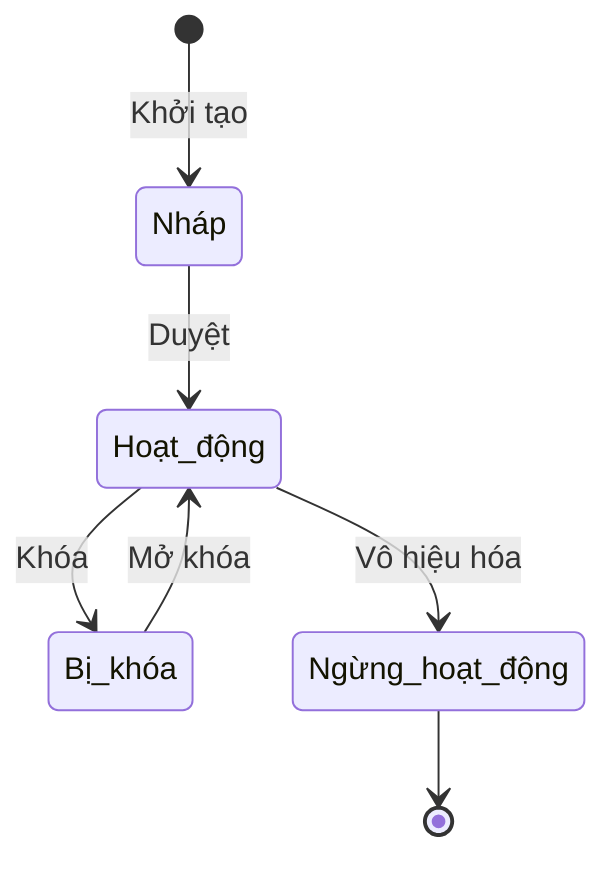

# BF-XXX-YY: [Tên Phân hệ Nghiệp vụ]

> **Capability:** CAP-XXX ([Tên Capability])
> **Giai đoạn:** [1 - Thiết lập / 2 - Vận hành...]
> **Nhóm chức năng:** [Tên nhóm trên thanh điều hướng]
> **Mã màn hình:** `[menu_id]`

---

## 1. Mô tả tổng quan

[Phân hệ này giải quyết bài toán gì? Vì sao tổ chức cần nó để vận hành?]

## 2. Đối tượng sử dụng (Vai trò)

- **[Vai trò 1]:** [Mục đích sử dụng]
- **[Vai trò 2]:** [Mục đích sử dụng]

## 3. Ranh giới Nghiệp vụ (Scope)

### Có bao gồm (In Scope)
- [Nghiệp vụ 1]
- [Nghiệp vụ 2]

### Không bao gồm (Out of Scope)
- [Nghiệp vụ X] → Đã được xử lý tại `BF-YYY-ZZ`

## 4. Mô hình Dữ liệu Nghiệp vụ (Data Entities)

| Tên Thực thể | Trường định danh | Thuộc tính quan trọng | Ràng buộc quan hệ | Diễn giải |
|--------------|------------------|-----------------------|-------------------|----------|
| [Thực thể A] | Mã định danh | Trạng thái, Phân loại | Trỏ về Mã chi nhánh | [Mô tả] |
| [Thực thể B] | Mã định danh | Số lượng, Tổng tiền | Trỏ về Mã Thực thể A | [Mô tả] |

### 4.1. Vòng đời Trạng thái (Status Lifecycle)

*Sơ đồ dưới đây xác định tất cả trạng thái hợp lệ và các phép chuyển đổi được phép.*

**Quy tắc chuyển đổi:**

| Từ trạng thái | Sang trạng thái | Điều kiện bắt buộc | Vai trò được phép |
|---------------|-----------------|---------------------|-------------------|
| Nháp | Hoạt động | Đã điền đủ thông tin bắt buộc | Quản trị viên |
| Hoạt động | Bị khóa | Không cần điều kiện | Quản trị viên |
| Bị khóa | Hoạt động | Không cần điều kiện | Quản trị viên |
| Hoạt động | Ngừng hoạt động | Hộp thoại xác nhận nguy hiểm | Quản trị viên |

### 4.2. Ví dụ Dữ liệu mẫu

*Giúp AI và Lập trình viên tạo dữ liệu kiểm thử chính xác.*

| Tình huống | Dữ liệu đầu vào | Kết quả mong đợi |
|------------|-----------------|-------------------|
| Tạo thành công | Tên: "Đối tượng A", Loại: "Loại 1", Hoạt động: Bật | Lưu thành công, hệ thống tự sinh mã. |
| Trùng mã | Mã: "XX-24-0001" (đã tồn tại) | Báo lỗi "Mã đã tồn tại", chặn lưu. |
| Thiếu trường bắt buộc | Tên: (bỏ trống) | Cảnh báo đỏ tại ô Tên, chặn lưu. |

## 5. Quy tắc Nghiệp vụ Tổng thể (Business Rules)

1. **[RULE-BF-01] Ràng buộc Trạng thái:** `NẾU` đối tượng ở trạng thái 'Bị khóa', `THÌ` mọi chức năng chỉnh sửa bị vô hiệu hóa.
2. **[RULE-BF-02] Quy tắc Sinh Mã:** Mã định danh sinh tự động theo định dạng `TIỀN_TỐ-{Năm}-{4 số thứ tự}`. Ví dụ: `HV-24-0001`.

### 5.1. Thông số & Định mức cấp Phân hệ (Global Metrics & Thresholds)
*(Định nghĩa các con số giới hạn, định mức hoặc SLA áp dụng chung cho toàn bộ phân hệ này)*
- **[GLOBAL-METRIC-01] Định mức vận hành:** Ví dụ: Mỗi giáo viên tối đa được phân công 40 giờ/tuần.
- **[GLOBAL-METRIC-02] Lưu trữ dữ liệu:** Lưu trữ trạng thái hoạt động trong 5 năm, sau đó tự động lưu trữ lạnh (Archive).

## 6. Danh sách Yêu cầu Người dùng (User Stories)

| Mã Yêu cầu | Tên Yêu cầu (Loại màn hình) | Đường dẫn truy cập | Trạng thái |
|------------|-----------------------------|--------------------|------------|
| US-XXX-YY-01 | [Tên US 1] (Danh sách) | /app/[menu_id] | Đang soạn thảo |
| US-XXX-YY-02 | [Tên US 2] (Biểu mẫu) | Không có | Đang soạn thảo |
| US-XXX-YY-03 | [Tên US 3] (Chi tiết) | /app/[menu_id]/[id] | Đang soạn thảo |

---

## 7. Chỉ dẫn cho AI Agent & Lập trình viên (Business Architecture)

- Tuân thủ chặt chẽ cấu trúc thực thể ở mục 4. Phải đảm bảo tính toàn vẹn dữ liệu nghiệp vụ (dữ liệu bảng con phải trỏ đúng mã có thật của bảng cha).
- Mọi trạng thái liệt kê trong sơ đồ 4.1 phải được ánh xạ đầy đủ vào hệ thống.
- Giao diện và luồng xử lý phải tuân thủ bảng chuyển đổi trạng thái (chỉ hiển thị các hành động hợp lệ theo từng trạng thái và phân quyền).

### ⛔ Hàng rào An toàn (Guardrails)
- **KHÔNG** thêm trường dữ liệu hoặc thực thể ngoài danh sách quy định ở mục 4.
- **KHÔNG** thay đổi cấu trúc quan hệ thực thể mà chưa được phê duyệt từ Product Owner.
- **KHÔNG** tạo trạng thái nghiệp vụ mới ngoài sơ đồ ở mục 4.1. Mọi sự thay đổi vòng đời phải được cập nhật vào tài liệu này trước.
