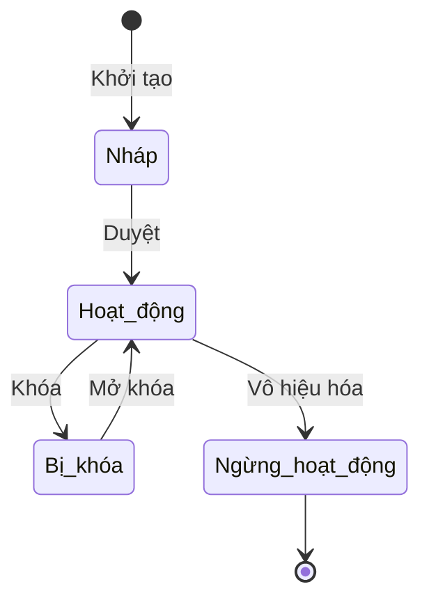

# BF-XXX-YY: [Tên Phân hệ Nghiệp vụ]

> **Capability:** CAP-XXX ([Tên Capability])
> **Giai đoạn:** [1 - Thiết lập / 2 - Vận hành...]
> **Nhóm chức năng:** [Tên nhóm trên thanh điều hướng]
> **Mã màn hình:** `[menu_id]`

---

## Lịch sử cập nhật tài liệu (Changelog)

| Ngày cập nhật | Nội dung cập nhật | Lý do cập nhật |
|---|---|---|
| [Ngày/Tháng/Năm] | [Tóm tắt nội dung] | [Lý do cập nhật] |

---

## 1. Bối cảnh & Vấn đề hiện tại (Context & Problem Statement)
* **Bối cảnh:** [Mô tả bối cảnh phát sinh yêu cầu của phân hệ này.]
* **Vấn đề thực tế:** [Khó khăn, hạn chế hoặc lỗi lọt ra môi trường thực tế hiện tại là gì? Nếu không làm thì hệ quả là gì?]

## 2. Mục tiêu, Giá trị mang lại & Chỉ số đo lường (Objectives, Value & KPIs)
* **Mục tiêu:** [Mục tiêu cụ thể cần đạt được sau khi triển khai phân hệ này là gì?]
* **Giá trị mang lại:** [Giá trị mang lại cho người dùng cuối và giá trị vận hành cho tổ chức.]
* **Mục tiêu đo lường hiệu quả (KPI target):**
    
    | Chỉ số đo lường (KPI) | Hiện trạng (Baseline) | Mục tiêu (Target) | Phương pháp đo lường |
    | :--- | :--- | :--- | :--- |
    | [KPI-001] [Tên chỉ số] | [Số liệu nền hiện tại] | [Số liệu kỳ vọng sau khi chạy] | [Cách thức thu thập/đo lường chỉ số] |

## 3. Hiểu người dùng (Target Users & Personas)
*Mô tả chi tiết chân dung đối tượng sử dụng chính, bối cảnh sử dụng, khó khăn lớn nhất và nhu cầu thực tế của họ.*

* **[Vai trò 1 (Ví dụ: Nhân viên chăm sóc học viên - CSM)]:**
  * *Bối cảnh sử dụng:* [Họ sử dụng phân hệ này khi nào, ở đâu, tần suất ra sao?]
  * *Khó khăn hiện tại (Pain-points):* [Khó khăn lớn nhất họ đang gặp phải ở hệ thống cũ hoặc quy trình thủ công.]
  * *Nhu cầu thực tế (Needs):* [Họ thực sự muốn hệ thống hỗ trợ gì để tăng hiệu suất làm việc?]
  * *Tình huống sử dụng chính (Use Cases):* [Mô tả 1-2 tình huống/kịch bản sử dụng cốt lõi của vai trò này.]
* **[Vai trò 2 (Ví dụ: Quản lý cơ sở - BM)]:**
  * *Bối cảnh sử dụng:* [Khi nào họ sử dụng?]
  * *Khó khăn hiện tại:* [Khó khăn hiện tại.]
  * *Nhu cầu thực tế:* [Nhu cầu thực tế.]
  * *Tình huống sử dụng chính:* [Kịch bản sử dụng chính.]

## 4. Ranh giới Nghiệp vụ & Phân loại Risk / Standard (Scope & Classification)

### Có bao gồm (In Scope)
- [Nghiệp vụ 1]
- [Nghiệp vụ 2]

### Không bao gồm (Out of Scope)
- [Nghiệp vụ X] → Đã được xử lý tại `BF-YYY-ZZ`

### Đánh giá & Phân loại Risk / Standard (Quality Gate 1)
*PO thực hiện đánh giá đặc tả nghiệp vụ dựa trên 5 tiêu chí dưới đây để xác định luồng phê duyệt.*

| Tiêu chí | Nội dung đánh giá thực tế | Điểm (0 / 1) |
|---|---|---|
| **A. Ảnh hưởng hệ thống** | [0: 1 module, không đổi kiến trúc; 1: >= 2 module hoặc thay đổi kiến trúc/database (Tech Lead xác nhận)] | [0 hoặc 1] |
| **B. Tác động tài chính** | [0: không ảnh hưởng doanh thu/chi phí/hợp đồng; 1: liên quan doanh thu/chi phí/pháp lý] | [0 hoặc 1] |
| **C1. Loại thay đổi** | [0: cập nhật tính năng đã có; 1: revamp toàn bộ] | [0 hoặc 1] |
| **C2. Độ mới nghiệp vụ** | [0: nghiệp vụ đã hiểu rõ; 1: nghiệp vụ mới chưa có tiền lệ] | [0 hoặc 1] |
| **D. Phụ thuộc bên ngoài** | [0: không phụ thuộc bên thứ 3; 1: phụ thuộc đối tác/API ngoài (Tech Lead xác nhận)] | [0 hoặc 1] |

*   **Tổng điểm:** [Tổng điểm đánh giá]
*   **Kết luận phân loại:** [🟢 **Standard** (nếu 0 điểm) / 🔴 **Risk** (nếu $\ge 1$ điểm)]
*   **Luồng phê duyệt Gate 1:** [Tự động thông qua (Standard) / Quản lý sản phẩm PM phê duyệt (Risk)]

## 5. Mô hình Dữ liệu Nghiệp vụ (Data Entities)

| Tên Thực thể | Trường định danh | Thuộc tính quan trọng | Ràng buộc quan hệ | Diễn giải |
|--------------|------------------|-----------------------|-------------------|----------|
| [Thực thể A] | Mã định danh | Trạng thái, Phân loại | Trỏ về Mã trường | [Mô tả] |
| [Thực thể B] | Mã định danh | Số lượng, Tổng tiền | Trỏ về Mã Thực thể A | [Mô tả] |

### 5.1. Vòng đời Trạng thái (Status Lifecycle)
*Sơ đồ dưới đây xác định tất cả trạng thái hợp lệ và các phép chuyển đổi được phép.*

**Quy tắc chuyển đổi:**

| Từ trạng thái | Sang trạng thái | Điều kiện bắt buộc | Vai trò được phép |
|---------------|-----------------|---------------------|-------------------|
| Nháp | Hoạt động | Đã điền đủ thông tin bắt buộc | Quản trị viên |
| Hoạt động | Bị khóa | Không cần điều kiện | Quản trị viên |
| Bị khóa | Hoạt động | Không cần điều kiện | Quản trị viên |
| Hoạt động | Ngừng hoạt động | Hộp thoại xác nhận nguy hiểm | Quản trị viên |

### 5.2. Ví dụ Dữ liệu mẫu
*Giúp Lập trình viên tạo dữ liệu kiểm thử chính xác.*

| Tình huống | Dữ liệu đầu vào | Kết quả mong đợi |
|------------|-----------------|-------------------|
| Tạo thành công | Tên: "Đối tượng A", Loại: "Loại 1", Hoạt động: Bật | Lưu thành công, hệ thống tự sinh mã. |
| Trùng mã | Mã: "XX-24-0001" (đã tồn tại) | Báo lỗi "Mã đã tồn tại", chặn lưu. |
| Thiếu trường bắt buộc | Tên: (bỏ trống) | Cảnh báo đỏ tại ô Tên, chặn lưu. |

## 6. Quy tắc Nghiệp vụ Tổng thể (Business Rules)

> [!IMPORTANT]
> **Lưu ý di trú:**
> Đối với các phân hệ thực hiện di trú giao diện từ hệ thống cũ và tái sử dụng 100% hệ thống cũ, bắt buộc ghi rõ: *"Kế thừa toàn bộ logic nghiệp vụ từ hệ thống cũ"*.
> Tuyệt đối KHÔNG tự ý định nghĩa mới hoặc đặc tả chi tiết các quy tắc nghiệp vụ lõi (như công thức tính toán, hệ số, điều kiện phê duyệt) thuộc về hệ thống cũ. Chỉ đặc tả các ràng buộc dữ liệu ở phía giao diện (kiểm tra tính hợp lệ, giới hạn nhập liệu, định dạng hiển thị) và quy trình tương tác.

1. **[Mã quy tắc (Ví dụ: RULE-BF-01)] [Tên quy tắc]:** Mô tả điều kiện và logic xử lý nghiệp vụ chung (hoặc quy tắc giao diện cho màn hình di trú). Dạng: `NẾU` [Điều kiện], `THÌ` [Kết quả].
2. **[Mã quy tắc (Ví dụ: RULE-BF-02)] [Tên quy tắc]:** Mô tả quy tắc nghiệp vụ khác (ví dụ: quy tắc định dạng hiển thị).

### 6.1. Thông số & Định mức cấp Phân hệ (Global Metrics & Thresholds)

> [!WARNING]
> **Ràng buộc hệ thống cũ:**
> Các con số giới hạn nghiệp vụ, hệ số tính toán, định mức giới hạn số lượng từ hệ thống cũ thuộc về nghiệp vụ hệ thống cũ và không can thiệp. KHÔNG định nghĩa các con số này dưới dạng quy tắc mới tại đây.
> Mục này chỉ dùng để liệt kê các cấu hình giao diện (ví dụ: phân trang mặc định) hoặc ghi nhận tham chiếu: *"Kế thừa các thông số/định mức từ hệ thống cũ"*.

- **[Mã định mức (Ví dụ: GLOBAL-METRIC-01)] [Tên định mức]:** Mô tả thông số giới hạn hoặc định mức vận hành (hoặc tham chiếu hệ thống cũ).
- **[Mã định mức (Ví dụ: GLOBAL-METRIC-02)] [Tên định mức]:** Mô tả thời gian xử lý hiển thị hoặc các ngưỡng giới hạn giao diện khác.

## 7. Danh sách Yêu cầu Người dùng (User Stories)

| Mã Yêu cầu | Tên Yêu cầu (Loại màn hình) | Phân loại nhãn | Đường dẫn truy cập | Trạng thái |
|------------|-----------------------------|----------------|--------------------|------------|
| US-XXX-YY-01 | [Tên US 1] (Danh sách) | [🟢 Standard / 🔴 Risk] | /app/[menu_id] | Đang soạn thảo |
| US-XXX-YY-02 | [Tên US 2] (Biểu mẫu) | [🟢 Standard / 🔴 Risk] | Không có | Đang soạn thảo |
| US-XXX-YY-03 | [Tên US 3] (Chi tiết) | [🟢 Standard / 🔴 Risk] | /app/[menu_id]/[id] | Đang soạn thảo |

---

## Phụ lục: Tự đánh giá Quality Gate 1 (Checklist A)
*PO tự rà soát Checklist A trước khi trình duyệt.*

- [ ] **1. Vì sao phải làm?** Mục 1 đã nêu rõ bối cảnh, mục tiêu và chỉ số KPI.
- [ ] **2. Làm cho ai?** Persona và Use Case được định nghĩa cụ thể trong Mục 3.
- [ ] **3. Người dùng sử dụng thế nào?** Luồng sử dụng được xây dựng rõ ràng (tham chiếu User Flow/FLOW-*.md).
- [ ] **4. Business Rules?** Quy tắc nghiệp vụ được định nghĩa đầy đủ ở Mục 6.
- [ ] **5. Feature Scope?** Danh sách chức năng/US ở Mục 7 có ID, độ ưu tiên và nhãn phân loại Risk/Standard.
- [ ] **6. Thiết kế giao diện dễ dùng?** Tuân thủ 6 tiêu chí đánh giá UI/UX (thao tác tối thiểu, bảng dữ liệu tinh gọn...).
- [ ] **7. Người dùng nhận giá trị gì?** Mục 2 xác định rõ KPI mục tiêu và cách đo lường cụ thể.
