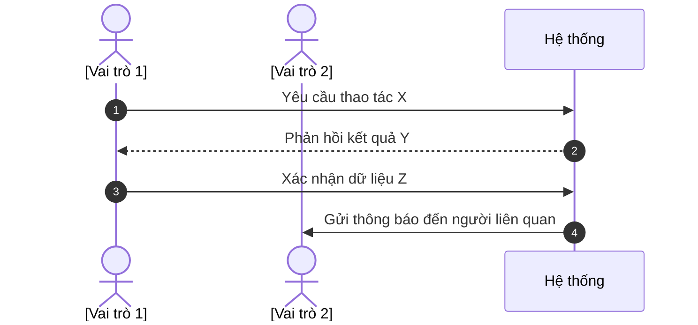

# FLOW-XXX-YY: [Tên Luồng Tổng Thể]

## 1. Bối cảnh Nghiệp vụ (Context)
[Luồng quy trình này giải quyết bài toán gì? Khi nào thì kích hoạt?]

## 2. Đối tượng và Hệ thống tham gia
*   **[Vai trò 1]**: [Mục đích / Thao tác trong luồng]
*   **[Vai trò 2]**: [Mục đích / Thao tác trong luồng]
*   **Hệ thống tự động**: [Hành động hệ thống tự thực thi]

## 3. Sơ đồ Trình tự

## 4. Diễn giải các bước
1.  **Bước 1**: [Mô tả chi tiết bằng ngôn ngữ nghiệp vụ]
2.  **Bước 2**: [Mô tả hệ thống kiểm tra quy tắc gì]
3.  **Bước 3**: [Mô tả kết quả cuối cùng]

## 5. Xử lý Rẽ nhánh / Ngoại lệ
*   **Tình huống [A]**: [Cách hệ thống xử lý ngoại lệ]
*   **Tình huống [B]**: [Cách hệ thống xử lý ngoại lệ]
