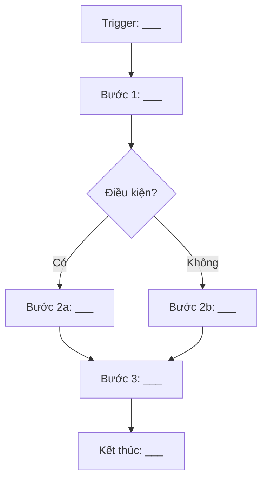

# TPL-PROC: Process Modeling As-Is — Vẽ Luồng Hiện tại

> **Kỹ thuật BABOK:** Process Modeling
> **Mục đích:** Ghi nhận quy trình hiện tại (As-Is) dưới dạng bảng bước + sơ đồ Mermaid.
> **Khi nào dùng:** Khi cần hiểu luồng công việc end-to-end trước khi thiết kế To-Be.

---

## 1. Thông tin Quy trình

| Mục | Giá trị |
|-----|---------|
| **Tên quy trình** | [VD: Quy trình Tuyển sinh từ Lead → Enrolled] |
| **Mã quy trình** | PROC-XXX |
| **Trigger (bắt đầu khi nào)** | [VD: Khi PH gọi điện hỏi thông tin] |
| **Kết thúc khi nào** | [VD: Khi HV được xếp lớp thành công] |
| **Persona liên quan** | [VD: Sale, BM, CSM] |
| **Người ghi nhận** | ___ |
| **Ngày ghi nhận** | YYYY-MM-DD |
| **Nguồn dữ liệu** | ○ Phỏng vấn ○ Quan sát ○ Tài liệu có sẵn |

---

## 2. Bảng Bước Quy trình

| STT | Bước | Ai làm | Input | Output | Thời gian | Vấn đề / Rủi ro |
|-----|------|--------|-------|--------|-----------|-----------------|
| 1 | | | | | | |
| 2 | | | | | | |
| 3 | | | | | | |
| 4 | | | | | | |
| 5 | | | | | | |
| 6 | | | | | | |
| 7 | | | | | | |
| 8 | | | | | | |

---

## 3. Sơ đồ Mermaid (Flowchart)

> Vẽ lại bảng bước dưới dạng flowchart. Dùng ký hiệu chuẩn BPMN đơn giản.

---

## 4. Handoff Points (Điểm chuyển giao)

> Liệt kê các điểm mà công việc chuyển từ người này sang người khác — đây thường là nơi xảy ra delay hoặc mất thông tin.

| # | Từ (Persona) | Sang (Persona) | Phương thức chuyển giao | Vấn đề thường gặp |
|---|-------------|---------------|------------------------|-------------------|
| 1 | | | ○ Hệ thống ○ Zalo ○ Giấy ○ Miệng | |
| 2 | | | ○ Hệ thống ○ Zalo ○ Giấy ○ Miệng | |
| 3 | | | ○ Hệ thống ○ Zalo ○ Giấy ○ Miệng | |

---

## 5. Phân tích Vấn đề

| # | Bước có vấn đề | Loại vấn đề | Mô tả | Tác động |
|---|---------------|-------------|--------|----------|
| 1 | | ○ Delay ○ Lỗi ○ Thiếu thông tin ○ Thủ công | | |
| 2 | | ○ Delay ○ Lỗi ○ Thiếu thông tin ○ Thủ công | | |

---

## 6. Output Mapping

| Nội dung | → Điền vào file | Mục cụ thể |
|----------|-----------------|------------|
| Bảng bước quy trình | `BF-XXX.md` | §2 Process Steps (validate) |
| Handoff points | `BF-XXX.md` | §3 Integration Points |
| Vấn đề / Delay | `BR-YYY.md` | §2 Context / Pain Points |
| Flowchart Mermaid | `FLOW-XXX.md` | Diagram chính |
| Bước thủ công cần automation | `US-XXX.md` | Acceptance Criteria |

---

## 7. Guardrails (Hàng rào An toàn)

- **KHÔNG** vẽ To-Be trong file này — chỉ ghi As-Is (hiện trạng).
- **KHÔNG** bỏ qua bước "xấu" hoặc workaround — ghi đúng thực tế.
- **KHÔNG** gộp nhiều quy trình vào 1 file — mỗi file 1 quy trình rõ ràng.
- **Xác nhận:** Sau khi vẽ xong, cho Persona liên quan review lại để đảm bảo đúng.
- **Phiên bản:** Ghi ngày ghi nhận — quy trình có thể thay đổi theo thời gian.
- **Scope:** Tối đa 15 bước/quy trình. Nếu nhiều hơn, tách thành sub-process.
