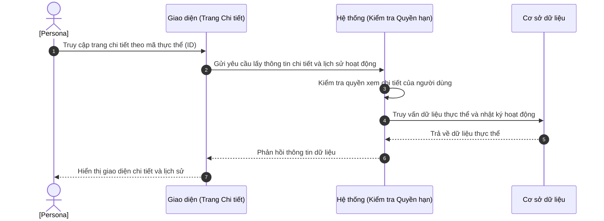

# US-XXX-YY-ZZ: [Tên Màn Hình Chi Tiết]

> **Tham chiếu:** BF-XXX-YY · SR-PERSONA-XXX · Giao diện Mẫu §4.3 (Trang chi tiết / Hộp thoại chi tiết)
> **Đường dẫn màn hình & Trạng thái liên quan:**
> - `[Đường dẫn trang chi tiết hoặc Hộp thoại chi tiết]` -> Trạng thái: `[Các trạng thái được phép]`

---

## 1. NHẬT KÝ THAY ĐỔI & BỐI CẢNH (CHANGELOG & CONTEXT)

### Lịch sử cập nhật tài liệu (Changelog)

| Ngày cập nhật | Nội dung cập nhật | Lý do cập nhật |
|---|---|---|
| [Ngày/Tháng/Năm] | Tóm tắt nội dung thay đổi | Lý do (Ví dụ: Chốt luồng, thay đổi UI...) |

### Bối cảnh & Vấn đề nghiệp vụ (Context & Problem)
* **Bối cảnh:** [Tóm tắt bối cảnh nghiệp vụ từ tài liệu BF cha để hiểu nguồn gốc tính năng.]
* **Vấn đề hiện tại:** [Khó khăn/vấn đề cụ thể mà màn hình chi tiết này sẽ giải quyết (ví dụ: nhân sự khó tra cứu lịch sử, thao tác đổi trạng thái phức tạp hoặc không có lịch sử hoạt động...).]
* **Mục tiêu & Giá trị mang lại:** [Mục tiêu cụ thể khi màn hình này đi vào vận hành và giá trị mang lại cho tổ chức. KPI đo lường nếu có.]

### Hiểu người dùng & Tình huống sử dụng (User Needs & Use Cases)
* **Người dùng chính (Persona):** [Persona] (Ví dụ: PERSONA-CSM)
* **Khó khăn lớn nhất (Pain-points):** [Khó khăn lớn nhất của đối tượng này khi cần xem hoặc thay đổi trạng thái chi tiết của thực thể dữ liệu.]
* **Nhu cầu thực tế (Needs):** [Mong muốn thực tế của người dùng đối với các tính năng trên màn hình này (ví dụ: muốn xem nhanh nhật ký, muốn phê duyệt nhanh...).]
* **Câu phát biểu nghiệp vụ:** **Là một** [Persona], **tôi muốn** [xem chi tiết thông quan hệ, lịch sử hoạt động và chuyển đổi trạng thái], **để** [nắm bắt tình trạng cụ thể và thực hiện các bước nghiệp vụ tiếp theo].

### Phạm vi kiểm soát (Scope)
* **Phạm vi hiển thị:** [Thực thể chính và các mối quan hệ liên kết]
* **Ràng buộc nghiệp vụ toàn cục (Global Rules):**
  > [!IMPORTANT]
  > **Lưu ý di trú:**
  > Đối với màn hình di trú giao diện và sử dụng hệ thống cũ, ghi rõ: *"Kế thừa toàn bộ ràng buộc nghiệp vụ từ hệ thống cũ"*. KHÔNG tự định nghĩa mới các quy tắc kinh doanh hoặc thông số định mức nghiệp vụ thuộc về hệ thống cũ.
  - **[Mã quy tắc (Ví dụ: RULE-DETAIL-01)] [Tên quy tắc]:** Mô tả ràng buộc nghiệp vụ khi thay đổi hoặc cập nhật dữ liệu phía giao diện.
  - **[Mã quy tắc (Ví dụ: RULE-DETAIL-02)] [Tên quy tắc]:** Quy định về hiển thị nhật ký vận hành hoặc luồng cập nhật tự động phía giao diện.
  - **[Mã định mức (Ví dụ: GLOBAL-METRIC-01)] Định mức hiển thị:** Các thông số giới hạn số lượng bản ghi hiển thị (ví dụ: tối đa 5 bản ghi lịch sử gần nhất, cho phép bấm Xem thêm) hoặc các ngưỡng giới hạn giao diện khác (hoặc kế thừa từ hệ thống cũ).

---

## 2. LUỒNG XỬ LÝ CHÍNH (MAIN FLOW - HAPPY PATH)

*Mô tả luồng đi của người dùng từ khi truy cập trang chi tiết thực thể, xem thông tin cho đến khi thực hiện chuyển đổi trạng thái thành công.*



---

## 3. GIAO DIỆN & TRẠNG THÁI TĨNH (DATA & UI STATE)

### 3.1. Thiết kế trực quan (Figma)
* **Link/Hình ảnh Figma:** [Ghi vị trí chèn link thiết kế]

### 3.2. Cấu trúc các vùng giao diện
Bố cục trang/hộp thoại chi tiết tuân thủ tỷ lệ chuẩn gồm: Thanh tiêu đề & Nút thao tác phía trên → Bố cục chia 2 cột (Cột trái Tóm tắt 30% / Cột phải Thông tin Chi tiết 70%) → Dòng thời gian Lịch sử hoạt động ở phía dưới.

#### A. Tiêu đề & Nút thao tác chuyển trạng thái
| Tên nút hành động | Kiểu hiển thị | Quy tắc chuyển trạng thái | Điều kiện kích hoạt hiển thị | Mobile Responsive |
|-------------------|---------------|---------------------------|-----------------------------|-------------------|
| [Hành động A] | Nút màu tích cực | Đổi trạng thái sang '[Trạng thái X]' | `NẾU` đang ở trạng thái '[Trạng thái Y]' | Hiển thị nổi bật |
| [Hành động B] | Nút màu cảnh báo | Đổi trạng thái sang '[Trạng thái Z]' | [Mô tả điều kiện] | Hiển thị nổi bật |
| Chỉnh sửa | Nút biểu tượng | Chuyển các trường sang chế độ sửa | [Mô tả điều kiện] | Thay bằng icon bút chì |

#### B. Cột trái — Bảng tóm tắt thông tin (Chỉ xem)
| Thông tin hiển thị | Kiểu hiển thị | Nguồn dữ liệu | Quy tắc thị giác & Trạng thái | Mobile Responsive |
|--------------------|---------------|----------------|--------------------------------|-------------------|
| Tên đối tượng | Chữ đậm kích thước lớn | Trường Tên | Hiển thị nổi bật ở đầu cột trái | Luôn hiển thị |
| Trạng thái hiện tại | Nhãn màu (Badge) | Trường Trạng thái | Đồng bộ màu trạng thái chuẩn của hệ thống | Luôn hiển thị |
| Mã định danh | Chữ kích thước nhỏ, màu mờ | Trường Mã | Không cho phép chỉnh sửa | Luôn hiển thị |

#### C. Cột phải — Thông tin chi tiết phân nhóm & Quy tắc kiểm tra (Validation Rules)
| Nhóm thông tin | Các trường dữ liệu hiển thị | Kiểu hiển thị | Quy tắc kiểm tra khi sửa (Validation Rules) | Diễn giải quy tắc | Mobile Responsive |
|---|---|---|---|---|---|
| Thông tin chung | [Trường A] | Chỉ xem | - | Hiển thị dạng nhãn + giá trị | Luôn hiển thị |
| [Thông tin bổ sung] | [Trường B] | Chỉnh sửa nhanh | Tối đa 200 ký tự, không trống | Click vào để sửa nhanh. Tự động lưu khi bấm ra ngoài. | Luôn hiển thị |

#### D. Lịch sử hoạt động (Timeline)
| Thành phần giao diện | Kiểu hiển thị | Dữ liệu hiển thị | Logic xử lý hành động | Mobile Responsive |
|-----------------------|---------------|-------------------|-----------------------|-------------------|
| Dòng thời gian | Danh sách sắp xếp dọc | Nhật ký ghi nhận tự động | Sắp xếp bản ghi mới nhất ở trên cùng | Luôn hiển thị |
| Ô nhập ghi chú | Ô nhập văn bản | Người dùng nhập | Bấm nút gửi để lưu ghi chú thủ công | Ẩn hoặc thu gọn |

### 3.3. Các trạng thái giao diện mặc định
1. **Trạng thái đang tải (Loading state):** Hiển thị các khối chờ tải thông tin (Skeleton) tương ứng với cấu trúc layout.
2. **Trạng thái không tìm thấy dữ liệu (Empty/Not Found):** Hiển thị thông báo dữ liệu không tồn tại hoặc đã bị xóa kèm nút bấm quay lại trang danh sách chính.
3. **Trạng thái lỗi tải dữ liệu (Error state):** Hiển thị thông báo cảnh báo lỗi kết nối máy chủ/hệ thống và nút bấm tải lại trang.

### 3.4. Ma trận phân quyền (Permission Matrix)
*Xác định vai trò nào được phép thao tác các chức năng trên trang chi tiết.*

| Vai trò người dùng | Xem chi tiết (View) | Chỉnh sửa nhanh (Edit) | Thực hiện Thao tác / Duyệt (Approve) | Xóa / Khóa / Hủy (Destructive) |
|---|:---:|:---:|:---:|:---:|
| **Quản trị viên (Admin / Owner)** | ✅ | ✅ | ✅ | ✅ |
| **Quản lý cơ sở (Branch Manager)** | ✅ | ✅ | ✅ | [Có/Không] |
| **Nhân viên CSKH (CSM)** | ✅ | [Có/Không] | [Có/Không] | ❌ |
| **Nhân viên tư vấn (Sale)** | [Có/Không] | ❌ | ❌ | ❌ |
| **Giáo viên (Teacher)** | [Có/Không] | ❌ | ❌ | ❌ |

---

## 4. KHỐI CHỨC NĂNG CHI TIẾT: ACTION & LUỒNG KÍCH HOẠT (ACTIONS & EVENTS)

### Khối chức năng 1: Chuyển đổi trạng thái thực thể

#### Action 1.1: Bấm nút [Hành động nguy hiểm/hủy bỏ]
* **Luồng kích hoạt (Event/Flow):** Khi người dùng click nút, hệ thống bắt buộc hiển thị hộp thoại xác nhận (Confirm Dialog). Sau khi xác nhận, hệ thống gửi yêu cầu cập nhật trạng thái mới.
* **Quy tắc kiểm soát & Kiểm tra dữ liệu (Validation & Rules):**
  - **Hộp thoại xác nhận bắt buộc (Confirm Dialog):** Không thực thi trực tiếp hành động. Phải xác nhận thông qua hộp thoại nổi nhằm tránh phá hủy dữ liệu ngoài ý muốn.
* **Tiêu chí nghiệm thu (Acceptance Criteria):** (Yêu cầu $\ge 3$ AC, bao gồm happy + unhappy/alternate paths)
  - **AC-1 (Happy Path - Xác nhận thành công):**
    - **Giả sử:** Thực thể đang ở trạng thái "[Trạng thái khởi đầu]".
    - **Khi:** Người dùng click nút hành động và bấm xác nhận "Đồng ý" trên hộp thoại xác nhận.
    - **Thì:** Hệ thống gửi yêu cầu lên máy chủ, cập nhật trạng thái thành "[Trạng thái kết quả]", vô hiệu hóa các nút sửa đổi cũ, ghi nhận nhật ký mới và hiển thị thông báo thành công.
  - **AC-2 (Exception Path - Người dùng hủy bỏ thao tác):**
    - **Giả sử:** Thực thể đang ở trạng thái "[Trạng thái khởi đầu]".
    - **Khi:** Người dùng click nút hành động nhưng bấm "Hủy bỏ" trên hộp thoại xác nhận.
    - **Thì:** Hộp thoại đóng lại, trạng thái đối tượng giữ nguyên và không có thay đổi nào xảy ra.
  - **AC-3 (Exception Path - Lỗi cập nhật từ máy chủ):**
    - **Giả sử:** Thực thể đang ở trạng thái "[Trạng thái khởi đầu]" và hộp thoại xác nhận được đồng ý.
    - **Khi:** Máy chủ trả về lỗi cập nhật (ví dụ: mất kết nối).
    - **Thì:** Trạng thái thực thể giữ nguyên, hệ thống hiển thị thông báo lỗi "Cập nhật thất bại. Vui lòng thử lại sau."

---

### Khối chức năng 2: Chỉnh sửa nhanh và Ghi chú hoạt động

#### Action 2.1: Chỉnh sửa nhanh trường thông tin (Auto-save)
* **Luồng kích hoạt (Event/Flow):** Người dùng bấm vào trường thông tin để chỉnh sửa. Khi người dùng click chuột ra ngoài (Blur), hệ thống tự động gửi yêu cầu cập nhật trường thông tin lên máy chủ.
* **Tiêu chí nghiệm thu (Acceptance Criteria):**
  - **AC-1 (Happy Path - Tự động lưu thành công):**
    - **Giả sử:** Người dùng đang xem trang chi tiết.
    - **Khi:** Người dùng click vào trường thông tin chỉnh sửa nhanh, thay đổi nội dung và click ra ngoài.
    - **Thì:** Hệ thống tự động lưu nội dung mới, hiển thị nhãn "Đã tự động lưu" và ghi nhận một bản ghi thay đổi vào timeline lịch sử.

---

## 5. ĐẶC TẢ KẾT NỐI HỆ THỐNG (API SPECIFICATION)
*Mô tả cấu trúc dữ liệu trao đổi giữa giao diện và hệ thống phía sau (hoặc ghi N/A nếu là màn hình tĩnh).*

*   **Endpoint:** `GET /api/v1/[some-endpoint]/{id}` (Lấy chi tiết) hoặc `PATCH /api/v1/[some-endpoint]/{id}` (Cập nhật trạng thái/trường)
*   **Cấu trúc dữ liệu gửi đi (Request Payload - JSON) cho cập nhật:**
    ```json
    {
      "status": "string"
    }
    ```
*   **Cấu trúc dữ liệu phản hồi thành công (Response JSON - 200 OK):**
    ```json
    {
      "success": true,
      "data": {
        "id": "string",
        "name": "string",
        "status": "string",
        "updated_at": "string"
      }
    }
    ```
*   **Mã lỗi thường gặp (Response Error Codes):**
    *   `400 Bad Request`: Định dạng yêu cầu không đúng.
    *   `404 Not Found`: Không tìm thấy bản ghi theo ID.
    *   `401 Unauthorized`: Hết hạn đăng nhập hoặc chưa đăng nhập.
    *   `403 Forbidden`: Không có quyền thao tác trên bản ghi này.
    *   `500 Internal Server Error`: Lỗi hệ thống máy chủ.

---

## 6. CÁC TRƯỜNG HỢP GÓC CẠNH & LUỒNG NGOẠI LỆ (CORNER CASES & EXCEPTION FLOWS)

*Mô tả chi tiết xử lý ngoại lệ (dữ liệu sai, mất mạng, timeout, hết hạn quyền, xung đột dữ liệu) đối với màn hình chi tiết:*

- **[CASE-01] Người dùng thực hiện thao tác duyệt/hủy nhưng thiếu điều kiện ràng buộc (Exception Flow - Missing Constraints):**
  - *Tình huống:* Người dùng thực hiện hành động chuyển trạng thái nhưng bỏ trống lý do hủy bắt buộc.
  - *Cách xử lý:* Hệ thống hiển thị cảnh báo đỏ ngay trên hộp thoại xác nhận và chặn không gửi yêu cầu lưu.
- **[CASE-02] Không đủ quyền truy cập thông tin chi tiết (Exception Flow - Access Denied):**
  - *Tình huống:* Người dùng cố tình truy cập vào ID bản ghi mà tài khoản của mình bị giới hạn phạm vi dữ liệu hoặc không có quyền xem.
  - *Cách xử lý:* Giao diện chặn hiển thị thông tin, đưa ra thông báo "Bạn không có quyền truy cập thông tin chi tiết này" hoặc quay về màn hình danh sách chính.
- **[CASE-03] Xung đột dữ liệu cập nhật đồng thời (Exception Flow - Concurrent Modification):**
  - *Tình huống:* Hai người dùng cùng mở chi tiết một bản ghi. Người A thay đổi trạng thái trước, người B bấm thực hiện thao tác ngay sau đó.
  - *Cách xử lý:* Khi người B bấm lưu, máy chủ báo lỗi xung đột dữ liệu (409/412), hệ thống hiển thị thông báo "Bản ghi đã được cập nhật bởi nhân sự khác. Vui lòng tải lại trang." và tự động làm mới giao diện chi tiết.
- **[CASE-04] Mất kết nối mạng khi đang thực hiện thao tác (Exception Flow - Network Loss):**
  - *Tình huống:* Người dùng bấm nút xác nhận thao tác hoặc gửi ghi chú timeline khi kết nối mạng bị mất.
  - *Cách xử lý:* Hiển thị thông báo lỗi kết nối máy chủ, giữ nguyên hộp thoại hoặc nội dung ghi chú chưa gửi để người dùng có thể thử lại khi kết nối mạng ổn định.
- **[CASE-05] Thời gian phản hồi cập nhật bị timeout (Exception Flow - Gateway Timeout):**
  - *Tình huống:* Máy chủ xử lý quá lâu (quá 10 giây) khi thực hiện chuyển đổi trạng thái.
  - *Cách xử lý:* Hủy yêu cầu, hiển thị cảnh báo lỗi timeout và khôi phục lại trạng thái của các nút thao tác trên giao diện để người dùng thử lại.

