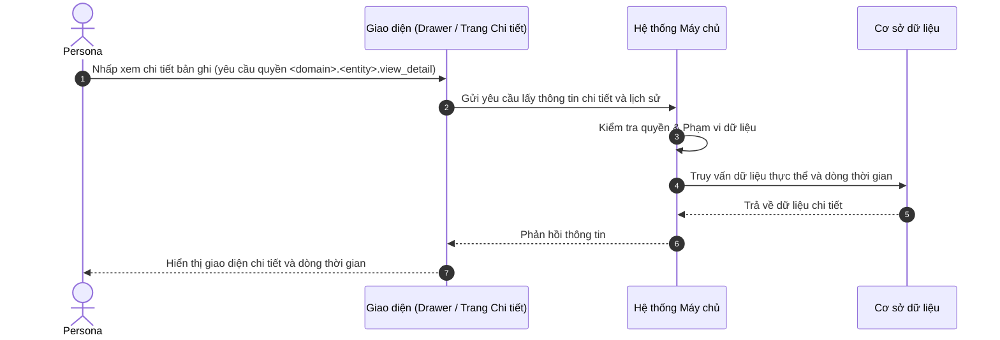

# US-XXX-YY-ZZ: [Tên Màn Hình Chi Tiết / Drawer]

> **Tham chiếu:** `BF-XXX-YY` · `SR-PERSONA-XXX`  
> **Đường dẫn màn hình & Trạng thái liên quan:**  
> - `[Đường dẫn trang chi tiết hoặc Hộp thoại trượt Drawer]` -> Trạng thái: `[Các trạng thái áp dụng]`  

---

## 1. NHẬT KÝ THAY ĐỔI & BỐI CẢNH (CHANGELOG & CONTEXT)

### Lịch sử cập nhật tài liệu (Changelog)

| Ngày cập nhật | Nội dung cập nhật | Lý do cập nhật |
|---|---|---|
| [Ngày/Tháng/Năm] | [Tóm tắt nội dung thay đổi] | [Lý do cập nhật] |

### Bối cảnh & Vấn đề nghiệp vụ (Context & Problem)
* **Bối cảnh:** [Người dùng tự điền bối cảnh phát sinh giao diện chi tiết này]
* **Vấn đề hiện tại:** [Người dùng tự điền khó khăn/vấn đề cụ thể mà giao diện chi tiết này giải quyết]
* **Mục tiêu & Giá trị mang lại:** [Người dùng tự điền mục tiêu khi giao diện chi tiết này đi vào vận hành]

### Hiểu người dùng & Tình huống sử dụng (User Needs & Use Cases)
* **Người dùng chính (Persona):** `[PERSONA-XXX]`
* **Nhu cầu thực tế (Needs):** [Mong muốn thực tế của người dùng khi xem thông tin chi tiết và dòng thời gian]
* **Câu phát biểu nghiệp vụ:** **Là một** [Persona], **tôi muốn** [xem chi tiết hồ sơ, lịch sử tương tác và ghi nhận trao đổi], **để** [nắm bắt tình trạng cụ thể và thực hiện các bước chăm sóc tiếp theo].

---

## 2. LUỒNG XỬ LÝ CHÍNH (MAIN FLOW - HAPPY PATH)



---

## 3. GIAO DIỆN & CẤU TRÚC CHI TIẾT (UI & DATA STATE)

### 3.1. Cấu trúc các vùng giao diện & Ràng buộc Quyền hạn (Capability Gating)

| Vùng Giao diện / Nút Thao Tác | Loại Hiển Thị | Mã Quyền Yêu Cầu (Required Capability) | Xử Lý Khi Không Đủ Quyền |
| :--- | :--- | :--- | :--- |
| **Xem Chi tiết Hồ sơ** | Bảng tóm tắt & Thông tin | `<domain>.<entity>.view_detail` | Chặn xem chi tiết, báo lỗi 403 |
| **Ghi nhận Ghi chú / Tương tác** | Form nhập liệu nhanh | `<domain>.<entity>.add_log` | Ẩn form nhập hoặc vô hiệu hóa nút gửi |
| **Nút Thao tác Chuyển trạng thái** | Nút hành động | `<domain>.<entity>.transition` | Ẩn nút chuyển trạng thái |

### 3.2. Cấu trúc các khối thông tin
1. **Khối 1: Thông tin Tóm tắt Thực thể Chính:**
   - [Định danh, tên, thuộc tính quan trọng, nhãn trạng thái].
2. **Khối 2: Thông tin Chi tiết Phân nhóm:**
   - [Các trường dữ liệu chi tiết liên quan].
3. **Khối 3: Dòng thời gian Hoạt động (Timeline):**
   - Danh sách các mốc tương tác, thay đổi trạng thái theo thời gian giảm dần.
4. **Khối 4: Form Tương tác Nhanh (nếu có):**
   - Các trường ghi chú nhanh, chọn kết quả, ngày hẹn nhắc việc.

---

## 4. TIÊU CHÍ NGHIỆM THU (ACCEPTANCE CRITERIA - BDD GHERKIN)

```gherkin
Scenario: Xem thông tin chi tiết và ghi nhận tương tác (Happy Path)
  Given Giao diện chi tiết đang mở cho bản ghi hợp lệ
  When Người dùng nhập ghi chú tương tác và bấm "Lưu"
  Then Hệ thống ghi nhận bản ghi mới vào dòng thời gian
    And cập nhật trạng thái tương ứng ngoài danh sách.

Scenario: Chặn thao tác khi không đủ quyền hạn
  Given Người dùng không có quyền ghi nhận tương tác
  When Mở giao diện chi tiết
  Then Form thêm ghi chú bị ẩn hoặc nút bấm bị vô hiệu hóa.
```

---

## 5. CÁC TRƯỜNG HỢP GÓC CẠNH & LUỒNG NGOẠI LỆ (CORNER CASES & EXCEPTION FLOWS)

- **[CASE-01] Bản ghi đã bị xóa hoặc thay đổi bởi người dùng khác:**
  - *Tình huống:* Người dùng mở chi tiết nhưng bản ghi đã bị sửa đổi/xóa trước đó.
  - *Cách xử lý:* Hệ thống cảnh báo "Bản ghi đã được cập nhật bởi nhân sự khác. Đang tải lại dữ liệu." và làm mới lại giao diện.
- **[CASE-02] Mất kết nối mạng khi đang gửi ghi chú:**
  - *Tình huống:* Người dùng bấm nút lưu ghi chú đúng lúc mạng bị mất.
  - *Cách xử lý:* Giữ nguyên nội dung ghi chú trong ô nhập, hiển thị thông báo lỗi mạng kèm nút thử lại.
